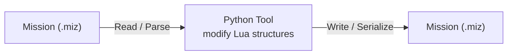

# AI Agent Instructions for VEAF Mission Creation Tools

## Communication & Collaboration

- **Language:** Français (speak to the developer in French)
- **Tone:** Treat the developer as an equal (direct, practical, no obsequiousness)
- **Style:** Brief explanations in chat, let code/docs speak for themselves

### Documentation Standards
- **English only:** All source code, comments, and documentation files
- **Harmonize:** Match existing patterns, conventions, and tone in the repository
- **Reuse:** Existing solutions first; ask before proposing alternatives
- **Avoid:** Meta-documentation ("What was done", "Implementation summary", etc.)

### Documentation Workflow
- **Source of truth:** Always base documentation on the actual source code — never invent CLI flags, file names, or workflows
- **Bilingual:** Produce both EN (`.md`) and FR (`.fr.md`) versions; use FR stubs with admonition redirect when full translation is not available
- **Links:** Verify all internal links work (`mkdocs build --strict` must pass with zero warnings)
- **User experience first:** Prioritize clarity for the reader — show the simplest path, hide advanced details behind dedicated sections

### File Naming Conventions
- Be specific: `BUILD_AND_RELEASE_GUIDE.md` ✅, not `IMPLEMENTATION_SUMMARY.md` ❌
- Standards: `README.md`, `QUICKSTART.md`, `ARCHITECTURE.md` ✅

### Code Quality
- **Use Poetry for all Python commands:** `poetry run python`, `poetry run ruff`, `poetry run mypy`, `poetry run pytest`
- For interactive sessions: `poetry shell` opens a shell with Poetry's venv active
- Type hints on all functions, docstrings for public methods
- Follow existing code style, include error handling
- Test cross-platform compatibility when possible
- Remove old/unused scripts when replacing them

### Quality Gate — Lua Scripts

Before committing any change to `src/scripts/veaf/`, run StyLua and luacheck:

```powershell
# StyLua — check only (CI equivalent)
~/.local/bin/stylua.exe --check src/scripts/veaf/

# StyLua — auto-fix
~/.local/bin/stylua.exe src/scripts/veaf/

# luacheck — static analysis (undefined globals, unused vars, shadowing)
luacheck src/scripts/veaf/ --config .luacheckrc
```

- StyLua version used by CI: **2.4.0** (installed at `~/.local/bin/stylua.exe`)
- Config: `.stylua.toml` at workspace root (if present), otherwise StyLua defaults
- This check is enforced by the **StyLua Formatting** CI job on every PR
- Never commit Lua files with formatting violations — the CI will block the merge
- luacheck is enforced by the **Luacheck** CI job on every PR

### Quality Gate — Lua Unit Tests

Before opening a PR that touches `src/scripts/veaf/`, run the Lua test suite locally:

```powershell
# Requires lua.exe (Lua 5.1) — installed at C:\Program Files (x86)\Lua\5.1\lua.exe
$FAILED=0
Get-ChildItem test/lua/test_*.lua | Sort-Object Name | ForEach-Object {
    Write-Host "--- $($_.Name) ---"
    lua $_.FullName; if ($LASTEXITCODE -ne 0) { $FAILED=1 }
}
if ($FAILED -eq 0) { 'All tests passed.' } else { 'FAILED'; exit 1 }
```

- CI runs on Lua 5.1 (Ubuntu, `lua5.1`). Local interpreter: `lua` (Lua 5.1 via `C:\Program Files (x86)\Lua\5.1\lua.exe`)
- **Critical**: `veaf.lp()` (lazy proxy) returns a table. In Lua 5.1, `string.format("%s", table)` does NOT call `__tostring` and will error. Only pass `veaf.lp()` as a direct logger argument, never inside a `string.format()` call — use `veaf.p()` there instead.

### Post-merge Hygiene

After every PR merge and branch deletion:

1. `git fetch origin --prune` — remove deleted remote branches from local cache
2. `git checkout develop-v6 && git pull origin develop-v6 --ff-only` — sync local `develop-v6` with the merged state

Always do this before starting any new work.

### Pre-PR Checklist (run in order before every PR)

1. `~/.local/bin/stylua.exe src/scripts/veaf/` — auto-fix Lua formatting
2. `~/.local/bin/stylua.exe --check src/scripts/veaf/` — verify clean
3. `luacheck src/scripts/veaf/ --config .luacheckrc` — static analysis
4. Lua tests (see above) — verify all suites pass
5. `poetry run ruff check src/python` + `poetry run ruff format --check src/python` + `poetry run mypy src/python` + `poetry run pytest` — Python quality gate
6. Update `doc/backlog.md` to reflect ticket state
7. Only then: open PR and request Copilot review (`mcp_github_request_copilot_review`)

---

## Project Overview

VEAF Mission Creation Tools is a hybrid **Lua + Python** system for designing and running dynamic DCS World missions. The architecture separates **runtime scripting** (Lua executing in DCS) from **design-time tools** (Python CLI for mission manipulation).

### Key Distinction
- **Runtime** (`src/scripts/veaf/`): Lua modules that execute within DCS missions providing spawning, asset management, radio systems
- **Design-time** (`src/python/veaf-tools/`): Python CLI tools for mission file manipulation (miz format), preprocessing, injection

---

## Architecture Patterns

### Core Concepts

1. **Mission Files (`.miz`)** - ZIP archives containing Lua dictionaries:
   - `mission` - Main mission data (groups, triggers, settings)
   - `options` - Graphics and gameplay options
   - `theatre` - Map information
   - `warehouses` - Supply configurations
   - Uses a local `luadata` package (`src/python/veaf-tools/luadata/`) for Lua serialization

2. **Worker Pattern** - Each tool follows consistent design:
   - `*_worker.py` classes with `run()` method entry point
   - Async-friendly patterns using `Path` objects
   - Error handling via `typer.Abort` exception
   - Logging through centralized `logger` instance

3. **Plugin System** - Injector tools are modular:
   - `weather_injector/`, `waypoints_injector/`, `aircrafts_injector/` etc.
   - Each can extract from AND inject into missions (dual mode)
   - Config-driven via YAML files

### Data Flow



---

## Python Code Conventions

### Module Organization
- **`veaf_libs/`** - Shared utilities (logger, progress, miz_tools)
- **`mission_tools/`** - Core miz file handling (DcsMission dataclass, read_miz, write_miz)
- **`{tool_name}_injector/`** - Specialized injectors with submodules:
  - `*_worker.py` - Main entry point (async/CLI compatible)
  - `*_manager.py` - Data transformation logic
  - `models.py` - Dataclass definitions
  - `*_README.py` - Help/documentation generation

### Logger Pattern
```python
from veaf_libs.logger import logger, console

logger.info("Processing mission...")
logger.debug("Detailed info")
logger.warning("Watch out")
logger.error("Failed", raise_exception=True)
```
- Logs to both file (`{module}.log`) and console (via Rich)
- Centralized in `veaf_libs/logger.py`

### Dataclass Usage
```python
from dataclasses import dataclass, field
from typing import Dict, Optional

@dataclass
class MissionConfig:
    version: str
    mappings: Dict[str, str] = field(default_factory=dict)
```
- Extensive use of `@dataclass` with `field(default_factory=...)` for mutable defaults
- YAML serialization via `yaml.safe_load/dump`

### Type Hints
- Always use `Path` from `pathlib` for file operations (not strings)
- Use `Optional[T]` for nullable fields
- Use `Dict[str, T]`, `List[T]` for collections

---

## Build & Release Workflow

### Key Script: `veaf-build` (Poetry entry point)

Main orchestrator for the entire build pipeline.
Source: `veaf_build/` package (`cli.py`, `worker.py`, `github.py`).

```powershell
# Install dependencies (Poetry manages its own virtual environment)
poetry install              # runtime + dev (no PyInstaller)
poetry install --with build # full setup including PyInstaller

# Build
poetry run veaf-build build --version 6.0.4

# Publish to GitHub (requires GITHUB_TOKEN)
poetry run veaf-build publish --version 6.0.4
```

**What it does:**
1. Validates prerequisites (Git, Python, PyInstaller)
2. Compiles Lua scripts from `src/scripts/veaf/` → `build/`
3. Runs PyInstaller on `src/python/veaf-tools/veaf-tools.py` → `dist/veaf-tools.exe`
4. Creates `published.zip` with all artifacts
5. Publishes to GitHub Release with SHA256 checksum

**Configuration:** `veaf-tools-config.yaml` (optional)
```yaml
github:
  owner: VEAF
  repo: VEAF-Mission-Creation-Tools
  token: ${GITHUB_TOKEN}  # or env var
```

### Development Build Tasks

The workspace includes pre-configured build tasks (visible in VS Code):
- `build Demo mission` - Builds test/Demo mission (uses sample Lua)
- `build Helo Training mission` - Helicopter training scenario
- `test Mission Editor` - Runs mission editor validation

---

## Lua Runtime Scripts

### Module Loading Pattern

Lua modules follow a strict loading order (see `src/scripts/veaf/`):

1. **veaf.lua** - Core framework (logging, state management)
2. **veaf*.lua** - Feature modules (veafSpawn, veafRadio, veafMove, etc.)
3. **Dynamic modules** - Via `VeafDynamicLoader.lua` at mission start

### Key Points
- **No external dependencies** - Pure Lua, runs in DCS environment
- **Logging** - Via `veaf.loggers.new()` for module-scoped logging
- **State isolation** - Each module uses local scope patterns
- **Backward compatibility** - Mission files are sensitive to breaking changes

---

## Important Conventions

### File & Naming Standards
- Python files: `snake_case.py`
- Classes: `PascalCase` (e.g., `MissionBuilder`, `WeatherInjector`)
- Constants: `UPPER_SNAKE_CASE`
- Lua files: `veafFeatureName.lua` (lowercase 'veaf' prefix)

### Error Handling
- Python: Use `typer.Abort` for CLI errors
- Propagate `logger.error(..., raise_exception=True)` up the stack
- **Never silently swallow errors** - visibility is critical for mission makers

### Documentation
- User-facing documentation lives in `doc/` (split by audience):
  - `doc/mission-maker/GUIDE.md` — mission maker reference
  - `doc/developer/GUIDE.md` — build pipeline, quality gates, contributing
  - `doc/LUA_API_REFERENCE.md` — full Lua public API
- API docs in source code docstrings (Python)
- Lua comments inline (no separate documentation needed)

---

## Integration Points & Dependencies

### External Libraries
- **typer** - CLI framework (argument parsing, help generation)
- **pyyaml** - Config file loading (YAML format)
- **rich** - Terminal UI (progress bars, colored output, tables)
- **luadata** - Lua serialization/deserialization
- **lupa** — Python ↔ Lua bridging (optional extra; needed for `miz_tools`)
- **Pillow** - Image processing (weather icon generation)
- **pydantic** - Data validation (newer code)

### GitHub Integration
- Automated via `veaf-build` using GitHub REST API
- Requires `GITHUB_TOKEN` environment variable
- Creates tags, releases, uploads artifacts automatically

### DCS World Integration
- Missions are ZIP files with Lua dictionaries
- Scripts injected into `mission/` → `do file(...)` at mission start
- No API calls - everything is file-based manipulation

---

## Testing & Validation

### Running Tools Locally
```powershell
# Run a tool directly
poetry run python -m veaf_tools weather-inject --mission test/test.miz --output test/test-out.miz

# Run tests
poetry run pytest
```

### Mission Validation
- Use `test Mission Editor` task to validate mission structure
- Check `veaf-tools.log` for runtime errors
- Validate Lua syntax before injecting

---

## Questions to Ask Before Implementation

1. **Is this runtime Lua or design-time Python?** (Different testing, deployment)
2. **Does it modify mission files?** (Need to handle miz format, ZIP, Lua serialization)
3. **Is this a new injector?** (Follow the `{tool_name}_injector/` pattern)
4. **Does it integrate with DCS?** (Consider mission loading, state persistence)

---

## Quick Checklist for New Features

- [ ] Follows Worker/Manager pattern if adding new tool
- [ ] Uses `logger` for all output (no print statements)
- [ ] Type hints on all functions
- [ ] Docstrings for public methods
- [ ] Configuration via YAML (not hardcoded)
- [ ] Error messages are user-friendly and actionable
- [ ] Tested against actual `.miz` files (not mocked)
- [ ] Updated documentation in `doc/` if user-facing (see `doc/mission-maker/GUIDE.md`, `doc/LUA_API_REFERENCE.md`)

---

**Note:** This file is `.github/copilot-instructions.md` — it provides technical architecture and code patterns for AI agents. Communication preferences (language, tone) are at the top of this same file.
