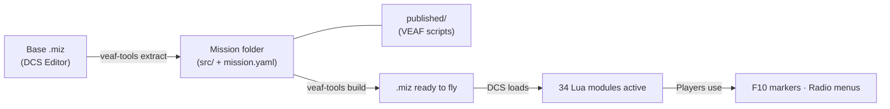
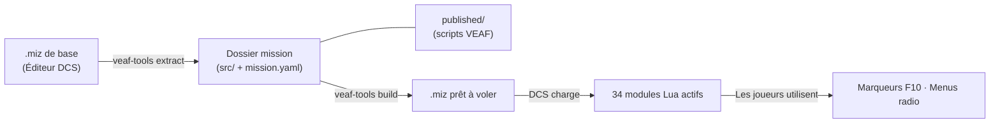

# [![VEAF-logo]][VEAF website] Mission Creation Tools

> 🇫🇷 [Lire ce document en français](#fr)

[![Badge-Discord]][VEAF Discord]
![Badge-Wakatime]

Complete toolkit for creating dynamic [DCS World][DCS] missions using VEAF Lua scripts and automation tools.

**License:** [MIT](LICENSE.md) | **Version:** see [CHANGELOG.md](CHANGELOG.md)

---

## Documentation

Choose the guide that matches your role:

| Role | Guide | Description |
|------|-------|-------------|
| **Player / Pilot** | [Pilot Guide](doc/pilot/README.md) | F10 menus, marker commands, assets, combat zones |
| **Mission Maker** | [Mission Maker Guide](doc/mission-maker/README.md) | Install, configure, build — all scripts documented |
| **Developer** | [Developer Guide](doc/developer/README.md) | Architecture, build pipeline, quality gates, contributing |

### Detailed References

| Reference | Description |
|-----------|-------------|
| [Lua API Reference](doc/LUA_API_REFERENCE.md) | Full API for all 34 Lua runtime modules |
| [Tools CLI Reference](doc/TOOLS_REFERENCE.md) | `veaf-tools.exe` and `veaf-tools-updater.exe` |
| [Testing Guide](doc/TESTING.md) | Lua unit test suite, CI/CD pipeline |
| [Roadmap](doc/ROADMAP.md) | Planned features and known limitations |

---

## Quick Start

### Players and Pilots

You're in a mission that uses VEAF scripts. Open the F10 map, place a marker, and type a command (e.g. `_spawn unit T-80` or `_cas`). See the [Pilot Guide](doc/pilot/README.md) for all available commands.

### Mission Makers

```powershell
# 1. Download the updater from the GitHub release page, then:
.\veaf-tools-updater.exe

# 2. Add veaf-scripts.lua to your DCS mission triggers (DO SCRIPT FILE)

# 3. Configure modules in missionconfig.lua
```

Full workflow: [Mission Maker Guide](doc/mission-maker/README.md)

### Developers

```powershell
# Setup
poetry install --with build

# Build
poetry run veaf-build build --version 6.0.5

# Test
poetry run test-lua

# Publish
poetry run veaf-build publish --version 6.0.5
```

Full reference: [Developer Guide](doc/developer/README.md)

---

## About

VEAF Mission Creation Tools is a hybrid **Lua + Python** system:

- **Runtime** (`src/scripts/veaf/`) — 34 Lua modules loaded inside DCS missions, providing spawning, asset management, mission types, radio menus, and more
- **Design-time** (`src/python/veaf-tools/`) — Python CLI (`veaf-tools.exe`) for manipulating `.miz` files: normalizing, injecting weather/waypoints/radio presets/aircraft groups
- **Release pipeline** (`veaf-build` CLI) — compiles Lua, builds EXE files, publishes to GitHub

## How It Works



1. **Extract** — Create a base mission in DCS Editor and extract it into version-controllable source files (`src/mission/`, `src/scripts/`)
2. **Configure** — `mission.yaml` declares active modules; `published/` provides the VEAF Lua scripts
3. **Build** — `veaf-tools build` assembles everything (mission data, VEAF scripts, triggers) into a final `.miz`
4. **Runtime** — DCS loads the `.miz` and executes the VEAF Lua framework; players interact via F10

---

## Community & Support

- [VEAF Discord][VEAF Discord] — real-time help
- [VEAF Website][VEAF website]
- [GitHub Issues][GitHub] — bug reports
- [Support the project][Zip on coff.ee]

---

# [![VEAF-logo]][VEAF website] Outils de création de missions

> 🇫🇷 **Français** | 🇬🇧 [English](#-mission-creation-tools)

## À propos

Ensemble complet d'outils pour créer des missions [DCS World][DCS] dynamiques avec les scripts Lua VEAF.

- **Runtime** (`src/scripts/veaf/`) — 34 modules Lua s'exécutant dans DCS : spawning, assets, menus radio, zones de combat, météo, et plus
- **Design-time** (`src/python/veaf-tools/`) — CLI Python (`veaf-tools.exe`) pour manipuler les fichiers `.miz`
- **Pipeline de release** (`veaf-build` CLI) — compilation Lua, build EXE, publication GitHub

## Principe de fonctionnement



1. **Extract** — Créez une mission de base dans l'éditeur DCS et extrayez-la en fichiers source versionnables (`src/mission/`, `src/scripts/`)
2. **Configure** — `mission.yaml` déclare les modules actifs ; `published/` fournit les scripts Lua VEAF
3. **Build** — `veaf-tools build` assemble tout (données mission, scripts VEAF, triggers) en un `.miz` final
4. **Runtime** — DCS charge le `.miz` et exécute le framework Lua VEAF ; les joueurs interagissent via F10

---

## Documentation

Choisissez le guide correspondant à votre rôle :

| Rôle | Guide | Description |
|------|-------|-------------|
| **Joueur / Pilote** | [Guide du pilote](doc/pilot/README.fr.md) | Menus F10, commandes marqueurs, assets, zones de combat |
| **Créateur de missions** | [Guide créateur de missions](doc/mission-maker/README.fr.md) | Installation, configuration, build — tous les scripts documentés |
| **Développeur** | [Guide du développeur](doc/developer/README.fr.md) | Architecture, pipeline de build, qualité, contribution |

### Références détaillées

| Référence | Description |
|-----------|-------------|
| [Référence API Lua](doc/LUA_API_REFERENCE.fr.md) | API complète des 34 modules Lua runtime |
| [Référence CLI des outils](doc/TOOLS_REFERENCE.fr.md) | `veaf-tools.exe` et `veaf-tools-updater.exe` |
| [Guide de tests](doc/TESTING.fr.md) | Suite de tests Lua unitaires, pipeline CI/CD |
| [Feuille de route](doc/ROADMAP.fr.md) | Fonctionnalités prévues et limitations connues |

---

## Démarrage rapide

### Joueurs et pilotes

Vous êtes dans une mission utilisant les scripts VEAF. Ouvrez la carte F10, placez un marqueur et tapez une commande (ex : `_spawn unit T-80` ou `_cas`). Voir le [Guide du pilote](doc/pilot/README.fr.md) pour toutes les commandes disponibles.

### Créateurs de missions

```powershell
# 1. Téléchargez l'outil de mise à jour depuis la page de release GitHub, puis :
.\veaf-tools-updater.exe

# 2. Ajoutez veaf-scripts.lua aux triggers de votre mission DCS (DO SCRIPT FILE)

# 3. Configurez les modules dans missionconfig.lua
```

Guide complet : [Guide créateur de missions](doc/mission-maker/README.fr.md)

### Développeurs

```powershell
# Installation
poetry install --with build

# Build
poetry run veaf-build build --version 6.0.5

# Tests
poetry run test-lua

# Publication
poetry run veaf-build publish --version 6.0.5
```

Référence complète : [Guide du développeur](doc/developer/README.fr.md)

---

## Communauté & Support

- [VEAF Discord][VEAF Discord] — aide en temps réel
- [Site VEAF][VEAF website]
- [Issues GitHub][GitHub] — signalement de bugs
- [Soutenir le projet][Zip on coff.ee]

---

[Badge-Discord]: https://img.shields.io/discord/471061487662792715?label=VEAF%20Discord&style=for-the-badge
[Badge-Wakatime]: https://wakatime.com/badge/github/VEAF/VEAF-Mission-Creation-Tools.svg
[VEAF-logo]: https://veaf.github.io/documentation/images/logo.png
[VEAF Discord]: https://www.veaf.org/discord
[Zip on Github]: https://github.com/davidp57
[Zip on coff.ee]: https://coff.ee/veaf_zip
[VEAF website]: https://www.veaf.org
[GitHub]: https://github.com/VEAF/VEAF-Mission-Creation-Tools/issues
[DCS]: https://www.digitalcombatsimulator.com/
