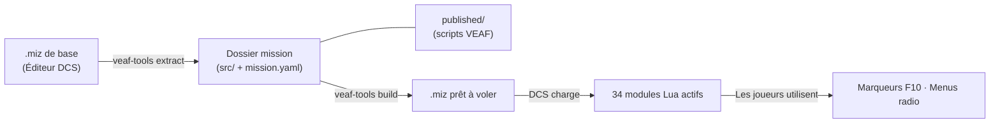

# VEAF Mission Creation Tools

Framework de scripts Lua et outils CLI Python pour créer des missions [DCS World](https://www.digitalcombatsimulator.com/) dynamiques et interactives.

**34 modules Lua runtime** s'exécutent dans DCS pour offrir le spawning, la gestion d'assets, les menus radio, les zones de combat, les opérations porte-avions, l'injection météo, et plus — le tout contrôlable par les joueurs via les marqueurs F10 et les menus radio.

**Les outils Python design-time** (`veaf-tools.exe`) manipulent les fichiers `.miz` : injection de scripts, configuration météo, gestion des waypoints et presets radio.

---

## Démarrage rapide

| Je suis… | Je veux… | Commencer ici |
|----------|----------|---------------|
| **Joueur / Pilote** | Utiliser les fonctionnalités VEAF MCT en vol (spawn, CAS, assets) | [Guide Pilote](pilot/README.md) |
| **Créateur de missions** | Intégrer VEAF MCT dans mes missions DCS | [Guide Créateur de missions](mission-maker/README.md) |
| **Développeur** | Contribuer au code source de VEAF MCT | [Guide Développeur](developer/README.md) |

---

## Principe de fonctionnement

1. **Extract** — Vous créez une mission de base dans l'éditeur DCS et l'extrayez en fichiers source versionnables (`src/mission/`, `src/scripts/`)
2. **Configure** — `mission.yaml` déclare les modules actifs ; `published/` fournit les scripts Lua VEAF
3. **Build** — `veaf-tools build` assemble tout (données mission, scripts VEAF, triggers) en un `.miz` final
4. **Runtime** — DCS charge le `.miz` et exécute le framework Lua VEAF ; les joueurs interagissent via F10

---

## Références

| Document | Contenu |
|----------|---------|
| [Référence API Lua](LUA_API_REFERENCE.md) | API publique complète des 34 modules runtime |
| [Référence CLI des outils](TOOLS_REFERENCE.md) | Commandes et options de `veaf-tools.exe` |
| [Feuille de route](ROADMAP.md) | Fonctionnalités prévues et limitations connues |

---

## Liens

- **Source** : [github.com/VEAF/VEAF-Mission-Creation-Tools](https://github.com/VEAF/VEAF-Mission-Creation-Tools)
- **Communauté** : [Discord VEAF](https://www.veaf.org/discord)
- **Licence** : [MIT](https://github.com/VEAF/VEAF-Mission-Creation-Tools/blob/develop-v6/LICENSE.md)
