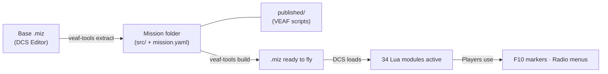

# VEAF Mission Creation Tools

A Lua script framework and Python CLI toolkit for building dynamic, interactive [DCS World](https://www.digitalcombatsimulator.com/) missions.

**34 Lua runtime modules** execute inside DCS to provide spawning, asset management, radio menus, combat zones, carrier operations, weather injection, and more — all controllable by players via F10 markers and radio menus.

**Python design-time tools** (`veaf-tools.exe`) manipulate `.miz` files: inject scripts, configure weather, manage waypoints and radio presets.

---

## Getting Started

| I am a… | I want to… | Start here |
|---------|-----------|------------|
| **Player / Pilot** | Use VEAF MCT features in flight (spawn, CAS, assets) | [Pilot Guide](pilot/README.md) |
| **Mission Maker** | Integrate VEAF MCT into my DCS missions | [Mission Maker Guide](mission-maker/README.md) |
| **Developer** | Contribute to the VEAF MCT source code | [Developer Guide](developer/README.md) |

---

## How It Works

1. **Extract** — You create a base mission in DCS Editor and extract it into version-controllable source files (`src/mission/`, `src/scripts/`)
2. **Configure** — `mission.yaml` declares active modules; `published/` provides the VEAF Lua scripts
3. **Build** — `veaf-tools build` assembles everything (mission data, VEAF scripts, triggers) into a final `.miz`
4. **Runtime** — DCS loads the `.miz` and executes the VEAF Lua framework; players interact via F10

---

## References

| Document | Content |
|----------|---------|
| [Lua API Reference](LUA_API_REFERENCE.md) | Full public API for all 34 runtime modules |
| [Tools CLI Reference](TOOLS_REFERENCE.md) | `veaf-tools.exe` commands and options |
| [Roadmap](ROADMAP.md) | Planned features and known limitations |

---

## Language

`veaf-tools.exe` and `veaf-tools-updater.exe` display messages in your OS language automatically — no setup required. The detection order is:

1. `--lang` CLI option
2. `VEAF_LANG` environment variable
3. `~/veafmct.yaml` → `lang:` key
4. OS locale (Windows registry / system locale on Linux–macOS)
5. `en` (built-in fallback)

Supported languages: English (`en`), French (`fr`). See [Language Configuration](mission-maker/GUIDE.md#global-user-configuration) for full details.

---

## Links

- **Source**: [github.com/VEAF/VEAF-Mission-Creation-Tools](https://github.com/VEAF/VEAF-Mission-Creation-Tools)
- **Community**: [VEAF Discord](https://www.veaf.org/discord)
- **License**: [MIT](https://github.com/VEAF/VEAF-Mission-Creation-Tools/blob/develop-v6/LICENSE.md)

