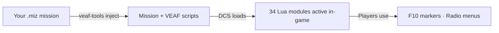

# VEAF Mission Creation Tools

A Lua script framework and Python CLI toolkit for building dynamic, interactive [DCS World](https://www.digitalcombatsimulator.com/) missions.

**34 Lua runtime modules** execute inside DCS to provide spawning, asset management, radio menus, combat zones, carrier operations, weather injection, and more — all controllable by players via F10 markers and radio menus.

**Python design-time tools** (`veaf-tools.exe`) manipulate `.miz` files: inject scripts, configure weather, manage waypoints and radio presets.

---

## Getting Started

| I am a… | I want to… | Start here |
|---------|-----------|------------|
| **Player / Pilot** | Use VEAF features in flight (spawn, CAS, assets) | [Pilot Guide](pilot/README.md) |
| **Mission Maker** | Integrate VEAF into my DCS missions | [Mission Maker Guide](mission-maker/README.md) |
| **Developer** | Contribute to the VEAF source code | [Developer Guide](developer/README.md) |

---

## How It Works

1. **Design time** — You configure which modules to load in `veaf-mission.yaml` and build with `veaf-tools.exe`
2. **Runtime** — DCS executes the VEAF Lua framework; players interact via F10

---

## References

| Document | Content |
|----------|---------|
| [Lua API Reference](LUA_API_REFERENCE.md) | Full public API for all 34 runtime modules |
| [Tools CLI Reference](TOOLS_REFERENCE.md) | `veaf-tools.exe` commands and options |
| [Roadmap](ROADMAP.md) | Planned features and known limitations |

---

## Links

- **Source**: [github.com/VEAF/VEAF-Mission-Creation-Tools](https://github.com/VEAF/VEAF-Mission-Creation-Tools)
- **Community**: [VEAF Discord](https://www.veaf.org/discord)
- **License**: [MIT](https://github.com/VEAF/VEAF-Mission-Creation-Tools/blob/develop-v6/LICENSE.md)

