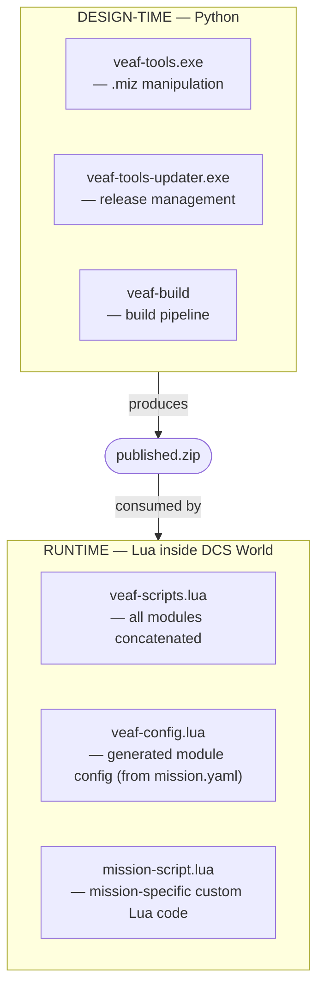

# Developer Guide — VEAF Mission Creation Tools


This guide is for developers who want to contribute to the VEAF Mission Creation Tools source code, build new releases, or extend the framework.

---

## Table of Contents

1. [Architecture Overview](#architecture-overview)
2. [Repository Layout](#repository-layout)
3. [Development Environment](#development-environment)
4. [Lua Runtime Scripts](#lua-runtime-scripts)
5. [Python Tools](#python-tools)
6. [Build and Release](#build-and-release)
7. [Developer Mode](#developer-mode)
8. [Testing](#testing)
9. [Quality Gates](#quality-gates)
10. [Contributing](#contributing)

---

## Architecture Overview

The project has two completely separate layers:



- **Runtime** (`src/scripts/veaf/`) — Lua modules loaded inside DCS missions
- **Design-time** (`src/python/veaf-tools/`) — Python CLI tools for `.miz` file manipulation

---

## Repository Layout

```
VEAF-Mission-Creation-Tools/
├── veaf_build/                   # veaf-build CLI (build & publish orchestrator)
├── build-and-release.py          # Backward-compat shim (use veaf-build instead)
├── src/
│   ├── scripts/veaf/             # Lua runtime modules
│   └── python/veaf-tools/        # Python CLI source
│       ├── veaf-tools.py         # Entry point
│       ├── veaf_libs/            # Shared utilities (logger, progress, miz)
│       ├── mission_tools/        # Core .miz read/write
│       └── *_injector/           # One folder per CLI command
├── published/                    # Compiled Lua output
├── dist/                         # PyInstaller .exe output
├── build/                        # Temporary build workspace
├── test/
│   ├── lua/                      # Lua unit tests
│   └── python/                   # Python unit tests
├── doc/                          # Documentation
├── .backlog/                     # Lot backlog (PRDs + tickets)
└── .github/
    └── workflows/                # CI/CD GitHub Actions
```

---

## Development Environment {#development-environment}

Two setup paths are available. The DevContainer is recommended for new contributors and ensures an environment identical to CI.

### Option A — DevContainer (recommended)

The repository ships a `.devcontainer/` configuration that provides a pre-configured, zero-install environment with Python 3.13, Lua 5.1, StyLua 2.4.0, Poetry, and all VS Code extensions already installed.

**VS Code Dev Containers** (local Docker):

1. Install [Docker Desktop](https://www.docker.com/products/docker-desktop/) and the [Dev Containers](https://marketplace.visualstudio.com/items?itemName=ms-vscode-remote.remote-containers) extension
2. Open the repository folder in VS Code
3. Press `Ctrl+Shift+P` → *Dev Containers: Reopen in Container*
4. Wait for the container to build and `poetry install` to complete — the environment is ready

**GitHub Codespaces** (browser, no local install):

1. On the repository page, click **Code** → **Codespaces** → **New codespace**
2. The environment builds automatically — open a terminal and start working

In both cases, `poetry install --without build --all-extras` runs automatically on first open.

### Option B — Manual setup (Windows)

#### 1. Python 3.11+

Download the installer from [python.org](https://www.python.org/downloads/) (**3.13** recommended) or via winget:

```powershell
winget install --id Python.Python.3.13
```

> **Important:** during the graphical installer, check **"Add Python to PATH"**. Without it, `python` and `pip` will not be found in the terminal.

Verify:

```powershell
python --version   # Python 3.11 or higher expected
```

#### 2. Poetry

Poetry manages Python virtual environments and project dependencies. The recommended installation method is via `pipx`, which isolates Poetry in its own environment:

```powershell
python -m pip install pipx
pipx ensurepath        # adds ~/.local/bin to PATH — restart the terminal afterwards
pipx install poetry
```

Verify:

```powershell
poetry --version
```

> `poetry install` automatically creates an isolated virtualenv inside the project. All project commands are then run with the `poetry run <command>` prefix.

#### 3. Git

```powershell
winget install --id Git.Git
```

Or download from [git-scm.com](https://git-scm.com/download/win).

#### 4. Lua 5.1 (for unit tests)

Lua 5.1 is required to run tests locally. Version **5.1** is mandatory — versions 5.2+ are not compatible with DCS World code.

Via [Scoop](https://scoop.sh/) (recommended Windows package manager):

```powershell
# Install Scoop if not already present
Set-ExecutionPolicy -ExecutionPolicy RemoteSigned -Scope CurrentUser
Invoke-RestMethod -Uri https://get.scoop.sh | Invoke-Expression

# Install Lua 5.1
scoop install lua51
```

> If another Lua version is already installed through scoop, `lua51` **replaces its `lua` shim**
> (the package declares one). The `lua51` shim stays available for both, and
> `poetry run test-lua` knows how to find it — but the bare `lua` command in your terminal will
> have changed version.

Alternatively, download a binary from [LuaBinaries](https://luabinaries.sourceforge.net/) (`lua-5.1.x_Win64_bin.zip`), extract it, and add the folder to the system PATH.

Verify:

```powershell
lua -v   # Lua 5.1.x expected
```

If it is not 5.1, `poetry run test-lua` refuses to run and prints what it found: running the suite
under 5.4 produces dozens of failures that look like regressions in the VEAF code and are not.

#### 5. StyLua 2.4.0 (Lua code quality) {#stylua-setup}

StyLua formats Lua code. **Version 2.4.0 is enforced by CI** — any other version will fail the formatting job.

Download `stylua-windows-x86_64.zip` from the [v2.4.0 release page](https://github.com/JohnnyMorganz/StyLua/releases/tag/v2.4.0), then install:

```powershell
# Create target folder
New-Item -ItemType Directory -Force "$HOME\.local\bin"

# Extract and place the executable (adjust path to where the zip was extracted)
Copy-Item "path\to\stylua.exe" "$HOME\.local\bin\stylua.exe"

# Verify
~/.local/bin/stylua.exe --version   # stylua 2.4.0 expected
```

#### 6. GitHub CLI — optional, only needed to publish releases

```powershell
winget install --id GitHub.cli
gh auth login
```

#### Clone and initialise the project

Once all prerequisites are installed:

```powershell
git clone https://github.com/VEAF/VEAF-Mission-Creation-Tools.git
cd VEAF-Mission-Creation-Tools
git checkout develop

# Install all Python dependencies
poetry install

# Verify everything works
poetry run test-lua   # Lua tests (requires Lua 5.1)
poetry run pytest     # Python tests
```

> To compile the Windows executables (`veaf-tools.exe`, etc.), add the `build` group:
> ```powershell
> poetry install --with build
> ```

### Python Dependencies

| Package | Purpose |
|---------|---------|
| `typer` | CLI framework |
| `rich` | Terminal UI (progress bars, tables) |
| `pyyaml` | Config file loading |
| `luadata` | Lua serialisation/deserialisation |
| `pyinstaller` | Build Windows executables |
| `pillow` | Image processing (weather icons) |

---

## Lua Runtime Scripts {#lua-runtime-scripts}

### Module Structure

Every Lua module follows this pattern:

```lua
moduleName = {}

moduleName.Id = "MODULE_ID"
-- moduleName.LogLevel = "trace"  -- uncomment to increase verbosity

veaf.loggers.new(moduleName.Id, moduleName.LogLevel)

function moduleName.initialize()
  -- register with markers, radio, event handler
end

function moduleName.start()
  -- start watchdogs, scheduled tasks
end
```

### Dependency Order

1. `veaf.lua` — must be first
2. `veafEventHandler.lua`
3. `veafMarkers.lua`, `veafRadio.lua`, `veafSecurity.lua`
4. All other modules (any order)

### Logging

```lua
veaf.loggers.get(moduleName.Id):info("Message")
veaf.loggers.get(moduleName.Id):debug("Debug: %s", variable)
veaf.loggers.get(moduleName.Id):trace("Trace: %s", veaf.lp(table))
```

Log levels: `error` (1) → `warning` (2) → `info` (3) → `debug` (4) → `trace` (5). Default is `info` (3).

For expensive arguments, use `veaf.lp()` (lazy proxy — only stringified when the level is active).

To increase verbosity for a mission at **build time** (global, baked into the `.miz`), add `global_log_level` in `mission.yaml`:

```yaml
global_log_level: debug
```

For **per-module build-time** control, use the `modules` section:

```yaml
modules:
  SPAWN:
    logLevel: debug
  RADIO:
    logLevel: trace
```

This generates `veaf.setConfig("MODULE_ID", "logLevel", "...")` calls in `veaf-config.lua`. Or use `--log-modules SPAWN,RADIO` on the CLI to silence everything else.

For **per-module runtime** control (no rebuild), add the Lua call directly in `mission-script.lua`:

```lua
veaf.loggers.get("SPAWN"):setLevel("debug", true)  -- force=true bypasses BaseLogLevel cap
```

### Scheduling a function

Do not call `timer.scheduleFunction` or `mist.scheduleFunction`. Use `veaf.scheduleFunction`, which
puts the task on the native DCS timer while keeping the conveniences the code expects: repetition, a
stop time, arguments as a table, and a task that fails without taking the others down with it.

```lua
-- once, in 30 seconds
local id = veaf.scheduleFunction(myFunction, { arg1, arg2 }, timer.getTime() + 30)

-- every 10 seconds, for an hour
veaf.scheduleFunction(myFunction, {}, timer.getTime() + 10, 10, timer.getTime() + 3600)

veaf.removeFunction(id) -- cancels; answers false if the task has already run
```

The implementation lives in `veafScheduler.lua`. There is **no** polling loop: every task is one
native scheduled call, re-armed by returning its next time, so nothing runs when nothing is due.

### Maths, vectors and conversions

Do not call `mist.utils.*` or `mist.vec.*`. The functions live in `veafMath.lua`, behind `veaf.*`
façades:

```lua
veaf.metersToNM(d)  veaf.NMToMeters(d)  veaf.metersToFeet(d)  veaf.feetToMeters(d)  veaf.mpsToKnots(v)
veaf.vecAdd(a, b)   veaf.vecScalarMult(v, k)   veaf.vecMag(v)   veaf.get2DDist(p1, p2)
veaf.makeVec3(p, alt)   veaf.makeVec2(p)   veaf.getDir(v, point)   veaf.getNorthCorrection(point)
veaf.deepCopy(t)
```

Three traps, in the order they bite:

- **`makeVec3` / `makeVec2` translate between DCS's two coordinate conventions** — read
  [`docs/agents/dcs-coordinates.md`](https://github.com/VEAF/VEAF-Mission-Creation-Tools/blob/develop/docs/agents/dcs-coordinates.md)
  before using them. Getting it wrong raises no error, only a position a hundred kilometres away.
- **There is no `veaf.toRadian` or `veaf.toDegree`**: they are `math.rad` and `math.deg`, from Lua's
  standard library.
- **There is no `round` in `veafMath`**: it has been `veaf.round` in `veaf.lua` all along, and it is
  identical to MiST's.

### Rendering a position as text

`veafGeo.lua` assembles coordinate strings, behind two façades:

```lua
veaf.toStringLL(lat, lon, acc)         -- "42 21.00'N⇥ 43 34.07'E"  (decimal minutes)
veaf.toStringLL(lat, lon, acc, true)   -- "42 21' 00\"N⇥ 43 34' 04\"E"  (degrees/minutes/seconds)
veaf.toStringMGRS(coord.LLtoMGRS(lat, lon), 3)  -- "38T KM 123 679"
```

The geodesy stays DCS's own (`coord.LOtoLL`, `coord.LLtoMGRS`); this module only does the text.

`veafGeo` also carries zones and polygons:

```lua
veaf.zoneToVec3("ZONE NAME")           -- the zone's centre, or nil when there is no such zone
veaf.getAvgPos({ "unit1", "unit2" })   -- average position, nil when none of them exists
veaf.getAvgGroupPos("group name")
veaf.pointInPolygon(point, corners)    -- accepts either coordinate shape
veaf.getUnitsInPolygon({ "u1", "u2" }, corners)
```

And unit id allocation lives in `veafMissionDb.lua`: `veaf.getNextUnitId()`.

**These strings go into F10 reports and briefings**, so they are pinned by literal-string tests. The
port reproduced MiST to the character, oddities included; correcting one of them changes what pilots
read and was therefore decided on its own. Both have been: `FIX-DMS-MINUTE-CARRY` (in DMS a minute
reaching 60 now carries into the degree, as the decimal layout already did) and `FIX-ZERO-HEMISPHERE`
(a position at exactly zero renders as `N`/`E`, the hemisphere test having moved from `> 0` to
`>= 0`).

### What the mission holds

`veafMissionDb.lua` answers three questions, and accumulates nothing else.

**The editor snapshot** — every group and unit placed in the Mission Editor, read once from
`env.mission`. A *mission record* is not a live object: it exists for a unit that has not spawned yet
and for one already destroyed. That is precisely what `Unit.getByName` cannot do, and why the index
exists at all.

```lua
veaf.getUnitRecord(unitName)      -- x, y, alt, type, groupName, coalition, coalitionId, category…
veaf.getGroupRecord(groupName)
veaf.getGroupRecordById(groupId)
veaf.getAllUnitRecords()          -- to iterate
veaf.getAllGroupRecords()
veaf.getBullseye("blue")          -- straight from env.mission
```

**The player roster** — the editor's slots, **plus DCS dynamic slots**, which appear in no
`env.mission`. It is the only one of the three that refreshes, and it does so when it is read rather
than on a clock:

```lua
veaf.isHumanUnit(unitName)
veaf.getAllHumanRecords()
```

**The name registry** — what VEAF has named, so a group can respawn under a name it used before:

```lua
veaf.takeSpawnedName(name)
veaf.releaseSpawnedName(name)
veaf.isNameTaken(name)
```

The old `veaf.mist.getGroupData`, `isHumanUnit`, `getAllUnitData`, `getAllGroupData`,
`getAllHumanUnitData` and `getGroupById` façades still exist and forward here; new code calls `veaf.*`
directly. `veaf.mist.getUnitData` was removed: it had no caller.

---

## Python Tools {#python-tools}

### CLI Architecture

Each `veaf-tools.exe` subcommand is implemented as a `*_injector/` package:

```
weather_injector/
├── weather_worker.py    # Entry point (run() method)
├── weather_manager.py   # Data transformation logic
├── models.py            # Dataclass definitions
└── weather_README.py    # Help/documentation strings
```

### Logger Pattern

```python
from veaf_libs.logger import logger, console

logger.info("Processing mission...")
logger.debug("Detailed info")
logger.warning("Watch out")
logger.error("Failed", raise_exception=True)
```

### Adding a New Tool

1. Create `src/python/veaf-tools/new_feature_injector/`
2. Implement `new_feature_worker.py` with a `run()` method
3. Register the command with `typer` under `veaf_tools/commands/`, then file it in a group in
   `veaf_tools/command_tree.py` — an unplaced command fails the tests, because it would vanish from
   `--help`. Nothing goes into `veaf-tools.py`: that entry point delegates to
   `veaf_tools.app.main()` and knows no commands.
4. Add YAML config schema in `models.py`

### Shared Test Helpers {#shared-test-helpers}

`test/python/testlib/` holds the helpers several test files share. The folder is on pytest's
`pythonpath`, so its modules import by name:

```python
from mission_builder_factory import make_worker
```

`make_worker(**overrides)` builds a `MissionBuilderWorker` **without running `__init__`** — that
reads `mission.yaml`, resolves the scripts path and checks the loader exists on disk, all of which a
unit test of one method wants to avoid. Every attribute `__init__` assigns is present with a neutral
value, so the test only names what it actually cares about:

```python
worker = make_worker(mission_yaml={"dcs_bridge": {"enabled": True}}, dev_mode=True)
```

No filesystem access: `mission_folder` defaults to `None`. When a folder is given,
`output_mission` derives from it (`<mission_folder>/out.miz`). An unknown key is rejected
(`TypeError`) rather than silently creating an attribute nothing reads; **method** stubs are
assigned on the returned worker, not through `make_worker`.

Adding a field to `MissionBuilderWorker.__init__` requires adding an entry to
`init_field_defaults()`. That is not something to remember:
`test/python/mission_builder/test_mission_builder_factory_contract.py` reads the `self.<field>`
assignments out of `__init__` and fails naming the missing field and the file to fix.

---

## Build and Release

### Local Build

```powershell
# Build (compiles Lua + builds .exe)
poetry run veaf-build build --version <version>
```

What it does:
1. Validates prerequisites (Git, Python, PyInstaller)
2. Concatenates Lua modules → `published/veaf-scripts.lua`
3. Builds `veaf-tools.exe` and `veaf-tools-updater.exe` via PyInstaller
4. Creates `published.zip` with all artifacts + SHA256 checksum

### Publishing a Release

Use the release assistant prompt at `.prompts/generate-release-notes.md` to run the full release preparation interactively. It guides you through:
1. Extracting changes from `[Unreleased]` in `CHANGELOG.md`
2. Consolidation interview (theme, breaking changes, highlights)
3. Writing and validating `RELEASE_NOTES.md`
4. Administrative closure (CHANGELOG version bump, `pyproject.toml`, ROADMAP)
5. Git commands to copy-paste

#### Release flow (git flow) {#release-flow}

The AI assistant handles: creating `release/x.y.z` from `develop`, committing all release files, and
opening the PR **against `master`** — never against `develop`.

> **A release PR merges with a real merge commit, NOT a squash.** Squashing rewrites the release into
> a single new commit, so `master` and `develop` stop sharing history: `develop` then shows as
> permanently "N commits ahead", the tag becomes unreachable from `master`, and later merges raise
> artificial conflicts. This happened on 6.11.0 — repaired by a back-merge.

After the PR is merged, the developer runs:

```bash
# 1. BOTH tags, on master
git checkout master
git pull origin master
git tag published-vx.y.z          # → executables, published.zip, the capture kit
git tag vx.y.z                    # → versioned docs + the "latest" alias
git push origin published-vx.y.z vx.y.z

# 2. back-merge, so develop shares master's history again
git checkout develop
git pull origin develop
git merge origin/master
git push origin develop
```

> **Warning:** pushing the tag is irreversible — only run after the PR is merged.

> **Both tags, or the documentation stays on the previous version.** `published-v*` publishes the
> binaries; `vx.y.z` deploys the versioned documentation and moves the `latest` alias. Pushing only
> the first ships binaries whose documentation is not published — which is what happened to 6.11.0,
> whose site stayed on 6.10.0 for want of a `v6.11.0` tag.

> **Do not skip the back-merge:** without it `develop` and `master` drift apart, and every later
> release merge gets harder.

Pushing the tag triggers the `release` CI workflow, which will:
1. Build `veaf-tools.exe`, `veaf-tools-updater.exe`, and `published.zip`
2. Create the GitHub Release using **`RELEASE_NOTES.md` as-is** from the tagged commit
3. Upload all assets and move the `published-latest` floating tag

> **Important:** `RELEASE_NOTES.md` must be committed and up-to-date on the tagged commit — the CI takes it verbatim, without editing.

### Security Model

```
veaf-build computes SHA256 of published.zip
    ↓
SHA256 stored alongside ZIP in GitHub Release
    ↓
veaf-tools-updater.exe downloads both files
    ↓
Checksum verified before extraction
    ↓
✅ Integrity guaranteed
```

---

## Testing

### Run All Tests

```shell
poetry run test-lua
```

Exit code `0` = all pass, `1` = failures.

Works on Windows, Linux, and inside the DevContainer (auto-detects `lua5.1` / `lua51` / `lua` / Windows fallback path). Every candidate is **queried with `lua -v`**: a 5.2+ interpreter is refused, with install instructions, rather than used — otherwise 5.4's incompatibilities look like regressions in the VEAF code.

### Filtered Run

```shell
poetry run test-lua --filter spawn
poetry run test-lua --filter combat
```

### Coverage

```shell
poetry run test-lua --coverage
```

Prints a per-file line coverage table. Requires `luarocks install luacov` (pre-installed in the DevContainer). See [TESTING.md](../TESTING.en.md#coverage) for details.

### Single Suite

```shell
lua test/lua/test_veafSpawn.lua
```

### Infrastructure

- **Framework:** [luaunit](https://github.com/bluebird75/luaunit) (bundled in `test/lua/luaunit.lua`)
- **DCS stubs:** `test/lua/dcs_mocks.lua` — stubs for all DCS API namespaces
- **Module loader:** `test/lua/veaf_loader.lua`
- No DCS installation required

Full testing reference: [Testing Guide](../TESTING.en.md)

---

## Quality Gates

### Before Every Commit to Lua Files

```powershell
# Check formatting (same as CI)
~/.local/bin/stylua.exe --check src/scripts/veaf/ test/lua/

# Auto-fix
~/.local/bin/stylua.exe src/scripts/veaf/ test/lua/

# Static analysis
luacheck src/scripts/veaf/ --config .luacheckrc
```

StyLua version: **2.4.0** (enforced by the `StyLua Formatting` CI job).
Luacheck is enforced by the `Luacheck` CI job.

### CI Jobs

| Job | What it checks |
|-----|---------------|
| `Lua Unit Tests` | Every test suite passes |
| `Luacheck` | No undefined globals, unused vars, or shadowing in `src/scripts/veaf/` |
| `StyLua Formatting` | No formatting violations in `src/scripts/veaf/` and `test/lua/` |
| `Lua Coverage` | Line coverage (luacov) above the ratchet floor (`--cov-fail-under`) — blocking |
| `python-quality` | ruff lint + format (`src/python/ test/python/ veaf_build/`), mypy (`src/python/veaf-tools`), pytest |
| `exe-smoke` | The packaged executable starts (`--help`) and runs a real command — the only job that can see a packaging defect, which is invisible from a checkout |
| `Docs Check` | Documentation links and anchors, FR/EN pairing, pages missing from the menu |
| `Release` | Triggered on `published-v*` tag push — builds and publishes to GitHub |

All CI jobs must be green before a PR can be merged. Exception: `dcs-mock-coverage` is
`continue-on-error` — informative, it does not block the merge.

### Before a commit touching the documentation {#docs-check}

```bash
poetry run docs-check
```

The `Docs Check` CI job runs exactly that command, which chains **three passes**: the main pass
over `doc/` (the table below), a relative-link pass over the rest of the repository (`.backlog/`,
`docs/`, the root pages), and a documentation-coverage pass (every capability the code defines
must be named by its reference page). The main pass refuses four kinds of rot that had quietly
accumulated before it existed (see the `DOC-AUDIT-PASS` lot):

| Check | Why |
|-------|-----|
| relative `.md` link to a file that does not exist | six links were returning 404 **in production** |
| cross-page anchor the target does not expose | a section renumbering had left links behind |
| cross-page anchor derived from a heading | it breaks on the first reword and **differs between FR and EN**; declare `{#anchor}` |
| FR page with no `.en.md`, or absent from the `nav` | one page went untranslated for months, serving French on its English URL |

**Anchor convention**: the anchor name is **English** and identical in both languages; the visible
heading stays in the page's own language.

```markdown
## Couverture {#coverage}      <!-- FR: French heading, English anchor -->
## Coverage {#coverage}        <!-- EN: same anchor -->
```

A cross-page link then always targets `#coverage`, whatever language the reader is in.

> The version shown in the big references' headers is **not** hand-written: the repository keeps a
> readable range (`6.11.x`) and the deploy workflow replaces it with the shipped version
> (`poetry run docs-stamp-version`).

### Republishing an already-released version's documentation

Re-running the tag build is not enough: it would rebuild from the **tagged commit**, so a fix that
landed after the tag would never reach the pages. Use the `Deploy Docs` workflow's manual trigger:

| Field | Value |
|-------|-------|
| branch | the one carrying the fix (`develop`) |
| `version` | the version to republish, e.g. `6.12.0` |
| `set_latest` | ticked if that version should remain the site's `latest` |

The version you enter is also the one stamped into the pages — otherwise republishing 6.12.0 from a
6.12.1 tree would stamp 6.12.1 onto them. Leaving `version` empty simply redeploys the `dev` alias.

### Releasing a new version

Push a `published-v*` tag — the `Release` CI workflow does everything automatically:

```bash
git tag published-v<version>
git push origin published-v<version>
```

---

## Developer Mode {#developer-mode}

Developer mode lets you test local changes to `veaf-scripts.lua` without publishing a release.
When enabled, `veaf-tools mission build` reads scripts from a local VEAF-Mission-Creation-Tools clone
instead of the `published/` folder shipped with veaf-tools.

### Prerequisites

1. Clone VEAF-Mission-Creation-Tools locally
2. Build the Lua bundle: `poetry run veaf-build build` → produces `build/veaf-scripts.lua`

### Activation (priority order — first match wins)

| Priority | Method | Effect |
|----------|--------|--------|
| 1 | `veaf-tools mission build --dev-mode` | CLI flag — sets `dev_mode: true`, persisted to `mission.yaml` |
| 2 | `mission.yaml build.dev_mode: true` | Persisted config — applies every build |
| 3 | *(default)* | `false` — uses published scripts |

`scripts_path` resolution order (where to find the local repo):

| Priority | Source |
|----------|--------|
| 1 | `--scripts-path <path>` CLI option |
| 2 | `mission.yaml build.scripts_path` |
| 3 | `~/veafmct.yaml scripts_path` |

When passed via CLI, both `dev_mode` and `scripts_path` are persisted in `mission.yaml`.

Persisting rewrites the `build:` section **only**: everything around it — comments, other
sections, including any placed **after** it — is preserved, and line endings stay LF. Until
6.15.2 that held only for content *before* the section: the build truncated the file at its
marker, so a block written after `build:` vanished on the next build, silently.

### Effect on the build

| Mode | Scripts source |
|------|---------------|
| `dev_mode: false` (default) | `published/src/scripts/veaf/veaf-scripts.lua` (released copy) |
| `dev_mode: true` | `<scripts_path>/build/veaf-scripts.lua` (local build output) |

### Example workflow

```powershell
# 1. Edit a Lua module
code src/scripts/veaf/veafSpawn.lua

# 2. Rebuild the Lua bundle
poetry run veaf-build build

# 3. Build a test mission using the local scripts
cd path/to/my-mission
veaf-tools mission build --dev-mode --scripts-path path/to/VEAF-Mission-Creation-Tools
```

---

## Contributing

### Git Flow

- **Feature work:** create `feature/xxx` from `develop`, open PR → `develop`
- **Bug fixes:** create `fix/xxx` from `develop`, open PR → `develop`
- **Hotfixes to production:** `fix/xxx` from `master`, PR → `master`
- **Releases:** `release/X.Y.Z` (no `v`) from `develop`, PR → `master`

### Commit Convention

```
type(scope): short description

feat(spawn): add convoy patrol mode
fix(qra): guard unit:isExist() before unit:inAir()
chore(deps): update luaunit to 3.4
docs(api): document veafMove tanker helpers
```

**Types:** `feat`, `fix`, `chore`, `docs`, `test`, `refactor`, `style`

### Pull Request Checklist

- [ ] All Lua changes pass `stylua --check`
- [ ] All unit tests pass (`poetry run test-lua`)
- [ ] New functionality has tests in `test/lua/`
- [ ] Public API changes documented in `doc/LUA_API_REFERENCE.md`
- [ ] `CHANGELOG.md` updated for user-visible changes

---

## Further Reading

- [Lua API Reference](../LUA_API_REFERENCE.en.md) — full public API for the modules
- [Testing Guide](../TESTING.en.md) — test infrastructure details
- [CLI Reference](../CLI_REFERENCE.en.md) — all 25 `veaf-tools` commands and every option
- [Roadmap](../ROADMAP.en.md) — planned work
