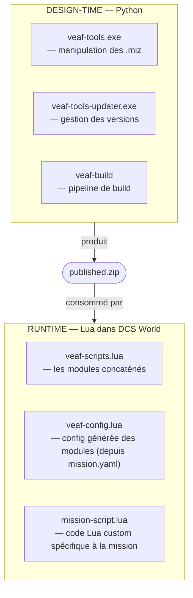

# Guide du développeur — VEAF Mission Creation Tools

Ce guide s'adresse aux développeurs qui souhaitent contribuer au code source de VEAF Mission Creation Tools, créer de nouvelles versions ou étendre le framework.

---

## Table des matières

1. [Vue d'ensemble de l'architecture](#vue-densemble-de-larchitecture)
2. [Structure du dépôt](#structure-du-dépôt)
3. [Environnement de développement](#development-environment)
4. [Scripts Lua runtime](#lua-runtime-scripts)
5. [Outils Python](#python-tools)
6. [Build et publication](#build-et-publication)
7. [Mode développeur](#developer-mode)
8. [Tests](#tests)
9. [Portes de qualité](#portes-de-qualité)
10. [Contribuer](#contribuer)

---

## Vue d'ensemble de l'architecture

Le projet comporte deux couches complètement séparées :



- **Runtime** (`src/scripts/veaf/`) — modules Lua chargés dans les missions DCS
- **Design-time** (`src/python/veaf-tools/`) — outils CLI Python pour la manipulation des fichiers `.miz`

---

## Structure du dépôt

```
VEAF-Mission-Creation-Tools/
├── veaf_build/                   # CLI veaf-build (orchestrateur build & publication)
├── build-and-release.py          # Shim de rétrocompatibilité (utiliser veaf-build à la place)
├── src/
│   ├── scripts/veaf/             # Modules Lua runtime
│   └── python/veaf-tools/        # Code source Python CLI
│       ├── veaf-tools.py         # Point d'entrée
│       ├── veaf_libs/            # Utilitaires partagés (logger, progress, miz)
│       ├── mission_tools/        # Lecture/écriture .miz
│       └── *_injector/           # Un dossier par commande CLI
├── published/                    # Sortie Lua compilée
├── dist/                         # Sortie .exe PyInstaller
├── build/                        # Espace de travail de build temporaire
├── test/
│   ├── lua/                      # Tests unitaires Lua
│   └── python/                   # Tests unitaires Python
├── doc/                          # Documentation
├── .backlog/                     # Backlog des lots (PRD + tickets)
└── .github/
    └── workflows/                # CI/CD GitHub Actions
```

---

## Environnement de développement {#development-environment}

Deux options de setup sont disponibles. Le DevContainer est recommandé pour les nouveaux contributeurs : il garantit un environnement identique à la CI.

### Option A — DevContainer (recommandé)

Le dépôt inclut une configuration `.devcontainer/` qui fournit un environnement pré-configuré, sans installation manuelle : Python 3.13, Lua 5.1, StyLua 2.4.0, Poetry et toutes les extensions VS Code sont déjà installées.

**VS Code Dev Containers** (Docker local) :

1. Installer [Docker Desktop](https://www.docker.com/products/docker-desktop/) et l'extension [Dev Containers](https://marketplace.visualstudio.com/items?itemName=ms-vscode-remote.remote-containers)
2. Ouvrir le dossier du dépôt dans VS Code
3. Appuyer sur `Ctrl+Shift+P` → *Dev Containers: Reopen in Container*
4. Attendre la construction du conteneur et la fin de `poetry install` — l'environnement est prêt

**GitHub Codespaces** (navigateur, sans installation locale) :

1. Sur la page du dépôt, cliquer sur **Code** → **Codespaces** → **New codespace**
2. L'environnement se construit automatiquement — ouvrir un terminal et commencer à travailler

Dans les deux cas, `poetry install --without build --all-extras` s'exécute automatiquement à la première ouverture.

### Option B — Setup manuel (Windows)

#### 1. Python 3.11+

Télécharger l'installateur depuis [python.org](https://www.python.org/downloads/) (version **3.13** recommandée) ou via winget :

```powershell
winget install --id Python.Python.3.13
```

> **Important :** pendant l'installation graphique, cocher **"Add Python to PATH"**. Sans cette case, `python` et `pip` ne seront pas trouvés dans le terminal.

Vérification :

```powershell
python --version   # Python 3.11 ou supérieur attendu
```

#### 2. Poetry

Poetry gère les environnements virtuels Python et les dépendances du projet. La méthode recommandée est via `pipx`, qui isole Poetry dans son propre environnement :

```powershell
python -m pip install pipx
pipx ensurepath        # ajoute ~/.local/bin au PATH — redémarrer le terminal ensuite
pipx install poetry
```

Vérification :

```powershell
poetry --version
```

> `poetry install` crée automatiquement un virtualenv isolé dans le projet. Toutes les commandes du projet s'exécutent ensuite avec le préfixe `poetry run <commande>`.

#### 3. Git

```powershell
winget install --id Git.Git
```

Ou télécharger depuis [git-scm.com](https://git-scm.com/download/win).

#### 4. Lua 5.1 (pour les tests unitaires)

Lua 5.1 est requis pour exécuter les tests localement. La version **5.1** est obligatoire — les versions 5.2+ ne sont pas compatibles avec le code DCS.

Via [Scoop](https://scoop.sh/) (gestionnaire de paquets Windows recommandé) :

```powershell
# Installer Scoop si pas encore présent
Set-ExecutionPolicy -ExecutionPolicy RemoteSigned -Scope CurrentUser
Invoke-RestMethod -Uri https://get.scoop.sh | Invoke-Expression

# Installer Lua 5.1
scoop install lua51
```

> Si une autre version de Lua est déjà installée via scoop, `lua51` **remplace son shim `lua`**
> (le paquet en déclare un). Le shim `lua51` reste disponible pour les deux, et
> `poetry run test-lua` sait le trouver — mais la commande `lua` nue de votre terminal aura changé
> de version.

Alternativement, télécharger un binaire depuis [LuaBinaries](https://luabinaries.sourceforge.net/) (`lua-5.1.x_Win64_bin.zip`), extraire et ajouter le dossier au PATH système.

Vérification :

```powershell
lua -v   # Lua 5.1.x attendu
```

Si ce n'est pas une 5.1, `poetry run test-lua` refuse de s'exécuter et affiche ce qu'il a trouvé :
lancer la suite sous 5.4 produit des dizaines d'échecs qui ressemblent à des régressions du code
VEAF et n'en sont pas.

#### 5. StyLua 2.4.0 (qualité du code Lua) {#stylua-setup}

StyLua formate le code Lua. **La version 2.4.0 est imposée par la CI** — toute autre version fera échouer le job de formatage.

Télécharger `stylua-windows-x86_64.zip` depuis la [page de release v2.4.0](https://github.com/JohnnyMorganz/StyLua/releases/tag/v2.4.0), puis installer :

```powershell
# Créer le dossier cible
New-Item -ItemType Directory -Force "$HOME\.local\bin"

# Extraire et placer l'exécutable (adapter le chemin selon où le zip a été extrait)
Copy-Item "chemin\vers\stylua.exe" "$HOME\.local\bin\stylua.exe"

# Vérifier
~/.local/bin/stylua.exe --version   # stylua 2.4.0 attendu
```

#### 6. GitHub CLI — optionnel, uniquement pour publier des versions

```powershell
winget install --id GitHub.cli
gh auth login
```

#### Cloner et initialiser le projet

Une fois tous les prérequis installés :

```powershell
git clone https://github.com/VEAF/VEAF-Mission-Creation-Tools.git
cd VEAF-Mission-Creation-Tools
git checkout develop

# Installer toutes les dépendances Python
poetry install

# Vérifier que tout fonctionne
poetry run test-lua   # tests Lua (requiert Lua 5.1)
poetry run pytest     # tests Python
```

> Pour compiler les exécutables Windows (`veaf-tools.exe`, etc.), ajouter le groupe `build` :
> ```powershell
> poetry install --with build
> ```

### Dépendances Python

| Package | Utilité |
|---------|---------|
| `typer` | Framework CLI |
| `rich` | Interface terminal (barres de progression, tableaux) |
| `pyyaml` | Chargement des fichiers de config |
| `luadata` | Sérialisation/désérialisation Lua |
| `pyinstaller` | Compilation des exécutables Windows |
| `pillow` | Traitement d'images (icônes météo) |

---

## Scripts Lua runtime {#lua-runtime-scripts}

### Structure des modules

Chaque module Lua suit ce modèle :

```lua
moduleName = {}

moduleName.Id = "MODULE_ID"
-- moduleName.LogLevel = "trace"  -- décommenter pour augmenter la verbosité

veaf.loggers.new(moduleName.Id, moduleName.LogLevel)

function moduleName.initialize()
  -- s'enregistrer auprès des marqueurs, radio, gestionnaire d'événements
end

function moduleName.start()
  -- démarrer les watchdogs, tâches planifiées
end
```

### Ordre de chargement

1. `veaf.lua` — doit être en premier
2. `veafEventHandler.lua`
3. `veafMarkers.lua`, `veafRadio.lua`, `veafSecurity.lua`
4. Tous les autres modules (dans n'importe quel ordre)

### Journalisation

```lua
veaf.loggers.get(moduleName.Id):info("Message")
veaf.loggers.get(moduleName.Id):debug("Debug: %s", variable)
veaf.loggers.get(moduleName.Id):trace("Trace: %s", veaf.lp(table))
```

Niveaux de log : `error` (1) → `warning` (2) → `info` (3) → `debug` (4) → `trace` (5). Par défaut : `info` (3).

Pour les arguments coûteux à évaluer, utiliser `veaf.lp()` (proxy lazy — stringifié uniquement si le niveau est actif).

Pour augmenter la verbosité pour une mission au **moment du build** (global, intégré dans le `.miz`), ajouter `global_log_level` dans `mission.yaml` :

```yaml
global_log_level: debug
```

Pour le contrôle **par module au moment du build**, utiliser la section `modules` :

```yaml
modules:
  SPAWN:
    logLevel: debug
  RADIO:
    logLevel: trace
```

Cela génère des appels `veaf.setConfig("MODULE_ID", "logLevel", "...")` dans `veaf-config.lua`. Ou utiliser `--log-modules SPAWN,RADIO` sur la CLI pour réduire au silence tout le reste.

Pour le contrôle **par module au runtime** (sans rebuild), ajouter l'appel Lua directement dans `mission-script.lua` :

```lua
veaf.loggers.get("SPAWN"):setLevel("debug", true)  -- force=true contourne le cap BaseLogLevel
```

### Accès mist.DBs

Ne pas accéder à `mist.DBs.*` directement. Utiliser l'interface `veaf.mist` :

```lua
local unitData  = veaf.mist.getUnitData(unitName)
local groupData = veaf.mist.getGroupData(groupName)
local isHuman   = veaf.mist.isHumanUnit(unitName)
local allUnits  = veaf.mist.getAllUnitData()
local groupById = veaf.mist.getGroupById(groupId)
```

---

## Outils Python {#python-tools}

### Architecture CLI

Chaque sous-commande de `veaf-tools.exe` est implémentée comme un package `*_injector/` :

```
weather_injector/
├── weather_worker.py    # Point d'entrée (méthode run())
├── weather_manager.py   # Logique de transformation des données
├── models.py            # Définitions des dataclasses
└── weather_README.py    # Chaînes d'aide/documentation
```

### Pattern de journalisation

```python
from veaf_libs.logger import logger, console

logger.info("Traitement de la mission...")
logger.debug("Informations détaillées")
logger.warning("Attention")
logger.error("Échec", raise_exception=True)
```

### Ajouter un nouvel outil

1. Créer `src/python/veaf-tools/new_feature_injector/`
2. Implémenter `new_feature_worker.py` avec une méthode `run()`
3. Enregistrer la commande dans `veaf-tools.py` avec `typer`
4. Ajouter le schéma de configuration YAML dans `models.py`

### Aides de test partagées {#shared-test-helpers}

`test/python/testlib/` contient les aides utilisées par plusieurs fichiers de test. Le dossier est
sur le `pythonpath` de pytest, donc ses modules s'importent par leur nom :

```python
from mission_builder_factory import make_worker
```

`make_worker(**overrides)` construit un `MissionBuilderWorker` **sans exécuter `__init__`** — celui-ci
lit `mission.yaml`, résout le chemin des scripts et vérifie la présence du chargeur sur le disque,
ce qu'un test unitaire d'une seule méthode veut éviter. Tous les attributs que `__init__` affecte
sont présents avec une valeur neutre ; le test ne nomme que ce qui l'intéresse :

```python
worker = make_worker(mission_yaml={"dcs_bridge": {"enabled": True}}, dev_mode=True)
```

Aucun accès disque : `mission_folder` vaut `None` par défaut. Quand un dossier est fourni,
`output_mission` en dérive (`<mission_folder>/out.miz`). Une clé inconnue est refusée
(`TypeError`) plutôt que de créer en silence un attribut que personne ne lit ; les remplacements de
**méthode** s'affectent sur le worker retourné, pas via `make_worker`.

Ajouter un champ à `MissionBuilderWorker.__init__` impose d'ajouter une entrée dans
`init_field_defaults()`. Ce n'est pas à retenir :
`test/python/mission_builder/test_mission_builder_factory_contract.py` lit les affectations
`self.<champ>` de `__init__` et échoue en nommant le champ manquant et le fichier à corriger.

---

## Build et publication

### Build local

```powershell
# Build (compile Lua + construit les .exe)
poetry run veaf-build build --version <version>
```

Ce que cela fait :
1. Valide les prérequis (Git, Python, PyInstaller)
2. Concatène les modules Lua → `published/veaf-scripts.lua`
3. Construit `veaf-tools.exe` et `veaf-tools-updater.exe` via PyInstaller
4. Crée `published.zip` avec tous les artefacts + somme SHA256

### Publier une version

Utiliser le prompt `.prompts/generate-release-notes.md` pour lancer la préparation de release de façon interactive. Il guide à travers :
1. Extraction des changements depuis `[Unreleased]` dans `CHANGELOG.md`
2. Interview de consolidation (thème, breaking changes, highlights)
3. Rédaction et validation de `RELEASE_NOTES.md`
4. Clôture administrative (version CHANGELOG, `pyproject.toml`, ROADMAP)
5. Commandes git à copier-coller

#### Flow de release (git flow)

L'assistant AI gère : créer `release/x.y.z` depuis `develop`, commiter tous les fichiers de release, et ouvrir la PR.

Après le merge de la PR, le développeur exécute :

```bash
git checkout develop
git pull origin develop
git tag published-vx.y.z
git push origin published-vx.y.z
```

> **Attention :** pousser le tag est irréversible — uniquement après le merge de la PR.

Pousser le tag déclenche le workflow CI `release`, qui va :
1. Construire `veaf-tools.exe`, `veaf-tools-updater.exe` et `published.zip`
2. Créer la GitHub Release en utilisant **`RELEASE_NOTES.md` tel quel** depuis le commit tagué
3. Uploader tous les artefacts et déplacer le tag flottant `published-latest`

> **Important :** `RELEASE_NOTES.md` doit être commité et à jour sur le commit tagué — la CI le prend verbatim, sans modification.

### Modèle de sécurité

```
veaf-build calcule le SHA256 de published.zip
    ↓
SHA256 stocké avec le ZIP dans la GitHub Release
    ↓
veaf-tools-updater.exe télécharge les deux fichiers
    ↓
Somme de contrôle vérifiée avant extraction
    ↓
✅ Intégrité garantie
```

---

## Tests

### Lancer tous les tests

```shell
poetry run test-lua
```

Code de sortie `0` = tous passent, `1` = échecs.

Fonctionne sur Windows, Linux et dans le DevContainer (détection automatique de `lua5.1` / `lua51` / `lua` / chemin Windows de secours). Chaque candidat est **interrogé avec `lua -v`** : un interpréteur 5.2+ est refusé, avec les instructions d'installation, plutôt qu'utilisé — sinon les incompatibilités de la 5.4 ressemblent à des régressions du code VEAF.

### Exécution filtrée

```shell
poetry run test-lua --filter spawn
poetry run test-lua --filter combat
```

### Couverture

```shell
poetry run test-lua --coverage
```

Affiche un tableau de couverture ligne par ligne. Nécessite `luarocks install luacov` (pré-installé dans le DevContainer). Voir [TESTING.md](../TESTING.md#coverage) pour plus de détails.

### Suite unique

```shell
lua test/lua/test_veafSpawn.lua
```

### Infrastructure

- **Framework :** [luaunit](https://github.com/bluebird75/luaunit) (intégré dans `test/lua/luaunit.lua`)
- **Stubs DCS :** `test/lua/dcs_mocks.lua` — stubs pour tous les espaces de noms de l'API DCS
- **Chargeur de modules :** `test/lua/veaf_loader.lua`
- Aucune installation DCS requise

Référence complète des tests : [Guide de tests](../TESTING.md)

---

## Portes de qualité

### Avant chaque commit sur des fichiers Lua

```powershell
# Vérifier le formatage (équivalent CI)
~/.local/bin/stylua.exe --check src/scripts/veaf/ test/lua/

# Corriger automatiquement
~/.local/bin/stylua.exe src/scripts/veaf/ test/lua/

# Analyse statique
luacheck src/scripts/veaf/ --config .luacheckrc
```

Version StyLua : **2.4.0** (imposée par le job CI `StyLua Formatting`).
Luacheck est imposé par le job CI `Luacheck`.

### Jobs CI

| Job | Ce qu'il vérifie |
|-----|-----------------|
| `Lua Unit Tests` | Toutes les suites de tests passent |
| `Luacheck` | Aucune variable globale non définie, variable inutilisée ni shadowing dans `src/scripts/veaf/` |
| `StyLua Formatting` | Aucune violation de formatage dans `src/scripts/veaf/` et `test/lua/` |
| `Lua Coverage` | Couverture ligne (luacov) au-dessus du plancher de cliquet (`--cov-fail-under`) — bloquant |
| `python-quality` | ruff lint + format (`src/python/ test/python/ veaf_build/`), mypy (`src/python/veaf-tools`), pytest |
| `Docs Check` | Liens et ancres de la documentation, versions FR/EN, pages absentes du menu |
| `Release` | Déclenché sur push de tag `published-v*` — build et publication sur GitHub |

Tous les jobs CI doivent être verts avant qu'une PR puisse être mergée. Exception :
`dcs-mock-coverage` est en `continue-on-error` — informatif, il ne bloque pas le merge.

### Avant un commit qui touche à la documentation {#docs-check}

```bash
poetry run docs-check
```

Le job CI `Docs Check` lance exactement la même commande, qui enchaîne **trois passes** : la passe
principale sur `doc/` (le tableau ci-dessous), une passe de liens relatifs sur le reste du dépôt
(`.backlog/`, `docs/`, les pages racine), et une passe de couverture documentaire (chaque capacité
définie par le code doit être nommée par sa page de référence). La passe principale refuse quatre
dérives qui, avant son existence, s'étaient accumulées silencieusement (voir le lot
`DOC-AUDIT-PASS`) :

| Vérification | Pourquoi |
|--------------|----------|
| lien relatif `.md` vers un fichier inexistant | six liens renvoyaient un 404 **en production** |
| ancre inter-page inexistante dans la page cible | une renumérotation de sections avait laissé des liens derrière elle |
| ancre inter-page dérivée d'un titre | elle casse au premier reformulage et **diffère entre FR et EN** ; déclarez `{#ancre}` |
| page FR sans version `.en.md`, ou absente du menu `nav` | une page est restée non traduite des mois, servant du français sur l'URL anglaise |

**Convention d'ancre** : le nom de l'ancre est **en anglais** et identique dans les deux langues ;
le titre affiché, lui, reste dans la langue de la page.

```markdown
## Couverture {#coverage}      <!-- FR : titre français, ancre anglaise -->
## Coverage {#coverage}        <!-- EN : même ancre -->
```

Un lien inter-page vise alors toujours `#coverage`, quelle que soit la langue du lecteur.

> La version affichée en en-tête des grosses références n'est **pas** écrite à la main : le dépôt
> garde un intervalle lisible (`6.11.x`) et le workflow de publication la remplace par la version
> livrée (`poetry run docs-stamp-version`).

### Republier la documentation d'une version déjà sortie

Relancer le build du tag ne suffit pas : il reconstruirait depuis le **commit tagué**, donc sans
un correctif arrivé après le tag. Utilisez le déclenchement manuel du workflow `Deploy Docs` :

| Champ | Valeur |
|-------|--------|
| branche | celle qui contient le correctif (`develop`) |
| `version` | la version à republier, par exemple `6.12.0` |
| `set_latest` | coché si cette version doit rester la `latest` du site |

La version saisie est aussi celle qui est tamponnée dans les pages — sans quoi republier la 6.12.0
depuis un dépôt en 6.12.1 estampillerait les pages 6.12.1. Laisser `version` vide redéploie
simplement l'alias `dev`.

---

### Publier une nouvelle version

Pousser un tag `published-v*` — le workflow CI `Release` fait tout automatiquement :

```bash
git tag published-v<version>
git push origin published-v<version>
```

---

## Mode développeur {#developer-mode}

Le mode développeur permet de tester des modifications locales de `veaf-scripts.lua` sans publier de version.
Lorsqu'il est activé, `veaf-tools mission build` lit les scripts depuis un clone local de VEAF-Mission-Creation-Tools
plutôt que depuis le dossier `published/` livré avec veaf-tools.

### Prérequis

1. Cloner VEAF-Mission-Creation-Tools en local
2. Construire le bundle Lua : `poetry run veaf-build build` → produit `build/veaf-scripts.lua`

### Activation (ordre de priorité — premier trouvé appliqué)

| Priorité | Méthode | Effet |
|----------|---------|-------|
| 1 | `veaf-tools mission build --dev-mode` | Option CLI — définit `dev_mode: true`, persisté dans `mission.yaml` |
| 2 | `mission.yaml build.dev_mode: true` | Config persistée — s'applique à chaque build |
| 3 | *(défaut)* | `false` — utilise les scripts publiés |

Ordre de résolution de `scripts_path` (emplacement du dépôt local) :

| Priorité | Source |
|----------|--------|
| 1 | Option CLI `--scripts-path <chemin>` |
| 2 | `mission.yaml build.scripts_path` |
| 3 | `~/veafmct.yaml scripts_path` |

Lorsqu'ils sont passés via la CLI, `dev_mode` et `scripts_path` sont persistés dans `mission.yaml`.

### Effet sur le build

| Mode | Source des scripts |
|------|-------------------|
| `dev_mode: false` (défaut) | `published/src/scripts/veaf/veaf-scripts.lua` (copie publiée) |
| `dev_mode: true` | `<scripts_path>/build/veaf-scripts.lua` (sortie du build local) |

### Exemple de workflow

```powershell
# 1. Modifier un module Lua
code src/scripts/veaf/veafSpawn.lua

# 2. Reconstruire le bundle Lua
poetry run veaf-build build

# 3. Builder une mission de test avec les scripts locaux
cd chemin/vers/ma-mission
veaf-tools mission build --dev-mode --scripts-path chemin/vers/VEAF-Mission-Creation-Tools
```

---

## Contribuer

### Git Flow

- **Développement de fonctionnalité :** créer `feature/xxx` depuis `develop`, ouvrir PR → `develop`
- **Corrections de bugs :** créer `fix/xxx` depuis `develop`, ouvrir PR → `develop`
- **Hotfixes en production :** `fix/xxx` depuis `master`, PR → `master`
- **Versions :** `release/X.Y.Z` (sans `v`) depuis `develop`, PR → `master`

### Convention de commit

```
type(scope): courte description

feat(spawn): ajouter le mode patrouille convoy
fix(qra): vérifier unit:isExist() avant unit:inAir()
chore(deps): mettre à jour luaunit à 3.4
docs(api): documenter les helpers tanker de veafMove
```

**Types :** `feat`, `fix`, `chore`, `docs`, `test`, `refactor`, `style`

### Checklist Pull Request

- [ ] Tous les changements Lua passent `stylua --check`
- [ ] Tous les tests unitaires passent (`poetry run test-lua`)
- [ ] Les nouvelles fonctionnalités ont des tests dans `test/lua/`
- [ ] Les changements d'API publique sont documentés dans `doc/LUA_API_REFERENCE.md`
- [ ] `CHANGELOG.md` mis à jour pour les changements visibles par les utilisateurs

---

## Pour aller plus loin

- [Référence API Lua](../LUA_API_REFERENCE.md) — API publique complète des modules
- [Guide de tests](../TESTING.md) — détails de l'infrastructure de test
- [Référence CLI](../CLI_REFERENCE.md) — les 25 commandes de `veaf-tools` et toutes leurs options
- [Feuille de route](../ROADMAP.md) — travaux planifiés
