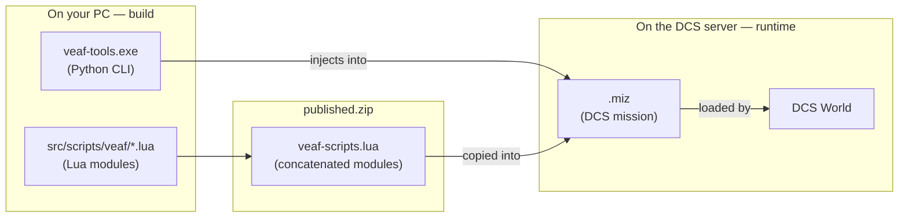

# Developer Guide

This project delivers two things: **Lua scripts** that run inside DCS World missions, and **Python tools** that prepare those missions before launch. The two layers are independent — you can contribute to one without touching the other.

---

## The two layers

### Runtime layer — Lua inside DCS

`src/scripts/veaf/` contains the Lua modules loaded inside DCS World missions while the mission is running. These scripts do not execute on your PC — they execute inside the simulator, on the server hosting the mission. They handle features such as QRAs, combat zones, dynamic weather, radio menus, and more.

Lua 5.1 is the scripting language embedded in DCS World. There are no external libraries, no package manager — just plain `.lua` files.

### Build layer — Python

`src/python/veaf-tools/` is a CLI tool that manipulates `.miz` files (DCS missions, which are ZIP archives). It injects Lua scripts, configuration, and weather data into a mission *before* it is launched.

`veaf_build/` is the orchestrator that concatenates the Lua modules into a single file, compiles Windows `.exe` files, and publishes GitHub releases.

### How the two layers connect

The Python tools produce a `published.zip`. That ZIP is consumed by mission makers to embed VEAF scripts into their own DCS missions.



---

## Where to start?

**You want to modify a Lua script** (add a feature, fix a bug in a module):

1. Read the [Lua Runtime Scripts](GUIDE.md#lua-runtime-scripts) section of the guide
2. Edit the file in `src/scripts/veaf/`
3. Run `poetry run test-lua` to check nothing is broken

**You want to modify the Python tools** (`veaf-tools.exe` CLI, build pipeline):

1. Read the [Python Tools](GUIDE.md#python-tools) section of the guide
2. Edit the code in `src/python/veaf-tools/`
3. Run `poetry run pytest` to check

**You are starting from scratch and have nothing installed:**

→ The [Development Environment](GUIDE.md#development-environment) section walks through every installation step (Python, Poetry, Lua, StyLua).

---

## Initial environment check

Do this once after following the [setup guide](GUIDE.md#development-environment), to confirm everything is correctly installed:

```powershell
git clone https://github.com/VEAF/VEAF-Mission-Creation-Tools.git
cd VEAF-Mission-Creation-Tools
git checkout develop-v6
poetry install

poetry run test-lua   # should show "OK" for every suite
poetry run pytest     # should show "passed" with no failures
```

---

## Quality Gates — before each commit

These commands must pass without errors before committing. CI also runs them automatically — a failing job blocks the merge.

| What was changed | Commands to run |
|-----------------|----------------|
| Lua files (`src/scripts/veaf/`) | `stylua --check src/scripts/veaf/` then `poetry run test-lua` |
| Python code (`src/python/`) | `poetry run ruff check src/python` then `poetry run mypy src/python` then `poetry run pytest` |

> On Windows, `stylua` is installed at `~/.local/bin/stylua.exe` by default (see [setup guide](GUIDE.md#5-stylua-240-lua-code-quality)).

---

## Full reference

- [Complete Developer Guide](GUIDE.md) — repository layout, coding conventions, build pipeline, contributing workflow
- [Testing Guide](../TESTING.md) — Lua and Python test infrastructure in detail
- [`export` JSON contract](export-json-contract.en.md) — `veaf-tools export` output format consumed by the BFR `dcs-mission-tools` plugin
- [Per-type radio-preset projection](radio-preset-projection.en.md) — how the build projects `channel_lists` onto each aircraft's radios (channel 0, reserved slots, fusion — AJS-37, OH-58D, Mi-24P…)

---

## External references — DCS API

- **[DCS World Schema](https://github.com/YoloWingPixie/dcs-world-schema)** (YoloWingPixie, MIT) — a complete YAML schema of the DCS World mission-scripting API, exported as JSON Schema, EmmyLua annotations (`dcs-world-api.lua`) and TypeScript/Go/Python types. A reference for DCS API signatures; useful for LuaLS linting and to extend our `test/lua/dcs_mocks.lua` stubs.

### Vendored DCS schema

A frozen copy (release `v0.3.5`) is vendored under `src/python/veaf-tools/veaf_libs/data/dcs-schema/` (upstream MIT `LICENSE` + a `NOTICE` recording the tag, URL and fetch date). It serves two purposes:

- **Mock-coverage audit** — `poetry run audit-dcs-mocks` cross-references the schema's DCS functions, the calls actually made by `src/scripts/veaf/*.lua` and the stubs in `test/lua/dcs_mocks.lua`, then lists the DCS calls used by VEAF but not mocked (the gap we find too late today, when a test fails). Use `--format json`/`markdown` for machine-readable output. A non-blocking CI job publishes the report to the run summary.
- **IDE help (optional)** — `.luarc.json` wires LuaLS to the vendored `dcs-world-api.lua` EmmyLua annotations, for autocomplete and signature diagnostics in VSCode while writing VEAF Lua.

Updating this copy is an explicit bump commit (re-download the artifacts from a newer release). Drift-watch is handled by the VENDORED-DRIFT-WATCH lot.

## Vendored third-party artifacts — drift watch

We freeze (commit a copy of) several third-party artifacts: community Lua (`mist`, `CTLD`, `CSAR`, `AIEN`, `TheUniversalMission`, `Skynet`, `Hercules_Cargo`, `DCS-SimpleTextToSpeech`), the Python `luadata` lib, sounds, and the DCS schema above. The **`vendored.yaml`** manifest (repo root) is the single source of truth for every pin: per artifact it records the real `source` (established by **content comparison**, never by assuming a VEAF fork is the origin), the `upstream`, the `vendoring` mode (`verbatim` / `adapted` / `fork` / `compiled`), and the `manual_steps` to update it (a plain re-copy vs a fork-rebase / recompile).

- **`poetry run check-vendored`** compares each pin against upstream **via the GitHub API only** (no artifact download) — latest release tag or latest file commit — and reports `drifted` / `up-to-date` / `manual` (`--format table|json|markdown`, non-zero exit on anything actionable).
- The scheduled **`vendored-drift-watch.yml`** workflow (weekly cron + `workflow_dispatch`) runs it and **opens or updates a single recap issue** listing the drifts + the manual re-check reminders, each with its `manual_steps`. **Notify only — never auto-update** (that is the COMMUNITY-AUTOUPDATE vision).
