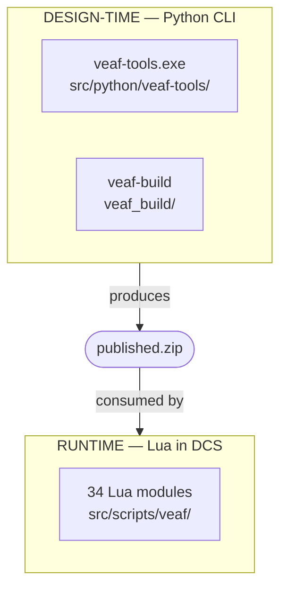

# Developer Guide

Contribute to the VEAF Mission Creation Tools — a hybrid Lua + Python project with 34 runtime modules and a CLI toolkit.

---

## Quick Start — Clone to Tests in 5 Minutes

```powershell
# 1. Clone
git clone https://github.com/VEAF/VEAF-Mission-Creation-Tools.git
cd VEAF-Mission-Creation-Tools
git checkout develop-v6

# 2. Install Python dependencies (requires Poetry)
poetry install

# 3. Run Lua tests
poetry run test-lua

# 4. Run Python quality gate
poetry run ruff check src/python
poetry run mypy src/python
poetry run pytest
```

---

## Architecture at a Glance



| Layer | Language | Location | Purpose |
|-------|----------|----------|----------|
| Runtime | Lua 5.1 | `src/scripts/veaf/` | Executes inside DCS missions |
| CLI Tools | Python 3.11+ | `src/python/veaf-tools/` | `.miz` file manipulation |
| Build | Python | `veaf_build/` | Build & release orchestrator |
| Tests | Lua + Python | `test/` | Unit tests for both layers |

---

## Quality Gates

| Gate | Command | CI Job |
|------|---------|--------|
| Lua formatting | `stylua --check src/scripts/veaf/` | StyLua Formatting |
| Lua lint | `luacheck src/scripts/veaf/ --config .luacheckrc` | Luacheck |
| Lua tests | `poetry run test-lua` | Lua Tests |
| Python lint + format | `poetry run ruff check` + `ruff format --check` | Python Quality |
| Python types | `poetry run mypy src/python` | Python Quality |
| Python tests | `poetry run pytest` | Python Quality |

---

## Full Reference

The [complete Developer Guide](GUIDE.md) covers repository layout, coding conventions, build pipeline, and contributing workflow.

See also: [Testing Guide](../TESTING.md)
