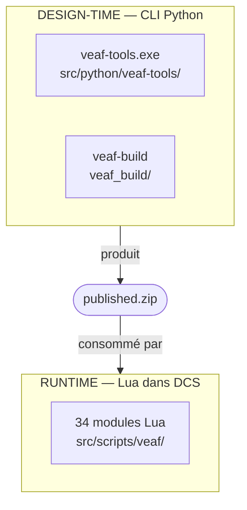

# Guide du développeur

Contribuez aux VEAF Mission Creation Tools — un projet hybride Lua + Python avec 34 modules runtime et un toolkit CLI.

---

## Démarrage rapide — Du clone aux tests en 5 minutes

```powershell
# 1. Cloner
git clone https://github.com/VEAF/VEAF-Mission-Creation-Tools.git
cd VEAF-Mission-Creation-Tools
git checkout develop-v6

# 2. Installer les dépendances Python (nécessite Poetry)
poetry install

# 3. Lancer les tests Lua
$FAILED=0
Get-ChildItem test/lua/test_*.lua | Sort-Object Name | ForEach-Object {
    lua $_.FullName; if ($LASTEXITCODE -ne 0) { $FAILED=1 }
}

# 4. Lancer la quality gate Python
poetry run ruff check src/python
poetry run mypy src/python
poetry run pytest
```

---

## Architecture en un coup d'œil



| Couche | Langage | Emplacement | Rôle |
|--------|---------|-------------|------|
| Runtime | Lua 5.1 | `src/scripts/veaf/` | S'exécute dans les missions DCS |
| Outils CLI | Python 3.11+ | `src/python/veaf-tools/` | Manipulation de fichiers `.miz` |
| Build | Python | `veaf_build/` | Orchestrateur de build & release |
| Tests | Lua + Python | `test/` | Tests unitaires des deux couches |

---

## Quality Gates

| Gate | Commande | Job CI |
|------|----------|--------|
| Formatage Lua | `stylua --check src/scripts/veaf/` | StyLua Formatting |
| Lint Lua | `luacheck src/scripts/veaf/ --config .luacheckrc` | Luacheck |
| Tests Lua | `lua test/lua/test_*.lua` | Lua Tests |
| Lint + format Python | `poetry run ruff check` + `ruff format --check` | Python Quality |
| Types Python | `poetry run mypy src/python` | Python Quality |
| Tests Python | `poetry run pytest` | Python Quality |

---

## Référence complète

Le [guide développeur complet](GUIDE.md) couvre l'organisation du dépôt, les conventions de code, le pipeline de build, et le workflow de contribution.

Voir aussi : [Guide de test](../TESTING.md)
