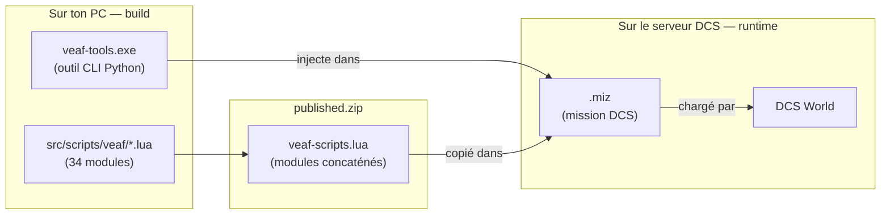

# Guide du développeur

Ce projet fournit deux choses : des **scripts Lua** qui s'exécutent dans des missions DCS World, et des **outils Python** qui préparent ces missions avant le lancement. Les deux couches sont indépendantes — on peut contribuer à l'une sans toucher à l'autre.

---

## Les deux couches du projet

### Couche runtime — Lua dans DCS

`src/scripts/veaf/` contient 34 modules Lua chargés à l'intérieur des missions DCS au moment où la mission tourne. Ces scripts ne s'exécutent pas sur ton PC — ils s'exécutent dans le simulateur, sur le serveur qui héberge la mission. Ils gèrent des fonctionnalités comme les QRA, les zones de combat, la météo dynamique, la radio, etc.

Lua 5.1 est le langage de script embarqué dans DCS World. Il n'y a pas de bibliothèque externe, pas de package manager — juste des fichiers `.lua` purs.

### Couche build — Python

`src/python/veaf-tools/` est un outil CLI qui manipule les fichiers `.miz` (les missions DCS, qui sont des archives ZIP). Il injecte les scripts Lua, la configuration, et les données météo dans la mission *avant* son lancement.

`veaf_build/` est l'orchestrateur qui concatène les 34 modules Lua en un seul fichier, compile les `.exe` Windows, et publie les releases GitHub.

### Comment les deux couches se connectent

Les outils Python produisent un `published.zip`. Ce ZIP est consommé par les créateurs de missions pour intégrer les scripts VEAF dans leurs propres missions DCS.



---

## Par où commencer ?

**Tu veux modifier un script Lua** (ajouter une fonctionnalité, corriger un bug dans les modules) :

1. Lis la section [Scripts Lua runtime](GUIDE.md#scripts-lua-runtime) du guide
2. Modifie le fichier dans `src/scripts/veaf/`
3. Lance `poetry run test-lua` pour vérifier que rien n'est cassé

**Tu veux modifier les outils Python** (la CLI `veaf-tools.exe`, le pipeline de build) :

1. Lis la section [Outils Python](GUIDE.md#outils-python) du guide
2. Modifie le code dans `src/python/veaf-tools/`
3. Lance `poetry run pytest` pour vérifier

**Tu démarres de zéro et n'as rien d'installé** :

→ La [section Environnement de développement](GUIDE.md#environnement-de-développement) détaille toutes les installations pas-à-pas (Python, Poetry, Lua, StyLua).

---

## Vérification rapide de l'environnement

Une fois l'environnement configuré (voir [GUIDE.md](GUIDE.md#environnement-de-développement)) :

```powershell
# Cloner et préparer
git clone https://github.com/VEAF/VEAF-Mission-Creation-Tools.git
cd VEAF-Mission-Creation-Tools
git checkout develop-v6
poetry install

# Vérifier que tout fonctionne
poetry run test-lua   # tests des modules Lua (31 suites)
poetry run pytest     # tests des outils Python
```

---

## Quality Gates

Avant tout commit, ces commandes doivent passer sans erreur :

| Ce qui est modifié | Commandes à lancer |
|--------------------|-------------------|
| Fichiers Lua (`src/scripts/veaf/`) | `~/.local/bin/stylua.exe --check src/scripts/veaf/` puis `poetry run test-lua` |
| Code Python (`src/python/`) | `poetry run ruff check src/python` puis `poetry run mypy src/python` puis `poetry run pytest` |

La CI vérifie tout cela automatiquement à chaque PR. Un job rouge bloque le merge.

---

## Référence complète

- [Guide développeur complet](GUIDE.md) — organisation du dépôt, conventions de code, pipeline de build, workflow de contribution
- [Guide de test](../TESTING.md) — infrastructure de test Lua et Python en détail
