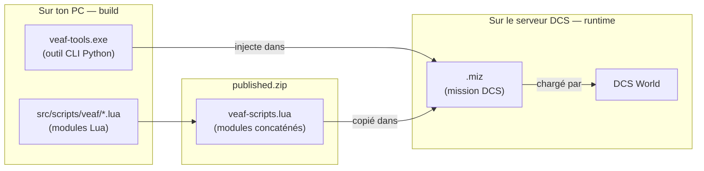

# Guide du développeur

Ce projet fournit deux choses : des **scripts Lua** qui s'exécutent dans des missions DCS World, et des **outils Python** qui préparent ces missions avant le lancement. Les deux couches sont indépendantes — on peut contribuer à l'une sans toucher à l'autre.

---

## Les deux couches du projet

### Couche runtime — Lua dans DCS

`src/scripts/veaf/` contient les modules Lua chargés à l'intérieur des missions DCS au moment où la mission tourne. Ces scripts ne s'exécutent pas sur ton PC — ils s'exécutent dans le simulateur, sur le serveur qui héberge la mission. Ils gèrent des fonctionnalités comme les QRA, les zones de combat, la météo dynamique, la radio, etc.

Lua 5.1 est le langage de script embarqué dans DCS World. Il n'y a pas de bibliothèque externe, pas de package manager — juste des fichiers `.lua` purs.

### Couche build — Python

`src/python/veaf-tools/` est un outil CLI qui manipule les fichiers `.miz` (les missions DCS, qui sont des archives ZIP). Il injecte les scripts Lua, la configuration, et les données météo dans la mission *avant* son lancement.

`veaf_build/` est l'orchestrateur qui concatène les modules Lua en un seul fichier, compile les `.exe` Windows, et publie les releases GitHub.

### Comment les deux couches se connectent

Les outils Python produisent un `published.zip`. Ce ZIP est consommé par les créateurs de missions pour intégrer les scripts VEAF dans leurs propres missions DCS.



---

## Par où commencer ?

**Tu veux modifier un script Lua** (ajouter une fonctionnalité, corriger un bug dans les modules) :

1. Lis la section [Scripts Lua runtime](GUIDE.md#lua-runtime-scripts) du guide
2. Modifie le fichier dans `src/scripts/veaf/`
3. Lance `poetry run test-lua` pour vérifier que rien n'est cassé

**Tu veux modifier les outils Python** (la CLI `veaf-tools.exe`, le pipeline de build) :

1. Lis la section [Outils Python](GUIDE.md#python-tools) du guide
2. Modifie le code dans `src/python/veaf-tools/`
3. Lance `poetry run pytest` pour vérifier

**Tu démarres de zéro et n'as rien d'installé** :

→ La [section Environnement de développement](GUIDE.md#development-environment) détaille toutes les installations pas-à-pas (Python, Poetry, Lua, StyLua).

---

## Vérification initiale de l'environnement

À faire une seule fois après avoir suivi le [guide de setup](GUIDE.md#development-environment), pour confirmer que tout est bien installé :

```powershell
git clone https://github.com/VEAF/VEAF-Mission-Creation-Tools.git
cd VEAF-Mission-Creation-Tools
git checkout develop
poetry install

poetry run test-lua   # doit afficher "OK" pour toutes les suites
poetry run pytest     # doit afficher "passed" sans échec
```

---

## Quality Gates — avant chaque commit

Ces commandes doivent passer sans erreur avant de committer. La CI les exécute aussi automatiquement — un job rouge bloque le merge.

| Ce qui est modifié | Commandes à lancer |
|--------------------|-------------------|
| Fichiers Lua (`src/scripts/veaf/`) | `stylua --check src/scripts/veaf/` puis `poetry run test-lua` |
| Code Python (`src/python/`) | `poetry run ruff check src/python` puis `poetry run mypy src/python` puis `poetry run pytest` |

> Sur Windows, `stylua` est installé dans `~/.local/bin/stylua.exe` par défaut (voir [guide de setup](GUIDE.md#stylua-setup)).

---

## Référence complète

- [Guide développeur complet](GUIDE.md) — organisation du dépôt, conventions de code, pipeline de build, workflow de contribution
- [Guide de test](../TESTING.md) — infrastructure de test Lua et Python en détail
- [Contrat JSON `export`](export-json-contract.md) — format de sortie de `veaf-tools mission export` consommé par le plugin BFR `dcs-mission-tools`
- [Projection des presets radio par type](radio-preset-projection.md) — comment le build projette les `channel_lists` sur les radios de chaque appareil (canal 0, slots réservés, fusion — AJS-37, OH-58D, Mi-24P…)
- [Serveur MCP d'édition de mission](mission-editing-mcp.md) — `veaf-mission-mcp`, actions editor-parity (mutation directe du `.miz`) vs actions VMCT, catalogue v1 (`describe_mission`, `add_group`)

---

## Ressources externes — API DCS

- **[DCS World Schema](https://github.com/YoloWingPixie/dcs-world-schema)** (YoloWingPixie, MIT) — schéma YAML complet de l'API de scripting de mission DCS World, exporté en JSON Schema, annotations EmmyLua (`dcs-world-api.lua`) et types TypeScript/Go/Python. Référence pour les signatures de l'API DCS ; utile pour le linting LuaLS et pour compléter nos stubs `test/lua/dcs_mocks.lua`.

### Schéma DCS vendoré

Une copie figée (release `v0.3.5`) est vendorée sous `src/python/veaf-tools/veaf_libs/data/dcs-schema/` (`LICENSE` MIT + `NOTICE` rappelant le tag, l'URL et la date de récupération). Elle sert à deux choses :

- **Audit de couverture des mocks** — `poetry run audit-dcs-mocks` croise les fonctions DCS du schéma, les appels réellement faits par `src/scripts/veaf/*.lua` et les stubs de `test/lua/dcs_mocks.lua`, puis liste les appels DCS utilisés par VEAF mais non mockés (le trou qu'on découvre aujourd'hui trop tard, quand un test échoue). `--format json`/`markdown` pour la sortie machine. Un job CI non bloquant publie le rapport dans le résumé du run.
- **Aide IDE (optionnel)** — `.luarc.json` câble LuaLS sur l'annotation EmmyLua `dcs-world-api.lua` vendorée, pour l'autocomplétion et le diagnostic de signatures dans VSCode lors de l'écriture du Lua VEAF.

Mettre à jour cette copie = un commit de bump explicite (re-télécharger les artefacts d'une release plus récente). La veille de dérive est gérée par le lot VENDORED-DRIFT-WATCH.

## Artefacts tiers vendorés — veille de dérive

On fige (commit d'une copie) plusieurs artefacts tiers : Lua communautaire (`mist`, `CTLD`, `CSAR`, `AIEN`, `TheUniversalMission`, `Skynet`, `Hercules_Cargo`, `DCS-SimpleTextToSpeech`), la lib Python `luadata`, des sons, et le schéma DCS ci-dessus. Le manifeste **`vendored.yaml`** (racine du repo) est la source de vérité unique des pins : par artefact il enregistre la `source` réelle (établie par **comparaison de contenu**, jamais en supposant qu'un fork VEAF est l'origine), l'`upstream`, le mode `vendoring` (`verbatim` / `adapted` / `fork` / `compiled`), et les `manual_steps` pour mettre à jour (re-copie vs rebase de fork / recompilation).

- **`poetry run check-vendored`** compare chaque pin à l'upstream **via l'API GitHub uniquement** (aucun téléchargement d'artefact) — dernier tag de release ou dernier commit du fichier — et signale `drifted` / `up-to-date` / `manual` (sortie `--format table|json|markdown`, code de sortie ≠ 0 si quelque chose est actionnable).
- Le workflow planifié **`vendored-drift-watch.yml`** (cron hebdomadaire + `workflow_dispatch`) le lance et **ouvre ou met à jour une seule issue récap** listant les dérives + les rappels de re-vérification manuelle, chacun avec ses `manual_steps`. **Notification seulement — jamais de mise à jour automatique** (c'est la vision COMMUNITY-AUTOUPDATE).
