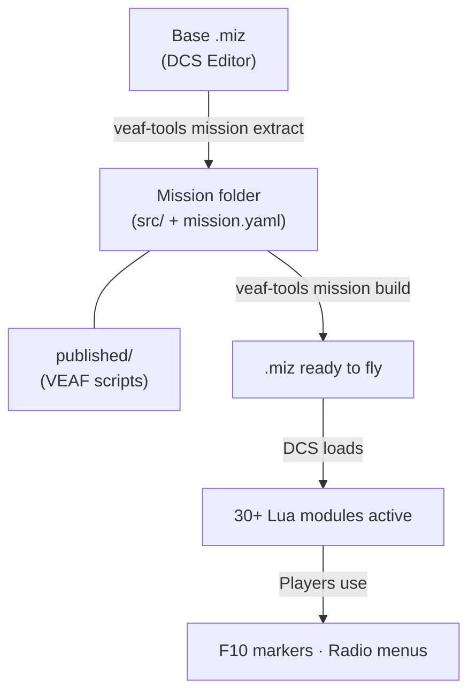

# VEAF Mission Creation Tools — Documentation

VEAF MCT turns a standard DCS mission into a dynamic, player-driven sandbox — 30+ Lua modules, a build pipeline, and a CLI tool that does the heavy lifting.

Complete toolkit for creating dynamic [DCS World](https://www.digitalcombatsimulator.com/) missions using VEAF Lua scripts and automation tools.

---

## Start here {#start-here}

<div class="grid cards" markdown>

-   :material-airplane:{ .lg .middle } **Fly**

    ---

    You are joining a VEAF mission: F10 menus, marker commands, what you can spawn.

    [:octicons-arrow-right-24: Pilot Guide](pilot/README.en.md)

-   :material-compass-outline:{ .lg .middle } **Discover VMCT**

    ---

    What the tools do and how a mission is made, in ten minutes.

    [:octicons-arrow-right-24: Discover VMCT](mission-maker/DISCOVER.en.md)

-   :material-hammer-wrench:{ .lg .middle } **My first mission**

    ---

    The tutorial, from an empty folder to a mission running in DCS.

    [:octicons-arrow-right-24: Tutorial](mission-maker/TUTORIAL.en.md)

-   :material-robot-outline:{ .lg .middle } **Create with an AI**

    ---

    Claude, Gemini or another AI: you describe the mission, it builds it.

    [:octicons-arrow-right-24: Install the AI assistant](mission-maker/AI_ASSISTANT_INSTALL.en.md)

-   :material-file-restore-outline:{ .lg .middle } **Take over a mission**

    ---

    A VEAF v5 mission to bring to v6, or another author's mission to adopt.

    [:octicons-arrow-right-24: Migrate a v5 mission](mission-maker/MIGRATION_GUIDE.en.md)<br>
    [:octicons-arrow-right-24: Adopt a third-party mission](mission-maker/CONVERT_OTHER.en.md)

-   :material-lifebuoy:{ .lg .middle } **Get help**

    ---

    Where to ask, and what to provide so that someone can answer.

    [:octicons-arrow-right-24: Getting help](SUPPORT.en.md)

</div>

Everything else for mission makers is in the [Mission Maker Guide](mission-maker/README.en.md); to contribute to the tools, see the [Developer Guide](developer/README.en.md).

---

## How It Works



1. **Extract** — Create a base mission in DCS Editor and extract it into version-controllable source files
2. **Configure** — `mission.yaml` declares active modules; `published/` provides the VEAF Lua scripts
3. **Build** — `veaf-tools mission build` assembles everything into a final `.miz`
4. **Runtime** — DCS loads the `.miz`; players interact via F10 markers and radio menus

---

## References

| Reference | Description |
|-----------|-------------|
| [Lua API Reference](LUA_API_REFERENCE.en.md) | Full API for the Lua runtime modules |
| [CLI Reference](CLI_REFERENCE.en.md) | `veaf-tools` — all 37 commands, their arguments and every option |
| [Updater & release tools](TOOLS_REFERENCE.en.md) | `veaf-tools-updater` and `veaf-build`: install, update, publish |
| [Testing Guide](TESTING.en.md) | Lua unit test suite and CI/CD pipeline |
| [Roadmap](ROADMAP.en.md) | Planned features and known limitations |

---

## Quick Start

### Players and Pilots

You are in a mission that uses VEAF scripts. Open the F10 map, place a marker, and type a command — for example `_spawn unit, name T-80UD` or `_cas`. See the [Pilot Guide](pilot/README.en.md) for all available commands.

### Demo mission

The [v6 demo mission](https://github.com/VEAF/VEAF-Demo-Mission-v6/blob/main/README.en.md) shows every feature in game, with a guided tour (**F10 → Other → Guided tour**), in French and in English.
It is also the tools' acceptance check, run before every release — see [the mission maker guide](mission-maker/GUIDE.en.md#demo-mission).

### Mission Makers

> **The `.\` is required.** The default Windows terminal is PowerShell, which does not search the
> current directory — on purpose. `cmd.exe` accepts both forms, so `.\` works everywhere. See
> [PowerShell or Command Prompt?](mission-maker/GUIDE.en.md#powershell-vs-cmd).

```powershell
# 1. Download veaf-tools-updater.exe from the GitHub release page and run it:
.\veaf-tools-updater.exe
# → installs veaf-tools.exe and all VEAF scripts in the current folder
```

Then, depending on your starting point:

**You already have a VEAF mission folder** (or created one with `mission prepare`):
```powershell
.\veaf-tools.exe mission build
```

**You only have a `.miz` file:**
```powershell
.\veaf-tools.exe mission extract my-mission.miz
# → edit mission.yaml to enable the modules you want
.\veaf-tools.exe mission build
```

Full workflow: [Mission Maker Guide](mission-maker/README.en.md)

### Developers

```powershell
poetry install --with build
poetry run veaf-build build --version <version>
poetry run test-lua
poetry run veaf-build publish --version <version>
```

Full reference: [Developer Guide](developer/README.en.md)

---

## Community & Support

- **[Getting help](SUPPORT.en.md)** — where to go, what to provide, where the logs are
- [VEAF Discord](https://www.veaf.org/discord) — real-time help
- [GitHub Issues](https://github.com/VEAF/VEAF-Mission-Creation-Tools/issues) — bug reports and feature requests
- [VEAF Website](https://www.veaf.org)
