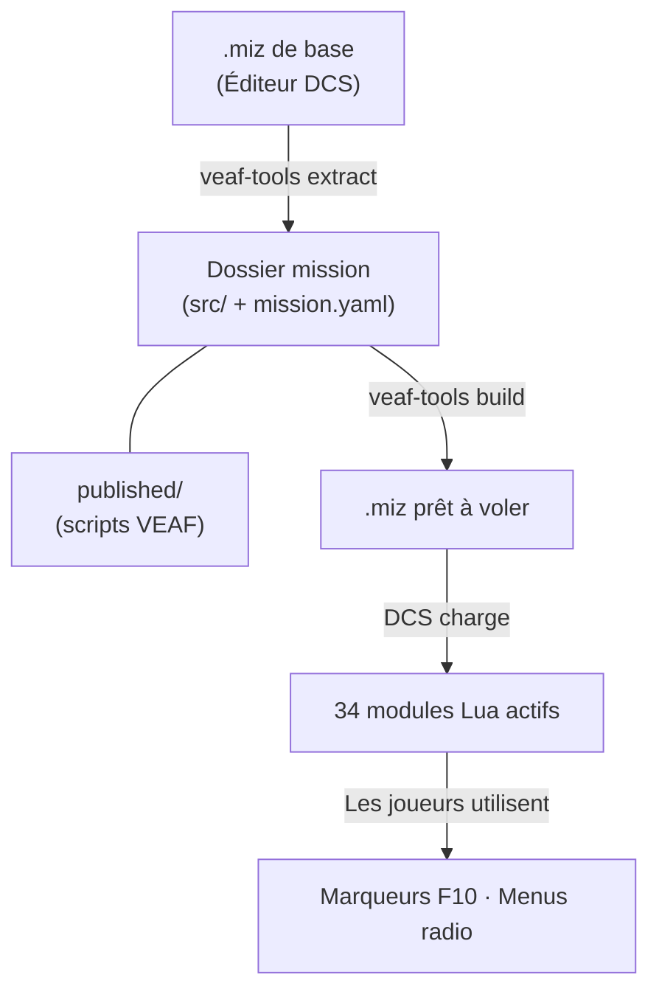

# VEAF Mission Creation Tools — Documentation

VEAF MCT transforme une mission DCS standard en un bac à sable dynamique piloté par les joueurs — 34 modules Lua, un pipeline de build, et un outil CLI qui fait le gros du travail.

Ensemble complet d'outils pour créer des missions [DCS World](https://www.digitalcombatsimulator.com/) dynamiques avec les scripts Lua VEAF.

---

## Choisissez votre guide

| Rôle | Par ici | Ce que vous trouverez |
|------|---------|-----------------------|
| **Joueur / Pilote** | [Guide du pilote](pilot/README.md) | Menus F10, commandes marqueurs, assets et zones de combat disponibles |
| **Créateur de missions** | [Guide créateur de missions](mission-maker/README.md) | Installation, configuration des modules, build et déploiement |
| **Développeur** | [Guide du développeur](developer/README.md) | Architecture, pipeline de build, qualité, contribution |

---

## Principe de fonctionnement



1. **Extract** — Créez une mission de base dans l'éditeur DCS et extrayez-la en fichiers source versionnables
2. **Configure** — `mission.yaml` déclare les modules actifs ; `published/` fournit les scripts Lua VEAF
3. **Build** — `veaf-tools build` assemble tout en un `.miz` final
4. **Runtime** — DCS charge le `.miz` ; les joueurs interagissent via les marqueurs F10 et les menus radio

---

## Références

| Référence | Description |
|-----------|-------------|
| [Référence API Lua](LUA_API_REFERENCE.md) | API complète des 34 modules Lua runtime |
| [Référence CLI des outils](TOOLS_REFERENCE.md) | `veaf-tools.exe` — toutes les commandes et options |
| [Guide de tests](TESTING.md) | Suite de tests Lua unitaires et pipeline CI/CD |
| [Feuille de route](ROADMAP.md) | Fonctionnalités prévues et limitations connues |

---

## Démarrage rapide

### Joueurs et pilotes

Vous êtes dans une mission utilisant les scripts VEAF. Ouvrez la carte F10, placez un marqueur et tapez une commande — par exemple `_spawn unit T-80` ou `_cas`. Voir le [Guide du pilote](pilot/README.md) pour toutes les commandes disponibles.

### Créateurs de missions

```powershell
# 1. Téléchargez veaf-tools-updater.exe depuis la page de release GitHub et lancez-le :
.\veaf-tools-updater.exe
# → installe veaf-tools.exe et tous les scripts VEAF dans le dossier courant
```

Ensuite, selon votre point de départ :

**Vous avez déjà un dossier mission VEAF** (ou vous avez forké la [mission de démonstration](https://github.com/VEAF/VEAF-Demo-Mission)) :
```powershell
veaf-tools.exe build
```

**Vous n'avez qu'un fichier `.miz` :**
```powershell
veaf-tools.exe extract ma-mission.miz
# → éditez mission.yaml pour activer les modules souhaités
veaf-tools.exe build
```

Guide complet : [Guide créateur de missions](mission-maker/README.md)

### Développeurs

```powershell
poetry install --with build
poetry run veaf-build build --version 6.0.5
poetry run test-lua
poetry run veaf-build publish --version 6.0.5
```

Référence complète : [Guide du développeur](developer/README.md)

---

## Communauté & Support

- [VEAF Discord](https://www.veaf.org/discord) — aide en temps réel
- [Issues GitHub](https://github.com/VEAF/VEAF-Mission-Creation-Tools/issues) — signalement de bugs et demandes de fonctionnalités
- [Site VEAF](https://www.veaf.org)
