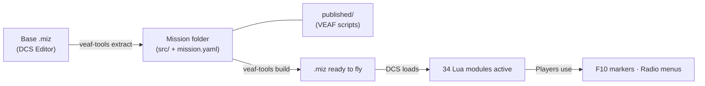

# VEAF Mission Creation Tools — Documentation

Complete toolkit for creating dynamic [DCS World](https://www.digitalcombatsimulator.com/) missions using VEAF Lua scripts and automation tools.

---

## Choose Your Guide

| Role | Start Here | What You'll Find |
|------|------------|-----------------|
| **Player / Pilot** | [Pilot Guide](pilot/README.md) | F10 menus, marker commands, available assets and combat zones |
| **Mission Maker** | [Mission Maker Guide](mission-maker/README.md) | Install, configure modules, build and deploy missions |
| **Developer** | [Developer Guide](developer/README.md) | Architecture, build pipeline, quality gates, contributing |

---

## How It Works



1. **Extract** — Create a base mission in DCS Editor and extract it into version-controllable source files
2. **Configure** — `mission.yaml` declares active modules; `published/` provides the VEAF Lua scripts
3. **Build** — `veaf-tools build` assembles everything into a final `.miz`
4. **Runtime** — DCS loads the `.miz`; players interact via F10 markers and radio menus

---

## References

| Reference | Description |
|-----------|-------------|
| [Lua API Reference](LUA_API_REFERENCE.md) | Full API for all 34 Lua runtime modules |
| [Tools CLI Reference](TOOLS_REFERENCE.md) | `veaf-tools.exe` — all commands and options |
| [Testing Guide](TESTING.md) | Lua unit test suite and CI/CD pipeline |
| [Roadmap](ROADMAP.md) | Planned features and known limitations |

---

## Quick Start

### Players and Pilots

You are in a mission that uses VEAF scripts. Open the F10 map, place a marker, and type a command — for example `_spawn unit T-80` or `_cas`. See the [Pilot Guide](pilot/README.md) for all available commands.

### Mission Makers

```powershell
# 1. Download veaf-tools-updater.exe from the GitHub release page, then:
.\veaf-tools-updater.exe

# 2. Add veaf-scripts.lua to your DCS mission triggers (DO SCRIPT FILE)

# 3. Configure active modules in missionconfig.lua
```

Full workflow: [Mission Maker Guide](mission-maker/README.md)

### Developers

```powershell
poetry install --with build
poetry run veaf-build build --version 6.0.5
poetry run test-lua
poetry run veaf-build publish --version 6.0.5
```

Full reference: [Developer Guide](developer/README.md)

---

## Community & Support

- [VEAF Discord](https://www.veaf.org/discord) — real-time help
- [GitHub Issues](https://github.com/VEAF/VEAF-Mission-Creation-Tools/issues) — bug reports and feature requests
- [VEAF Website](https://www.veaf.org)
