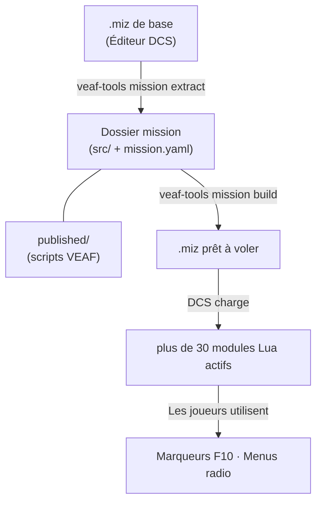

# VEAF Mission Creation Tools — Documentation

VEAF MCT transforme une mission DCS standard en un bac à sable dynamique piloté par les joueurs — plus de 30 modules Lua, un pipeline de build, et un outil CLI qui fait le gros du travail.

Ensemble complet d'outils pour créer des missions [DCS World](https://www.digitalcombatsimulator.com/) dynamiques avec les scripts Lua VEAF.

---

## Par où commencer {#start-here}

<div class="grid cards" markdown>

-   :material-airplane:{ .lg .middle } **Voler**

    ---

    Vous rejoignez une mission VEAF : menus F10, commandes marqueurs, ce que vous pouvez faire apparaître.

    [:octicons-arrow-right-24: Guide du pilote](pilot/README.md)

-   :material-compass-outline:{ .lg .middle } **Découvrir VMCT**

    ---

    Ce que font les outils et comment une mission est fabriquée, en dix minutes.

    [:octicons-arrow-right-24: Découvrir VMCT](mission-maker/DISCOVER.md)

-   :material-hammer-wrench:{ .lg .middle } **Ma première mission**

    ---

    Le tutoriel, du dossier vide à la mission qui tourne dans DCS.

    [:octicons-arrow-right-24: Tutoriel](mission-maker/TUTORIAL.md)

-   :material-robot-outline:{ .lg .middle } **Créer avec une IA**

    ---

    Claude, Gemini ou une autre IA : vous décrivez la mission, elle la construit.

    [:octicons-arrow-right-24: Installer l'assistant IA](mission-maker/AI_ASSISTANT_INSTALL.md)

-   :material-file-restore-outline:{ .lg .middle } **Reprendre une mission**

    ---

    Une mission VEAF v5 à passer en v6, ou celle d'un autre auteur à adopter.

    [:octicons-arrow-right-24: Migrer une mission v5](mission-maker/MIGRATION_GUIDE.md)<br>
    [:octicons-arrow-right-24: Adopter une mission tierce](mission-maker/CONVERT_OTHER.md)

-   :material-lifebuoy:{ .lg .middle } **Obtenir de l'aide**

    ---

    Où demander, et quoi fournir pour qu'on puisse vous répondre.

    [:octicons-arrow-right-24: Obtenir de l'aide](SUPPORT.md)

</div>

Tout le reste du créateur de missions est dans le [guide du créateur de missions](mission-maker/README.md) ; pour contribuer aux outils, voyez le [guide du développeur](developer/README.md).

---

## Principe de fonctionnement


```mermaid
flowchart TD
    A[".miz de base\n(Éditeur DCS)"] -->|veaf-tools mission extract| B["Dossier mission\n(src/ + mission.yaml)"]
    B --- C["published/\n(scripts VEAF)"]
    B -->|veaf-tools mission build| D[".miz prêt à voler"]
    D -->|DCS charge| E["plus de 30 modules Lua actifs"]
    E -->|Les joueurs utilisent| F["Marqueurs F10 · Menus radio"]
```

1. **Extract** — Créez une mission de base dans l'éditeur DCS et extrayez-la en fichiers source versionnables
2. **Configure** — `mission.yaml` déclare les modules actifs ; `published/` fournit les scripts Lua VEAF
3. **Build** — `veaf-tools mission build` assemble tout en un `.miz` final
4. **Runtime** — DCS charge le `.miz` ; les joueurs interagissent via les marqueurs F10 et les menus radio

---

## Références

| Référence | Description |
|-----------|-------------|
| [Référence API Lua](LUA_API_REFERENCE.md) | API complète des modules Lua runtime |
| [Référence CLI](CLI_REFERENCE.md) | `veaf-tools` — les 37 commandes, leurs arguments et toutes leurs options |
| [Mise à jour & publication](TOOLS_REFERENCE.md) | `veaf-tools-updater` et `veaf-build` : installer, mettre à jour, publier |
| [Guide de tests](TESTING.md) | Suite de tests Lua unitaires et pipeline CI/CD |
| [Feuille de route](ROADMAP.md) | Fonctionnalités prévues et limitations connues |

---

## Démarrage rapide

### Joueurs et pilotes

Vous êtes dans une mission utilisant les scripts VEAF. Ouvrez la carte F10, placez un marqueur et tapez une commande — par exemple `_spawn unit, name T-80UD` ou `_cas`. Voir le [Guide du pilote](pilot/README.md) pour toutes les commandes disponibles.

### Mission de démo

La [mission de démo v6](https://github.com/VEAF/VEAF-Demo-Mission-v6) montre chaque fonctionnalité en jeu, avec une visite guidée (**F10 → Autre → Visite guidée**), en français et en anglais.
C'est aussi la recette des outils, rejouée avant chaque release — voir [le guide du créateur de missions](mission-maker/GUIDE.md#demo-mission).

### Créateurs de missions

> **Le `.\` est obligatoire.** Le terminal Windows par défaut est PowerShell, qui ne cherche pas
> dans le dossier courant — exprès. `cmd.exe` accepte les deux formes, donc `.\` marche partout.
> Voir [PowerShell ou invite de commandes ?](mission-maker/GUIDE.md#powershell-vs-cmd).

```powershell
# 1. Téléchargez veaf-tools-updater.exe depuis la page de release GitHub et lancez-le :
.\veaf-tools-updater.exe
# → installe veaf-tools.exe et tous les scripts VEAF dans le dossier courant
```

Ensuite, selon votre point de départ :

**Vous avez déjà un dossier mission VEAF** (ou vous en avez créé un avec `mission prepare`) :
```powershell
.\veaf-tools.exe mission build
```

**Vous n'avez qu'un fichier `.miz` :**
```powershell
.\veaf-tools.exe mission extract ma-mission.miz
# → éditez mission.yaml pour activer les modules souhaités
.\veaf-tools.exe mission build
```

Guide complet : [Guide créateur de missions](mission-maker/README.md)

### Développeurs

```powershell
poetry install --with build
poetry run veaf-build build --version <version>
poetry run test-lua
poetry run veaf-build publish --version <version>
```

Référence complète : [Guide du développeur](developer/README.md)

---

## Communauté & Support

- **[Obtenir de l'aide](SUPPORT.md)** — où s'adresser, quoi fournir, où sont les journaux
- [VEAF Discord](https://www.veaf.org/discord) — aide en temps réel
- [Issues GitHub](https://github.com/VEAF/VEAF-Mission-Creation-Tools/issues) — signalement de bugs et demandes de fonctionnalités
- [Site VEAF](https://www.veaf.org)
