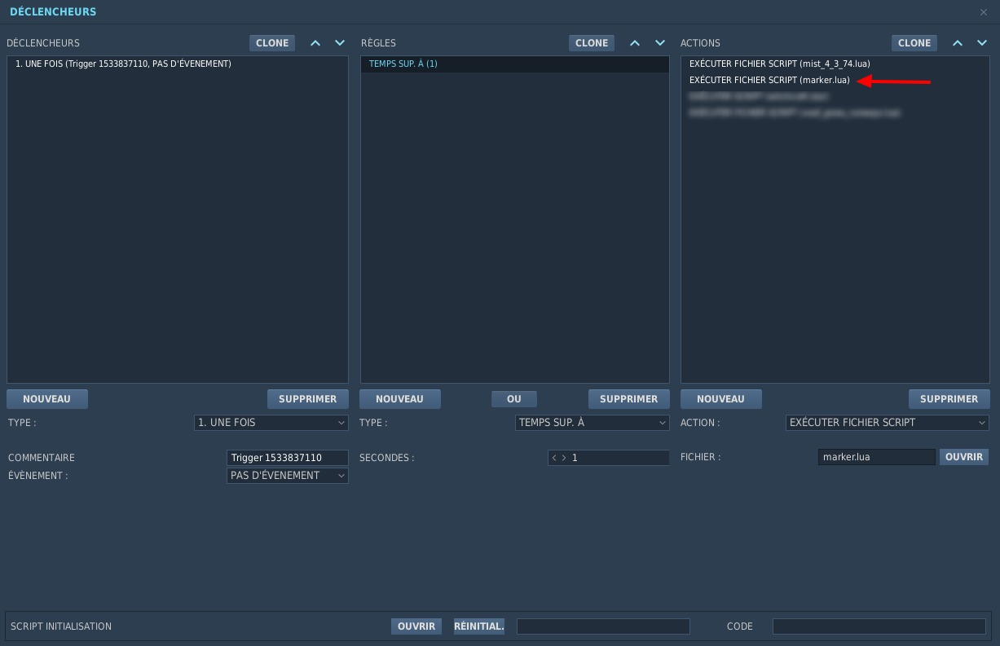
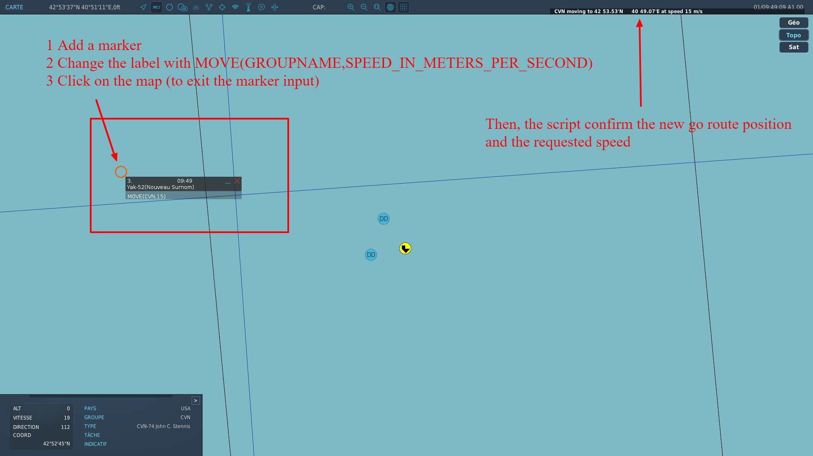

# Marker Documentation

## Mission maker

Just add marker.lua file script execution after mist.lua is loaded:



To enable debug mode, add an inline script execution:

```lua
markerDebug = true
```

## Players

In mission, simple add marker on map to send commands.

### Move a group

Works with:

* [x] ships
* [ ] ground units (not tested)

Exemple:




