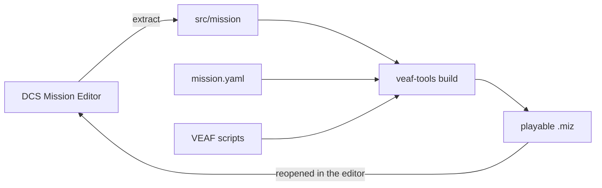

# Discover VMCT in ten minutes

You know the DCS Mission Editor. You have never opened VEAF Mission Creation Tools. This page
teaches you nothing to *do*: it tells you **what the thing is made of**, so the rest makes sense.

- To do it, in order, from an empty `.miz` to a mission that runs: [the tutorial](TUTORIAL.en.md).
- To write one specific thing: [the cards](concepts/README.en.md).
- For every detail: [the full guide](GUIDE.en.md).

---

## The idea in one sentence {#the-idea}

Your mission is no longer a `.miz` you edit by hand: it is a **folder of text files** that a tool
recomposes into a `.miz` at every build, injecting the VEAF scripts as it goes.



You still place your units, zones and waypoints in the DCS editor. What you gain is everything that
is **described** rather than placed: enemies that appear on demand, an F10 radio menu, radio
frequencies consistent across the whole coalition, several weather variants of the same mission.

---

## The six pieces {#the-pieces}

### 1. The mission folder

A version-controllable folder (Git) holding everything: the exploded DCS mission, your
configuration, your scripts, and the tools themselves. That is your unit of work — no longer the
`.miz`.

→ [card: the mission folder](concepts/mission-folder.en.md)

### 2. `mission.yaml`

The configuration file at the root. It declares the mission's identity and, in its `modules:` block,
**which VEAF features are active**. A module that is not there is not shipped.

```yaml
modules:
  UNITS:              # infrastructure: mandatory, no value
  RADIO: true         # the VEAF F10 radio menu
  SPAWN: true         # spawn units from the F10 map
```

→ [card: `mission.yaml` and its modules](concepts/mission-yaml.en.md)

### 3. The build

`veaf-tools build` reads the folder, **generates** `veaf-config.lua` from `mission.yaml`, injects
the triggers that load the VEAF scripts at start-up, then runs the optional pipeline steps whose
file it finds. You **never** add a VEAF trigger by hand in the DCS editor.

→ [card: the build and its pipeline](concepts/build.en.md)

### 4. Your own Lua scripts

Whatever cannot be described in YAML is written in Lua under `src/scripts/`. The `custom_scripts:`
block chooses which are loaded, and in what order.

→ [card: custom scripts](concepts/custom-scripts.en.md)

### 5. What the pipeline injects

Each file under `src/` feeds one step, and that step only runs if the file is there:

| File | What it produces in the mission |
|---|---|
| `src/presets.yaml` | each aircraft's preset radio channels, plus the kneeboards |
| `src/waypoints.yaml` | named, reusable flight plans |
| `src/spawnables.yaml` | template aircraft groups, spawnable in game |
| `src/dynamic-slot-templates.yaml` | the templates served to dynamic slots |
| `src/warehouses.yaml` | which airfields open dynamic slots, and with what stock |
| `src/spawn-groups.yaml` | extra ground/sea groups for `_spawn` |
| `src/versions.yaml` | one `.miz` variant per declared weather/time |

→ [card: radio presets](concepts/radio-presets.en.md) ·
[card: dynamic slots](concepts/dynamic-slots.en.md) ·
[card: spawnable groups](concepts/spawnables.en.md) ·
[card: weather variants](concepts/weather-variants.en.md)

### 6. The VEAF scripts, in game

Once the mission is running, the injected scripts live inside DCS. Players meet them through the
**F10 "Other"** radio menu, where the active modules put their entries (spawn, combat zones, assets,
weather…). Commands can also be written as **markers on the F10 map** — `-shilka` spawns a Shilka
where the marker is.

→ [script catalogue, module by module](scripts/README.en.md) ·
[marker aliases](../ALIASES.en.md)

---

## Two mechanisms that catch people out {#two-surprises}

**Combat zones are geometric *and* nominal.** A combat zone is a DCS trigger zone; the groups inside
it are emptied at start-up and put back on activation. But a group is only captured if **its name
starts with the zone's name** — a well-placed but badly named group is ignored.

→ [card: combat zones](concepts/combat-zones.en.md)

**The pipeline fires by itself.** A freshly created folder already contains a `versions.yaml` with a
"noon" variant, so your first build produces *two* files, `My-Mission.miz` and
`missions/My-Mission_noon.miz`. Not a bug — the weather step found its file.

→ [card: weather variants](concepts/weather-variants.en.md)

---

## Where to go next {#next}

| You want to | Go to |
|---|---|
| Build your first mission, step by step | [Tutorial — your first mission](TUTORIAL.en.md) |
| Write one specific piece of configuration | [The cards](concepts/README.en.md) |
| Know everything about an option | [Full guide](GUIDE.en.md) · [`mission.yaml` reference](../MISSION_YAML_REFERENCE.en.md) · [CLI reference](../CLI_REFERENCE.en.md) |
| Convert a VEAF v5 mission | [Migration guide](MIGRATION_GUIDE.en.md) |
| Adopt a third-party mission | [Adopt a third-party mission](CONVERT_OTHER.en.md) |
