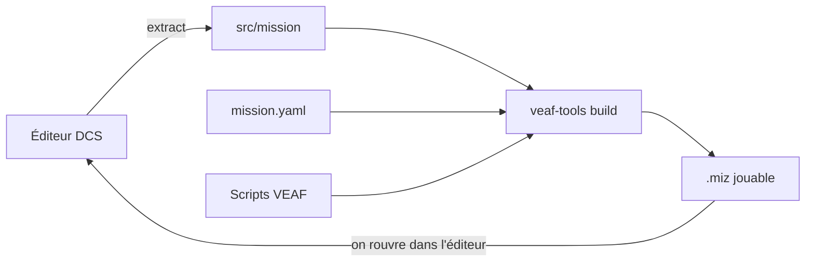

# Découvrir VMCT en dix minutes

Vous savez utiliser l'éditeur de mission de DCS. Vous n'avez jamais ouvert VEAF Mission Creation
Tools. Cette page ne vous apprend rien à *faire* : elle vous dit **de quoi c'est fait**, pour que
la suite ait un sens.

- Pour faire, dans l'ordre, du `.miz` vide à la mission qui tourne : [le tutoriel](TUTORIAL.md).
- Pour écrire un concept précis : [les fiches](concepts/README.md).
- Pour tout le détail : [le guide complet](GUIDE.md).

---

## L'idée en une phrase {#the-idea}

Votre mission n'est plus un `.miz` que vous éditez à la main : c'est un **dossier de fichiers
texte** qu'un outil recompose en `.miz` à chaque build, en y injectant les scripts VEAF.



Vous continuez à placer vos unités, vos zones et vos waypoints dans l'éditeur DCS. Ce que vous
gagnez, c'est tout ce qui se **décrit** plutôt que se place : des ennemis qui apparaissent à la
demande, un menu radio F10, des fréquences radio cohérentes sur toute la coalition, plusieurs
variantes météo de la même mission.

---

## Les six pièces {#the-pieces}

### 1. Le dossier de mission

Un dossier versionnable (Git) qui contient tout : la mission DCS décompressée, votre configuration,
vos scripts, et les outils eux-mêmes. C'est votre unité de travail — plus le `.miz`.

→ [fiche : le dossier de mission](concepts/mission-folder.md)

### 2. `mission.yaml`

Le fichier de configuration à la racine. Il déclare l'identité de la mission et, dans son bloc
`modules:`, **quelles fonctionnalités VEAF sont actives**. Un module absent n'est pas embarqué.

```yaml
modules:
  UNITS:              # infrastructure : obligatoire, aucune valeur
  RADIO: true         # le menu radio F10 VEAF
  SPAWN: true         # faire apparaître des unités depuis la carte F10
```

→ [fiche : `mission.yaml` et ses modules](concepts/mission-yaml.md)

### 3. Le build

`veaf-tools build` lit le dossier, **génère** `veaf-config.lua` depuis `mission.yaml`, injecte les
déclencheurs qui chargent les scripts VEAF au démarrage, puis exécute les étapes optionnelles du
pipeline dont il trouve le fichier. Vous n'ajoutez **jamais** un déclencheur VEAF à la main dans
l'éditeur DCS.

→ [fiche : le build et son pipeline](concepts/build.md)

### 4. Vos propres scripts Lua

Ce qui ne se décrit pas en YAML s'écrit en Lua dans `src/scripts/`. Le bloc `custom_scripts:`
choisit lesquels sont chargés, et dans quel ordre.

→ [fiche : scripts personnalisés](concepts/custom-scripts.md)

### 5. Ce que le pipeline injecte

Chaque fichier de `src/` alimente une étape, qui ne s'exécute que si le fichier est là :

| Fichier | Ce qu'il produit dans la mission |
|---|---|
| `src/presets.yaml` | les canaux radio préréglés de chaque appareil, + les planchettes |
| `src/waypoints.yaml` | des plans de vol nommés, réutilisables |
| `src/spawnables.yaml` | des groupes d'aéronefs modèles, à faire apparaître en jeu |
| `src/dynamic-slot-templates.yaml` | les modèles servis aux slots dynamiques |
| `src/warehouses.yaml` | quels terrains ouvrent des slots dynamiques, et avec quel stock |
| `src/spawn-groups.yaml` | des groupes sol/mer supplémentaires pour `_spawn` |
| `src/versions.yaml` | une variante `.miz` par météo/horaire déclaré |

→ [fiche : préréglages radio](concepts/radio-presets.md) ·
[fiche : slots dynamiques](concepts/dynamic-slots.md) ·
[fiche : groupes spawnables](concepts/spawnables.md) ·
[fiche : variantes météo](concepts/weather-variants.md)

### 6. Les scripts VEAF, en jeu

Une fois la mission lancée, les scripts injectés tournent dans DCS. Le joueur les rencontre par le
menu radio **F10 « Other »** : y apparaissent les entrées des modules actifs (spawn, zones de
combat, assets, météo…). Les commandes s'écrivent aussi comme **marqueurs sur la carte F10** —
`-shilka` fait apparaître une Shilka à l'endroit du marqueur.

→ [catalogue des scripts, module par module](scripts/README.md) ·
[alias de marqueurs](../ALIASES.md)

---

## Deux mécanismes qui surprennent souvent {#two-surprises}

**Les zones de combat sont géométriques *et* nominatives.** Une zone de combat est une trigger zone
de l'éditeur DCS ; les groupes qu'elle contient sont vidés au démarrage et remis en place à
l'activation. Mais un groupe n'est capturé que si **son nom commence par le nom de la zone** — un
groupe bien placé mais mal nommé est ignoré.

→ [fiche : zones de combat](concepts/combat-zones.md)

**Le pipeline s'auto-déclenche.** Un dossier fraîchement créé contient déjà `versions.yaml` avec une
variante « midi » : votre premier build produit donc *deux* fichiers, `Ma-Mission.miz` et
`missions/Ma-Mission_noon.miz`. Ce n'est pas un bug, c'est l'étape météo qui a trouvé son fichier.

→ [fiche : variantes météo](concepts/weather-variants.md)

---

## Et maintenant {#next}

| Vous voulez | Allez à |
|---|---|
| Fabriquer votre première mission, pas à pas | [Tutoriel — votre première mission](TUTORIAL.md) |
| Écrire un bout de configuration précis | [Les fiches](concepts/README.md) |
| Tout savoir sur une option | [Guide complet](GUIDE.md) · [Référence `mission.yaml`](../MISSION_YAML_REFERENCE.md) · [Référence CLI](../CLI_REFERENCE.md) |
| Convertir une mission VEAF v5 | [Guide de migration](MIGRATION_GUIDE.md) |
| Adopter une mission tierce | [Adopter une mission tierce](CONVERT_OTHER.md) |
