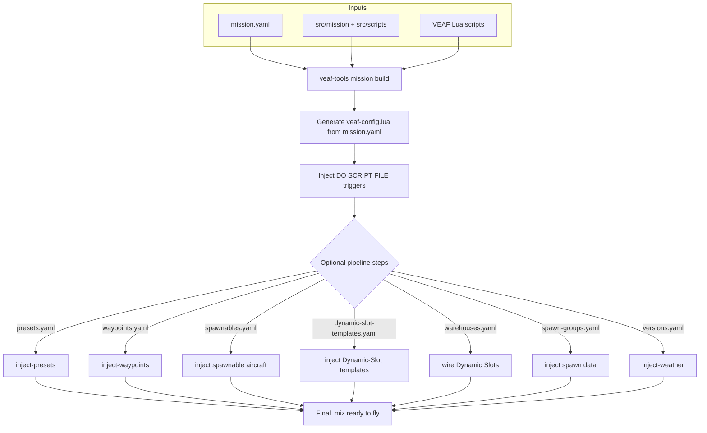

# Mission Maker Guide — VEAF Mission Creation Tools


This guide is for DCS World mission designers who want to integrate the VEAF framework into their missions.

---

## Table of Contents

1. [What You Get](#what-you-get)
2. [Prerequisites](#prerequisites)
3. [Installation and Updates](#installation-and-updates)
4. [Global User Configuration](#global-user-configuration)
5. [Creating a New Mission](#creating-a-new-mission)
6. [How Scripts Are Loaded](#how-scripts-are-loaded)
7. [Configuring Modules](#configuring-modules)
8. [Configuring the build pipeline](#configuring-pipeline)
9. [Design-Time Tools](#design-time-tools)
10. [Typical Build Workflow](#typical-build-workflow)
11. [Build Profiles](#build-profiles)
12. [Scripts Reference](#scripts-reference)
13. [Configuration Examples](#configuration-examples)
14. [CTLD and CSAR Integration](#ctld-and-csar-integration)
15. [DCS Bridge](#dcs-bridge)
16. [Debug Logging](#debug-logging)
17. [Resources](#resources)

> **Migrating an existing mission?** See the [Migration Guide](MIGRATION_GUIDE.en.md) — covers both VEAF MCT v5 → v6 and vanilla DCS → VEAF MCT.

---

## What You Get

A VEAF mission is a standard DCS `.miz` file that loads the VEAF Lua framework at startup. This gives players and controllers:

- **Marker commands** — players type commands on the F10 map (spawn units, generate CAS zones, move groups…)
- **F10 radio menus** — dynamic menus for every enabled feature
- **Pre-built mission types** — CAS, transport, carrier ops, QRA, air waves, combat zones
- **Asset management** — tankers, AWACS, carriers with automatic state tracking and radio menus
- **Named points** — reusable map positions with optional ATC/TACAN services
- **Integrations** — Skynet IADS, CTLD/CSAR

---

## Prerequisites

| Tool | Purpose | Required |
|------|---------|----------|
| DCS World | The simulator | Yes |
| DCS Mission Editor | Create the base `.miz` (included with DCS) | Yes |
| Git | Version control for your mission project | Recommended |
| `veaf-tools-updater.exe` | Downloads and installs the latest VEAF MCT release | Yes |
| `veaf-tools.exe` | Build-time `.miz` manipulation CLI | Yes (for build pipeline) |
| VS Code or Notepad++ | Editing Lua/YAML config files | Recommended |
| `ctld-tools.exe` | CTLD configuration editor — **shipped with CTLD, not with VEAF MCT** ([where to download it](#getting-ctld-tools)) | Only if your mission uses CTLD |

> **Base mission coalitions**: each side coalition (blue/red) needs at least one ground unit, otherwise its Lua coalition tables are incomplete and DCS purges the empty side — which used to require placing one blue and one red ground group by hand. **The build now handles this for you**: if a side coalition has no unit, it injects a single *hidden* placeholder ground unit (on the coalition bullseye) so DCS registers the side. You can still place your own ground groups — the placeholder is only added when a side is empty.

---

## Installation and Updates

### PowerShell or Command Prompt? {#powershell-vs-cmd}

On Windows, the terminal you get by default — the one behind the **Open in Terminal** context menu, the one built into VS Code — is **PowerShell**. Every example in this documentation is written for it.

**An executable sitting in the current folder is called `.\veaf-tools.exe`, never `veaf-tools.exe`.** PowerShell does **not** search the current directory, and that is deliberate: it is a protection against command hijacking — dropping a fake `git.exe` into a folder so that it runs instead of the real one. Without the `.\`, you get:

> veaf-tools.exe is not recognized as a name of a cmdlet, function, script file, or executable program.

(the exact wording depends on your PowerShell version and language). The error names the file you are looking straight at, in the folder you are standing in: it reads as "the tool is broken" when only two characters are missing.

Command Prompt (`cmd.exe`) does search the current directory and accepts both forms. **So `.\veaf-tools.exe` works in both shells**: it is the portable form, and the only one this documentation writes.

The three differences between the two shells that actually bite:

| | PowerShell | `cmd.exe` |
|---|---|---|
| Running an executable from the current folder | `.\veaf-tools.exe` (required) | either form |
| Setting an environment variable | `$env:VEAF_LANG = "fr"` | `set VEAF_LANG=fr` |
| Breaking a command over several lines | a backtick `` ` `` at end of line | a caret `^` |

### First Installation

Download `veaf-tools-updater.exe` from the [latest GitHub release](https://github.com/VEAF/VEAF-Mission-Creation-Tools/releases/tag/published-latest) and place it in your mission project folder.

> **Windows security:** Windows may block `.exe` files downloaded from the internet. If the file doesn't run, right-click it → **Properties** → **General** tab → check **Unblock** at the bottom → **OK**.

Then run:

```powershell
.\veaf-tools-updater.exe
```

This downloads `published.zip`, verifies the SHA256 checksum, and extracts all scripts and tools into your mission folder.

### Updating

Run the same command whenever a new release is available:

```powershell
.\veaf-tools-updater.exe
```

Only updates if the remote version is newer. To force a reinstall:

```powershell
.\veaf-tools-updater.exe --force
```

To pin to a specific version:

```powershell
.\veaf-tools-updater.exe --tag published-v6.1.0
```

Full CLI reference: [CLI Reference](../CLI_REFERENCE.en.md)

---

## Global User Configuration {#global-user-configuration}

Create `~/veafmct.yaml` (i.e. `C:\Users\YourName\veafmct.yaml` on Windows) to set persistent defaults that apply to **all** your VEAF projects on this machine:

```yaml
# ~/veafmct.yaml
lang: fr                 # Tool output language: "en" (default) or "fr"
check_updates: true      # Check for new veaf-tools releases at startup
scripts_path: D:/dev/_VEAF/VEAF-Mission-Creation-Tools   # Local repo path (for --dev-mode)
```

All keys are optional. To initialise the file from the CLI:

```powershell
.\veaf-tools.exe user-config --init
```

Or inspect/edit values interactively:

```powershell
# Show effective configuration and its source
.\veaf-tools.exe user-config

# Set a value
.\veaf-tools.exe user-config --set lang=fr

# Remove a value (revert to default)
.\veaf-tools.exe user-config --unset lang
```

**Language detection order** (first match wins):
1. `--lang` CLI option
2. `VEAF_LANG` environment variable
3. `~/veafmct.yaml` → `lang:` key
4. OS locale (Windows registry / system locale on Linux–macOS)
5. `en` (built-in fallback)

---

## Creating a New Mission

### Recommended: Fork the Demo Mission

The fastest way to start is to fork [VEAF-Demo-Mission](https://github.com/VEAF/VEAF-Demo-Mission), which already has the correct folder structure, sample configurations, and build scripts.

```powershell
git clone https://github.com/VEAF/VEAF-Demo-Mission.git my-mission
cd my-mission
.\veaf-tools-updater.exe
```

### From Scratch

1. Create a folder for your mission project (this is your Git repository)
2. Copy your existing `.miz` file there
3. Run `.\veaf-tools-updater.exe` to fetch all VEAF scripts
4. Extract your mission: `.\veaf-tools.exe mission extract my-mission.miz`
5. Configure modules in `mission.yaml` and optionally `src/scripts/mission-script.lua`

Recommended project layout:

```
MyMission/
├── src/
│   ├── mission/                  # Extracted DCS mission data (from extract)
│   ├── scripts/
│   │   ├── mission-script.lua    # Your custom Lua code (optional)
│   │   └── veafDynamicConfig.lua # Dynamic script-loading config (dev/test)
│   ├── options                  # DCS options table injected into the .miz
│   ├── presets.yaml             # Radio frequency presets (presets step)
│   ├── spawnables.yaml          # Spawnable aircraft groups (veafSpawn- prefix, spawnable_aircrafts step)
│   ├── dynamic-slot-templates.yaml # Dynamic-Slot templates (dynSpawnTemplate=true, dynamic_slot_templates step)
│   ├── warehouses.yaml          # Per-coalition Dynamic Slots (warehouses step, optional)
│   ├── spawn-groups.yaml        # Extend/override the spawn database (spawn_data step, optional)
│   ├── versions.yaml            # Weather/time variants (weather step)
│   └── waypoints.yaml           # Per-flight-plan navigation points (waypoints step)
├── published/                    # VEAF scripts & tools (auto-installed)
├── mission.yaml                  # Build-time configuration
├── .gitignore                    # Excludes generated/downloaded files
├── veaf-tools.exe                # CLI tool (auto-installed)
└── veaf-tools-updater.exe
```

> Every file listed under `src/` (except the `mission/` extract output) ships from
> the tool's `defaults/mission-folder/` scaffold and is consumed at the first
> build — the `*.yaml` files by their pipeline/module step, `options` by `.miz`
> injection, and the `scripts/*.lua` files by script loading.

---

## How Scripts Are Loaded

The `build` command **automatically injects** a `DO SCRIPT FILE` trigger at mission start that loads all VEAF scripts. You do **not** need to manually add any trigger in the DCS Mission Editor.

If you have a custom `src/scripts/mission-script.lua`, it is also injected automatically by the builder.

### What the builder does

1. Reads `src/mission/` (the extracted DCS data)
2. Removes any existing VEAF triggers
3. Injects fresh `DO SCRIPT FILE` triggers for all VEAF scripts + your custom scripts
4. Writes the final `.miz`

The full build then runs any optional pipeline steps whose configuration files are present (presets, waypoints, aircraft groups, weather):



> **Note — templates and multiplayer slots**: the groups injected from `spawnables.yaml` and `dynamic-slot-templates.yaml` are reusable **templates**. To keep them from showing up as pickable slots in the multiplayer briefing, the build automatically hides them from the slot list (`hiddenOnPlanner`/`hiddenOnMFD`) and locks them with a password. Dynamic-slot spawning (which references the template by name) stays fully functional.

> **The shipped templates are a starting point, not a ready-made catalogue.** When a pilot takes a dynamic slot, DCS hands them the aircraft **as the template describes it**: loadout, livery, frequencies. Of the 52 templates shipped by default, **only 9 carry a loadout** — an A-10C II or an F-14B come out armed and painted, a UH-1H, an F/A-18C or an M-2000C come out **bare**. This is not a build defect: the template-to-aircraft link works, the template itself is empty.
>
> To give your pilots equipped aircraft, set them up **once** in a mission (in the DCS Mission Editor, with the loadout and livery you want), then regenerate the file from that mission:
>
> ```powershell
> .\veaf-tools.exe content extract-aircraft-groups my-mission.miz --kind dynamic-template
> ```
>
> That rewrites `src/dynamic-slot-templates.yaml` with your templates. The next build injects them, and the dynamic slots offer aircraft ready to fly.
>
> **Add `--merge` to build the catalogue up instead of starting it over.** Without it the file is rebuilt from the mission alone, so a second mission's templates — or a template you edited by hand — are lost. With it, the mission wins on a group of the same name and **each replacement is named** in the report, while everything the mission does not carry is kept:
>
> ```powershell
> .\veaf-tools.exe content extract-aircraft-groups second-mission.miz --kind dynamic-template --merge
> ```

---

## Configuring Modules {#configuring-modules}

VEAF MCT has two configuration layers:

- **`mission.yaml`** (at the project root) — build-time configuration: which modules to enable/disable, log levels, security settings, asset declarations
- **`src/scripts/mission-script.lua`** (optional) — custom Lua code that runs at mission start: aliases, helper functions, third-party script setup (CTLD, CSAR). Module initialization and configuration are generated automatically from `mission.yaml`.

For most missions, `mission.yaml` is sufficient. Use `mission-script.lua` only for custom Lua code that cannot be expressed in YAML.

### mission.yaml Example

```yaml
mission:
  name: "My-Mission"

modules:
  SECURITY: true        # shorthand: just enable the module
  SPAWN:
    logLevel: debug     # a module with extra config uses a block
  ASSETS:
    enabled: true
    assets:
      - sort: 1
        name: "T1-Arco-1"
        description: "Arco-1 (KC-135)"
        information: "Tacan 64Y\nU290.50 (20)"
```

> The unified `modules:` block replaces the older `lua_modules:` + `community_scripts:` keys, and `enabled:` replaces `enable:`. The legacy keys still work but emit a deprecation warning. See the [mission.yaml Reference](../MISSION_YAML_REFERENCE.en.md) for the full syntax.

### mission-script.lua Example

```lua
-- mission-script.lua — custom mission-level code
-- Module initialization is handled automatically by veaf-config.lua (generated from mission.yaml).
-- Put custom aliases, helper functions, and third-party script setup here.

-- Example: custom shortcut alias
-- veafShortcuts.AddAlias(VeafAlias:new():setName("-cas1"):setVeafCommand("_cas"))

-- Note: nothing to write here for CTLD — it is configured in ctld-config.yaml
-- (see CTLD and CSAR Integration)
```

### MiST: injected only when you need it {#mist-injection}

MiST used to be loaded into **every** mission, because the VEAF scripts called it everywhere. They
no longer call it at all, and neither does any community script shipped here. A mission that does
not need it therefore stops carrying its **336 KB**.

There is nothing to do: at build time VEAF reads your own scripts under `src/scripts/` and, if one
of them calls `mist.`, injects MiST and tells you which file asked for it:

```
MiST is no longer injected by default, but 'src/scripts/HoundElint.lua' calls it:
injecting it for this mission.
```

That is the common case: a third-party script such as HoundElint calls MiST, the scan sees it, and
everything keeps working. Converting from v5 reads the same way, so a converted mission keeps MiST
if and only if it actually uses it.

What the scan **cannot** see: a script that loads another script, or one that reaches MiST through
`_G["mist"]`. Only in that case, ask for it explicitly:

```yaml
modules:
  MIST: true
```

A `MIST: false` does not win against the scan: if one of your scripts calls MiST, it is injected
anyway. Honouring the flag would mean breaking the mission in flight to respect a config line.

> **If your `mission.yaml` already carries a bare `MIST:` line**, it used to mean "mandatory module,
> always on"; it now means "not asked for". That is every mission written so far, since the shipped
> template carried that line. There is nothing to change: your mission gets 336 KB lighter, and if
> one of your scripts calls MiST, the scan injects it back.

### Security Levels {#security-tiers}

| Tier | Constant | Passes without a password when the pilot's level is |
|------|----------|------------------------------------------------------|
| `KNOWN_PILOT` | `veafSecurity.LEVEL_KNOWN_PILOT` = 1 | **≥ 1** — any pilot listed in the server's `veaf-pilots.txt` |
| `SENIOR_PILOT` | `veafSecurity.LEVEL_SENIOR_PILOT` = 10 | **≥ 10** — a trusted member |
| `ADMIN` | `veafSecurity.LEVEL_ADMIN` = 90 | **≥ 90** — a server administrator |
| `MM` | (no level) | never — the Mission Master password is the only way in |
| `OPEN` | (no check) | always — the command is deliberately available to everyone |

!!! info "`L9`, `L1` and `L0` are deprecated aliases — and they read backwards"

    The old names read backwards from what they suggest: `L0` is the **tightest** tier
    (`ADMIN`), not the loosest; `L9` is the most open (`KNOWN_PILOT`).

    `L9`, `L1` and `L0` still work as **deprecated aliases** and will be removed in a
    future release. **The values are unchanged** (1, 10, 90), so renaming them changes no
    mission's behaviour — only what you write.

Two things satisfy a check. Either the player's **pilot level**, published by the server
hook from `veaf-pilots.txt`, is high enough for the tier — that is the identity path, and
it needs no password — or the correct **password** for that tier appears in the marker
text. Without the hook there are no pilot levels, so everything falls back to passwords.

Set passwords (SHA-1 hashes — that is what `veafSecurity` compares) in `mission.yaml`:

```yaml
security:
  disabled: false
  password_hashes:
    - "<SHA-1 hash of your password>"
```

---

## Configuring the build pipeline {#configuring-pipeline}

Beyond the Lua modules that run inside DCS, `veaf-tools mission build` can chain **pipeline steps** at build time: they inject data into the `.miz` (radio presets, waypoints, aircraft groups, weather variants) from separate YAML files placed in `src/`. Each step is **auto-detected** (it runs when its config file exists) and is controlled from the `pipeline:` section of `mission.yaml`.

| Step | Role | Detailed schema |
|------|------|-----------------|
| `presets` | Injects radio frequency presets into human-piloted aircraft groups and generates the associated kneeboard PNG plates | [presets.yaml](../PIPELINE_REFERENCE.en.md#pipeline-step-1-presets) |
| `waypoints` | Injects waypoint templates (bullseye, navigation) into human aircraft groups | [waypoints.yaml](../PIPELINE_REFERENCE.en.md#pipeline-step-2-waypoints) |
| `spawnable_aircrafts` / `dynamic_slot_templates` | Injects spawnable aircraft groups and dynamic-slot templates | [aircraft groups](../PIPELINE_REFERENCE.en.md#pipeline-step-3-aircraft-groups) |
| `weather` | Creates several mission variants with different weather and time settings | [versions.yaml](../PIPELINE_REFERENCE.en.md#pipeline-step-6-versions) |

Each step accepts the **scalar** form (`true`/`false` to enable or skip) or the **mapping** form (detailed options). For example, the `presets` step can keep the radio injection while suppressing the PNG plates globally:

```yaml
pipeline:
  presets:
    enabled: true       # default true — inject radio presets
    kneeboards: false   # default true — when false, no kneeboard PNG is generated
```

See the [Pipeline Reference](../PIPELINE_REFERENCE.en.md) for the full schema of each step and the [mission.yaml Reference](../MISSION_YAML_REFERENCE.en.md#pipeline) for all `pipeline:` fields.

---

### Which flight plan for which aircraft? {#flight-plan-matching}

`src/waypoints.yaml` declares **flight plans**, each with criteria: coalition, category (`plane` /
`helicopter`), aircraft type, country. The criteria a plan does not state are wildcards.

> **The most specific plan wins.** Among the plans that match, the one stating the **most** criteria is
> used — wherever it happens to be written in the file.

```yaml
settings:
  all_blue_planes:
    coalition: blue
    category: plane
    waypoints: { ... }

  f16_flight_plan:          # more specific: it also names the type
    coalition: blue
    category: plane
    type: F-16C_50
    waypoints: { ... }
```

A blue F-16C matches both and gets `f16_flight_plan`. Any other blue plane gets `all_blue_planes`. A plan
with **no criteria at all** is the fallback: it matches everything and loses to everything. Declaration
order only breaks a **tie** between plans of equal specificity, and only then.

!!! warning "This behaviour changed in 6.15.42"
    Before, the **first** compatible plan won, so declaration order decided — and a specific plan written
    after a broad one was unreachable. Both this file and the code announced the specificity rule for
    years without it being implemented; it is now.

    If you had ordered your plans narrow-first to work around it, **nothing changes for you**. If you
    were knowingly relying on order so that a broad plan masked a specific one, that specific plan now
    applies.

Only **human-piloted** groups receive waypoints — and since 6.15.43, **all** of them do.

!!! warning "Before 6.15.43 your flight plan reached almost no slot"
    The waypoints step ran **before** aircraft injection (`spawnables.yaml`,
    `dynamic-slot-templates.yaml`). The slots those files create did not exist yet when the waypoints
    were injected.

    Measured on this repository's smoke-test mission: **105** human-piloted groups, exactly **1** carrying
    a waypoint from the plan — the one already in the source `.miz`. At the corrected position: **105 of
    105**.

    This was never only about an automatic bullseye: it was your *declared* flight plan, applied to a
    handful of slots and nothing else. And the build did not say so — it reported "1 injected, 0 without a
    plan", which is accurate and reads perfectly healthy. The count was taken before the world was
    finished.

    **What changes for you**: if your mission uses dynamic slots or spawnable aircraft, your declared
    waypoints now reach those slots — which is what you were asking for already. If your mission only has
    slots placed in the editor, nothing changes.


#### The bullseye, injected for you {#automatic-bullseye}

Since 6.15.44, every flight plan also receives a **`BULLSEYE`** waypoint at **your mission's own**
bullseye coordinates — no need to declare it, and no risk of copying another map's.

The coalition is honoured: a **red** flight gets the red bullseye, **everything else** gets the blue one.
That is the same rule the VEAF scripts have applied in game since
[#304](https://github.com/VEAF/VEAF-Mission-Creation-Tools/issues/304), and it is not a shortcut: in real
missions the "neutral" bullseye is often `{0, 0}` or `{100, 100}`, so a neutral flight would be sent to
the map origin.

The waypoint is **appended** to the plan, so your existing points keep their numbers.

!!! note "Your own declaration always wins"
    If your flight plan already declares a waypoint named `BULLSEYE`, **yours** is used, with your
    coordinates. Nothing is added and nothing is replaced.

To turn it off:

```yaml
pipeline:
  waypoints:
    bullseye: false
```

And it only applies to missions that already inject waypoints: a mission **without** a
`src/waypoints.yaml` is untouched, and a group no flight plan matches receives nothing — the bullseye
rides along with a plan, it does not create one.

The build tells you how many it added.

## Design-Time Tools

`veaf-tools.exe` manipulates `.miz` files at build time — before loading them in DCS.

> **Commands are filed by theme.** `veaf-tools mission build`, `veaf-tools content
> inject-presets`, `veaf-tools convert v5`… `veaf-tools --help` lists the groups, and
> `veaf-tools <group> --help` shows what is in one. The `dcs` group is what **needs DCS running**.
> The groups are: `mission`, `convert`, `content`, `cockpit` and `dcs`.
> A command whose name starts with its group's name drops that word inside: you write
> `veaf-tools convert v5` and `veaf-tools convert other`, not `convert convert-v5`.
>
> **The old short names still work**: `veaf-tools build` does exactly what `veaf-tools mission
> build` does. They are no longer shown in the help and count as deprecated — a script or forum
> post written before this change keeps working.

| Command | What it does |
|---------|-------------|
| `prepare` | Initialises/refreshes a mission folder from the default scaffold; `--template minimal\|standard\|full\|custom` generates a `mission.yaml` with the matching module set (`custom` = pick modules interactively); `--list-templates` to list them. `--theatre <name>` also generates a synthetic blank mission for that DCS map into `src/mission/` (no DCS round-trip needed to start); `--list-theatres` to list the supported maps. The generated file carries the same documented preamble as `convert-v5` (YAML syntax guide, `global_log_level:`, `mission:`, `security:`, `pipeline:`) |
| `build` | Builds the mission from `src/` — injects VEAF triggers, outputs a `.miz`. Also validates the `mission.yaml` references to the Mission Editor (trigger zones, groups, units, airfields) and prints a **prominent end-of-build summary** of any that are missing — **without blocking** (the `.miz` is built anyway, so you can fix them in the Mission Editor and iterate). A COMBATZONE **operation**'s `zone_name` is not checked (it's only a label, not a required trigger zone) |
| `validate` | Lints the mission folder **before** build — reports config errors and runtime risks without building (exit non-zero on error; `--strict` fails on warnings too) |
| `extract` | Extracts a `.miz` to a source folder (run once to initialise your repo) |
| `export` | Exports a `.miz` to **JSON** (default), **YAML** or **Markdown** (readable brief): `export mission.miz out.json --format json`. Parsing is **pure-Python** (the `luadata` parser) and **never executes Lua** — a safe alternative to interpreting an untrusted `.miz` (arbitrary-code-execution risk). Writes to stdout when no output file is given |
| `inject-presets` | Injects radio frequency plans for all human cockpits |
| `inject-weather` | Creates weather/time variants from a YAML config |
| `inject-aircraft-groups` | Injects aircraft group templates |
| `extract-aircraft-groups` | Extracts aircraft groups from a mission |
| `inject-waypoints` | Injects waypoints (bullseye, nav points) for human groups |
| `extract-waypoints` | Extracts waypoints from a mission |
| `convert-v5` | Migrates a v5 mission folder to v6 format |
| `user-config` | Shows or edits the global user config (`~/veafmct.yaml`) |
| `about` | Show information about VEAF Mission Creation Tools. |
| `ask` | Ask a question about the VEAF documentation (AI assistant). With no question, starts an interactive session. |
| `capture-map` | Capture a theatre's airbases from a running bridge mission (via dcs-serve) into <theatre>.json; `--parking` also writes the parking spots to `parking/<theatre>.json`. |
| `convert-other` | Adopt a third-party (non-VEAF) .miz mission onto the v6 toolchain. |
| `explore-cockpit` | Explore a live cockpit: name a control to see it, or move one to name it. |
| `generate-config` | Generate a documented mission.yaml template for a mission folder. |
| `inject-bridge` | Embed the dcs-bridge + a start trigger into a .miz, turning it into a bridge mission. |
| `mcp` | Start the LLM-assisted mission-editing MCP server (stdio). Used by the veaf-mission-editor Claude plugin. |
| `migrate-config` | Migrate a missionConfig.lua to v6 format (mission-script.lua). |
| `resolve-checklist` | Fill in the technical fields of a guided checklist written in plain words. |
| `smoke-test` | Assert VEAF runtime behaviour inside a running DCS, over the dcs-fiddle hook. |
| `verify-checklist` | Check a resolved checklist against a real cockpit (needs DCS running here). |

Full reference: [CLI Reference](../CLI_REFERENCE.en.md)

### Interactive mode (wizard)

In an interactive terminal, `veaf-tools.exe` opens a guided wizard (TUI) instead of failing on a missing option:

- `.\veaf-tools.exe` (no arguments) → command-selection menu, then prompts.
- `.\veaf-tools.exe mission prepare` → the wizard asks for the target folder **and** the module template.
- `.\veaf-tools.exe mission prepare c:\my-mission` → the folder is already supplied, so the wizard only asks for the template.
- `--tui` appended to any command → opens the wizard even when nothing is missing (e.g. `.\veaf-tools.exe mission build --tui`).

Options already passed on the command line are pre-filled; unknown options (e.g. `--verbose`) are preserved as-is. Outside an interactive terminal (CI, redirected output), the wizard never triggers and the command runs normally.

**Navigation**: **Ctrl-B** (or **Escape** pressed twice) steps back to the previous prompt; from the main menu (or a command's first prompt) it quits the wizard. A reminder is shown at the bottom of each prompt.

---

## Typical Build Workflow

```powershell
# Build the mission — the integrated pipeline runs all enabled steps automatically
.\veaf-tools.exe mission build
```

The `build` command reads `mission.yaml` and runs every enabled pipeline step (presets, waypoints, aircraft groups, weather) in a single pass. Configure which steps are active under the `pipeline:` key in `mission.yaml`.

<details>
<summary>Advanced: running pipeline steps individually</summary>

If you need to run a single step in isolation (e.g. inject weather only, without a full rebuild):

```powershell
# Inject radio presets only
.\veaf-tools.exe content inject-presets my-mission.miz --presets-file src/presets.yaml

# Inject bullseye and nav waypoints only
.\veaf-tools.exe content inject-waypoints my-mission.miz --waypoints-file src/waypoints.yaml

# Create weather/time variants only
.\veaf-tools.exe content inject-weather my-mission.miz --config-file versions.yaml
```

</details>

Commit the contents of `src/` to Git — not the built `.miz`. Use `extract` once to bootstrap the source folder from an existing mission:

```powershell
.\veaf-tools.exe mission extract my-mission.miz
```

---

## Build Profiles {#build-profiles}

Build profiles let you switch between different named configurations without editing `mission.yaml`. Define a `profiles:` section once, then select a profile at build time:

```yaml
# mission.yaml
global_log_level: info
security:
  disabled: false
pipeline:
  weather: true

profiles:
  TEST:
    global_log_level: debug
    security:
      disabled: true
    pipeline:
      weather: false   # skip weather variants during test builds
  SERVER:
    global_log_level: info
    pipeline:
      weather: true
```

```powershell
# Build for testing (no weather, security disabled, verbose logging)
.\veaf-tools.exe mission build --profile TEST

# Build for server deployment
.\veaf-tools.exe mission build --profile SERVER

# Build with no profile (base config)
.\veaf-tools.exe mission build
```

Profile keys **deep-merge** onto the base config: only the keys you specify are overridden, everything else stays as defined at the top of `mission.yaml`. Passing an unknown profile name emits a warning and falls back to the base config.

See [`profiles:` in the YAML Reference](../MISSION_YAML_REFERENCE.en.md#profiles) for the full field description.

---

## Scripts Reference

All VEAF Lua modules are available once `veaf-scripts.lua` is loaded. See [scripts/README.md](scripts/README.en.md) for the complete list with configuration guides.

**Quick navigation by category:**

| Category | Modules |
|----------|---------|
| Core | [veafSpawn](scripts/veafSpawn.en.md), [veafMove](scripts/veafMove.en.md), [veafSecurity](scripts/veafSecurity.en.md), [veafNamedPoints](scripts/veafNamedPoints.en.md) |
| Mission types | [veafCasMission](scripts/veafCasMission.en.md), [veafCombatZone](scripts/veafCombatZone.en.md), [veafTransportMission](scripts/veafTransportMission.en.md), [veafQraManager](scripts/veafQraManager.en.md), [veafAirWaves](scripts/veafAirWaves.en.md) |
| Assets | [veafAssets](scripts/veafAssets.en.md), [veafCarrierOperations](scripts/veafCarrierOperations.en.md), [veafGrass](scripts/veafGrass.en.md), [veafWeather](scripts/veafWeather.en.md) |
| Protection | [veafSanctuary](scripts/veafSanctuary.en.md), [veafMissileGuardian](scripts/veafMissileGuardian.en.md) |
| Integrations | [veafSkynetIadsHelper](scripts/veafSkynetIadsHelper.en.md) |

---

## Configuration Examples {#configuration-examples}

### QRA Zone

```lua
local northQra = VeafQRA:new()
  :setName("QRA-North")
  :setTriggerZone("ZONE-QRA-NORTH")
  :setCoalition(coalition.side.RED)
  :addGroup("MiG-29 QRA")
  :start()
```

### Combat Zone

A combat zone is declared in `mission.yaml`. Its contents are **not listed here**: the zone adopts every group that stands inside the DCS trigger zone it names **and whose name starts with the zone's name** (case is ignored). You draw the circle in the Mission Editor, put the armour and the AAA inside it — named `ZONE-STRIKE-ALPHA-ARMOR`, `ZONE-STRIKE-ALPHA-AAA` — and the zone destroys and respawns them on activation. A group placed inside the circle but named otherwise is ignored, silently: see [the prefix rule](scripts/veafCombatZone.en.md#zone-membership).

```yaml
modules:
  COMBATZONE:
    enabled: true
    combat_zones:
      - type: zone
        zone_name: ZONE-STRIKE-ALPHA    # the DCS trigger zone the groups stand in
        friendly_name: Strike Alpha     # label in the F10 menu
        briefing: Armoured column advancing on Senaki. Destroy all armoured vehicles; expect AAA.
        training: false
```

How each group appears — its dispersion, its probability, its delay — is written in the **unit names**, with the `#spawnradius`, `#spawnchance`, `#spawncount`, `#spawndelay` and `#alarm` tags. See [veafCombatZone](scripts/veafCombatZone.en.md) for the full field list and for those tags.

!!! note "Lua is for what YAML has no key for"
    `VeafCombatZone:new():…:initialize()` is still the API underneath, and `mission.yaml` generates exactly those calls — so writing it by hand buys nothing for a plain zone. Use it for what has no YAML key, in `src/scripts/mission-script.lua`, once the zone is declared:

    ```lua
    veafCombatZone.GetZone("ZONE-STRIKE-ALPHA"):setOnCompletedHook(myCallback)
    ```

### Air Waves Zone

```lua
local defenseZone = AirWaveZone:new()
  :setName("AW-Defense")
  :setTriggerZone("ZONE-DEFENSE")
  :setDescription("Intercept zone")
  :addPlayerCoalition(coalition.side.BLUE)
  :addWave({ "MiG-23 Wave 1", "MiG-23 Wave 1b" })
  :addWave({ "MiG-29 Wave 2" })
  :start()
```

---

## CTLD and CSAR Integration {#ctld-and-csar-integration}

[CTLD](https://github.com/VEAF/CTLD) (troop transport and logistics) and [CSAR](https://github.com/ciribob/DCS-CSAR) (Combat Search and Rescue) are third-party scripts that VEAF supports natively: you never have to load or initialise them yourself. They are **not** configured the same way — **CSAR in `mission.yaml`, CTLD in a file of its own.**

### Configuring CTLD: `ctld-config.yaml` + ctld-tools

In `mission.yaml`, CTLD is now just a switch:

```yaml
modules:
  CTLD: true
```

Everything else — distances, timers, crates, troop groups, zones, per-aircraft capabilities — lives in a **`ctld-config.yaml`** file next to `mission.yaml` in your mission folder. You edit it with **`ctld-tools.exe`**, shipped with CTLD: double-click it and the tool opens in your browser, locally, with nothing to install. It validates as you type and shows plain-language labels rather than raw setting names.

#### Where to get `ctld-tools` {#getting-ctld-tools}

The tool does **not** come with VEAF MCT. It is published with CTLD: open the [VEAF/CTLD releases](https://github.com/VEAF/CTLD/releases) and download the `ctld-tools.exe` file attached to the release.

!!! warning "It does not show up under \"Latest release\""
    Until CTLD 2 cuts a stable version, **every** one of its releases is published as a *pre-release* — so the repository landing page shows none of them, and the "Releases" link is the only way in.

    Do not trust the first entry in the list either: the **"CTLD dev build"** entry is not a release but a build of the latest merged commit, and it jumps back to the top every time it is rebuilt. Real releases are tagged `published-v…` — pick from those, using the rule below.

Take the release **matching the CTLD version your VEAF MCT ships**: the tool and the engine move together. That version is written in plain text in the header of the script installed on your machine, `published/src/scripts/community/CTLD.lua`:

```text
    CTLD.lua - Combined Transport and Logistics Dispatcher for DCS World
    Version : 2.0.0-rc7
```

(Yours may be newer — that line is what counts, not this example.)

After every VEAF MCT update, read that line again: if the version changed, re-download `ctld-tools.exe` from the matching release. A mismatch is not silent — the tool lists the differences when it opens your file (see below).

> **Windows security:** as with `veaf-tools-updater.exe`, Windows may block an `.exe` downloaded from the internet. Right-click → **Properties** → tick **Unblock** → **OK**.

#### The configuration file

`veaf-tools mission prepare` creates the file for you when the chosen template enables CTLD, pre-filled with the engine's own defaults. It is never overwritten afterwards: it is your configuration.

At build time VEAF injects it into the mission as a `CTLD_userConfig.lua` loaded immediately before `CTLD.lua`.

!!! warning "Do not use ctld-tools' own \"inject into mission\" button"
    It writes straight into a `.miz`. On a VEAF mission the `.miz` is rebuilt from the mission folder on every build, so your injection would be wiped by the next one. Save the `ctld-config.yaml` file and let the build do the rest.

#### FARPs and carriers placed in the editor {#ctld-manage-logistics}

For a FARP or a carrier to serve as a loading point, CTLD 2 has to know its unit **type** — through
the `logisticUnitTypes` and `troopZoneShipTypes` settings. CTLD ships them **empty**, which is the
right default for the wider world and the wrong one for a VEAF mission, which has always recognised
carriers and FARP ammo dumps automatically.

VEAF handles it, through a switch in `mission.yaml`:

```yaml
modules:
  CTLD:
    enabled: true
    manage_logistics: true   # default
```

At build time the VEAF types (`LHA_Tarawa`, `Stennis`, `CVN_71`, `KUZNECOW`,
`FARP Ammo Dump Coating`) are **added** to whatever your file declares. Added, not substituted: a
type you entered yourself in `ctld-tools` — a modded carrier, say — is kept. Your `ctld-config.yaml`
is not modified; the copy injected into the mission is, and the generated `CTLD_userConfig.lua`
records in a comment what was added.

Set it to `false` to own those two lists entirely — that is the only way to **remove** a type VEAF
adds. In that case, if both lists are empty, the build warns you plainly: the mission will start with
no loading point from the editor at all.

!!! warning "A mission whose `ctld-config.yaml` did not come from `mission prepare`"
    A file written by hand, copied from another mission, or regenerated from the CTLD defaults
    arrives with both lists empty. The symptom is confusing because it is partial: the FOBs you
    create in flight work — they take a different path — and the FARPs you placed in the editor do
    not. That is exactly what this setting fixes.

!!! note "This file is a **complete** configuration"
    CTLD 2 merges nothing. A plain setting you omit falls back to the engine default (and says so when the mission starts), but a **list** you omit — a crate section, a troop group, a zone — is genuinely removed. That is how you take one out. Always start from the existing file rather than writing one from scratch.

When you upgrade CTLD and your file was written against an earlier version, `ctld-tools` lists what appeared, what disappeared and what differs from the default before you save it again.

#### CTLD's language

CTLD speaks your mission's language: VEAF aligns it on `mission.language` at start-up, so a French mission gets a French CTLD menu with nothing to configure.

Two cases where that is not what happens:

- you set `i18n_lang:` in your `ctld-config.yaml` — your explicit choice wins, by design;
- CTLD does not speak that language. It ships `en`, `fr`, `es` and `ko`; for anything else it stays in its own default and says so once in the log, rather than printing the translation key in place of every string.

#### What changed from CTLD v1

| Before | Now |
|---|---|
| `modules: CTLD: { settings: … }` | `ctld-config.yaml` (a `settings:` block is rejected by `validate`) |
| units named `logistic #001` … `#020` | a Mission Editor zone named `LGZ_…` (any number of them) |
| zones named `pickzone #001` … `#020` | a Mission Editor zone named `TRZ_…` |
| `ctld.initialize(configurationCallback)` in `mission-script.lua` | nothing to write: the build generates CTLD's start-up |

!!! warning "Missions built with veaf-tools 6.14.0 or earlier: rebuild them"
    Those versions did not write the line that starts CTLD. In game this shows up as **no CTLD
    entry in the radio menu**, and the first `-fob` raises a script error in the DCS log
    (`CTLD.lua: attempt to perform arithmetic on local 'interval'`). Rebuild the mission with an
    up-to-date version — or, if you cannot rebuild right away, add this line to your
    `src/scripts/mission-script.lua`:

    ```lua
    if ctld then veaf.ctld_initialize() end
    ```

To attach a logistic zone to something that moves — a carrier, say — link the zone to the unit in the Mission Editor (*Moving Zone*): the zone follows its unit.

#### Switching CTLD sling loading off mid-mission {#ctld-slingload-toggle}

A game master can turn CTLD sling loading on or off without editing a file or rebuilding the mission:

> **F10 → CTLD → Disable CTLD sling loading** (or *Enable*, depending on the current state)

The entry is **password-protected**: it changes how every helicopter crew plays, not only whoever pressed
it. The menu only ever shows the command that changes something — offering "enable" while it is already
enabled just asks the reader which of two entries does nothing.

The change takes effect **immediately, both ways**: switching off stops hover pickups, switching back on
resumes them. Nothing to reload.

!!! warning "What this does not switch off: DCS's own winch"
    It governs only the sling loading **CTLD manages** — hover pickup, the countdown, the crate lost on
    overspeed. The game's own winch keeps working: a CTLD crate stays physically hookable with DCS's
    sling whatever this setting says.

    The on-screen message says so, because it is the first thing a crew notices after a switch-off — and
    left unsaid, the command reads as broken.

The underlying setting is `enableHoverSlingload`, which lives in your `ctld-config.yaml` like every other
one; the menu only flips it at runtime. To start a mission with sling loading already off, set it to
`false` there.

### Configuring CSAR via mission.yaml (YAML-first)

CSAR can be configured the same way:

```yaml
modules:
  CSAR:
    enabled: true
    settings:                # csar.xxx = value pairs
      enableAllslots: true
      useprefix: true
      csarPrefix: "MEDEVAC"
```

VEAF generates the `csar.xxx = value` assignments and the `csar.initialize()` call in `veaf-config.lua`. For complex settings such as `aircraftType` (a per-aircraft table), continue using the Lua callback pattern in `mission-script.lua`.

### A pilot ejecting over water {#csar-over-water}

When an aircraft goes down, CSAR spawns the surviving pilot to be rescued. His position came from a fixed 50 m offset from the aircraft, with nothing looking at what was there — so ejecting near a shoreline put the survivor **in the water**, unreachable ([#245](https://github.com/VEAF/VEAF-Mission-Creation-Tools/issues/245)).

Since 6.15.28 there are two outcomes and nothing in between:

| Where the ejection happened | What the mission gets |
|---|---|
| dry ground, or water with dry ground within **500 m** | a CSAR at the nearest dry point |
| open water, nothing dry within 500 m | **no CSAR at all** — the pilot is lost, and his coalition is told |

That second case is not "a CSAR you cannot reach": it is the absence of one. No MAYDAY, no ADF beacon, no wounded group sitting on the seabed for the rest of the mission. A flight is not left waiting for a rescue that does not exist.

Shallow water is not open sea: a survivor standing a few metres off a beach stays rescuable where he is.

!!! note "`CSAR.lua` is not modified"
    The CSAR script is a vendored third-party component; fixing it in place would be erased by its next update. VEAF replaces `csar.addCsar` from its own code, as it already replaces CSAR's loggers.

### Making an ejection cost something: `csarMode` {#csar-mode}

CSAR can charge a pilot for ejecting, so that crashing is not free. It is a `settings:` value like any
other:

```yaml
modules:
  CSAR:
    enabled: true
    settings:
      csarMode: 3
      disableTimeoutTime: 30   # in minutes, for modes 1 and 2
```

| `csarMode` | What the pilot loses |
|---|---|
| `0` (default) | nothing |
| `1` | **his aircraft is unavailable to everyone** for `disableTimeoutTime` minutes |
| `2` | that same aircraft is barred to him alone; others may still take it |
| `3` | he loses one of his lives |

!!! note "One case where modes 1 and 2 do not apply"
    Modes 1 and 2 lock **one specific aircraft**, named by its DCS identifier. When the pilot has
    ejected and his aircraft is already gone from the world, that identifier no longer exists, so the
    sanction is **skipped** — and the DCS log says so (`csarMode … the sanction is skipped`).

    That is a deliberate refusal rather than a default: locking an arbitrary aircraft would ground a
    pilot who did nothing. Mode `3` does not have the problem — it depends only on the player's name —
    and always applies.

### Loading order in the DCS trigger chain

The build produces this chain for you; it is written out here so you can read it back in the Mission Editor:

```
DO SCRIPT FILE → CTLD_userConfig.lua (generated from your ctld-config.yaml)
DO SCRIPT FILE → CTLD.lua            (third-party)
DO SCRIPT FILE → csar.lua            (third-party)
DO SCRIPT FILE → veaf-scripts.lua    (VEAF modules)
DO SCRIPT FILE → veaf-config.lua     (generated from mission.yaml)
DO SCRIPT FILE → mission-script.lua  (your custom code)
```

The order of the first two lines matters: CTLD reads its configuration as it loads. That same file also tells it to wait for the VEAF framework instead of starting on its own, which lets VEAF route its messages into the VEAF logs — including its startup report, which is what flags an incomplete or outdated configuration.

CSAR keeps the older mechanism: `veaf-scripts.lua` detects the `csar` global table and wraps its `initialize()` function.

### Lua fallback — CSAR in mission-script.lua

For per-aircraft type overrides or other complex settings not supported by YAML:

```lua
if csar then
    local initializeCSAR = true
    if initializeCSAR then
        veaf.loggers.get(veaf.Id):info("initialize CSAR")
        local function configurationCallback()
            -- Configure CSAR settings before it initialises
            csar.enableAllslots = true
            csar.aircraftType["UH-1H"]  = 8
            csar.aircraftType["Mi-8MT"] = 16
            csar.useprefix  = true
            csar.csarPrefix = { "MEDEVAC" }
        end
        csar.initialize(configurationCallback)
    else
        csar.alreadyInitialized = true
    end
end
```

### VEAF automatic defaults

When VEAF wraps the initialisers it applies its own defaults: logging and a standard radio menu entry. You do not need to configure any of this manually.

---

## DCS Bridge

[VEAF-dcs-bridge](https://github.com/VEAF/VEAF-dcs-bridge) is an optional Lua module that opens a TCP socket between DCS World and an external server, enabling external control of the mission (Discord bots, dashboards, automation tools).

### Enabling dcs-bridge.lua injection

Add the following section to your `mission.yaml`:

```yaml
dcs_bridge:
  enabled: true
```

At build time, `veaf-tools` automatically downloads `dcs-bridge.lua` from GitHub and injects it as the very first DO SCRIPT FILE trigger in the mission (before all VEAF scripts).

### Using a local file

If you have a local clone of `VEAF-dcs-bridge`, point directly to the file:

```yaml
dcs_bridge:
  enabled: true
  lua_path: /path/to/VEAF-dcs-bridge/src/lua/dcs-bridge.lua
```

The path can be absolute or relative to the mission folder.

### Load order

When `dcs_bridge` is enabled, the trigger is inserted at **position 1**, before all other VEAF triggers. dcs-bridge is therefore available at the earliest possible point in mission startup, before `veaf-scripts.lua` is loaded.

---

## Debug Logging

All VEAF scripts write to the DCS log file (`Saved Games\DCS\Logs\dcs.log`). The build now produces a **single** `veaf-scripts.lua` loader; verbosity is controlled by log levels in `mission.yaml`, not by loading a different script file.

### Switching log levels {#debug-logging}

Set a global default with `global_log_level`, or override it per module with `logLevel`, then rebuild:

```yaml
global_log_level: info   # trace | debug | info | warning | error

modules:
  SPAWN:
    logLevel: debug   # overrides the global default for this module only
```

`.\veaf-tools.exe mission build` regenerates `veaf-config.lua` from `mission.yaml`. For a quick change without rebuilding, edit `veaf-config.lua` directly — it is a generated file so your changes will be overwritten on the next build.

### Reading the log

We recommend [Klogg](https://klogg.filimonov.dev/) — a fast log viewer with regex highlighting. Load `dcs.log` and filter on `VEAF` to see only VEAF messages.

A ready-to-use Klogg highlight profile is included in the repository at [`tools/klogg/veaf.conf`](https://github.com/VEAF/VEAF-Mission-Creation-Tools/blob/develop/tools/klogg/veaf.conf). It colour-codes log levels (errors in red, warnings in orange, VEAF info in green, debug in teal, trace in grey) and highlights MIST and CTLD entries. To install it: open Klogg → *File > Import highlights…* and select the file.

---

## Resources

- [Scripts Reference](scripts/README.en.md) — all scripts with configuration details
- [CLI Reference](../CLI_REFERENCE.en.md) — all 25 `veaf-tools` commands, arguments and options
- [Lua API Reference](../LUA_API_REFERENCE.en.md) — complete Lua API documentation
- [VEAF Demo Mission](https://github.com/VEAF/VEAF-Demo-Mission) — working example mission
- [VEAF Discord](https://www.veaf.org/discord) — community help

