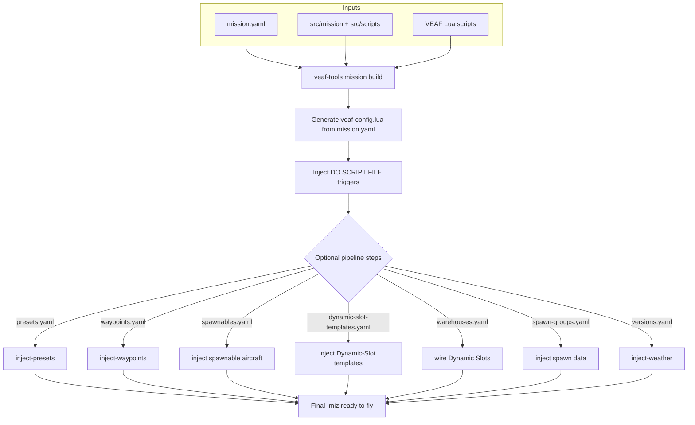

# Mission Maker Guide — VEAF Mission Creation Tools


This guide is for DCS World mission designers who want to integrate the VEAF framework into their missions.

---

## Table of Contents

1. [What You Get](#what-you-get)
2. [Prerequisites](#prerequisites)
3. [Installation and Updates](#installation-and-updates)
4. [Global User Configuration](#global-user-configuration)
5. [Creating a New Mission](#creating-a-new-mission)
6. [How Scripts Are Loaded](#how-scripts-are-loaded)
7. [Configuring Modules](#configuring-modules)
8. [Configuring the build pipeline](#configuring-pipeline)
9. [Design-Time Tools](#design-time-tools)
10. [Typical Build Workflow](#typical-build-workflow)
11. [Build Profiles](#build-profiles)
12. [Scripts Reference](#scripts-reference)
13. [Configuration Examples](#configuration-examples)
14. [CTLD and CSAR Integration](#ctld-and-csar-integration)
15. [DCS Bridge](#dcs-bridge)
16. [Debug Logging](#debug-logging)
17. [Resources](#resources)

> **Migrating an existing mission?** See the [Migration Guide](MIGRATION_GUIDE.en.md) — covers both VEAF MCT v5 → v6 and vanilla DCS → VEAF MCT.

---

## What You Get

A VEAF mission is a standard DCS `.miz` file that loads the VEAF Lua framework at startup. This gives players and controllers:

- **Marker commands** — players type commands on the F10 map (spawn units, generate CAS zones, move groups…)
- **F10 radio menus** — dynamic menus for every enabled feature
- **Pre-built mission types** — CAS, transport, carrier ops, QRA, air waves, combat zones
- **Asset management** — tankers, AWACS, carriers with automatic state tracking and radio menus
- **Named points** — reusable map positions with optional ATC/TACAN services
- **Integrations** — Skynet IADS, CTLD/CSAR

---

## Prerequisites

| Tool | Purpose | Required |
|------|---------|----------|
| DCS World | The simulator | Yes |
| DCS Mission Editor | Create the base `.miz` (included with DCS) | Yes |
| Git | Version control for your mission project | Recommended |
| `veaf-tools-updater.exe` | Downloads and installs the latest VEAF MCT release | Yes |
| `veaf-tools.exe` | Build-time `.miz` manipulation CLI | Yes (for build pipeline) |
| VS Code or Notepad++ | Editing Lua/YAML config files | Recommended |

> **Base mission coalitions**: each side coalition (blue/red) needs at least one ground unit, otherwise its Lua coalition tables are incomplete and DCS purges the empty side — which used to require placing one blue and one red ground group by hand. **The build now handles this for you**: if a side coalition has no unit, it injects a single *hidden* placeholder ground unit (on the coalition bullseye) so DCS registers the side. You can still place your own ground groups — the placeholder is only added when a side is empty.

---

## Installation and Updates

### First Installation

Download `veaf-tools-updater.exe` from the [latest GitHub release](https://github.com/VEAF/VEAF-Mission-Creation-Tools/releases/tag/published-latest) and place it in your mission project folder.

> **Windows security:** Windows may block `.exe` files downloaded from the internet. If the file doesn't run, right-click it → **Properties** → **General** tab → check **Unblock** at the bottom → **OK**.

Then run:

```powershell
.\veaf-tools-updater.exe
```

This downloads `published.zip`, verifies the SHA256 checksum, and extracts all scripts and tools into your mission folder.

### Updating

Run the same command whenever a new release is available:

```powershell
.\veaf-tools-updater.exe
```

Only updates if the remote version is newer. To force a reinstall:

```powershell
.\veaf-tools-updater.exe --force
```

To pin to a specific version:

```powershell
.\veaf-tools-updater.exe --tag published-v6.1.0
```

Full CLI reference: [Tools Reference](../TOOLS_REFERENCE.en.md)

---

## Global User Configuration {#global-user-configuration}

Create `~/veafmct.yaml` (i.e. `C:\Users\YourName\veafmct.yaml` on Windows) to set persistent defaults that apply to **all** your VEAF projects on this machine:

```yaml
# ~/veafmct.yaml
lang: fr                 # Tool output language: "en" (default) or "fr"
check_updates: true      # Check for new veaf-tools releases at startup
scripts_path: D:/dev/_VEAF/VEAF-Mission-Creation-Tools   # Local repo path (for --dev-mode)
```

All keys are optional. To initialise the file from the CLI:

```powershell
veaf-tools.exe user-config --init
```

Or inspect/edit values interactively:

```powershell
# Show effective configuration and its source
veaf-tools.exe user-config

# Set a value
veaf-tools.exe user-config --set lang=fr

# Remove a value (revert to default)
veaf-tools.exe user-config --unset lang
```

**Language detection order** (first match wins):
1. `--lang` CLI option
2. `VEAF_LANG` environment variable
3. `~/veafmct.yaml` → `lang:` key
4. OS locale (Windows registry / system locale on Linux–macOS)
5. `en` (built-in fallback)

---

## Creating a New Mission

### Recommended: Fork the Demo Mission

The fastest way to start is to fork [VEAF-Demo-Mission](https://github.com/VEAF/VEAF-Demo-Mission), which already has the correct folder structure, sample configurations, and build scripts.

```powershell
git clone https://github.com/VEAF/VEAF-Demo-Mission.git my-mission
cd my-mission
.\veaf-tools-updater.exe
```

### From Scratch

1. Create a folder for your mission project (this is your Git repository)
2. Copy your existing `.miz` file there
3. Run `veaf-tools-updater.exe` to fetch all VEAF scripts
4. Extract your mission: `veaf-tools.exe mission extract my-mission.miz`
5. Configure modules in `mission.yaml` and optionally `src/scripts/mission-script.lua`

Recommended project layout:

```
MyMission/
├── src/
│   ├── mission/                  # Extracted DCS mission data (from extract)
│   ├── scripts/
│   │   ├── mission-script.lua    # Your custom Lua code (optional)
│   │   └── veafDynamicConfig.lua # Dynamic script-loading config (dev/test)
│   ├── options                  # DCS options table injected into the .miz
│   ├── presets.yaml             # Radio frequency presets (presets step)
│   ├── spawnables.yaml          # Spawnable aircraft groups (veafSpawn- prefix, spawnable_aircrafts step)
│   ├── dynamic-slot-templates.yaml # Dynamic-Slot templates (dynSpawnTemplate=true, dynamic_slot_templates step)
│   ├── warehouses.yaml          # Per-coalition Dynamic Slots (warehouses step, optional)
│   ├── spawn-groups.yaml        # Extend/override the spawn database (spawn_data step, optional)
│   ├── versions.yaml            # Weather/time variants (weather step)
│   └── waypoints.yaml           # Bullseye / navigation points (waypoints step)
├── published/                    # VEAF scripts & tools (auto-installed)
├── mission.yaml                  # Build-time configuration
├── .gitignore                    # Excludes generated/downloaded files
├── veaf-tools.exe                # CLI tool (auto-installed)
└── veaf-tools-updater.exe
```

> Every file listed under `src/` (except the `mission/` extract output) ships from
> the tool's `defaults/mission-folder/` scaffold and is consumed at the first
> build — the `*.yaml` files by their pipeline/module step, `options` by `.miz`
> injection, and the `scripts/*.lua` files by script loading.

---

## How Scripts Are Loaded

The `build` command **automatically injects** a `DO SCRIPT FILE` trigger at mission start that loads all VEAF scripts. You do **not** need to manually add any trigger in the DCS Mission Editor.

If you have a custom `src/scripts/mission-script.lua`, it is also injected automatically by the builder.

### What the builder does

1. Reads `src/mission/` (the extracted DCS data)
2. Removes any existing VEAF triggers
3. Injects fresh `DO SCRIPT FILE` triggers for all VEAF scripts + your custom scripts
4. Writes the final `.miz`

The full build then runs any optional pipeline steps whose configuration files are present (presets, waypoints, aircraft groups, weather):



> **Note — templates and multiplayer slots**: the groups injected from `spawnables.yaml` and `dynamic-slot-templates.yaml` are reusable **templates**. To keep them from showing up as pickable slots in the multiplayer briefing, the build automatically hides them from the slot list (`hiddenOnPlanner`/`hiddenOnMFD`) and locks them with a password. Dynamic-slot spawning (which references the template by name) stays fully functional.

---

## Configuring Modules {#configuring-modules}

VEAF MCT has two configuration layers:

- **`mission.yaml`** (at the project root) — build-time configuration: which modules to enable/disable, log levels, security settings, asset declarations
- **`src/scripts/mission-script.lua`** (optional) — custom Lua code that runs at mission start: aliases, helper functions, third-party script setup (CTLD, CSAR). Module initialization and configuration are generated automatically from `mission.yaml`.

For most missions, `mission.yaml` is sufficient. Use `mission-script.lua` only for custom Lua code that cannot be expressed in YAML.

### mission.yaml Example

```yaml
mission:
  name: "My-Mission"

modules:
  SECURITY: true        # shorthand: just enable the module
  SPAWN:
    logLevel: debug     # a module with extra config uses a block
  ASSETS:
    enabled: true
    assets:
      - sort: 1
        name: "T1-Arco-1"
        description: "Arco-1 (KC-135)"
        information: "Tacan 64Y\nU290.50 (20)"
```

> The unified `modules:` block replaces the older `lua_modules:` + `community_scripts:` keys, and `enabled:` replaces `enable:`. The legacy keys still work but emit a deprecation warning. See the [mission.yaml Reference](../MISSION_YAML_REFERENCE.en.md) for the full syntax.

### mission-script.lua Example

```lua
-- mission-script.lua — custom mission-level code
-- Module initialization is handled automatically by veaf-config.lua (generated from mission.yaml).
-- Put custom aliases, helper functions, and third-party script setup here.

-- Example: custom shortcut alias
-- veafShortcuts.AddAlias(VeafAlias:new():setName("-cas1"):setVeafCommand("_cas"))

-- Note: nothing to write here for CTLD — it is configured in ctld-config.yaml
-- (see CTLD and CSAR Integration)
```

### Security Levels

| Tier | Constant | Passes without a password when the pilot's level is |
|------|----------|------------------------------------------------------|
| `KNOWN_PILOT` | `veafSecurity.LEVEL_KNOWN_PILOT` = 1 | **≥ 1** — any pilot listed in the server's `veaf-pilots.txt` |
| `SENIOR_PILOT` | `veafSecurity.LEVEL_SENIOR_PILOT` = 10 | **≥ 10** — a trusted member |
| `ADMIN` | `veafSecurity.LEVEL_ADMIN` = 90 | **≥ 90** — a server administrator |
| `MM` | (no level) | never — the Mission Master password is the only way in |
| `OPEN` | (no check) | always — the command is deliberately available to everyone |

!!! info "These tiers were called `L9`, `L1` and `L0` until 6.13.37"

    The old names read backwards — `L0` was the **tightest** tier, not the loosest — and
    this page said the opposite until 2026-08-06, which is how a change came within one
    line of locking a deliberately public command to administrators.

    `L9`, `L1` and `L0` still work as **deprecated aliases** and will be removed in a
    future release. **The values are unchanged** (1, 10, 90), so renaming them changes no
    mission's behaviour — only what you write.

Two things satisfy a check. Either the player's **pilot level**, published by the server
hook from `veaf-pilots.txt`, is high enough for the tier — that is the identity path, and
it needs no password — or the correct **password** for that tier appears in the marker
text. Without the hook there are no pilot levels, so everything falls back to passwords.

Set passwords (SHA-1 hashes — that is what `veafSecurity` compares) in `mission.yaml`:

```yaml
security:
  disabled: false
  password_hashes:
    - "<SHA-1 hash of your password>"
```

---

## Configuring the build pipeline {#configuring-pipeline}

Beyond the Lua modules that run inside DCS, `veaf-tools mission build` can chain **pipeline steps** at build time: they inject data into the `.miz` (radio presets, waypoints, aircraft groups, weather variants) from separate YAML files placed in `src/`. Each step is **auto-detected** (it runs when its config file exists) and is controlled from the `pipeline:` section of `mission.yaml`.

| Step | Role | Detailed schema |
|------|------|-----------------|
| `presets` | Injects radio frequency presets into human-piloted aircraft groups and generates the associated kneeboard PNG plates | [presets.yaml](../PIPELINE_REFERENCE.en.md#pipeline-step-1-presets) |
| `waypoints` | Injects waypoint templates (bullseye, navigation) into human aircraft groups | [waypoints.yaml](../PIPELINE_REFERENCE.en.md#pipeline-step-2-waypoints) |
| `spawnable_aircrafts` / `dynamic_slot_templates` | Injects spawnable aircraft groups and dynamic-slot templates | [aircraft groups](../PIPELINE_REFERENCE.en.md#pipeline-step-3-aircraft-groups) |
| `weather` | Creates several mission variants with different weather and time settings | [versions.yaml](../PIPELINE_REFERENCE.en.md#pipeline-step-6-versions) |

Each step accepts the **scalar** form (`true`/`false` to enable or skip) or the **mapping** form (detailed options). For example, the `presets` step can keep the radio injection while suppressing the PNG plates globally:

```yaml
pipeline:
  presets:
    enabled: true       # default true — inject radio presets
    kneeboards: false   # default true — when false, no kneeboard PNG is generated
```

See the [Pipeline Reference](../PIPELINE_REFERENCE.en.md) for the full schema of each step and the [mission.yaml Reference](../MISSION_YAML_REFERENCE.en.md#pipeline) for all `pipeline:` fields.

---

## Design-Time Tools

`veaf-tools.exe` manipulates `.miz` files at build time — before loading them in DCS.

> **Commands are filed by theme.** `veaf-tools mission build`, `veaf-tools content
> inject-presets`, `veaf-tools convert v5`… `veaf-tools --help` lists the groups, and
> `veaf-tools <group> --help` shows what is in one. The `dcs` group is what **needs DCS running**.
> The groups are: `mission`, `convert`, `content`, `cockpit` and `dcs`.
> A command whose name starts with its group's name drops that word inside: you write
> `veaf-tools convert v5` and `veaf-tools convert other`, not `convert convert-v5`.
>
> **The old short names still work**: `veaf-tools build` does exactly what `veaf-tools mission
> build` does. They are no longer shown in the help and count as deprecated — a script or forum
> post written before this change keeps working.

| Command | What it does |
|---------|-------------|
| `prepare` | Initialises/refreshes a mission folder from the default scaffold; `--template minimal\|standard\|full\|custom` generates a `mission.yaml` with the matching module set (`custom` = pick modules interactively); `--list-templates` to list them. `--theatre <name>` also generates a synthetic blank mission for that DCS map into `src/mission/` (no DCS round-trip needed to start); `--list-theatres` to list the supported maps. The generated file carries the same documented preamble as `convert-v5` (YAML syntax guide, `global_log_level:`, `mission:`, `security:`, `pipeline:`) |
| `build` | Builds the mission from `src/` — injects VEAF triggers, outputs a `.miz`. Also validates the `mission.yaml` references to the Mission Editor (trigger zones, groups, units, airfields) and prints a **prominent end-of-build summary** of any that are missing — **without blocking** (the `.miz` is built anyway, so you can fix them in the Mission Editor and iterate). A COMBATZONE **operation**'s `zone_name` is not checked (it's only a label, not a required trigger zone) |
| `validate` | Lints the mission folder **before** build — reports config errors and runtime risks without building (exit non-zero on error; `--strict` fails on warnings too) |
| `extract` | Extracts a `.miz` to a source folder (run once to initialise your repo) |
| `export` | Exports a `.miz` to **JSON** (default), **YAML** or **Markdown** (readable brief): `export mission.miz out.json --format json`. Parsing is **pure-Python** (the `luadata` parser) and **never executes Lua** — a safe alternative to interpreting an untrusted `.miz` (arbitrary-code-execution risk). Writes to stdout when no output file is given |
| `inject-presets` | Injects radio frequency plans for all human cockpits |
| `inject-weather` | Creates weather/time variants from a YAML config |
| `inject-aircraft-groups` | Injects aircraft group templates |
| `extract-aircraft-groups` | Extracts aircraft groups from a mission |
| `inject-waypoints` | Injects waypoints (bullseye, nav points) for human groups |
| `extract-waypoints` | Extracts waypoints from a mission |
| `convert-v5` | Migrates a v5 mission folder to v6 format |
| `user-config` | Shows or edits the global user config (`~/veafmct.yaml`) |
| `about` | Show information about VEAF Mission Creation Tools. |
| `ask` | Ask a question about the VEAF documentation (AI assistant). With no question, starts an interactive session. |
| `capture-map` | Capture a theatre's airbases from a running bridge mission (via dcs-serve) into <theatre>.json. |
| `convert-other` | Adopt a third-party (non-VEAF) .miz mission onto the v6 toolchain. |
| `explore-cockpit` | Explore a live cockpit: name a control to see it, or move one to name it. |
| `generate-config` | Generate a documented mission.yaml template for a mission folder. |
| `inject-bridge` | Embed the dcs-bridge + a start trigger into a .miz, turning it into a bridge mission. |
| `mcp` | Start the LLM-assisted mission-editing MCP server (stdio). Used by the veaf-mission-editor Claude plugin. |
| `migrate-config` | Migrate a missionConfig.lua to v6 format (mission-script.lua). |
| `resolve-checklist` | Fill in the technical fields of a guided checklist written in plain words. |
| `smoke-test` | Assert VEAF runtime behaviour inside a running DCS, over the dcs-fiddle hook. |
| `verify-checklist` | Check a resolved checklist against a real cockpit (needs DCS running here). |

Full reference: [Tools Reference](../TOOLS_REFERENCE.en.md)

### Interactive mode (wizard)

In an interactive terminal, `veaf-tools.exe` opens a guided wizard (TUI) instead of failing on a missing option:

- `veaf-tools.exe` (no arguments) → command-selection menu, then prompts.
- `veaf-tools.exe mission prepare` → the wizard asks for the target folder **and** the module template.
- `veaf-tools.exe mission prepare c:\my-mission` → the folder is already supplied, so the wizard only asks for the template.
- `--tui` appended to any command → opens the wizard even when nothing is missing (e.g. `veaf-tools.exe mission build --tui`).

Options already passed on the command line are pre-filled; unknown options (e.g. `--verbose`) are preserved as-is. Outside an interactive terminal (CI, redirected output), the wizard never triggers and the command runs normally.

**Navigation**: **Ctrl-B** (or **Escape** pressed twice) steps back to the previous prompt; from the main menu (or a command's first prompt) it quits the wizard. A reminder is shown at the bottom of each prompt.

---

## Typical Build Workflow

```powershell
# Build the mission — the integrated pipeline runs all enabled steps automatically
veaf-tools.exe mission build
```

The `build` command reads `mission.yaml` and runs every enabled pipeline step (presets, waypoints, aircraft groups, weather) in a single pass. Configure which steps are active under the `pipeline:` key in `mission.yaml`.

<details>
<summary>Advanced: running pipeline steps individually</summary>

If you need to run a single step in isolation (e.g. inject weather only, without a full rebuild):

```powershell
# Inject radio presets only
veaf-tools.exe content inject-presets my-mission.miz --presets-file src/presets.yaml

# Inject bullseye and nav waypoints only
veaf-tools.exe content inject-waypoints my-mission.miz --waypoints-file src/waypoints.yaml

# Create weather/time variants only
veaf-tools.exe content inject-weather my-mission.miz --config-file versions.yaml
```

</details>

Commit the contents of `src/` to Git — not the built `.miz`. Use `extract` once to bootstrap the source folder from an existing mission:

```powershell
veaf-tools.exe mission extract my-mission.miz
```

---

## Build Profiles {#build-profiles}

Build profiles let you switch between different named configurations without editing `mission.yaml`. Define a `profiles:` section once, then select a profile at build time:

```yaml
# mission.yaml
global_log_level: info
security:
  disabled: false
pipeline:
  weather: true

profiles:
  TEST:
    global_log_level: debug
    security:
      disabled: true
    pipeline:
      weather: false   # skip weather variants during test builds
  SERVER:
    global_log_level: info
    pipeline:
      weather: true
```

```powershell
# Build for testing (no weather, security disabled, verbose logging)
veaf-tools.exe mission build --profile TEST

# Build for server deployment
veaf-tools.exe mission build --profile SERVER

# Build with no profile (base config)
veaf-tools.exe mission build
```

Profile keys **deep-merge** onto the base config: only the keys you specify are overridden, everything else stays as defined at the top of `mission.yaml`. Passing an unknown profile name emits a warning and falls back to the base config.

See [`profiles:` in the YAML Reference](../MISSION_YAML_REFERENCE.en.md#profiles) for the full field description.

---

## Scripts Reference

All VEAF Lua modules are available once `veaf-scripts.lua` is loaded. See [scripts/README.md](scripts/README.en.md) for the complete list with configuration guides.

**Quick navigation by category:**

| Category | Modules |
|----------|---------|
| Core | [veafSpawn](scripts/veafSpawn.en.md), [veafMove](scripts/veafMove.en.md), [veafSecurity](scripts/veafSecurity.en.md), [veafNamedPoints](scripts/veafNamedPoints.en.md) |
| Mission types | [veafCasMission](scripts/veafCasMission.en.md), [veafCombatZone](scripts/veafCombatZone.en.md), [veafTransportMission](scripts/veafTransportMission.en.md), [veafQraManager](scripts/veafQraManager.en.md), [veafAirWaves](scripts/veafAirWaves.en.md) |
| Assets | [veafAssets](scripts/veafAssets.en.md), [veafCarrierOperations](scripts/veafCarrierOperations.en.md), [veafGrass](scripts/veafGrass.en.md), [veafWeather](scripts/veafWeather.en.md) |
| Protection | [veafSanctuary](scripts/veafSanctuary.en.md), [veafMissileGuardian](scripts/veafMissileGuardian.en.md) |
| Integrations | [veafSkynetIadsHelper](scripts/veafSkynetIadsHelper.en.md) |

---

## Configuration Examples {#configuration-examples}

### QRA Zone

```lua
local northQra = VeafQRA:new()
  :setName("QRA-North")
  :setTriggerZone("ZONE-QRA-NORTH")
  :setCoalition(coalition.side.RED)
  :addGroup("MiG-29 QRA")
  :start()
```

### Combat Zone

```lua
local strikeZone = VeafCombatZone:new()
  :setMissionEditorZoneName("ZONE-STRIKE-ALPHA")
  :setFriendlyName("Strike Alpha")
  :setBriefing("Armoured column advancing on Senaki. Destroy all armoured vehicles; expect AAA.")
  :addZoneElement(VeafCombatZoneElement:new():setName("ARMOR"):setSpawnGroup("STRIKE-ALPHA-ARMOR"))
  :addZoneElement(VeafCombatZoneElement:new():setName("AAA"):setSpawnGroup("STRIKE-ALPHA-AAA"))
  :initialize()
```

### Air Waves Zone

```lua
local defenseZone = AirWaveZone:new()
  :setName("AW-Defense")
  :setTriggerZone("ZONE-DEFENSE")
  :setDescription("Intercept zone")
  :addPlayerCoalition(coalition.side.BLUE)
  :addWave({ "MiG-23 Wave 1", "MiG-23 Wave 1b" })
  :addWave({ "MiG-29 Wave 2" })
  :start()
```

---

## CTLD and CSAR Integration {#ctld-and-csar-integration}

[CTLD](https://github.com/VEAF/CTLD) (troop transport and logistics) and [CSAR](https://github.com/ciribob/DCS-CSAR) (Combat Search and Rescue) are third-party scripts that VEAF supports natively: you never have to load or initialise them yourself. They are **not** configured the same way — **CSAR in `mission.yaml`, CTLD in a file of its own.**

### Configuring CTLD: `ctld-config.yaml` + ctld-tools

In `mission.yaml`, CTLD is now just a switch:

```yaml
modules:
  CTLD: true
```

Everything else — distances, timers, crates, troop groups, zones, per-aircraft capabilities — lives in a **`ctld-config.yaml`** file next to `mission.yaml` in your mission folder. You edit it with **`ctld-tools.exe`**, shipped with CTLD: double-click it and the tool opens in your browser, locally, with nothing to install. It validates as you type and shows plain-language labels rather than raw setting names.

`veaf-tools mission prepare` creates the file for you when the chosen template enables CTLD, pre-filled with the engine's own defaults. It is never overwritten afterwards: it is your configuration.

At build time VEAF injects it into the mission as a `CTLD_userConfig.lua` loaded immediately before `CTLD.lua`.

!!! warning "Do not use ctld-tools' own \"inject into mission\" button"
    It writes straight into a `.miz`. On a VEAF mission the `.miz` is rebuilt from the mission folder on every build, so your injection would be wiped by the next one. Save the `ctld-config.yaml` file and let the build do the rest.

!!! note "This file is a **complete** configuration"
    CTLD 2 merges nothing. A plain setting you omit falls back to the engine default (and says so when the mission starts), but a **list** you omit — a crate section, a troop group, a zone — is genuinely removed. That is how you take one out. Always start from the existing file rather than writing one from scratch.

When you upgrade CTLD and your file was written against an earlier version, `ctld-tools` lists what appeared, what disappeared and what differs from the default before you save it again.

#### What changed from CTLD v1

| Before | Now |
|---|---|
| `modules: CTLD: { settings: … }` | `ctld-config.yaml` (a `settings:` block is rejected by `validate`) |
| units named `logistic #001` … `#020` | a Mission Editor zone named `LGZ_…` (any number of them) |
| zones named `pickzone #001` … `#020` | a Mission Editor zone named `TRZ_…` |
| `ctld.initialize(configurationCallback)` in `mission-script.lua` | nothing to write: the VEAF framework initialises CTLD |

To attach a logistic zone to something that moves — a carrier, say — link the zone to the unit in the Mission Editor (*Moving Zone*): the zone follows its unit.

### Configuring CSAR via mission.yaml (YAML-first)

CSAR can be configured the same way:

```yaml
modules:
  CSAR:
    enabled: true
    settings:                # csar.xxx = value pairs
      enableAllslots: true
      useprefix: true
      csarPrefix: "MEDEVAC"
```

VEAF generates the `csar.xxx = value` assignments and the `csar.initialize()` call in `veaf-config.lua`. For complex settings such as `aircraftType` (a per-aircraft table), continue using the Lua callback pattern in `mission-script.lua`.

### Loading order in the DCS trigger chain

The build produces this chain for you; it is written out here so you can read it back in the Mission Editor:

```
DO SCRIPT FILE → CTLD_userConfig.lua (generated from your ctld-config.yaml)
DO SCRIPT FILE → CTLD.lua            (third-party)
DO SCRIPT FILE → csar.lua            (third-party)
DO SCRIPT FILE → veaf-scripts.lua    (VEAF modules)
DO SCRIPT FILE → veaf-config.lua     (generated from mission.yaml)
DO SCRIPT FILE → mission-script.lua  (your custom code)
```

The order of the first two lines matters: CTLD reads its configuration as it loads. That same file also tells it to wait for the VEAF framework instead of starting on its own, which lets VEAF route its messages into the VEAF logs — including its startup report, which is what flags an incomplete or outdated configuration.

CSAR keeps the older mechanism: `veaf-scripts.lua` detects the `csar` global table and wraps its `initialize()` function.

### Lua fallback — CSAR in mission-script.lua

For per-aircraft type overrides or other complex settings not supported by YAML:

```lua
if csar then
    local initializeCSAR = true
    if initializeCSAR then
        veaf.loggers.get(veaf.Id):info("initialize CSAR")
        local function configurationCallback()
            -- Configure CSAR settings before it initialises
            csar.enableAllslots = true
            csar.aircraftType["UH-1H"]  = 8
            csar.aircraftType["Mi-8MT"] = 16
            csar.useprefix  = true
            csar.csarPrefix = { "MEDEVAC" }
        end
        csar.initialize(configurationCallback)
    else
        csar.alreadyInitialized = true
    end
end
```

### VEAF automatic defaults

When VEAF wraps the initialisers it applies its own defaults: logging and a standard radio menu entry. You do not need to configure any of this manually.

---

## DCS Bridge

[VEAF-dcs-bridge](https://github.com/VEAF/VEAF-dcs-bridge) is an optional Lua module that opens a TCP socket between DCS World and an external server, enabling external control of the mission (Discord bots, dashboards, automation tools).

### Enabling dcs-bridge.lua injection

Add the following section to your `mission.yaml`:

```yaml
dcs_bridge:
  enabled: true
```

At build time, `veaf-tools` automatically downloads `dcs-bridge.lua` from GitHub and injects it as the very first DO SCRIPT FILE trigger in the mission (before all VEAF scripts).

### Using a local file

If you have a local clone of `VEAF-dcs-bridge`, point directly to the file:

```yaml
dcs_bridge:
  enabled: true
  lua_path: /path/to/VEAF-dcs-bridge/src/lua/dcs-bridge.lua
```

The path can be absolute or relative to the mission folder.

### Load order

When `dcs_bridge` is enabled, the trigger is inserted at **position 1**, before all other VEAF triggers. dcs-bridge is therefore available at the earliest possible point in mission startup, before `veaf-scripts.lua` is loaded.

---

## Debug Logging

All VEAF scripts write to the DCS log file (`Saved Games\DCS\Logs\dcs.log`). The build now produces a **single** `veaf-scripts.lua` loader; verbosity is controlled by log levels in `mission.yaml`, not by loading a different script file.

### Switching log levels {#debug-logging}

Set a global default with `global_log_level`, or override it per module with `logLevel`, then rebuild:

```yaml
global_log_level: info   # trace | debug | info | warning | error

modules:
  SPAWN:
    logLevel: debug   # overrides the global default for this module only
```

`veaf-tools.exe mission build` regenerates `veaf-config.lua` from `mission.yaml`. For a quick change without rebuilding, edit `veaf-config.lua` directly — it is a generated file so your changes will be overwritten on the next build.

### Reading the log

We recommend [Klogg](https://klogg.filimonov.dev/) — a fast log viewer with regex highlighting. Load `dcs.log` and filter on `VEAF` to see only VEAF messages.

A ready-to-use Klogg highlight profile is included in the repository at [`tools/klogg/veaf.conf`](../../tools/klogg/veaf.conf). It colour-codes log levels (errors in red, warnings in orange, VEAF info in green, debug in teal, trace in grey) and highlights MIST and CTLD entries. To install it: open Klogg → *File > Import highlights…* and select the file.

---

## Resources

- [Scripts Reference](scripts/README.en.md) — all scripts with configuration details
- [Tools Reference](../TOOLS_REFERENCE.en.md) — `veaf-tools.exe` CLI full reference
- [Lua API Reference](../LUA_API_REFERENCE.en.md) — complete Lua API documentation
- [VEAF Demo Mission](https://github.com/VEAF/VEAF-Demo-Mission) — working example mission
- [VEAF Discord](https://www.veaf.org/discord) — community help

