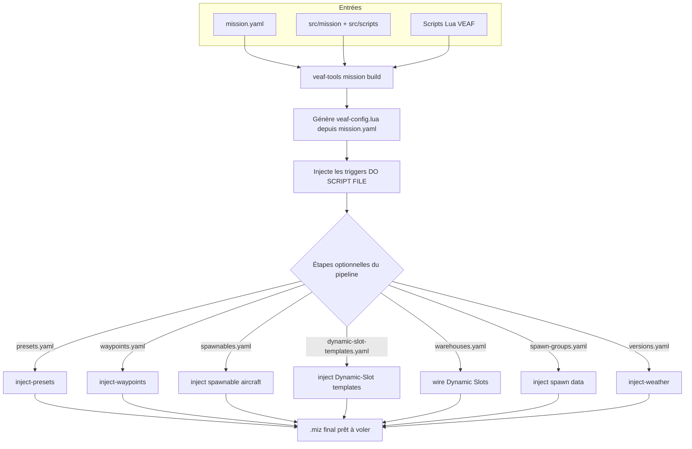

# Guide du créateur de missions — VEAF Mission Creation Tools

Ce guide s'adresse aux concepteurs de missions DCS World qui souhaitent intégrer le framework VEAF dans leurs missions.

---

## Table des matières

1. [Ce que vous obtenez](#ce-que-vous-obtenez)
2. [Prérequis](#prérequis)
3. [Installation et mises à jour](#installation-et-mises-à-jour)
4. [Configuration globale utilisateur](#global-user-configuration)
5. [Créer une nouvelle mission](#créer-une-nouvelle-mission)
6. [Comment les scripts sont chargés](#comment-les-scripts-sont-chargés)
7. [Configurer les modules](#configuring-modules)
8. [Configurer le pipeline de build](#configuring-pipeline)
9. [Outils de conception](#outils-de-conception)
10. [Workflow de build typique](#workflow-de-build-typique)
11. [Profils de build](#build-profiles)
12. [Référence des scripts](#référence-des-scripts)
13. [Exemples de configuration](#configuration-examples)
14. [Intégration CTLD et CSAR](#ctld-and-csar-integration)
15. [DCS Bridge](#dcs-bridge)
16. [Journalisation de débogage](#journalisation-de-débogage)
17. [Ressources](#ressources)

> **Migration d'une mission existante ?** Consultez le [Guide de migration](MIGRATION_GUIDE.md) — couvre à la fois VEAF MCT v5 → v6 et DCS vanilla → VEAF MCT.

---

## Ce que vous obtenez

Une mission VEAF est un fichier DCS `.miz` standard qui charge le framework Lua VEAF au démarrage. Cela offre aux joueurs et aux contrôleurs :

- **Commandes via marqueurs** — les joueurs tapent des commandes sur la carte F10 (faire apparaître des unités, créer des zones CAS, déplacer des groupes…)
- **Menus radio F10** — menus dynamiques pour chaque fonctionnalité activée
- **Types de missions préconstruits** — CAS, transport, opérations porte-avions, QRA, vagues aériennes, zones de combat
- **Gestion des ressources** — ravitailleurs, AWACS, porte-avions avec suivi d'état automatique et menus radio
- **Points nommés** — positions cartographiques réutilisables avec services ATC/TACAN optionnels
- **Intégrations** — Skynet IADS, CTLD/CSAR

---

## Prérequis

| Outil | Rôle | Obligatoire |
|-------|------|-------------|
| DCS World | Le simulateur | Oui |
| Éditeur de missions DCS | Créer le `.miz` de base (inclus avec DCS) | Oui |
| Git | Contrôle de version pour votre projet de mission | Recommandé |
| `veaf-tools-updater.exe` | Télécharge et installe la dernière release VEAF MCT | Oui |
| `veaf-tools.exe` | CLI de manipulation de `.miz` au moment du build | Oui (pour le pipeline de build) |
| VS Code ou Notepad++ | Édition des fichiers Lua/YAML de configuration | Recommandé |

> **Coalitions de la mission de base** : chaque coalition (bleue/rouge) a besoin d'au moins une unité au sol, sinon ses tables Lua de coalition sont incomplètes et DCS supprime le camp vide — ce qui obligeait auparavant à placer un groupe terrestre bleu et un rouge à la main. **Le build s'en charge désormais** : si une coalition n'a aucune unité, il injecte un unique groupe terrestre placeholder *caché* (sur le bullseye de la coalition) pour que DCS reconnaisse le camp. Vous pouvez toujours placer vos propres groupes — le placeholder n'est ajouté que si un camp est vide.

---

## Installation et mises à jour

### Première installation

Téléchargez `veaf-tools-updater.exe` depuis la [dernière release GitHub](https://github.com/VEAF/VEAF-Mission-Creation-Tools/releases/tag/published-latest) et placez-le dans le dossier de votre projet de mission.

> **Sécurité Windows :** Windows peut bloquer les fichiers `.exe` téléchargés depuis Internet. Si le fichier ne s'exécute pas, cliquez droit dessus → **Propriétés** → onglet **Général** → cochez **Débloquer** en bas de la fenêtre → **OK**.

Puis exécutez :

```powershell
.\veaf-tools-updater.exe
```

Cela télécharge `published.zip`, vérifie le checksum SHA256 et extrait tous les scripts et outils dans votre dossier de mission.

### Mises à jour

Exécutez la même commande dès qu'une nouvelle release est disponible :

```powershell
.\veaf-tools-updater.exe
```

La mise à jour n'est effectuée que si la version distante est plus récente. Pour forcer une réinstallation :

```powershell
.\veaf-tools-updater.exe --force
```

Pour épingler une version spécifique :

```powershell
.\veaf-tools-updater.exe --tag published-v6.1.0
```

Référence CLI complète : [Référence CLI](../CLI_REFERENCE.md)

---

## Configuration globale utilisateur {#global-user-configuration}

Créez `~/veafmct.yaml` (soit `C:\Users\VotreNom\veafmct.yaml` sous Windows) pour définir des valeurs par défaut persistantes applicables à **tous** vos projets VEAF sur cette machine :

```yaml
# ~/veafmct.yaml
lang: fr                 # Langue des outils : "en" (défaut) ou "fr"
check_updates: true      # Vérifier les nouvelles versions de veaf-tools au démarrage
scripts_path: D:/dev/_VEAF/VEAF-Mission-Creation-Tools   # Chemin local du dépôt (pour --dev-mode)
```

Toutes les clés sont optionnelles. Pour initialiser le fichier depuis la CLI :

```powershell
veaf-tools.exe user-config --init
```

Ou inspecter/modifier les valeurs de manière interactive :

```powershell
# Afficher la configuration effective et sa source
veaf-tools.exe user-config

# Définir une valeur
veaf-tools.exe user-config --set lang=fr

# Supprimer une valeur (revenir au défaut)
veaf-tools.exe user-config --unset lang
```

**Ordre de détection de la langue** (le premier qui correspond gagne) :
1. Option CLI `--lang`
2. Variable d'environnement `VEAF_LANG`
3. `~/veafmct.yaml` → clé `lang:`
4. Locale du système (registre Windows / locale système sur Linux–macOS)
5. `en` (fallback intégré)

---

## Créer une nouvelle mission

### Recommandé : forker la mission de démonstration

La façon la plus rapide de démarrer est de forker [VEAF-Demo-Mission](https://github.com/VEAF/VEAF-Demo-Mission), qui dispose déjà de la structure de dossiers correcte, de configurations d'exemple et de scripts de build.

```powershell
git clone https://github.com/VEAF/VEAF-Demo-Mission.git my-mission
cd my-mission
.\veaf-tools-updater.exe
```

### Depuis zéro

1. Créez un dossier pour votre projet de mission (c'est votre dépôt Git)
2. Copiez votre fichier `.miz` existant dedans
3. Exécutez `veaf-tools-updater.exe` pour récupérer tous les scripts VEAF
4. Extrayez votre mission : `veaf-tools.exe mission extract ma-mission.miz`
5. Configurez les modules dans `mission.yaml` et éventuellement `src/scripts/mission-script.lua`

Structure de projet recommandée :

```
MyMission/
├── src/
│   ├── mission/                  # Données DCS extraites (via extract)
│   ├── scripts/
│   │   ├── mission-script.lua    # Votre code Lua personnalisé (optionnel)
│   │   └── veafDynamicConfig.lua # Config de chargement dynamique des scripts (dev/test)
│   ├── options                  # Table d'options DCS injectée dans le .miz
│   ├── presets.yaml             # Préréglages de fréquences radio (étape presets)
│   ├── spawnables.yaml          # Groupes d'avions spawnables (préfixe veafSpawn-, étape spawnable_aircrafts)
│   ├── dynamic-slot-templates.yaml # Modèles de Dynamic Slots (dynSpawnTemplate=true, étape dynamic_slot_templates)
│   ├── warehouses.yaml          # Dynamic Slots par coalition (étape warehouses, optionnel)
│   ├── spawn-groups.yaml        # Extension/override de la base de spawn (étape spawn_data, optionnel)
│   ├── versions.yaml            # Variantes météo/horaires (étape weather)
│   └── waypoints.yaml           # Bullseye / points de navigation (étape waypoints)
├── published/                    # Scripts & outils VEAF (auto-installés)
├── mission.yaml                  # Configuration de build
├── .gitignore                    # Exclut les fichiers générés/téléchargés
├── veaf-tools.exe                # Outil CLI (auto-installé)
└── veaf-tools-updater.exe
```

> Chaque fichier listé sous `src/` (hormis la sortie d'extraction `mission/`)
> provient du gabarit `defaults/mission-folder/` de l'outil et est consommé dès
> le premier build — les `*.yaml` par leur étape de pipeline/module, `options`
> par injection dans le `.miz`, et les `scripts/*.lua` par le chargement de scripts.

---

## Comment les scripts sont chargés

La commande `build` **injecte automatiquement** un trigger `DO SCRIPT FILE` au démarrage de la mission qui charge tous les scripts VEAF. Vous n'avez **pas** besoin d'ajouter manuellement un trigger dans l'éditeur de missions DCS.

Si vous avez un `src/scripts/mission-script.lua` personnalisé, il est aussi injecté automatiquement par le builder.

### Ce que fait le builder

1. Lit `src/mission/` (les données DCS extraites)
2. Supprime tous les triggers VEAF existants
3. Injecte de nouveaux triggers `DO SCRIPT FILE` pour tous les scripts VEAF + vos scripts personnalisés
4. Écrit le `.miz` final

Le build complet exécute ensuite les étapes optionnelles du pipeline dont les fichiers de configuration sont présents (presets, waypoints, groupes d'aéronefs, météo) :



> **Note — templates et slots multijoueur** : les groupes injectés depuis `spawnables.yaml` et `dynamic-slot-templates.yaml` sont des **modèles** réutilisables. Pour éviter qu'ils n'apparaissent comme slots sélectionnables dans le briefing multijoueur, le build les masque automatiquement de la liste des slots (`hiddenOnPlanner`/`hiddenOnMFD`) et les verrouille par un mot de passe. Le spawn dynamique (qui référence le template par son nom) reste pleinement fonctionnel.

---

## Configurer les modules {#configuring-modules}

VEAF MCT a deux niveaux de configuration :

- **`mission.yaml`** (à la racine du projet) — configuration de build : quels modules activer/désactiver, niveaux de log, sécurité, déclarations d'assets
- **`src/scripts/mission-script.lua`** (optionnel) — code Lua personnalisé exécuté au démarrage de la mission : alias, fonctions utilitaires, intégration de scripts tiers (CTLD, CSAR). L'initialisation et la configuration des modules sont générées automatiquement depuis `mission.yaml`.

Pour la plupart des missions, `mission.yaml` suffit. N'utilisez `mission-script.lua` que pour du code Lua personnalisé qui ne peut pas être exprimé en YAML.

### Exemple mission.yaml

```yaml
mission:
  name: "My-Mission"

modules:
  SECURITY: true        # raccourci : activer simplement le module
  SPAWN:
    logLevel: debug     # un module avec configuration utilise un bloc
  ASSETS:
    enabled: true
    assets:
      - sort: 1
        name: "T1-Arco-1"
        description: "Arco-1 (KC-135)"
        information: "Tacan 64Y\nU290.50 (20)"
```

> Le bloc unifié `modules:` remplace les anciennes clés `lua_modules:` + `community_scripts:`, et `enabled:` remplace `enable:`. Les clés héritées fonctionnent toujours mais émettent un avertissement de dépréciation. Voir la [Référence mission.yaml](../MISSION_YAML_REFERENCE.md) pour la syntaxe complète.

### Exemple mission-script.lua

```lua
-- mission-script.lua — code Lua personnalisé au niveau mission
-- L'initialisation des modules est gérée automatiquement par veaf-config.lua (généré depuis mission.yaml).
-- Mettez ici vos alias, fonctions utilitaires et intégrations de scripts tiers.

-- Exemple : alias de raccourci personnalisé
-- veafShortcuts.AddAlias(VeafAlias:new():setName("-cas1"):setVeafCommand("_cas"))

-- Note : rien à écrire ici pour CTLD — il se configure dans ctld-config.yaml
-- (voir la section Intégration CTLD et CSAR)
```

### Niveaux de sécurité {#security-tiers}

| Palier | Constante | Passe sans mot de passe si le niveau du pilote est |
|--------|-----------|-----------------------------------------------------|
| `KNOWN_PILOT` | `veafSecurity.LEVEL_KNOWN_PILOT` = 1 | **≥ 1** — tout pilote inscrit dans le `veaf-pilots.txt` du serveur |
| `SENIOR_PILOT` | `veafSecurity.LEVEL_SENIOR_PILOT` = 10 | **≥ 10** — un membre de confiance |
| `ADMIN` | `veafSecurity.LEVEL_ADMIN` = 90 | **≥ 90** — un administrateur du serveur |
| `MM` | (aucun niveau) | jamais — seul le mot de passe Mission Master ouvre |
| `OPEN` | (aucun contrôle) | toujours — la commande est délibérément ouverte à tous |

!!! info "`L9`, `L1` et `L0` sont des alias dépréciés — et ils se lisent à l'envers"

    Les anciens noms se lisent à l'envers de ce qu'ils suggèrent : `L0` est le palier le plus
    **strict** (`ADMIN`), pas le plus permissif ; `L9` est le plus ouvert (`KNOWN_PILOT`).

    `L9`, `L1` et `L0` restent acceptés comme **alias dépréciés** et disparaîtront dans une
    version ultérieure. **Les valeurs sont inchangées** (1, 10, 90) : renommer ne change le
    comportement d'aucune mission, seulement ce que vous écrivez.

Deux choses satisfont un contrôle. Soit le **niveau de pilote** du joueur, publié par le
hook serveur depuis `veaf-pilots.txt`, atteint le palier — c'est la voie par l'identité,
sans mot de passe — soit le **mot de passe** du palier figure dans le texte du marqueur.
Sans le hook, personne n'a de niveau et tout retombe sur les mots de passe.

Définissez les mots de passe (hachages SHA-1 — c'est ce que `veafSecurity` compare) dans `mission.yaml` :

```yaml
security:
  disabled: false
  password_hashes:
    - "<hachage SHA-1 de votre mot de passe>"
```

---

## Configurer le pipeline de build {#configuring-pipeline}

Au-delà des modules Lua exécutés dans DCS, `veaf-tools mission build` peut enchaîner des **étapes de pipeline** au moment du build : elles injectent des données dans le `.miz` (préréglages radio, points de cheminement, groupes d'aéronefs, variantes météo) à partir de fichiers YAML séparés placés dans `src/`. Chaque étape est **auto-détectée** (elle s'exécute si son fichier de config existe) et se pilote depuis la section `pipeline:` de `mission.yaml`.

| Étape | Rôle | Schéma détaillé |
|-------|------|-----------------|
| `presets` | Injecte les préréglages de fréquences radio dans les groupes d'avions pilotés par des humains et génère les planchettes (kneeboards) PNG associées | [presets.yaml](../PIPELINE_REFERENCE.md#pipeline-step-1-presets) |
| `waypoints` | Injecte des modèles de points de cheminement (bullseye, navigation) dans les groupes d'avions humains | [waypoints.yaml](../PIPELINE_REFERENCE.md#pipeline-step-2-waypoints) |
| `spawnable_aircrafts` / `dynamic_slot_templates` | Injecte les groupes d'aéronefs spawnables et les modèles de slot dynamique | [groupes d'aéronefs](../PIPELINE_REFERENCE.md#pipeline-step-3-aircraft-groups) |
| `weather` | Crée plusieurs variantes de mission avec différentes météos et heures | [versions.yaml](../PIPELINE_REFERENCE.md#pipeline-step-6-versions) |

Chaque étape accepte la forme **scalaire** (`true`/`false` pour activer ou ignorer) ou la forme **mapping** (options détaillées). Par exemple, l'étape `presets` peut conserver l'injection radio tout en supprimant les planchettes PNG globalement :

```yaml
pipeline:
  presets:
    enabled: true       # défaut true — injecte les préréglages radio
    kneeboards: false   # défaut true — si false, aucune planchette PNG n'est générée
```

Voir la [Référence Pipeline](../PIPELINE_REFERENCE.md) pour le schéma complet de chaque étape et la [Référence mission.yaml](../MISSION_YAML_REFERENCE.md#pipeline) pour tous les champs de `pipeline:`.

---

## Outils de conception

`veaf-tools.exe` manipule les fichiers `.miz` au moment du build — avant de les charger dans DCS.

> **Les commandes sont rangées par thème.** `veaf-tools mission build`, `veaf-tools content
> inject-presets`, `veaf-tools convert v5`… `veaf-tools --help` liste les groupes, et
> `veaf-tools <groupe> --help` leur contenu. Le groupe `dcs` regroupe ce qui **exige DCS lancé**.
> Les groupes sont : `mission`, `convert`, `content`, `cockpit` et `dcs`.
> Une commande dont le nom commence par celui de son groupe le perd à l'intérieur : on écrit
> `veaf-tools convert v5` et `veaf-tools convert other`, pas `convert convert-v5`.
>
> **Les anciens noms courts fonctionnent toujours** : `veaf-tools build` fait exactement la même
> chose que `veaf-tools mission build`. Ils ne sont plus affichés dans l'aide et sont considérés
> comme dépréciés — un script ou un message de forum écrit avant ce changement continue de marcher.

| Commande | Ce qu'elle fait |
|----------|----------------|
| `prepare` | Initialise/rafraîchit un dossier de mission depuis le scaffold par défaut ; `--template minimal\|standard\|full\|custom` génère un `mission.yaml` avec le jeu de modules correspondant (`custom` = choix interactif) ; `--list-templates` pour les lister. `--theatre <nom>` génère aussi une mission vierge synthétique pour cette carte DCS dans `src/mission/` (sans passer par DCS pour démarrer) ; `--list-theatres` pour lister les cartes supportées. Le fichier généré inclut le même préambule documenté que `convert-v5` (guide de syntaxe YAML, `global_log_level:`, `mission:`, `security:`, `pipeline:`) |
| `build` | Construit la mission depuis `src/` — injecte les triggers VEAF, produit un `.miz`. Valide au passage les références de `mission.yaml` vers le Mission Editor (zones de déclenchement, groupes, unités, aérodromes) et affiche un **récapitulatif bien visible en fin de build** pour les références absentes — **sans bloquer** (le `.miz` est généré quand même, pour que vous puissiez corriger dans le Mission Editor et itérer). Le `zone_name` d'une **opération** COMBATZONE n'est pas vérifié (ce n'est qu'un libellé, pas une trigger zone requise) |
| `validate` | Vérifie le dossier de mission **avant** le build — signale les erreurs de config et les risques runtime sans builder (sortie non nulle en cas d'erreur ; `--strict` échoue aussi sur les avertissements) |
| `extract` | Extrait un `.miz` vers un dossier source (à exécuter une fois pour initialiser votre dépôt) |
| `export` | Exporte un `.miz` en **JSON** (défaut), **YAML** ou **Markdown** (résumé lisible) : `export mission.miz out.json --format json`. L'analyse est **purement Python** (parser `luadata`) et **n'exécute jamais de Lua** — alternative sûre à l'interprétation d'un `.miz` non fiable (risque d'exécution de code). Sans fichier de sortie, écrit sur la sortie standard |
| `inject-presets` | Injecte des plans de fréquences radio pour tous les cockpits humains |
| `inject-weather` | Crée des variantes météo/heure depuis une config YAML |
| `inject-aircraft-groups` | Injecte des templates de groupes d'aéronefs |
| `extract-aircraft-groups` | Extrait les groupes d'aéronefs d'une mission |
| `inject-waypoints` | Injecte des waypoints (bullseye, points de navigation) pour les groupes humains |
| `extract-waypoints` | Extrait les waypoints d'une mission |
| `convert-v5` | Migre un dossier mission v5 vers le format v6 |
| `user-config` | Affiche ou modifie la configuration globale utilisateur (`~/veafmct.yaml`) |
| `about` | Affiche les informations sur VEAF Mission Creation Tools. |
| `ask` | Pose une question sur la documentation VEAF (assistant IA). Sans question, démarre une session interactive. |
| `capture-map` | Capture les aérodromes d'un théâtre depuis une mission-pont en cours (via dcs-serve) dans <théâtre>.json ; `--parking` ajoute les places de parking dans `parking/<théâtre>.json`. |
| `convert-other` | Adopte une mission .miz tierce (non-VEAF) sur la chaîne d'outils v6. |
| `explore-cockpit` | Explorer un cockpit : nommez un contrôle pour le voir, ou bougez-en un pour le faire nommer. |
| `generate-config` | Génère un modèle mission.yaml documenté pour un dossier de mission. |
| `inject-bridge` | Injecte le dcs-bridge + un trigger de démarrage dans un .miz (mission-pont). |
| `mcp` | Démarre le serveur MCP d'édition de mission assistée par LLM (stdio). Utilisé par le plugin Claude veaf-mission-editor. |
| `migrate-config` | Migre un fichier missionConfig.lua au format v6 (mission-script.lua). |
| `resolve-checklist` | Complète les champs techniques d'une checklist guidée écrite en langage courant. |
| `smoke-test` | Vérifie le comportement runtime VEAF dans un DCS en cours d'exécution, via le hook dcs-fiddle. |
| `verify-checklist` | Vérifie une checklist résolue dans un vrai cockpit (DCS doit tourner ici). |

Référence complète : [Référence CLI](../CLI_REFERENCE.md)

### Mode interactif (assistant)

Dans un terminal interactif, `veaf-tools.exe` ouvre un assistant guidé (TUI) plutôt que d'échouer sur une option manquante :

- `veaf-tools.exe` (sans argument) → menu de sélection de commande, puis questions.
- `veaf-tools.exe mission prepare` → l'assistant demande le dossier cible **et** le template de modules.
- `veaf-tools.exe mission prepare c:\ma-mission` → le dossier est déjà fourni, l'assistant ne demande que le template.
- `--tui` ajouté à n'importe quelle commande → ouvre l'assistant même si rien ne manque (ex. `veaf-tools.exe mission build --tui`).

Les options déjà passées sur la ligne de commande sont pré-remplies ; les options inconnues (ex. `--verbose`) sont conservées telles quelles. Hors terminal interactif (CI, sortie redirigée), l'assistant ne se déclenche jamais : la commande s'exécute normalement.

**Navigation** : **Ctrl-B** (ou **Échap** deux fois) revient au prompt précédent ; depuis le menu principal (ou le premier prompt d'une commande), il quitte l'assistant. Un rappel s'affiche en bas de chaque prompt.

---

## Workflow de build typique

```powershell
# Construire la mission — le pipeline intégré exécute toutes les étapes activées automatiquement
veaf-tools.exe mission build
```

La commande `build` lit `mission.yaml` et exécute chaque étape activée du pipeline (presets, waypoints, groupes d'aéronefs, météo) en une seule passe. Configurez les étapes actives sous la clé `pipeline:` dans `mission.yaml`.

<details>
<summary>Avancé : exécuter les étapes du pipeline individuellement</summary>

Si vous devez exécuter une seule étape en isolation (ex : injecter la météo uniquement, sans rebuild complet) :

```powershell
# Injecter les préréglages radio uniquement
veaf-tools.exe content inject-presets ma-mission.miz --presets-file src/presets.yaml

# Injecter les waypoints bullseye et de navigation uniquement
veaf-tools.exe content inject-waypoints ma-mission.miz --waypoints-file src/waypoints.yaml

# Créer des variantes météo/heure uniquement
veaf-tools.exe content inject-weather ma-mission.miz --config-file versions.yaml
```

</details>

Commitez le contenu de `src/` dans Git — pas le `.miz` construit. Utilisez `extract` une fois pour initialiser le dossier source depuis une mission existante :

```powershell
veaf-tools.exe mission extract ma-mission.miz
```

---

## Profils de build {#build-profiles}

Les profils de build permettent de basculer entre différentes configurations nommées sans modifier `mission.yaml`. Définissez une section `profiles:` une seule fois, puis sélectionnez un profil au moment du build :

```yaml
# mission.yaml
global_log_level: info
security:
  disabled: false
pipeline:
  weather: true

profiles:
  TEST:
    global_log_level: debug
    security:
      disabled: true
    pipeline:
      weather: false   # pas de variantes météo pendant les builds de test
  SERVER:
    global_log_level: info
    pipeline:
      weather: true
```

```powershell
# Build pour les tests (pas de météo, sécurité désactivée, journalisation détaillée)
veaf-tools.exe mission build --profile TEST

# Build pour le déploiement serveur
veaf-tools.exe mission build --profile SERVER

# Build sans profil (config de base)
veaf-tools.exe mission build
```

Les clés du profil **fusionnent en profondeur** sur la config de base : seules les clés que vous spécifiez sont surchargées, tout le reste reste tel que défini en haut de `mission.yaml`. Passer un nom de profil inconnu émet un avertissement et revient à la config de base.

Voir [`profiles:` dans la référence YAML](../MISSION_YAML_REFERENCE.md#profiles) pour la description complète.

---

## Référence des scripts

Tous les modules Lua VEAF sont disponibles une fois `veaf-scripts.lua` chargé. Voir [scripts/README.md](scripts/README.md) pour la liste complète avec les guides de configuration.

**Navigation rapide par catégorie :**

| Catégorie | Modules |
|-----------|---------|
| Cœur | [veafSpawn](scripts/veafSpawn.md), [veafMove](scripts/veafMove.md), [veafSecurity](scripts/veafSecurity.md), [veafNamedPoints](scripts/veafNamedPoints.md) |
| Types de missions | [veafCasMission](scripts/veafCasMission.md), [veafCombatZone](scripts/veafCombatZone.md), [veafTransportMission](scripts/veafTransportMission.md), [veafQraManager](scripts/veafQraManager.md), [veafAirWaves](scripts/veafAirWaves.md) |
| Ressources | [veafAssets](scripts/veafAssets.md), [veafCarrierOperations](scripts/veafCarrierOperations.md), [veafGrass](scripts/veafGrass.md), [veafWeather](scripts/veafWeather.md) |
| Protection | [veafSanctuary](scripts/veafSanctuary.md), [veafMissileGuardian](scripts/veafMissileGuardian.md) |
| Intégrations | [veafSkynetIadsHelper](scripts/veafSkynetIadsHelper.md) |

---

## Exemples de configuration {#configuration-examples}

### Zone QRA

```lua
local northQra = VeafQRA:new()
  :setName("QRA-North")
  :setTriggerZone("ZONE-QRA-NORTH")
  :setCoalition(coalition.side.RED)
  :addGroup("MiG-29 QRA")
  :start()
```

### Zone de combat

```lua
local strikeZone = VeafCombatZone:new()
  :setMissionEditorZoneName("ZONE-STRIKE-ALPHA")
  :setFriendlyName("Strike Alpha")
  :setBriefing("Colonne blindée avançant sur Senaki. Détruisez tous les véhicules blindés ; attendez-vous à de la DCA.")
  :addZoneElement(VeafCombatZoneElement:new():setName("ARMOR"):setSpawnGroup("STRIKE-ALPHA-ARMOR"))
  :addZoneElement(VeafCombatZoneElement:new():setName("AAA"):setSpawnGroup("STRIKE-ALPHA-AAA"))
  :initialize()
```

### Zone Air Waves

```lua
local defenseZone = AirWaveZone:new()
  :setName("AW-Defense")
  :setTriggerZone("ZONE-DEFENSE")
  :setDescription("Zone d'interception")
  :addPlayerCoalition(coalition.side.BLUE)
  :addWave({ "MiG-23 Wave 1", "MiG-23 Wave 1b" })
  :addWave({ "MiG-29 Wave 2" })
  :start()
```

---

## Intégration CTLD et CSAR {#ctld-and-csar-integration}

[CTLD](https://github.com/VEAF/CTLD) (transport de troupes et logistique) et [CSAR](https://github.com/ciribob/DCS-CSAR) (Combat Search and Rescue) sont des scripts tiers que VEAF supporte nativement : vous n'avez ni à les charger ni à les initialiser vous-même. Ils ne se configurent pas de la même façon — **CSAR se règle dans `mission.yaml`, CTLD dans son propre fichier.**

### Configurer CTLD : `ctld-config.yaml` + ctld-tools

Dans `mission.yaml`, CTLD n'a plus qu'un interrupteur :

```yaml
modules:
  CTLD: true
```

Tout le reste — distances, temporisations, caisses, groupes de troupes, zones, capacités par appareil — vit dans un fichier **`ctld-config.yaml`**, à côté de `mission.yaml` dans votre dossier mission. Vous l'éditez avec **`ctld-tools.exe`**, fourni avec CTLD : double-cliquez, l'outil s'ouvre dans votre navigateur, en local, sans installation. Il valide au fil de la saisie et affiche les libellés en clair plutôt que les noms de réglages.

`veaf-tools mission prepare` crée ce fichier pour vous quand le modèle choisi active CTLD, pré-rempli avec les valeurs par défaut du moteur. Il n'est jamais écrasé ensuite : c'est votre configuration.

Au build, VEAF l'injecte dans la mission sous forme d'un `CTLD_userConfig.lua` chargé juste avant `CTLD.lua`.

!!! warning "N'utilisez pas le bouton « Injecter dans la mission » de ctld-tools"
    Il écrit directement dans un `.miz`. Sur une mission VEAF, le `.miz` est reconstruit à chaque build depuis le dossier mission : votre injection serait effacée au build suivant. Enregistrez le fichier `ctld-config.yaml`, et laissez le build faire le reste.

!!! note "Ce fichier est une configuration **complète**"
    CTLD 2 ne fusionne rien. Un réglage simple absent retombe sur la valeur par défaut du moteur (et il vous le dit au démarrage de la mission), mais une **liste** absente — une section de caisses, un groupe de troupes, une zone — est réellement supprimée. C'est ainsi qu'on retire un élément. Partez toujours du fichier existant plutôt que d'en écrire un de zéro.

Si vous montez CTLD de version et que votre fichier a été écrit pour la précédente, `ctld-tools` vous liste ce qui est apparu, ce qui a disparu et ce qui diffère du défaut avant que vous ne réenregistriez.

#### Ce qui a changé par rapport à CTLD v1

| Avant | Maintenant |
|---|---|
| `modules: CTLD: { settings: … }` | `ctld-config.yaml` (le bloc `settings:` est refusé par `validate`) |
| unités nommées `logistic #001` … `#020` | une zone de l'éditeur nommée `LGZ_…` (nombre illimité) |
| zones nommées `pickzone #001` … `#020` | une zone de l'éditeur nommée `TRZ_…` |
| `ctld.initialize(configurationCallback)` dans `mission-script.lua` | rien à écrire : le build génère le démarrage de CTLD |

!!! warning "Missions construites avec veaf-tools 6.14.0 ou antérieur : reconstruisez-les"
    Ces versions n'écrivaient pas la ligne qui démarre CTLD. Dans le jeu, cela se voit ainsi :
    **pas de menu CTLD dans le menu radio**, et le premier `-fob` provoque une erreur de script
    (`CTLD.lua: attempt to perform arithmetic on local 'interval'`) dans le journal DCS.
    Reconstruisez la mission avec une version à jour, ou, si vous ne pouvez pas reconstruire
    tout de suite, ajoutez cette ligne dans votre `src/scripts/mission-script.lua` :

    ```lua
    if ctld then veaf.ctld_initialize() end
    ```

Pour attacher une zone logistique à un objet mobile (un porte-avions, par exemple), liez la zone à l'unité dans l'éditeur de mission (*Moving Zone*) : la zone suit son unité.

### Configurer CSAR via mission.yaml (YAML-first)

CSAR se configure de la même façon :

```yaml
modules:
  CSAR:
    enabled: true
    settings:                # paires csar.xxx = valeur
      enableAllslots: true
      useprefix: true
      csarPrefix: "MEDEVAC"
```

VEAF génère les assignations `csar.xxx = value` et l'appel `csar.initialize()` dans `veaf-config.lua`. Pour les paramètres complexes comme `aircraftType` (une table par appareil), continuez à utiliser le pattern callback Lua dans `mission-script.lua`.

### Ordre de chargement dans la chaîne de triggers DCS

Le build produit cette chaîne pour vous ; elle est décrite ici pour que vous puissiez la relire dans l'éditeur de mission :

```
DO SCRIPT FILE → CTLD_userConfig.lua (généré depuis votre ctld-config.yaml)
DO SCRIPT FILE → CTLD.lua            (tiers)
DO SCRIPT FILE → csar.lua            (tiers)
DO SCRIPT FILE → veaf-scripts.lua    (modules VEAF)
DO SCRIPT FILE → veaf-config.lua     (généré depuis mission.yaml)
DO SCRIPT FILE → mission-script.lua  (votre code personnalisé)
```

L'ordre des deux premières lignes compte : CTLD lit sa configuration au chargement. Ce même fichier lui demande d'attendre le framework VEAF plutôt que de démarrer tout seul, ce qui permet à VEAF de router ses messages dans les logs VEAF — y compris son rapport de démarrage, qui signale une configuration incomplète ou périmée.

CSAR, lui, garde l'ancien mécanisme : `veaf-scripts.lua` détecte la table globale `csar` et enveloppe sa fonction `initialize()`.

### Fallback Lua — CSAR dans mission-script.lua

Pour les surcharges par type d'appareil ou d'autres paramètres complexes non supportés par YAML :

```lua
if csar then
    local initializeCSAR = true
    if initializeCSAR then
        veaf.loggers.get(veaf.Id):info("initialize CSAR")
        local function configurationCallback()
            -- Configurer les paramètres CSAR avant son initialisation
            csar.enableAllslots = true
            csar.aircraftType["UH-1H"]  = 8
            csar.aircraftType["Mi-8MT"] = 16
            csar.useprefix  = true
            csar.csarPrefix = { "MEDEVAC" }
        end
        csar.initialize(configurationCallback)
    else
        csar.alreadyInitialized = true
    end
end
```

### Valeurs par défaut automatiques VEAF

Quand VEAF enveloppe les initialiseurs, il applique ses propres valeurs par défaut : journalisation et une entrée de menu radio standard. Vous n'avez pas besoin de configurer cela manuellement.

---

## DCS Bridge

[VEAF-dcs-bridge](https://github.com/VEAF/VEAF-dcs-bridge) est un module Lua optionnel qui ouvre un socket TCP entre DCS World et un serveur externe, permettant de piloter la mission depuis l'extérieur (bots Discord, dashboards, outils d'automatisation).

### Activer l'injection de dcs-bridge.lua

Ajoutez la section suivante dans votre `mission.yaml` :

```yaml
dcs_bridge:
  enabled: true
```

Lors du build, `veaf-tools` télécharge automatiquement `dcs-bridge.lua` depuis GitHub et l'injecte comme premier trigger DO SCRIPT FILE de la mission (avant les scripts VEAF).

### Utiliser un fichier local

Si vous avez un clone local de `VEAF-dcs-bridge`, pointez directement vers le fichier :

```yaml
dcs_bridge:
  enabled: true
  lua_path: /chemin/vers/VEAF-dcs-bridge/src/lua/dcs-bridge.lua
```

Le chemin peut être absolu ou relatif au dossier de la mission.

### Ordre de chargement

Lorsque `dcs_bridge` est activé, le trigger est inséré en **position 1**, avant tous les autres triggers VEAF. dcs-bridge est donc disponible dès le démarrage de la mission, avant le chargement de `veaf-scripts.lua`.

---

## Journalisation de débogage

Tous les scripts VEAF écrivent dans le journal DCS (`Saved Games\DCS\Logs\dcs.log`). Le build produit désormais un **unique** chargeur `veaf-scripts.lua` ; la verbosité se contrôle via les niveaux de log dans `mission.yaml`, et non en chargeant un script différent.

### Changer le niveau de log {#debug-logging}

Définissez un défaut global avec `global_log_level`, ou surchargez-le par module avec `logLevel`, puis reconstruisez :

```yaml
global_log_level: info   # trace | debug | info | warning | error

modules:
  SPAWN:
    logLevel: debug   # surcharge le défaut global pour ce module uniquement
```

`veaf-tools.exe mission build` régénère `veaf-config.lua` depuis `mission.yaml`. **N'éditez pas `veaf-config.lua` directement** : il est généré, donc toute modification disparaît au prochain build. Pour essayer un réglage sans reconstruire, éditez-le en sachant que le changement est jetable — puis reportez-le dans `mission.yaml` pour qu'il survive.

### Lire le journal

Nous recommandons [Klogg](https://klogg.filimonov.dev/) — un visualiseur de logs rapide avec surligneur regex. Chargez `dcs.log` et filtrez sur `VEAF` pour ne voir que les messages VEAF.

Un profil de surligneur Klogg prêt à l'emploi est inclus dans le dépôt : [`tools/klogg/veaf.conf`](https://github.com/VEAF/VEAF-Mission-Creation-Tools/blob/develop/tools/klogg/veaf.conf). Il code les niveaux de log par couleur (erreurs en rouge, avertissements en orange, info VEAF en vert, debug en bleu-vert, trace en gris) et met en évidence les entrées MIST et CTLD. Pour l'installer : Klogg → *Fichier > Importer les surligneurs…* et sélectionnez le fichier.

---

## Ressources

- [Référence des scripts](scripts/README.md) — tous les scripts avec les détails de configuration
- [Référence CLI](../CLI_REFERENCE.md) — les 25 commandes de `veaf-tools`, arguments et options
- [Référence API Lua](../LUA_API_REFERENCE.md) — documentation complète de l'API Lua
- [VEAF Demo Mission](https://github.com/VEAF/VEAF-Demo-Mission) — mission d'exemple fonctionnelle
- [Discord VEAF](https://www.veaf.org/discord) — aide communautaire
