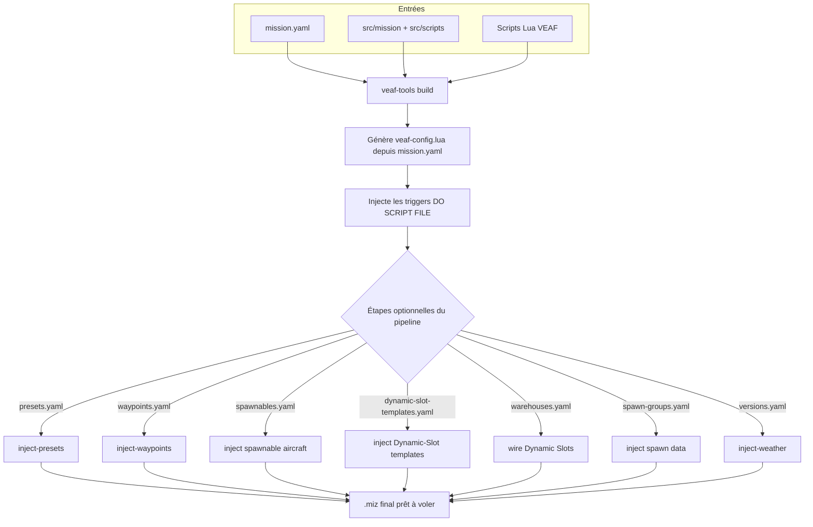

# Guide du créateur de missions — VEAF Mission Creation Tools

Ce guide s'adresse aux concepteurs de missions DCS World qui souhaitent intégrer le framework VEAF dans leurs missions.

---

## Table des matières

1. [Ce que vous obtenez](#ce-que-vous-obtenez)
2. [Prérequis](#prérequis)
3. [Installation et mises à jour](#installation-et-mises-à-jour)
4. [Configuration globale utilisateur](#configuration-globale-utilisateur)
5. [Créer une nouvelle mission](#créer-une-nouvelle-mission)
6. [Comment les scripts sont chargés](#comment-les-scripts-sont-chargés)
7. [Configurer les modules](#configurer-les-modules)
8. [Outils de conception](#outils-de-conception)
9. [Workflow de build typique](#workflow-de-build-typique)
10. [Profils de build](#profils-de-build)
11. [Référence des scripts](#référence-des-scripts)
12. [Exemples de configuration](#exemples-de-configuration)
13. [Intégration CTLD et CSAR](#intégration-ctld-et-csar)
14. [DCS Bridge](#dcs-bridge)
15. [Journalisation de débogage](#journalisation-de-débogage)
16. [Ressources](#ressources)

> **Migration d'une mission existante ?** Consultez le [Guide de migration](MIGRATION_GUIDE.md) — couvre à la fois VEAF MCT v5 → v6 et DCS vanilla → VEAF MCT.

---

## Ce que vous obtenez

Une mission VEAF est un fichier DCS `.miz` standard qui charge le framework Lua VEAF au démarrage. Cela offre aux joueurs et aux contrôleurs :

- **Commandes via marqueurs** — les joueurs tapent des commandes sur la carte F10 (faire apparaître des unités, créer des zones CAS, déplacer des groupes…)
- **Menus radio F10** — menus dynamiques pour chaque fonctionnalité activée
- **Types de missions préconstruits** — CAS, transport, opérations carrier, QRA, vagues aériennes, zones de combat
- **Gestion des actifs** — tankers, AWACS, carriers avec suivi d'état automatique et menus radio
- **Points nommés** — positions cartographiques réutilisables avec services ATC/TACAN optionnels
- **Intégrations** — Skynet IADS, CTLD/CSAR

---

## Prérequis

| Outil | Rôle | Obligatoire |
|-------|------|-------------|
| DCS World | Le simulateur | Oui |
| Éditeur de missions DCS | Créer le `.miz` de base (inclus avec DCS) | Oui |
| Git | Contrôle de version pour votre projet de mission | Recommandé |
| `veaf-tools-updater.exe` | Télécharge et installe la dernière release VEAF MCT | Oui |
| `veaf-tools.exe` | CLI de manipulation de `.miz` au moment du build | Oui (pour le pipeline de build) |
| VS Code ou Notepad++ | Édition des fichiers Lua/YAML de configuration | Recommandé |

> **Coalitions de la mission de base** : chaque coalition (bleue/rouge) a besoin d'au moins une unité au sol, sinon ses tables Lua de coalition sont incomplètes et DCS supprime le camp vide — ce qui obligeait auparavant à placer un groupe terrestre bleu et un rouge à la main. **Le build s'en charge désormais** : si une coalition n'a aucune unité, il injecte un unique groupe terrestre placeholder *caché* (sur le bullseye de la coalition) pour que DCS reconnaisse le camp. Vous pouvez toujours placer vos propres groupes — le placeholder n'est ajouté que si un camp est vide.

---

## Installation et mises à jour

### Première installation

Téléchargez `veaf-tools-updater.exe` depuis la [dernière release GitHub](https://github.com/VEAF/VEAF-Mission-Creation-Tools/releases/tag/published-latest) et placez-le dans le dossier de votre projet de mission.

> **Sécurité Windows :** Windows peut bloquer les fichiers `.exe` téléchargés depuis Internet. Si le fichier ne s'exécute pas, cliquez droit dessus → **Propriétés** → onglet **Général** → cochez **Débloquer** en bas de la fenêtre → **OK**.

Puis exécutez :

```powershell
.\veaf-tools-updater.exe
```

Cela télécharge `published.zip`, vérifie le checksum SHA256 et extrait tous les scripts et outils dans votre dossier de mission.

### Mises à jour

Exécutez la même commande dès qu'une nouvelle release est disponible :

```powershell
.\veaf-tools-updater.exe
```

La mise à jour n'est effectuée que si la version distante est plus récente. Pour forcer une réinstallation :

```powershell
.\veaf-tools-updater.exe --force
```

Pour épingler une version spécifique :

```powershell
.\veaf-tools-updater.exe --tag published-v6.1.0
```

Référence CLI complète : [Référence des outils](../TOOLS_REFERENCE.md)

---

## Configuration globale utilisateur

Créez `~/veafmct.yaml` (soit `C:\Users\VotreNom\veafmct.yaml` sous Windows) pour définir des valeurs par défaut persistantes applicables à **tous** vos projets VEAF sur cette machine :

```yaml
# ~/veafmct.yaml
lang: fr                 # Langue des outils : "en" (défaut) ou "fr"
check_updates: true      # Vérifier les nouvelles versions de veaf-tools au démarrage
scripts_path: D:/dev/_VEAF/VEAF-Mission-Creation-Tools   # Chemin local du dépôt (pour --dev-mode)
```

Toutes les clés sont optionnelles. Pour initialiser le fichier depuis la CLI :

```powershell
veaf-tools.exe user-config --init
```

Ou inspecter/modifier les valeurs de manière interactive :

```powershell
# Afficher la configuration effective et sa source
veaf-tools.exe user-config

# Définir une valeur
veaf-tools.exe user-config --set lang=fr

# Supprimer une valeur (revenir au défaut)
veaf-tools.exe user-config --unset lang
```

**Ordre de détection de la langue** (le premier qui correspond gagne) :
1. Option CLI `--lang`
2. Variable d'environnement `VEAF_LANG`
3. `~/veafmct.yaml` → clé `lang:`
4. Locale du système (registre Windows / locale système sur Linux–macOS)
5. `en` (fallback intégré)

---

## Créer une nouvelle mission

### Recommandé : forker la mission de démonstration

La façon la plus rapide de démarrer est de forker [VEAF-Demo-Mission](https://github.com/VEAF/VEAF-Demo-Mission), qui dispose déjà de la structure de dossiers correcte, de configurations d'exemple et de scripts de build.

```powershell
git clone https://github.com/VEAF/VEAF-Demo-Mission.git my-mission
cd my-mission
.\veaf-tools-updater.exe
```

### Depuis zéro

1. Créez un dossier pour votre projet de mission (c'est votre dépôt Git)
2. Copiez votre fichier `.miz` existant dedans
3. Exécutez `veaf-tools-updater.exe` pour récupérer tous les scripts VEAF
4. Extrayez votre mission : `veaf-tools.exe extract ma-mission.miz`
5. Configurez les modules dans `mission.yaml` et éventuellement `src/scripts/mission-script.lua`

Structure de projet recommandée :

```
MyMission/
├── src/
│   ├── mission/                  # Données DCS extraites (via extract)
│   ├── scripts/
│   │   ├── mission-script.lua    # Votre code Lua personnalisé (optionnel)
│   │   └── veafDynamicConfig.lua # Config de chargement dynamique des scripts (dev/test)
│   ├── options                  # Table d'options DCS injectée dans le .miz
│   ├── presets.yaml             # Préréglages de fréquences radio (étape presets)
│   ├── spawnables.yaml          # Groupes d'avions spawnables (préfixe veafSpawn-, étape spawnable_aircrafts)
│   ├── dynamic-slot-templates.yaml # Modèles de Dynamic Slots (dynSpawnTemplate=true, étape dynamic_slot_templates)
│   ├── warehouses.yaml          # Dynamic Slots par coalition (étape warehouses, optionnel)
│   ├── spawn-groups.yaml        # Extension/override de la base de spawn (étape spawn_data, optionnel)
│   ├── versions.yaml            # Variantes météo/horaires (étape weather)
│   └── waypoints.yaml           # Bullseye / points de navigation (étape waypoints)
├── published/                    # Scripts & outils VEAF (auto-installés)
├── mission.yaml                  # Configuration de build
├── .gitignore                    # Exclut les fichiers générés/téléchargés
├── veaf-tools.exe                # Outil CLI (auto-installé)
└── veaf-tools-updater.exe
```

> Chaque fichier listé sous `src/` (hormis la sortie d'extraction `mission/`)
> provient du gabarit `defaults/mission-folder/` de l'outil et est consommé dès
> le premier build — les `*.yaml` par leur étape de pipeline/module, `options`
> par injection dans le `.miz`, et les `scripts/*.lua` par le chargement de scripts.

---

## Comment les scripts sont chargés

La commande `build` **injecte automatiquement** un trigger `DO SCRIPT FILE` au démarrage de la mission qui charge tous les scripts VEAF. Vous n'avez **pas** besoin d'ajouter manuellement un trigger dans l'éditeur de missions DCS.

Si vous avez un `src/scripts/mission-script.lua` personnalisé, il est aussi injecté automatiquement par le builder.

### Ce que fait le builder

1. Lit `src/mission/` (les données DCS extraites)
2. Supprime tous les triggers VEAF existants
3. Injecte de nouveaux triggers `DO SCRIPT FILE` pour tous les scripts VEAF + vos scripts personnalisés
4. Écrit le `.miz` final

Le build complet exécute ensuite les étapes optionnelles du pipeline dont les fichiers de configuration sont présents (presets, waypoints, groupes d'aéronefs, météo) :



> **Note — templates et slots multijoueur** : les groupes injectés depuis `spawnables.yaml` et `dynamic-slot-templates.yaml` sont des **modèles** réutilisables. Pour éviter qu'ils n'apparaissent comme slots sélectionnables dans le briefing multijoueur, le build les masque automatiquement de la liste des slots (`hiddenOnPlanner`/`hiddenOnMFD`) et les verrouille par un mot de passe. Le spawn dynamique (qui référence le template par son nom) reste pleinement fonctionnel.

---

## Configurer les modules

VEAF MCT a deux niveaux de configuration :

- **`mission.yaml`** (à la racine du projet) — configuration de build : quels modules activer/désactiver, niveaux de log, sécurité, déclarations d'assets
- **`src/scripts/mission-script.lua`** (optionnel) — code Lua personnalisé exécuté au démarrage de la mission : alias, fonctions utilitaires, intégration de scripts tiers (CTLD, CSAR). L'initialisation et la configuration des modules sont générées automatiquement depuis `mission.yaml`.

Pour la plupart des missions, `mission.yaml` suffit. N'utilisez `mission-script.lua` que pour du code Lua personnalisé qui ne peut pas être exprimé en YAML.

### Exemple mission.yaml

```yaml
mission:
  name: "My-Mission"

modules:
  SECURITY: true        # raccourci : activer simplement le module
  SPAWN:
    logLevel: debug     # un module avec configuration utilise un bloc
  ASSETS:
    enabled: true
    assets:
      - sort: 1
        name: "T1-Arco-1"
        description: "Arco-1 (KC-135)"
        information: "Tacan 64Y\nU290.50 (20)"
```

> Le bloc unifié `modules:` remplace les anciennes clés `lua_modules:` + `community_scripts:`, et `enabled:` remplace `enable:`. Les clés héritées fonctionnent toujours mais émettent un avertissement de dépréciation. Voir la [Référence mission.yaml](../MISSION_YAML_REFERENCE.md) pour la syntaxe complète.

### Exemple mission-script.lua

```lua
-- mission-script.lua — code Lua personnalisé au niveau mission
-- L'initialisation des modules est gérée automatiquement par veaf-config.lua (généré depuis mission.yaml).
-- Mettez ici vos alias, fonctions utilitaires et intégrations de scripts tiers.

-- Exemple : alias de raccourci personnalisé
-- veafShortcuts.AddAlias(VeafAlias:new():setName("-cas1"):setVeafCommand("_cas"))

-- Exemple : intégration CTLD (voir la section Intégration CTLD et CSAR pour les détails)
-- if ctld then ctld.initialize(function()
--     -- ctld.hoverPickup = false
-- end) end
```

### Niveaux de sécurité

| Niveau | Constante | Qui peut utiliser |
|--------|-----------|-------------------|
| 0 (public) | `veafSecurity.LEVEL_L0` | Tous les joueurs |
| 1 (pilotes) | `veafSecurity.LEVEL_L1` | Pilotes non-spectateurs |
| 9 (admin) | `veafSecurity.LEVEL_L9` | Admins authentifiés |

Définissez les mots de passe (hachages SHA-256) dans `mission.yaml` :

```yaml
security:
  disabled: false
  password_hashes:
    - "<hachage SHA-256 de votre mot de passe>"
```

---

## Outils de conception

`veaf-tools.exe` manipule les fichiers `.miz` au moment du build — avant de les charger dans DCS.

| Commande | Ce qu'elle fait |
|----------|----------------|
| `prepare` | Initialise/rafraîchit un dossier de mission depuis le scaffold par défaut ; `--template minimal\|standard\|full\|custom` génère un `mission.yaml` avec le jeu de modules correspondant (`custom` = choix interactif) ; `--list-templates` pour les lister |
| `build` | Construit la mission depuis `src/` — injecte les triggers VEAF, produit un `.miz`. Valide au passage les références de `mission.yaml` vers le Mission Editor (zones de déclenchement, groupes, unités, aérodromes) et affiche un **récapitulatif bien visible en fin de build** pour les références absentes — **sans bloquer** (le `.miz` est généré quand même, pour que tu puisses corriger dans le Mission Editor et itérer). Le `zone_name` d'une **opération** COMBATZONE n'est pas vérifié (ce n'est qu'un libellé, pas une trigger zone requise) |
| `validate` | Vérifie le dossier de mission **avant** le build — signale les erreurs de config et les risques runtime sans builder (sortie non nulle en cas d'erreur ; `--strict` échoue aussi sur les avertissements) |
| `extract` | Extrait un `.miz` vers un dossier source (à exécuter une fois pour initialiser votre dépôt) |
| `export` | Exporte un `.miz` en **JSON** (défaut), **YAML** ou **Markdown** (résumé lisible) : `export mission.miz out.json --format json`. L'analyse est **purement Python** (parser `luadata`) et **n'exécute jamais de Lua** — alternative sûre à l'interprétation d'un `.miz` non fiable (risque d'exécution de code). Sans fichier de sortie, écrit sur la sortie standard |
| `inject-presets` | Injecte des plans de fréquences radio pour tous les cockpits humains |
| `inject-weather` | Crée des variantes météo/heure depuis une config YAML |
| `inject-aircraft-groups` | Injecte des templates de groupes d'aéronefs |
| `extract-aircraft-groups` | Extrait les groupes d'aéronefs d'une mission |
| `inject-waypoints` | Injecte des waypoints (bullseye, points de navigation) pour les groupes humains |
| `extract-waypoints` | Extrait les waypoints d'une mission |
| `convert-v5` | Migre un dossier mission v5 vers le format v6 |
| `user-config` | Affiche ou modifie la configuration globale utilisateur (`~/veafmct.yaml`) |

Référence complète : [Référence des outils](../TOOLS_REFERENCE.md)

### Mode interactif (assistant)

Dans un terminal interactif, `veaf-tools.exe` ouvre un assistant guidé (TUI) plutôt que d'échouer sur une option manquante :

- `veaf-tools.exe` (sans argument) → menu de sélection de commande, puis questions.
- `veaf-tools.exe prepare` → l'assistant demande le dossier cible **et** le template de modules.
- `veaf-tools.exe prepare c:\ma-mission` → le dossier est déjà fourni, l'assistant ne demande que le template.
- `--tui` ajouté à n'importe quelle commande → ouvre l'assistant même si rien ne manque (ex. `veaf-tools.exe build --tui`).

Les options déjà passées sur la ligne de commande sont pré-remplies ; les options inconnues (ex. `--verbose`) sont conservées telles quelles. Hors terminal interactif (CI, sortie redirigée), l'assistant ne se déclenche jamais : la commande s'exécute normalement.

**Navigation** : **Ctrl-B** (ou **Échap** deux fois) revient au prompt précédent ; depuis le menu principal (ou le premier prompt d'une commande), il quitte l'assistant. Un rappel s'affiche en bas de chaque prompt.

---

## Workflow de build typique

```powershell
# Construire la mission — le pipeline intégré exécute toutes les étapes activées automatiquement
veaf-tools.exe build
```

La commande `build` lit `mission.yaml` et exécute chaque étape activée du pipeline (presets, waypoints, groupes d'aéronefs, météo) en une seule passe. Configurez les étapes actives sous la clé `pipeline:` dans `mission.yaml`.

<details>
<summary>Avancé : exécuter les étapes du pipeline individuellement</summary>

Si vous devez exécuter une seule étape en isolation (ex : injecter la météo uniquement, sans rebuild complet) :

```powershell
# Injecter les préréglages radio uniquement
veaf-tools.exe inject-presets ma-mission.miz --presets-file src/presets.yaml

# Injecter les waypoints bullseye et de navigation uniquement
veaf-tools.exe inject-waypoints ma-mission.miz --waypoints-file src/waypoints.yaml

# Créer des variantes météo/heure uniquement
veaf-tools.exe inject-weather ma-mission.miz --config-file versions.yaml
```

</details>

Commitez le contenu de `src/` dans Git — pas le `.miz` construit. Utilisez `extract` une fois pour initialiser le dossier source depuis une mission existante :

```powershell
veaf-tools.exe extract ma-mission.miz
```

---

## Profils de build

Les profils de build permettent de basculer entre différentes configurations nommées sans modifier `mission.yaml`. Définissez une section `profiles:` une seule fois, puis sélectionnez un profil au moment du build :

```yaml
# mission.yaml
global_log_level: info
security:
  disabled: false
pipeline:
  weather: true

profiles:
  TEST:
    global_log_level: debug
    security:
      disabled: true
    pipeline:
      weather: false   # pas de variantes météo pendant les builds de test
  SERVER:
    global_log_level: info
    pipeline:
      weather: true
```

```powershell
# Build pour les tests (pas de météo, sécurité désactivée, journalisation détaillée)
veaf-tools.exe build --profile TEST

# Build pour le déploiement serveur
veaf-tools.exe build --profile SERVER

# Build sans profil (config de base)
veaf-tools.exe build
```

Les clés du profil **fusionnent en profondeur** sur la config de base : seules les clés que vous spécifiez sont surchargées, tout le reste reste tel que défini en haut de `mission.yaml`. Passer un nom de profil inconnu émet un avertissement et revient à la config de base.

Voir [`profiles:` dans la référence YAML](../MISSION_YAML_REFERENCE.md#profiles) pour la description complète.

---

## Référence des scripts

Tous les modules Lua VEAF sont disponibles une fois `veaf-scripts.lua` chargé. Voir [scripts/README.md](scripts/README.md) pour la liste complète avec les guides de configuration.

**Navigation rapide par catégorie :**

| Catégorie | Modules |
|-----------|---------|
| Cœur | [veafSpawn](scripts/veafSpawn.md), [veafMove](scripts/veafMove.md), [veafSecurity](scripts/veafSecurity.md), [veafNamedPoints](scripts/veafNamedPoints.md) |
| Types de missions | [veafCasMission](scripts/veafCasMission.md), [veafCombatZone](scripts/veafCombatZone.md), [veafTransportMission](scripts/veafTransportMission.md), [veafQraManager](scripts/veafQraManager.md), [veafAirWaves](scripts/veafAirWaves.md) |
| Actifs | [veafAssets](scripts/veafAssets.md), [veafCarrierOperations](scripts/veafCarrierOperations.md), [veafGrass](scripts/veafGrass.md), [veafWeather](scripts/veafWeather.md) |
| Protection | [veafSanctuary](scripts/veafSanctuary.md), [veafMissileGuardian](scripts/veafMissileGuardian.md) |
| Intégrations | [veafSkynetIadsHelper](scripts/veafSkynetIadsHelper.md) |

---

## Exemples de configuration

### Zone QRA

```lua
local northQra = VeafQRA:new()
  :setName("QRA-North")
  :setTriggerZone("ZONE-QRA-NORTH")
  :setCoalition(coalition.side.RED)
  :addGroup("MiG-29 QRA")
  :start()
```

### Zone de combat

```lua
local strikeZone = VeafCombatZone:new()
  :setMissionEditorZoneName("ZONE-STRIKE-ALPHA")
  :setFriendlyName("Strike Alpha")
  :setBriefing("Colonne blindée avançant sur Senaki. Détruisez tous les véhicules blindés ; attendez-vous à de la DCA.")
  :addZoneElement(VeafCombatZoneElement:new():setName("ARMOR"):setSpawnGroup("STRIKE-ALPHA-ARMOR"))
  :addZoneElement(VeafCombatZoneElement:new():setName("AAA"):setSpawnGroup("STRIKE-ALPHA-AAA"))
  :initialize()
```

### Zone Air Waves

```lua
local defenseZone = AirWaveZone:new()
  :setName("AW-Defense")
  :setTriggerZone("ZONE-DEFENSE")
  :setDescription("Zone d'interception")
  :addPlayerCoalition(coalition.side.BLUE)
  :addWave({ "MiG-23 Wave 1", "MiG-23 Wave 1b" })
  :addWave({ "MiG-29 Wave 2" })
  :start()
```

---

## Intégration CTLD et CSAR

[CTLD](https://github.com/ciribob/DCS-CTLD) (Combat Troop Loading and Deployment) et [CSAR](https://github.com/ciribob/DCS-CSAR) (Combat Search and Rescue) sont des scripts tiers que VEAF supporte nativement. VEAF monkey-patche leurs fonctions `initialize()` au démarrage, donc vous n'avez pas besoin de les charger ou de les initialiser séparément — configurez-les directement dans `mission.yaml` avec l'approche YAML-first ci-dessous.

### Configurer CTLD via mission.yaml (YAML-first)

Vous pouvez activer CTLD et définir ses propriétés directement dans `mission.yaml`, sans Lua :

```yaml
modules:
  CTLD:
    enabled: true
    settings:                # paires ctld.xxx = valeur
      hoverPickup: false
      slingLoad: true
```

VEAF génère la configuration Lua correspondante dans `veaf-config.lua` au moment du build, y compris l'appel `ctld.initialize()`. Utilisez `mission-script.lua` uniquement pour les paramètres pas encore supportés par le schéma YAML (ex. tables `aircraftType`).

### Configurer CSAR via mission.yaml (YAML-first)

CSAR se configure de la même façon :

```yaml
modules:
  CSAR:
    enabled: true
    settings:                # paires csar.xxx = valeur
      enableAllslots: true
      useprefix: true
      csarPrefix: "MEDEVAC"
```

VEAF génère les assignations `csar.xxx = value` et l'appel `csar.initialize()` dans `veaf-config.lua`. Pour les paramètres complexes comme `aircraftType` (une table par appareil), continuez à utiliser le pattern callback Lua dans `mission-script.lua`.

### Ordre de chargement dans la chaîne de triggers DCS

Les scripts CTLD/CSAR doivent être chargés avant les scripts VEAF :

```
DO SCRIPT FILE → ctld.lua           (tiers)
DO SCRIPT FILE → csar.lua           (tiers)
DO SCRIPT FILE → veaf-scripts.lua   (modules VEAF)
DO SCRIPT FILE → veaf-config.lua    (généré depuis mission.yaml)
DO SCRIPT FILE → mission-script.lua (votre code personnalisé)
```

Quand `veaf-scripts.lua` se charge, il détecte la présence des tables globales `ctld` et `csar` et enveloppe leurs fonctions `initialize()`, appliquant les valeurs par défaut VEAF avant d'appeler le vrai initialiseur.

### Fallback Lua — CTLD dans mission-script.lua

Pour les paramètres non couverts par `mission.yaml`, utilisez le pattern callback Lua :

```lua
if ctld then
    local initializeCTLD = true
    if initializeCTLD then
        veaf.loggers.get(veaf.Id):info("initialize CTLD")
        local function configurationCallback()
            -- Configurer les paramètres CTLD avant son initialisation
            -- ctld.hoverPickup = false
            -- ctld.slingLoad   = true
        end
        -- Appelle la version enveloppée par VEAF de ctld.initialize
        ctld.initialize(configurationCallback)
    else
        -- Empêcher l'auto-scheduled ctld.initialize de tourner
        ctld.alreadyInitialized = true
    end
end
```

Le `configurationCallback` est appelé immédiatement avant le vrai `ctld.initialize()` — définissez les propriétés CTLD là, pas avant.

### Fallback Lua — CSAR dans mission-script.lua

Pour les surcharges par type d'appareil ou d'autres paramètres complexes non supportés par YAML :

```lua
if csar then
    local initializeCSAR = true
    if initializeCSAR then
        veaf.loggers.get(veaf.Id):info("initialize CSAR")
        local function configurationCallback()
            -- Configurer les paramètres CSAR avant son initialisation
            csar.enableAllslots = true
            csar.aircraftType["UH-1H"]  = 8
            csar.aircraftType["Mi-8MT"] = 16
            csar.useprefix  = true
            csar.csarPrefix = { "MEDEVAC" }
        end
        csar.initialize(configurationCallback)
    else
        csar.alreadyInitialized = true
    end
end
```

### Valeurs par défaut automatiques VEAF

Quand VEAF enveloppe les initialiseurs, il applique ses propres valeurs par défaut : journalisation et une entrée de menu radio standard. Vous n'avez pas besoin de configurer cela manuellement.

---

## DCS Bridge

[VEAF-dcs-bridge](https://github.com/VEAF/VEAF-dcs-bridge) est un module Lua optionnel qui ouvre un socket TCP entre DCS World et un serveur externe, permettant de piloter la mission depuis l'extérieur (bots Discord, dashboards, outils d'automatisation).

### Activer l'injection de dcs-bridge.lua

Ajoutez la section suivante dans votre `mission.yaml` :

```yaml
dcs_bridge:
  enabled: true
```

Lors du build, `veaf-tools` télécharge automatiquement `dcs-bridge.lua` depuis GitHub et l'injecte comme premier trigger DO SCRIPT FILE de la mission (avant les scripts VEAF).

### Utiliser un fichier local

Si vous avez un clone local de `VEAF-dcs-bridge`, pointez directement vers le fichier :

```yaml
dcs_bridge:
  enabled: true
  lua_path: /chemin/vers/VEAF-dcs-bridge/src/lua/dcs-bridge.lua
```

Le chemin peut être absolu ou relatif au dossier de la mission.

### Ordre de chargement

Lorsque `dcs_bridge` est activé, le trigger est inséré en **position 1**, avant tous les autres triggers VEAF. dcs-bridge est donc disponible dès le démarrage de la mission, avant le chargement de `veaf-scripts.lua`.

---

## Journalisation de débogage

Tous les scripts VEAF écrivent dans le journal DCS (`Saved Games\DCS\Logs\dcs.log`). Le build produit désormais un **unique** chargeur `veaf-scripts.lua` ; la verbosité se contrôle via les niveaux de log dans `mission.yaml`, et non en chargeant un script différent.

### Changer le niveau de log

Définissez un défaut global avec `global_log_level`, ou surchargez-le par module avec `logLevel`, puis reconstruisez :

```yaml
global_log_level: info   # trace | debug | info | warning | error

modules:
  SPAWN:
    logLevel: debug   # surcharge le défaut global pour ce module uniquement
```

`veaf-tools.exe build` régénère `veaf-config.lua` depuis `mission.yaml`. Pour un changement rapide sans reconstruire, éditez directement `veaf-config.lua` — c'est un fichier généré, donc vos modifications seront écrasées au prochain build.

### Lire le journal

Nous recommandons [Klogg](https://klogg.filimonov.dev/) — un visualiseur de logs rapide avec surligneur regex. Chargez `dcs.log` et filtrez sur `VEAF` pour ne voir que les messages VEAF.

Un profil de surligneur Klogg prêt à l'emploi est inclus dans le dépôt : [`tools/klogg/veaf.conf`](../../tools/klogg/veaf.conf). Il code les niveaux de log par couleur (erreurs en rouge, avertissements en orange, info VEAF en vert, debug en bleu-vert, trace en gris) et met en évidence les entrées MIST et CTLD. Pour l'installer : Klogg → *Fichier > Importer les surligneurs…* et sélectionnez le fichier.

---

## Ressources

- [Référence des scripts](scripts/README.md) — tous les scripts avec les détails de configuration
- [Référence des outils](../TOOLS_REFERENCE.md) — référence CLI complète de `veaf-tools.exe`
- [Référence API Lua](../LUA_API_REFERENCE.md) — documentation complète de l'API Lua
- [VEAF Demo Mission](https://github.com/VEAF/VEAF-Demo-Mission) — mission d'exemple fonctionnelle
- [Discord VEAF](https://www.veaf.org/discord) — aide communautaire
