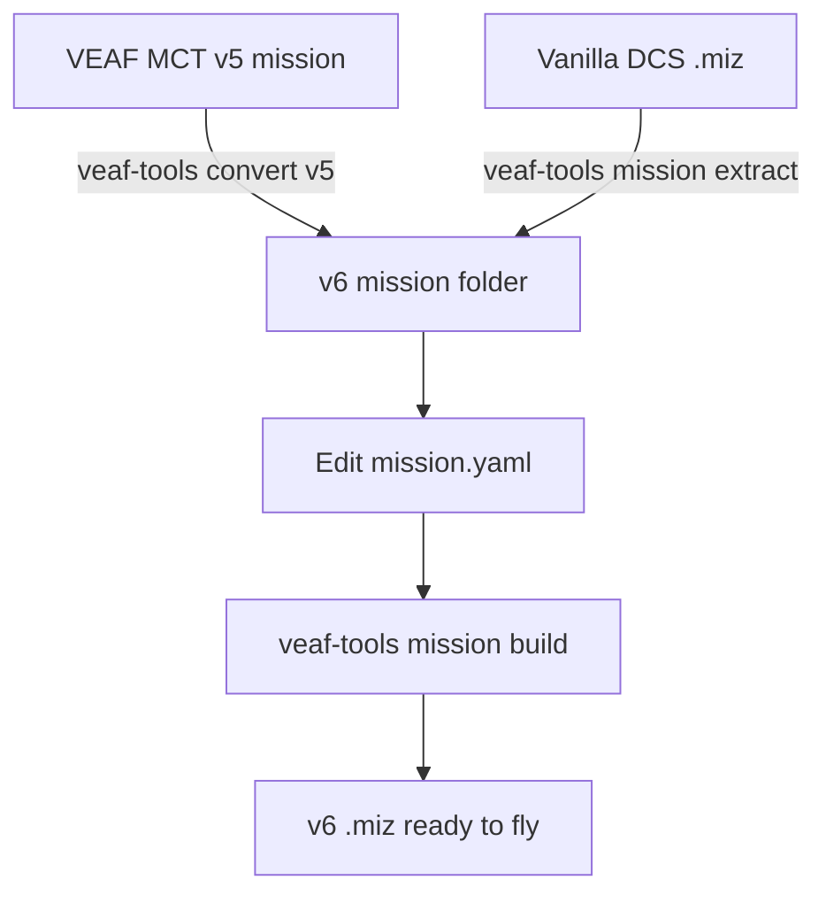

# Migrating a Mission to VEAF MCT v6


This guide covers two scenarios:

1. **[From VEAF MCT v5.xx](#migrating-from-veaf-mct-v5xx)** — your mission already uses VEAF MCT scripts but predates the v6 toolchain
2. **[From a vanilla DCS mission](#integrating-veaf-mct-into-a-vanilla-dcs-mission)** — your mission has no VEAF MCT scripts at all

In both cases the end result is a **VEAF MCT v6 mission folder** that you manage with `veaf-tools.exe`.



---

## Before You Start

### Terminology

| Term | Meaning |
|------|---------|
| **Mission folder** | The directory managed by `veaf-tools` — contains source files, config, and the `.miz` |
| **`.miz` file** | The DCS mission file (a ZIP archive); the output of the build step |
| **`published/`** | Where `veaf-tools-updater.exe` installs the VEAF scripts |
| **`src/`** | Your mission-specific source files (scripts, data) |

### Prerequisites

1. Install `veaf-tools-updater.exe` — download from the [latest GitHub release](https://github.com/VEAF/VEAF-Mission-Creation-Tools/releases/tag/published-latest)

   > **Windows security:** Windows may block `.exe` files downloaded from the internet. If the file doesn't run, right-click it → **Properties** → **General** tab → check **Unblock** at the bottom → **OK**.

2. Run the updater once to install `veaf-tools.exe` and all VEAF scripts:

```powershell
.\veaf-tools-updater.exe
```

3. Have your v5 mission folder on hand

> **Tip — Global User Configuration:** Before starting, create `~/veafmct.yaml` (i.e. `C:\Users\YourName\veafmct.yaml` on Windows) to set persistent defaults for all your VEAF projects on this machine — for example your language preference (`lang: fr`). See [Global User Configuration](GUIDE.en.md#global-user-configuration) for the full reference and CLI commands.

---

## Migrating from VEAF MCT v5.xx

### What Changed in v6

| Area | v5 | v6 |
|------|----|----|
| **DCS trigger** | Manual `DO SCRIPT FILE` triggers pointing at each `.lua` file | Single trigger injected automatically by `veaf-tools mission build`; no manual trigger work |
| **Build toolchain** | No build step — scripts loaded directly from disk at mission start | `veaf-tools.exe mission build` assembles the `.miz` from `src/mission/` + `src/scripts/` |
| **Build script** | Complex `build.cmd` with one line per inject command | No `build.cmd` — just run `veaf-tools-updater.exe` then `veaf-tools.exe mission build` |
| **Auto-inject pipeline** | Each inject command (`inject-presets`, `inject-waypoints`, etc.) had to be added manually to `build.cmd` | `veaf-tools mission build` auto-detects and runs each step when the matching file is present in `src/` |
| **Tool updates** | NPM (`npm install`) — scripts distributed as a versioned package | `veaf-tools-updater.exe` — downloads and verifies the latest release in one command |
| **Build-time config** | No build-time config file | `mission.yaml` — controls log levels, module enable/disable, pipeline step overrides |
| **Module enable/disable** | Edit `missionConfig.lua` (or simply omit the `initialize()` call) | `mission.yaml` → `modules:` block; generates `veaf-config.lua` automatically |
| **Module configuration** | Direct assignment: `veafSpawn.SpawnKeyphrase = "_spawn"` in `missionConfig.lua` | Same direct assignment still works in `mission-script.lua`; or `veaf.setConfig("MODULE_ID", "key", value)` for config-driven overrides |
| **Module init pattern** | Bare `veafXxx.initialize()` calls | Auto-generated into `veaf-config.lua` by `veaf-tools mission build`; no manual `initialize()` calls needed |
| **Config location** | Initialization scattered in DCS trigger scripts or a separate Lua file | `mission.yaml` generates `veaf-config.lua` at build time; optional custom Lua in `mission-script.lua` |
| **Config migration** | Manual rewrite | `veaf-tools.exe convert v5` — one command converts `missionConfig.lua`, pipeline files (presets, waypoints, weather, aircraft groups), and generates `mission.yaml` + `mission-script.lua`. Use `migrate-config` only to migrate `missionConfig.lua` alone. |
| **Module log levels** | Set per-module by assigning `veafXxx.LogLevel` before init | `mission.yaml` → `modules: → MODULE_ID: logLevel:` or `--log-modules` CLI flag |
| **Skynet / CTLD / CSAR / QRA** | Separate `external_modules:` and `qra:` sections | All under the `modules:` block (`modules.SKYNET`, `modules.CSAR` with a `settings:` sub-block, `modules.QRA` with `silence_all` + `definitions:`). **`modules.CTLD` is a plain boolean**: CTLD 2 is configured in a `ctld-config.yaml` next to `mission.yaml`, and a `settings:` block there is rejected by `validate`. The `external_modules:` and `qra:` sections no longer exist — see [ADR 0001](https://github.com/VEAF/VEAF-Mission-Creation-Tools/blob/develop/docs/adr/0001-modules-single-source-of-truth.md). `convert-v5` emits the new shape directly. |

### Step-by-step Migration

#### 1. Create a new mission folder and copy your v5 source files

Create a new empty folder for your v6 mission project, then copy the `src/` folder from your v5 mission into it. Starting fresh prevents old v5 artefacts from interfering and gives you a single clean copy of your source files:

```powershell
# Adapt these paths to your setup
New-Item -ItemType Directory "C:\path\to\my-new-v6-mission"
Copy-Item -Recurse "C:\path\to\your-v5-mission\src" "C:\path\to\my-new-v6-mission\"
Set-Location "C:\path\to\my-new-v6-mission"
```

> **Tip:** You can also do this in Windows Explorer — create a new folder, copy the `src/` folder from your v5 mission into it, then open a terminal there.

#### 2. Install VEAF MCT v6

Copy `veaf-tools-updater.exe` into the folder and run:

```powershell
.\veaf-tools-updater.exe
```

This creates the `published/` directory with all scripts and tools. Your existing `src/` files are not touched.

#### 3. Convert the mission folder to v6

Run the all-in-one converter:

```powershell
.\veaf-tools.exe convert v5 .
```

This single command handles everything in one pass:

- **`missionConfig.lua` migration** — comments out `doFile()` calls that load VEAF scripts (the builder injects them automatically), wraps bare `veafXxx.initialize()` calls in `if veafXxx then … end` guards.
- **Pipeline config conversion** — converts v5 config files (radio presets, waypoints, weather, aircraft groups) from Lua to v6 YAML format.
- **`mission.yaml` generation** — creates `mission.yaml` with the correct `modules:` and `pipeline:` sections.
- **`src/mission/` promotion to v6** — rewrites the exploded `.miz` (`src/mission/`) to v6: a base build migrates the legacy v5 triggers **on disk**, after backing up the original to `backup_v5/src/mission/`. On by default; all editor content (groups, routes, units) is preserved — only the legacy v5 trigger layer is purged. Use `--no-promote` to skip it.
- **Leftover v5 file triage** — obsolete v5 tooling (`*.cmd`, `*.ps1`, `package.json`, `yarn.lock`, `configuration.json`, …) is moved to `backup_v5/`; regenerable artifacts (`node_modules/`, `build/`, `cache/`) are deleted; any other unmanaged file is just **listed** in the report for you to decide. `configuration.json` is flagged because it may hold a v5 API key (unused in v6: real weather goes through `avwx-engine`, no key).
- **Conversion report** — saves `convert-v5-report.md` with all actions taken and any items requiring manual review.

If your pipeline contains `realweather` weather versions, supply the ICAO airport code via the `--icao` option to embed it in the generated config. If you omit it, the conversion still succeeds: the tool writes `airport_icao: TODO` into the generated config (`versions.yaml`) and prints a warning. Set it afterwards either by editing the `TODO` in `versions.yaml`, or by re-running `convert-v5 --icao UGGG --force`:

```powershell
.\veaf-tools.exe convert v5 . --icao UGGG
```

Old DCS `DO SCRIPT FILE` triggers are removed automatically by `veaf-tools mission build` in the next step — no manual action needed.

> **`src/mission/` promotion to v6 (on by default)**: `convert-v5` finishes by rewriting `src/mission/` to v6 (base build + extract), making the v6 switch definitive and avoiding a re-migration of the v5 triggers on every build. The original is backed up to `backup_v5/src/mission/`. If you'd rather review the generated configs and build yourself first, disable the step with `--no-promote`; you can re-run `convert-v5` later to promote.

> **If you only need to migrate `missionConfig.lua`** without converting pipeline files, use `veaf-tools.exe convert migrate-config src\scripts\missionConfig.lua` directly.

#### 4. Check removed v5 patterns

Some v5 constructs no longer exist or have been renamed:

| v5 | v6 |
|----|-----|
| `veaf.SecurityDisabled = true` | `veafSecurity.SecurityDisabled = true` |
| `veafSpawn.Keyphrase` set at top-level | Still `veafSpawn.Keyphrase` — unchanged |
| `veafAssets.Assets` inline table | Same table format — unchanged |
| Loading individual `.lua` files via `DO SCRIPT FILE` | Automatic — do not add these triggers manually |
| `IADS` scripts loaded manually | Load them via `src/scripts/` — they are picked up automatically |

#### 5. Verify with a test build

```powershell
.\veaf-tools.exe mission build
```

Open the resulting `.miz` in DCS, load the mission, and confirm:
- No duplicate `DO SCRIPT FILE` triggers in the trigger editor
- The v6 VEAF MCT loader trigger is present (named something like `VEAF scripts loader`)
- Radio menus and marker commands work as expected

#### 6. Set up version control

```powershell
git init
git add src/ .gitignore
git commit -m "feat: migrate my-mission to VEAF MCT v6"
```

Add `published/` and `*.miz` to `.gitignore` — they are build artifacts.

---

## Integrating VEAF MCT into a Vanilla DCS Mission

A **vanilla** mission has no VEAF MCT scripts, no special triggers, and was built entirely with the DCS Mission Editor.

### Step-by-step Integration

#### 1. Create the mission folder

```powershell
mkdir my-mission
cd my-mission
```

#### 2. Install VEAF MCT v6

```powershell
.\veaf-tools-updater.exe
```

#### 3. Extract the vanilla .miz, then build

Extract your vanilla `.miz` into the source folder, then run the build, which injects the VEAF scripts and rebuilds a new `.miz`:

```powershell
.\veaf-tools.exe mission extract "C:\path\to\vanilla.miz" .
.\veaf-tools.exe mission build
```

This:
1. Extracts `vanilla.miz` into `src/mission/`
2. Creates default `mission.yaml` and `src/scripts/mission-script.lua`
3. Injects the v6 VEAF loader trigger
4. Rebuilds a new `.miz` next to the folder

#### 4. Optionally: prepare the folder with defaults only

If you want to set up the folder structure without converting a mission yet, use `prepare`:

```powershell
.\veaf-tools.exe mission prepare .
```

Then copy your `.miz` as `mission.miz` and run:

```powershell
.\veaf-tools.exe mission extract mission.miz .
.\veaf-tools.exe mission build mission .
```

#### 5. Configure which modules to enable

Edit `mission.yaml` to enable the modules you want. A set of common modules is active by default — radio, spawn, shortcuts, CAS, transport, weather… — adjust to taste:

```yaml
mission:
  name: My Vanilla Mission

modules:
  RADIO:
    enabled: true
  SPAWN:
    enabled: true
  # Uncomment to enable CAS missions:
  # CASMISSION:
  #   enabled: true
  # Uncomment to enable carrier ops:
  # CARRIER:
  #   enabled: true
```

For custom Lua (advanced module calls, custom aliases, etc.), edit `src/scripts/mission-script.lua`.

See the [YAML reference](../MISSION_YAML_REFERENCE.en.md) and the individual script guides in [scripts/](scripts/README.en.md) for all options.

#### 6. Keep your existing mission content

Everything you built in the DCS Mission Editor (units, triggers, waypoints, zones) is preserved. VEAF does not remove or overwrite mission content — it only:
- Adds a single loader trigger at mission start
- Adds F10 radio menu entries at runtime
- Responds to F10 map marker commands

Your custom triggers, statics, and groups are untouched.

#### 7. Test and iterate

```powershell
# Rebuild after every config change
.\veaf-tools.exe mission build mission .
```

Each build produces a dated `.miz` file (e.g. `mission_20260516.miz`). Open it in DCS and test.

---

## Mission Folder Reference

After migration, your folder should look like this:

```
my-mission/
├── src/
│   ├── mission/                ← extracted DCS mission data (commit this)
│   │   ├── mission             ← main mission Lua dictionary
│   │   ├── options
│   │   └── warehouses
│   ├── scripts/
│   │   ├── mission-script.lua  ← custom Lua code (commit this)
│   │   └── veafDynamicConfig.lua   ← optional dynamic slots config
│   ├── presets.yaml            ← radio presets config (optional)
│   ├── spawnables.yaml         ← custom spawnable groups (optional)
│   └── waypoints.yaml          ← custom waypoints (optional)
├── mission.yaml                ← module config and pipeline settings (commit this)
├── published/                  ← installed by veaf-tools-updater (do NOT commit)
│   ├── veaf-scripts.lua
│   └── ...
├── veaf-tools.exe              ← installed by veaf-tools-updater (do NOT commit)
├── veaf-tools-updater.exe      ← commit this
└── mission_20260516.miz        ← build output (do NOT commit)
```

### Recommended .gitignore

```gitignore
published/
*.miz
*.log
__pycache__/
```

---

## mission-script.lua Reference

`mission-script.lua` is an optional file for custom Lua code that runs after all VEAF modules are initialized. Use it for advanced configuration that cannot yet be expressed in `mission.yaml` — custom shortcuts, per-module parameter overrides, custom assets, etc.

A minimal example:

```lua
-- Optional: override a module parameter
veafSpawn.SpawnKeyphrase = "_spawn"

-- Custom alias
veafShortcuts.AddAlias(
  VeafAlias:new()
    :setName("-myalias")
    :setVeafCommand("_spawn group, name my-template")
)
```

Module enable/disable is configured in `mission.yaml` → `modules:` — not in this file. See the [YAML reference](../MISSION_YAML_REFERENCE.en.md) for the full `mission.yaml` syntax.

---

## Common Issues

### "cannot load the presets file" after a conversion

A `src/presets.yaml` already present before the conversion could be written against the **v5
schema**: same name, same file format, but a different inner layout (`presets_definition:` instead
of `presets_collection:`, one extra `coalitions:` level, radios defined inline inside each preset).
`convert-v5` left it alone — it was in the right place — and the build then failed on the next step.

`convert-v5` now detects that case **by the file's structure** and rewrites it in place, keeping the
original as `backup_v5/src/presets.yaml`. The conversion report says so, with a warning for anything
it could not settle on its own (a radio whose channels straddle two bands, for instance).

If you edit that file by hand, note that the loader now refuses a section it does not recognise
instead of ignoring it in silence, and names the offending key, what it found there and what it
expected.

### "VEAF scripts loader" trigger appears twice

You have both an old manual `DO SCRIPT FILE` trigger and the v6 auto-injected one. Remove the manual trigger from the DCS Mission Editor (open the `.miz`, edit triggers, delete the old one, save), then re-extract and rebuild.

Alternatively, use `--migrate-from-v5` on the build to have the old triggers removed automatically (this is the default).

### Radio menus don't appear

Confirm `RADIO` is enabled in `mission.yaml`:

```yaml
modules:
  RADIO:
    enabled: true
```

Rebuild with `veaf-tools.exe mission build` after any `mission.yaml` change.

### Marker commands don't work

Confirm `SPAWN` is enabled in `mission.yaml`:

```yaml
modules:
  SPAWN:
    enabled: true
```

Then check the DCS log (`Saved Games\DCS\Logs\dcs.log`) for VEAF errors — filter on `VEAF` or `ERROR`.

### Reading the logs

All VEAF messages go to `Saved Games\DCS\Logs\dcs.log`. To find them quickly:

- **[Klogg](https://klogg.filimonov.dev/)** (recommended): open `dcs.log`, use the search bar to filter on `VEAF`. A VEAF highlight profile ships with the repository at `tools/klogg/veaf.conf` — load it via File → Highlighters.
- **Notepad++**: open `dcs.log` → Search → Find (`Ctrl+F`) → search for `VEAF`.

### Build fails with "VEAF scripts file not found"

Run `veaf-tools-updater.exe` first — the `published/` folder is missing or outdated.

---

## See Also

- [Mission Maker Guide](README.en.md) — general mission making workflow
- [Scripts Reference](scripts/README.en.md) — all available modules
- [Tools Reference](../TOOLS_REFERENCE.en.md) — full `veaf-tools.exe` CLI reference
