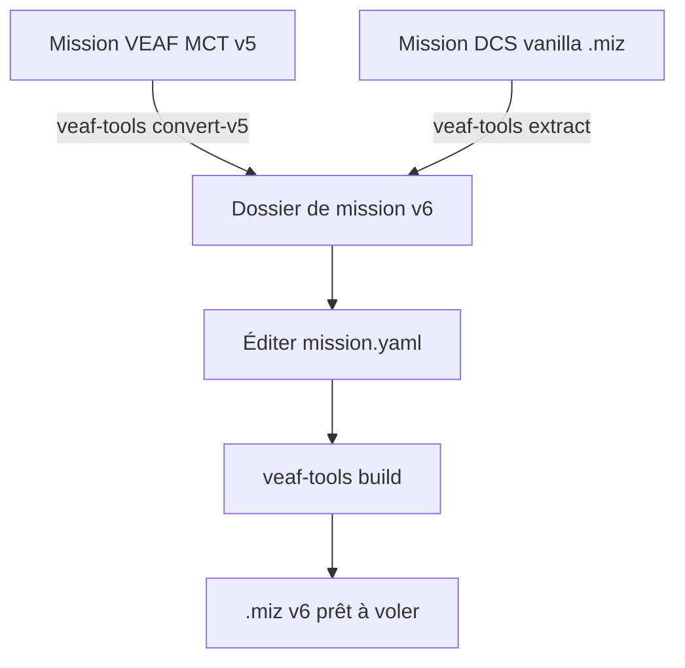

# Migration d'une mission vers VEAF MCT v6

Ce guide couvre deux scénarios :

1. **[Depuis VEAF MCT v5.xx](#migration-depuis-veaf-mct-v5xx)** — votre mission utilise déjà les scripts VEAF MCT mais est antérieure à la chaîne d'outils v6
2. **[Depuis une mission DCS vanilla](#intégration-de-veaf-mct-dans-une-mission-dcs-vanilla)** — votre mission n'a aucun script VEAF MCT

Dans les deux cas, le résultat final est un **dossier de mission VEAF MCT v6** que vous gérez avec `veaf-tools.exe`.



---

## Avant de commencer

### Terminologie

| Terme | Signification |
|-------|--------------|
| **Dossier de mission** | Le répertoire géré par `veaf-tools` — contient les fichiers source, la config et le `.miz` |
| **Fichier `.miz`** | Le fichier de mission DCS (une archive ZIP) ; le résultat du build |
| **`published/`** | Dossier où `veaf-tools-updater.exe` installe les scripts VEAF |
| **`src/`** | Vos fichiers source spécifiques à la mission (scripts, données) |

### Prérequis

1. Installez `veaf-tools-updater.exe` — téléchargez depuis la [dernière release GitHub](https://github.com/VEAF/VEAF-Mission-Creation-Tools/releases/tag/published-latest)

   > **Sécurité Windows :** Windows peut bloquer les fichiers `.exe` téléchargés depuis Internet. Si le fichier ne s'exécute pas, cliquez droit dessus → **Propriétés** → onglet **Général** → cochez **Débloquer** en bas de la fenêtre → **OK**.

2. Exécutez l'updater une fois pour installer `veaf-tools.exe` et tous les scripts VEAF :

```powershell
.\veaf-tools-updater.exe
```

3. Ayez votre dossier de mission v5 sous la main

> **Conseil — configuration globale utilisateur :** Avant de commencer, créez `~/veafmct.yaml` (soit `C:\Users\VotreNom\veafmct.yaml` sous Windows) pour définir des préférences persistantes sur cette machine — notamment la langue (`lang: fr`) afin que tous les outils s'affichent en français. Voir [Configuration globale utilisateur](GUIDE.md#configuration-globale-utilisateur) pour le détail et les commandes disponibles.

---

## Migration depuis VEAF MCT v5.xx

### Ce qui a changé en v6

| Domaine | v5 | v6 |
|---------|----|----|
| **Trigger DCS** | Triggers `DO SCRIPT FILE` manuels pointant vers chaque fichier `.lua` | Trigger unique injecté automatiquement par `veaf-tools build` ; aucun travail de trigger manuel |
| **Chaîne de build** | Pas d'étape de build — scripts chargés directement depuis le disque au démarrage de la mission | `veaf-tools.exe build` assemble le `.miz` depuis `src/mission/` + `src/scripts/` |
| **Script de build** | `build.cmd` complexe avec une ligne par commande d'injection | Pas de `build.cmd` — lancez simplement `veaf-tools-updater.exe` puis `veaf-tools.exe build` |
| **Pipeline d'auto-injection** | Chaque commande d'injection devait être ajoutée manuellement à `build.cmd` | `veaf-tools build` auto-détecte et exécute chaque étape quand le fichier correspondant est présent dans `src/` |
| **Mises à jour des outils** | NPM (`npm install`) — scripts distribués sous forme de package versionné | `veaf-tools-updater.exe` — télécharge et vérifie la dernière release en une commande |
| **Config au moment du build** | Pas de fichier de config au moment du build | `mission.yaml` — contrôle les niveaux de log, l'activation/désactivation des modules, les surcharges d'étapes du pipeline |
| **Activation/désactivation de modules** | Éditer `missionConfig.lua` (ou simplement omettre l'appel à `initialize()`) | Bloc `modules:` dans `mission.yaml` ; génère `veaf-config.lua` automatiquement |
| **Configuration de modules** | Affectation directe : `veafSpawn.SpawnKeyphrase = "_spawn"` dans `missionConfig.lua` | La même affectation directe fonctionne toujours dans `mission-script.lua` ; ou `veaf.setConfig("MODULE_ID", "key", value)` pour les surcharges pilotées par config |
| **Pattern d'init des modules** | Appels nus `veafXxx.initialize()` | Auto-généré dans `veaf-config.lua` par `veaf-tools build` ; aucun appel `initialize()` manuel nécessaire |
| **Emplacement de la config** | Initialisation dispersée dans des scripts de trigger DCS ou un fichier Lua séparé | `mission.yaml` génère `veaf-config.lua` au moment du build ; code Lua personnalisé optionnel dans `mission-script.lua` |
| **Migration de la config** | Réécriture manuelle | `veaf-tools.exe convert-v5` — une seule commande migre `missionConfig.lua`, convertit les fichiers pipeline (préréglages, waypoints, météo, groupes d'aéronefs) et génère `mission.yaml` + `mission-script.lua`. Utilisez `migrate-config` uniquement pour migrer `missionConfig.lua` seul. |
| **Niveaux de log des modules** | Définis par module en assignant `veafXxx.LogLevel` avant l'init | Section `modules: → MODULE_ID: logLevel:` dans `mission.yaml` ou option CLI `--log-modules` |
| **Skynet / CTLD / CSAR / QRA** | Sections séparées `external_modules:` et `qra:` | Tout sous le bloc `modules:` (`modules.SKYNET`, `modules.CTLD` / `modules.CSAR` avec un sous-bloc `settings:`, `modules.QRA` avec `silence_all` + `definitions:`). Les sections `external_modules:` et `qra:` n'existent plus — voir [ADR 0001](https://github.com/VEAF/VEAF-Mission-Creation-Tools/blob/develop/docs/adr/0001-modules-single-source-of-truth.md). `convert-v5` émet directement la nouvelle forme. |

### Migration étape par étape

#### 1. Créer un nouveau dossier de mission et copier les fichiers source v5

Créez un nouveau dossier vide pour votre projet de mission v6, puis copiez le dossier `src/` de votre mission v5 dedans. Partir d'un dossier neuf évite les interférences avec les anciens fichiers v5 et conserve une seule copie propre de vos sources :

```powershell
# Adaptez ces chemins à votre configuration
New-Item -ItemType Directory "C:\chemin\vers\ma-nouvelle-mission-v6"
Copy-Item -Recurse "C:\chemin\vers\mission-v5\src" "C:\chemin\vers\ma-nouvelle-mission-v6\\"
Set-Location "C:\chemin\vers\ma-nouvelle-mission-v6"
```

> **Conseil :** Vous pouvez aussi le faire dans l'Explorateur Windows — créez un nouveau dossier, copiez-y le dossier `src/` de votre mission v5, puis ouvrez un terminal dans ce nouveau dossier.

#### 2. Installer VEAF MCT v6

Copiez `veaf-tools-updater.exe` dans le dossier et exécutez :

```powershell
.\veaf-tools-updater.exe
```

Cela crée le répertoire `published/` avec tous les scripts et outils. Vos fichiers `src/` existants ne sont pas touchés.

#### 3. Convertir le dossier de mission en v6

Exécutez le convertisseur tout-en-un :

```powershell
.\veaf-tools.exe convert-v5 .
```

Cette commande unique gère tout en une seule passe :

- **Migration de `missionConfig.lua`** — commente les appels `doFile()` qui chargent les scripts VEAF (le builder les injecte automatiquement), enveloppe les appels nus `veafXxx.initialize()` dans des gardes `if veafXxx then … end`.
- **Conversion des configs pipeline** — convertit les fichiers de config v5 (préréglages radio, waypoints, météo, groupes d'aéronefs) du format Lua vers le YAML v6.
- **Génération de `mission.yaml`** — crée `mission.yaml` avec les sections `modules:` et `pipeline:` correctes.
- **Promotion de `src/mission/` en v6** — réécrit le `.miz` éclaté (`src/mission/`) au format v6 : un build de base migre les triggers v5 hérités **sur disque**, après avoir sauvegardé l'original dans `backup_v5/src/mission/`. Activé par défaut ; tout le contenu de l'éditeur (groupes, routes, unités) est préservé — seule la couche de triggers v5 hérités est purgée. Utilisez `--no-promote` pour l'ignorer.
- **Tri des fichiers v5 hérités** — l'outillage v5 obsolète (`*.cmd`, `*.ps1`, `package.json`, `yarn.lock`, `configuration.json`, …) est déplacé dans `backup_v5/` ; les artefacts régénérables (`node_modules/`, `build/`, `cache/`) sont supprimés ; tout autre fichier non géré est simplement **listé** dans le rapport pour que vous décidiez. `configuration.json` est signalé car il peut contenir une clé API v5 (inutile en v6 : la météo réelle passe par `avwx-engine`, sans clé).
- **Rapport de conversion** — sauvegarde `convert-v5-report.md` avec toutes les actions effectuées et les éléments nécessitant une révision manuelle.

Si votre pipeline contient des versions météo `realweather`, fournissez le code ICAO de l'aéroport via l'option `--icao` pour l'intégrer dans la config générée. Si vous l'omettez, la conversion réussit quand même : l'outil écrit `airport_icao: TODO` dans la config générée (`versions.yaml`) et affiche un avertissement. Renseignez-le ensuite, au choix, en éditant le `TODO` dans `versions.yaml`, ou en relançant `convert-v5 --icao UGGG --force` :

```powershell
.\veaf-tools.exe convert-v5 . --icao UGGG
```

Les anciens triggers DCS `DO SCRIPT FILE` sont supprimés automatiquement par `veaf-tools build` à l'étape suivante — aucune action manuelle requise.

> **Promotion de `src/mission/` en v6 (activée par défaut)** : `convert-v5` termine en réécrivant `src/mission/` au format v6 (build de base + extraction), ce qui rend la bascule v6 définitive et évite de re-migrer les triggers v5 à chaque build. L'original est sauvegardé dans `backup_v5/src/mission/`. Si vous préférez d'abord vérifier les configs générées et builder vous-même, désactivez l'étape avec `--no-promote` ; vous pourrez relancer `convert-v5` plus tard pour promouvoir.

> **Si vous n'avez besoin de migrer que `missionConfig.lua`** sans convertir les fichiers pipeline, utilisez `veaf-tools.exe migrate-config src\scripts\missionConfig.lua` directement.

#### 4. Vérifier les patterns v5 supprimés

Certaines constructions v5 n'existent plus ou ont été renommées :

| v5 | v6 |
|----|-----|
| `veaf.SecurityDisabled = true` | `veafSecurity.SecurityDisabled = true` |
| `veafSpawn.Keyphrase` défini au niveau global | Toujours `veafSpawn.Keyphrase` — inchangé |
| Table `veafAssets.Assets` inline | Même format de table — inchangé |
| Chargement de fichiers `.lua` individuels via `DO SCRIPT FILE` | Automatique — ne pas ajouter ces triggers manuellement |
| Scripts `IADS` chargés manuellement | Chargez-les via `src/scripts/` — ils sont pris en charge automatiquement |

#### 5. Vérifier avec un build de test

```powershell
.\veaf-tools.exe build
```

Ouvrez le `.miz` résultant dans DCS, chargez la mission et confirmez :
- Pas de triggers `DO SCRIPT FILE` en double dans l'éditeur de triggers
- Le trigger chargeur VEAF MCT v6 est présent (nommé quelque chose comme `VEAF scripts loader`)
- Les menus radio et les commandes de marqueurs fonctionnent comme prévu

#### 6. Configurer le contrôle de version

```powershell
git init
git add src/ .gitignore
git commit -m "feat: migration de ma-mission vers VEAF MCT v6"
```

Ajoutez `published/` et `*.miz` à `.gitignore` — ce sont des artefacts de build.

---

## Intégration de VEAF MCT dans une mission DCS vanilla

Une mission **vanilla** n'a pas de scripts VEAF MCT, pas de triggers spéciaux, et a été construite entièrement avec l'éditeur de missions DCS.

### Intégration étape par étape

#### 1. Créer le dossier de mission

```powershell
mkdir ma-mission
cd ma-mission
```

#### 2. Installer VEAF MCT v6

```powershell
.\veaf-tools-updater.exe
```

#### 3. Extraire le .miz vanilla puis builder

Extrayez votre `.miz` vanilla dans le dossier source, puis lancez le build qui injecte les scripts VEAF MCT et reconstruit un nouveau `.miz` :

```powershell
.\veaf-tools.exe extract "C:\chemin\vers\vanilla.miz" .
.\veaf-tools.exe build
```

Cela :
1. Extrait `vanilla.miz` dans `src/mission/`
2. Crée `mission.yaml` et `src/scripts/mission-script.lua` par défaut
3. Injecte le trigger chargeur VEAF MCT v6
4. Reconstruit un nouveau `.miz` à côté du dossier

#### 4. Optionnel : préparer le dossier avec les défauts seulement

Si vous souhaitez configurer la structure du dossier sans convertir de mission immédiatement, utilisez `prepare` :

```powershell
.\veaf-tools.exe prepare .
```

Puis copiez votre `.miz` sous `mission.miz` et exécutez :

```powershell
.\veaf-tools.exe extract mission.miz .
.\veaf-tools.exe build mission .
```

#### 5. Configurer les modules à activer

Éditez `mission.yaml` pour activer les modules souhaités. Un ensemble de modules courants est actif par défaut — radio, spawn, raccourcis, CAS, transport, météo… — à ajuster selon vos besoins :

```yaml
mission:
  name: Ma Mission Vanilla

modules:
  RADIO:
    enabled: true
  SPAWN:
    enabled: true
  # Décommenter pour activer les missions CAS :
  # CASMISSION:
  #   enabled: true
  # Décommenter pour activer les opérations carrier :
  # CARRIER:
  #   enabled: true
```

Pour du Lua personnalisé (appels de modules avancés, aliases, etc.), éditez `src/scripts/mission-script.lua`.

Consultez la [référence YAML](../MISSION_YAML_REFERENCE.md) et les guides de scripts individuels dans [scripts/](scripts/README.md) pour toutes les options.

#### 6. Conserver votre contenu de mission existant

Tout ce que vous avez construit dans l'éditeur de missions DCS (unités, triggers, waypoints, zones) est préservé. VEAF ne supprime ni n'écrase le contenu de la mission — il se contente de :
- Ajouter un seul trigger de chargeur au démarrage de la mission
- Ajouter des entrées de menu radio F10 au moment de l'exécution
- Répondre aux commandes de marqueurs sur la carte F10

Vos triggers personnalisés, statiques et groupes sont intacts.

#### 7. Tester et itérer

```powershell
# Rebuilder après chaque changement de config
.\veaf-tools.exe build mission .
```

Chaque build produit un fichier `.miz` daté (ex. `mission_20260516.miz`). Ouvrez-le dans DCS et testez.

---

## Référence du dossier de mission

Après la migration, votre dossier devrait ressembler à ceci :

```
ma-mission/
├── src/
│   ├── mission/                ← données de mission DCS extraites (à commiter)
│   │   ├── mission             ← dictionnaire Lua principal de la mission
│   │   ├── options
│   │   └── warehouses
│   ├── scripts/
│   │   ├── mission-script.lua  ← code Lua personnalisé (à commiter)
│   │   └── veafDynamicConfig.lua   ← config de slots dynamiques (optionnel)
│   ├── presets.yaml            ← config des préréglages radio (optionnel)
│   ├── spawnables.yaml         ← groupes spawnable personnalisés (optionnel)
│   └── waypoints.yaml          ← waypoints personnalisés (optionnel)
├── mission.yaml                ← config des modules et du pipeline (à commiter)
├── published/                  ← installé par veaf-tools-updater (NE PAS commiter)
│   ├── veaf-scripts.lua
│   └── ...
├── veaf-tools.exe              ← installé par veaf-tools-updater (NE PAS commiter)
├── veaf-tools-updater.exe      ← à commiter
└── mission_20260516.miz        ← sortie du build (NE PAS commiter)
```

### .gitignore recommandé

```gitignore
published/
*.miz
*.log
__pycache__/
```

---

## Référence mission-script.lua

`mission-script.lua` est un fichier optionnel pour du code Lua personnalisé exécuté après l'initialisation de tous les modules VEAF. Utilisez-le pour la configuration avancée qui ne peut pas encore s'exprimer dans `mission.yaml` — aliases personnalisés, surcharges de paramètres de modules, assets, etc.

Exemple minimal :

```lua
-- Optionnel : surcharger un paramètre de module
veafSpawn.SpawnKeyphrase = "_spawn"

-- Alias personnalisé
veafShortcuts.AddAlias(
  VeafAlias:new()
    :setName("-monalias")
    :setVeafCommand("_spawn group, name mon-template")
)
```

L'activation/désactivation des modules se configure dans `mission.yaml` → `modules:` — pas dans ce fichier. Consultez la [référence YAML](../MISSION_YAML_REFERENCE.md) pour la syntaxe complète de `mission.yaml`.

---

## Problèmes courants

### Le trigger "VEAF scripts loader" apparaît deux fois

Vous avez à la fois un ancien trigger `DO SCRIPT FILE` manuel et le nouveau trigger auto-injecté v6. Supprimez le trigger manuel de l'éditeur de missions DCS (ouvrez le `.miz`, éditez les triggers, supprimez l'ancien, enregistrez), puis ré-extrayez et rebuildez.

Alternativement, utilisez `--migrate-from-v5` sur le build pour que les anciens triggers soient supprimés automatiquement (c'est le comportement par défaut).

### Les menus radio n'apparaissent pas

Vérifiez que `RADIO` est activé dans `mission.yaml` :

```yaml
modules:
  RADIO:
    enabled: true
```

Reconstruisez avec `veaf-tools.exe build` après toute modification de `mission.yaml`.

### Les commandes de marqueurs ne fonctionnent pas

Vérifiez que `SPAWN` est activé dans `mission.yaml` :

```yaml
modules:
  SPAWN:
    enabled: true
```

Ensuite, consultez le journal DCS (`Saved Games\DCS\Logs\dcs.log`) pour les erreurs VEAF — filtrez sur `VEAF` ou `ERROR`.

### Lire les journaux

Tous les messages VEAF sont écrits dans `Saved Games\DCS\Logs\dcs.log`. Pour les trouver rapidement :

- **[Klogg](https://klogg.filimonov.dev/)** (recommandé) : ouvrez `dcs.log`, utilisez la barre de recherche pour filtrer sur `VEAF`. Un profil Klogg pour VEAF est prévu — une fois disponible, il sera commité dans le dépôt et annoncé sur le [Discord VEAF](https://www.veaf.org/discord).
- **Notepad++** : ouvrez `dcs.log` → Recherche → Rechercher (`Ctrl+F`) → cherchez `VEAF`.

### Le build échoue avec "VEAF scripts file not found"

Exécutez `veaf-tools-updater.exe` d'abord — le dossier `published/` est manquant ou obsolète.

---

## Voir aussi

- [Guide du créateur de missions](GUIDE.md) — workflow général de création de missions
- [Référence des scripts](scripts/README.md) — tous les modules disponibles
- [Référence des outils](../TOOLS_REFERENCE.md) — référence CLI complète de `veaf-tools.exe`
