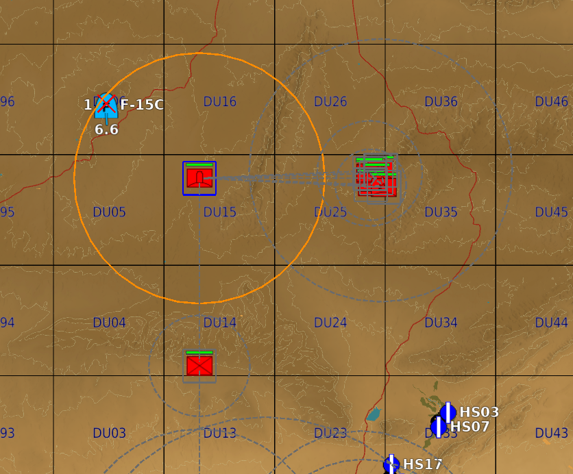
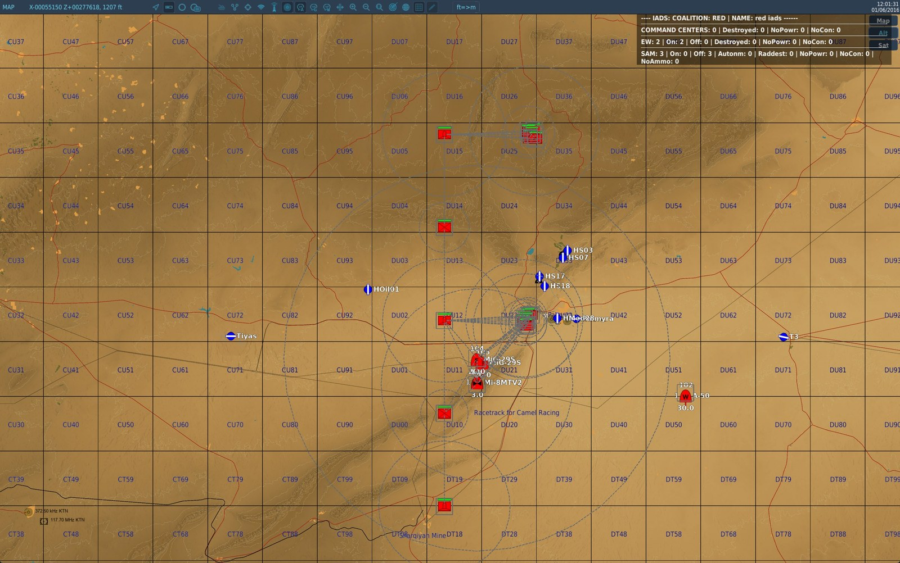
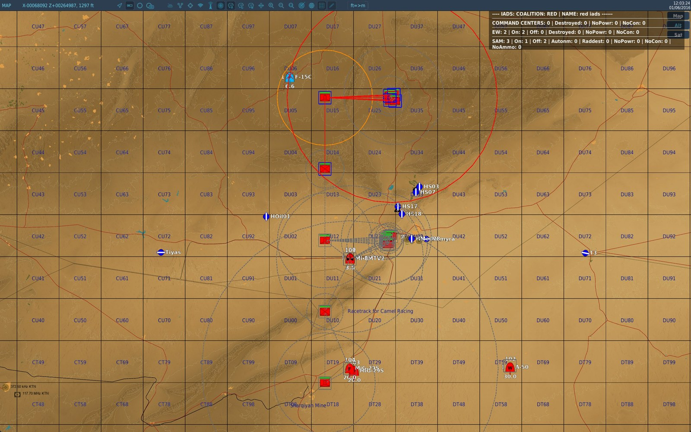
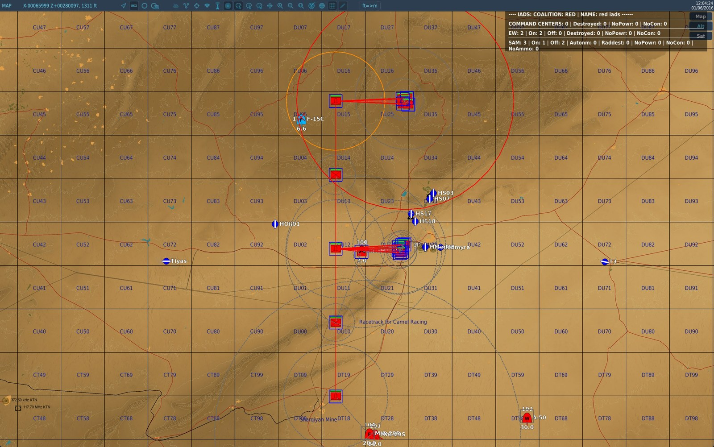
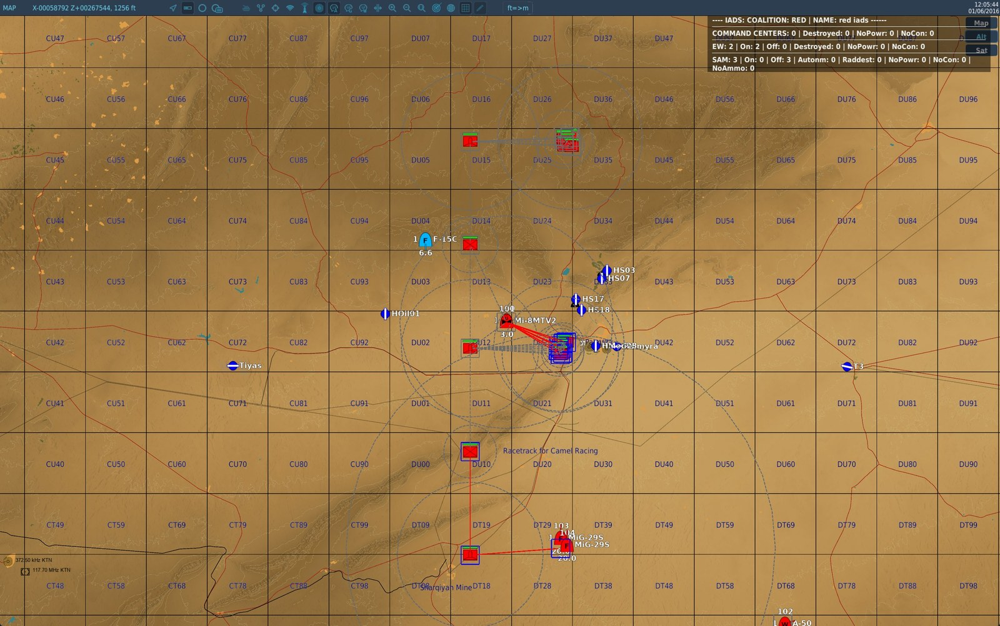
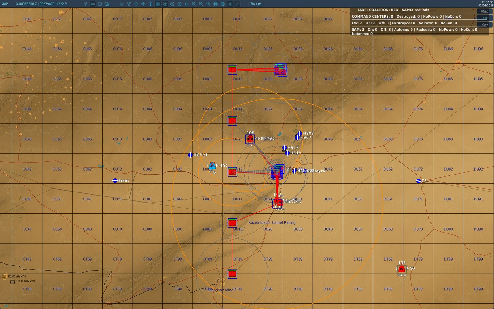

# veafSkynetIadsHelper — Skynet IADS Integration

**Module ID:** `SKYNET` | **File:** `veafSkynetIadsHelper.lua` | **Lua table:** `veafSkynet`

---

## Purpose

[Skynet-IADS](https://github.com/walder/Skynet-IADS) is a third-party script that drives ground-based air defence radars to optimise their survivability and lethality by staying dark as much as possible. It simulates an IADS (Integrated Air Defence System) in which Early Warning Radars (EWR) scan the sky and share detections with SAM sites, allowing those sites to activate only when they can engage a contact.

`veafSkynetIadsHelper` automates the construction of these networks from the groups present in the mission, and provides tools to monitor, control, and tie them to mission objectives.

---

## Requirements

- The Skynet IADS script must be downloaded separately and loaded **before** `veafSkynetIadsHelper`
- Configure via `mission.yaml` (recommended) or in `mission-script.lua` for advanced options not available in YAML

---

## Configuration (`mission.yaml`)

```yaml
modules:
  SKYNET:
    enabled: true
    include_red_in_radio: false   # show RED network status in F10 menu
    debug_red: false              # verbose Skynet logging for RED network
    include_blue_in_radio: false  # show BLUE network status in F10 menu
    debug_blue: false             # verbose Skynet logging for BLUE network
    dynamic_spawn: false          # also integrate groups that appear during the mission
    spotter_network: false        # ground units see aircraft and pass the word along
    spotter_radio_range_km: 20    # how far one unit can relay
    spotter_propagation_speed_kmh: 3600  # how fast an alert crosses the network
    spotter_view: "off"           # "off" | "on" | "radio" — F10 map view (the quotes matter)
    last_line_of_defence: true    # a dark site keeps a short radius of its own and lights up inside it
    last_line_of_defence_min_radius_km: 10
    last_line_of_defence_max_radius_km: 15
    last_line_of_defence_persistence_s: 45
    coverage_refresh_interval_s: 10
```

| Field | Type | Default | Description |
|-------|------|---------|-------------|
| `enabled` | boolean | `false` | Enable Skynet integration |
| `include_red_in_radio` | boolean | `false` | Add RED IADS status to F10 radio menu |
| `debug_red` | boolean | `false` | Enable verbose Skynet debug for RED coalition |
| `include_blue_in_radio` | boolean | `false` | Add BLUE IADS status to F10 radio menu |
| `debug_blue` | boolean | `false` | Enable verbose Skynet debug for BLUE coalition |
| `dynamic_spawn` | boolean | `false` | Also integrate groups that appear **during** the mission — see [Groups appearing during the mission](#dynamic-spawn) |
| `spotter_network` | boolean | `false` | Enable the spotter network — see [Spotter network](#spotter-network) |
| `spotter_radio_range_km` | number | `20` | How far one group can relay an alert, in kilometres |
| `spotter_propagation_speed_kmh` | number | `3600` | How fast an alert crosses the map, in km/h |
| `spotter_view` | `"off"` \| `"on"` \| `"radio"` | `"off"` | F10 map view of the network — see [Seeing what happens, on the map](#spotter-view) |
| `last_line_of_defence` | boolean | `true` | A dark site keeps a short radius of its own and lights up inside it — see [Last line of defence](#last-line-of-defence) |
| `last_line_of_defence_min_radius_km` | number | `10` | Lower bound of that radius, in kilometres |
| `last_line_of_defence_max_radius_km` | number | `15` | Upper bound of that radius, in kilometres |
| `last_line_of_defence_persistence_s` | number | `45` | How long the site stays lit after the last pass, in seconds |
| `coverage_refresh_interval_s` | number | `10` | Interval between two sweeps of the coverage graph, in seconds (`0` = never) |

---

## Activation (via `mission-script.lua`)

```lua
if veafSkynet then
    veafSkynet.PointDefenceMode = veafSkynet.PointDefenceModes.Skynet
    veafSkynet.GroupIntegrationMode = veafSkynet.GroupIntegrationModes.Strict
    veafSkynet.DynamicSpawn = false
    veafSkynet.DelayForStartup = 5
    veafSkynet.initialize(
        false, -- includeRedInRadio
        false, -- debugRed
        false, -- includeBlueInRadio
        false  -- debugBlue
    )
end
```

---

## How it works

The module scans all groups in the mission at startup and adds eligible ones to the Skynet IADS networks. Initialisation is delayed by `DelayForStartup` seconds to let other modules finish first. Late-activation groups are included; dynamically spawned groups are not (unless `DynamicSpawn = true`).

The module always creates two Skynet networks: one for **blue** coalition, one for **red**.

Only groups DCS still holds are enrolled. The distinction matters: DCS keeps listing a group for a short while after destroying it, and this module initialises just after every combat zone has cleaned itself out at startup. Such a group used to appear in the network as a SAM site whose radar never existed — counted as *radar destroyed* on the IADS status page for the rest of the mission.

---

## What a network SAM does and does not see {#what-a-network-sam-sees}

This is the mechanic that surprises people most, and it has already been reported as a bug while
working exactly as designed. **A SAM site under network control has its radar switched off.** It sees
nothing by itself.

### The two ways a site lights up

| | What triggers it |
|---|---|
| **An EWR informs it** | An early-warning radar sees the aircraft and hands the contact over; the site goes live if the contact enters its own firing envelope |
| **Its last line of defence** | The aircraft enters the short radius the site keeps for itself — see [Last line of defence](#last-line-of-defence) |

Proximity alone is not a third way. Outside the last-line-of-defence radius, an aircraft can fly
**directly overhead** a battery and nothing will react, if no EWR has seen it.

### Losing the EWRs makes the remaining sites *more* aggressive

It is counter-intuitive, and it is the expected behaviour. A site left with no EWR to inform it turns
**autonomous**: Skynet hands it back to the DCS AI, which lights everything up, all the time.
Destroying the early-warning radars therefore does not disarm the defence — it makes it blind and
aggressive.

### "Covered" does not mean "informed"

The status page lists, under each EWR, the batteries it "covers". Coverage is a flat **2D distance**
between the EWR's radar and the battery's, compared against the EWR's detection range. It ignores the
horizon, the terrain and altitude.

In other words it says the EWR is **near** the battery, never that it is feeding it. A single 55G6 can
list eighteen batteries under its coverage while seeing no aircraft at all.

### The four ways a group joins a network {#joining-a-network}

Two identical batteries behave in opposite ways depending on their origin.

| Where the group came from | Joins the network? |
|---|---|
| Mission Editor (late activation included) | Yes |
| Combat zone | Yes, whatever `dynamic_spawn` says |
| VEAF spawn command (`_spawn`) | Only if the command carries `skynet` |
| Third-party script, or any other spawn | Only if `dynamic_spawn: true` |

See [Groups appearing during the mission](#dynamic-spawn) for the detail and for `skynet false`.

### Giving a site permanent watch duty — the `ewr` option {#ewr-option}

A spawn command can put the `ewr` keyword on a group:

```text
_spawn group, name SA-10 skynet ewr
```

The site then becomes a **watch site**: it keeps its radar on permanently and sees for itself instead
of waiting to be informed. It also informs the other sites of the network.

What it costs: permanently lit, it is **visible and targetable** — a HARM will find it. That is the
price of the watch, and it is why the advice is to sacrifice a short-range battery rather than the
system being protected.

> Up to Skynet 3.5.0 the option had **no effect at all** on SA-10, SA-6, SA-5, Patriot and Hawk: two
> internal sweeps put those five types straight back to watch-off just after marking them. They have
> been removed.

### Diagnosing: why does this site not light up {#diagnosing-a-dark-site}

Setting `debug_red: true` (or `debug_blue`) shows the network's status page. Three readings, three
different conclusions:

| What the page shows | What it means |
|---|---|
| The EWR has **no contacts** | Nobody sees the aircraft: masked by terrain, or out of range. The network is working |
| The EWR has contacts, but the site stays `ACTIVE: false` | The aircraft is seen, but outside the site's firing envelope. The network is working |
| The site is `AUTONOMOUS` | It has no EWR left to inform it and has been handed back to the DCS AI — the inversion described above |

**After the fact, when nobody thought to switch debug on.** The status page is wiped on every cycle,
but the module keeps a **history of spotter-network wake-ups** that survives it: the last 200 per
coalition, each with its mission time. It answers the question asked the next day — *did the network
wake anything last night?* — without the measurement having to be planned in advance.

**One line per wake-up, not one per check.** A site holding the same aircraft for twenty minutes
writes a single line; if it loses the contact and is woken again by the same aircraft, that is a
second line. So an evening of flying fits in the 200, and a site that keeps flapping shows up as
what it is.

```lua
for _, entry in ipairs(veafSkynet.getSpotterWakeUpLog(coalition.side.RED)) do
    env.info(string.format("%d s: %s", entry.at, entry.line))
end
```

---

## Global properties (set before `initialize`)

### Point Defence mode — `veafSkynet.PointDefenceMode`

Identifies SAM sites capable of intercepting anti-radiation missiles and assigns them as point defences for nearby network elements.

| Value | Description |
|-------|-------------|
| `veafSkynet.PointDefenceModes.None` | No point defences (**default**) |
| `veafSkynet.PointDefenceModes.Skynet` | Point defences managed by Skynet (recommended if enabled) |
| `veafSkynet.PointDefenceModes.Dcs` | Excludes point defences from the IADS network — handed to DCS AI (always on, more effective but more vulnerable) |

### Group integration mode — `veafSkynet.GroupIntegrationMode`

Controls which DCS groups are added to the Skynet networks.

| Value | Description |
|-------|-------------|
| `veafSkynet.GroupIntegrationModes.Strict` | Only groups composed **entirely** of Skynet-known units are integrated |
| `veafSkynet.GroupIntegrationModes.Lenient` | Groups containing **at least one** Skynet-known unit are integrated (**default**) |

In `Lenient` mode, a convoy of tanks and trucks escorted by a SA-19 will be integrated. In `Strict` mode, it will not.

### Groups appearing during the mission — `dynamic_spawn` {#dynamic-spawn}

Set from `mission.yaml` (`dynamic_spawn`), or before `initialize` with `veafSkynet.DynamicSpawn`.

| Value | Description |
|-------|-------------|
| `false` | Only groups present at startup are integrated (**default**) |
| `true` | Groups appearing during the mission also join the existing networks |

**What it costs.** Once on, the module watches **every unit birth** in the mission to spot eligible groups. That is why it is off by default: turn it on when the mission spawns SAMs while it runs (a dynamic campaign, a third-party script), not as a matter of course.

**What it fixes.** Without it, a SAM appearing during the mission joins no network at all, and nothing says so.

**Combat zones do not need it.** An air defence a combat zone puts back on the map joins its coalition's network **whatever** this setting says: content the author placed inside a zone is not a spawn nobody asked for. Without that, belonging to the network came down to scheduling luck — a zone's activation and the start-up enrolment are scheduled for the same second, so a zone's battery joined the network if the activation happened to run first, and never rejoined it after the zone was cycled. Only elements that **stay put** are concerned: a convoy driving through the zone has no business in an air-defence network. The criterion is the one the alarm state uses when no `#alarm=` tag is stated — an explicit tag changes the alarm state, not the network membership.

**Who decides, group by group.** A spawn command's `skynet` option stays in charge: `skynet false` keeps the group **out** of every network (which is what the convoy shortcuts carry), and `skynet <network name>` sends it to that network rather than its coalition's. A group no VEAF command declared — placed in the Mission Editor, created by a third-party script — joins its coalition's network, which is exactly what this setting is for.

> The two integration paths are exclusive: when the target network integrates spawns, it does the work; otherwise `veafSpawn` does it as the group appears. A group is never integrated twice.

**Scoped per network.** The setting belongs to each network. Switching integration off on the red side — or deactivating the red network — leaves blue working.

```lua
-- during the mission, network by network
veafSkynet.setDynamicSpawn("red iads", false)
```

### Spotter network — `spotter_network` {#spotter-network}

A ground **group** that sees a hostile aircraft reports it, and the report travels from group to
group over the radio, one hop at a time. A SAM site that receives it does **not** light up: it holds the contact
and waits, exactly as it would for an early-warning radar, and goes live only when the aircraft
enters its firing envelope. It is a **distributed early-warning radar**, not a wake-up trigger.

When the spotter loses sight of the aircraft it sends a cancellation along the same path, and the
defence goes quiet again.

**Off by default**, because it changes the balance of every existing mission.

| Value | Description |
|-------|-------------|
| `false` | Nothing changes (**default**) |
| `true` | Ground groups see aircraft and pass the word along |

**The group is the unit of reasoning.** One DCS group is **one** spotter however many vehicles it
holds: eleven trucks parked in the same place are not eleven independent radio stations. A group sits
at the **median point** of its live vehicles, and it **sees as far as whichever of them sees
furthest** — so a group mixing a MANPADS with a Shilka sees 10 km, the Shilka being blind.

> The median point is a deliberate approximation: a group **strung out** over several kilometres — a
> convoy on the move — still has one point, so its range and its radio position are wrong by up to
> half its length. Nil for a stationary group, and small against ranges of 3 to 20 km.

**Who sees what.** The detection range depends on the type of unit, and each unit draws its own once
for the mission, within ±20 % of the table value; the group keeps the best of them. Terrain counts:
an aircraft following a valley is not seen by the spotter behind the crest.

| Unit | Sees out to | Relays |
|------|-------------|--------|
| Aeroplane | 30 km | yes |
| Helicopter | 15 km | yes |
| Ship | 12 km | yes |
| MANPADS | 10 km | yes |
| AAA, air-defence vehicle | 8 km | yes |
| Infantry | 4 km | yes |
| Armour, artillery, trucks | 3 km | yes |
| SAM site, EWR, AWACS | — | yes |
| Statics, buildings, everything else | — | no |

Seeing and relaying are two separate properties. **A SAM site relays but never spots**: its own
detection is already its last line of defence's job. That is what produces the domino — a battery
that is warned lights up **and** passes the word, so a line of batteries wakes in the direction of
the penetration. EWRs and AWACS are excluded for the same reason: they already feed Skynet.

A consequence that was accepted deliberately: **a player flying for the network's coalition becomes a
spotter**, and a friendly patrol feeds the ground defence.

**The radio range decides whether the network exists at all.** Measured over a 1 000-unit mission: at
10 km the largest connected pocket covers 5 % of a scattered map — an alert never leaves the group
that raised it. At 20 km it covers all of it on most layouts. That is why the default is 20 and not
below. On a map whose contents are spread very thin the network stays a set of islands at any range,
which is the honest limit of the idea.

**A speed, not a period.** One hop covers the radio range, so exposing both would let you widen the
range and double the speed of the alert without noticing. The hop period is derived: range ÷ speed,
so 20 s at the shipped values. At those settings an alert crosses a 200 km front in four minutes,
against thirteen for a fighter to fly it.

**Reading what happens.** With `debug_red` or `debug_blue` set to `true`, the module writes a status
page into `dcs.log` every minute: how many units and links, **how many pockets** — the answer to
"why did my alert not travel" — the live alerts with their age, who saw what since the previous page,
and which site was woken by which alert.

That trace is not decoration: once this feature is in service a site can light up for **three**
reasons — an early-warning radar, its last line of defence, or a spotter. Without the page the
question has no answer.

#### Seeing what happens, on the map {#spotter-view}

The module can draw the network on the F10 map. **One square and one circle per group**, and each
colour means one thing only:

| | Grey | Blue | Orange | Red |
|---|---|---|---|---|
| **The square** — what the group *knows* | nobody has told it | it has been told | — | it is a battery, and it is live |
| **The circle** — what it *sees* | it sees nothing | — | it has an aircraft in sight | the live battery's firing range |

The square is about what it has been **told**, the circle about what it **sees** for itself. The two do
not go together, and that is the heart of the feature: a truck warned over the radio is blue with a
grey circle, because it knows without seeing anything.

A dark battery draws **no** circle at all. That is deliberate: in grey, grey would mean two things at
once — *this battery could fire and nobody has told it* and *these eyes are looking at nothing* — and
you would no longer know which of the two circles you were looking at.



*Everything in one view: the **orange circle** of the post that has the aircraft in sight, its **blue
square**, the warned position to the east whose squares are blue too, the line joining them — and just
below, another post with a **grey dashed circle**, seeing nothing.*

On top of that: a **red cross** on each aircraft being tracked, a **grey dashed** line between two
groups that can talk to each other over the radio, and a **solid red** line wherever an alert actually
travelled — which is what makes the path of a report readable at a glance.

`spotter_view` takes three values:

| Value | Effect |
|-------|--------|
| `"off"` | Nothing is drawn (**default**) |
| `"on"` | The view is shown from the start of the mission |
| `"radio"` | A *Show / Hide the spotter view* switch appears in the F10 menu, under **SPOTTER NETWORK**. The view starts **off**: that is the point of a switch, and it is the cautious choice given what the view shows |

> ⚠️ **Quote the value.** YAML reads a bare `on` or `off` as a boolean, not as a word. Both are
> accepted and understood (`spotter_view: on` works), but `spotter_view: "on"` is the spelling that
> stays correct whatever happens.

The menu switch belongs to one coalition: red pilots do not see the blue network's. It is also added
without a group restriction, because a game master has **no** group — a group-only radio command
would never reach one, and a game master is exactly who this menu is for.

From `mission-script.lua`, the same thing:

```lua
veafSkynet.showSpotterView(coalition.side.RED, true)
```

> ⚠️ **It is a coalition view, and it cannot be anything narrower.** DCS can only draw for everyone,
> for a coalition, or for a group — and a game master has no group. So **every pilot of that coalition
> sees these markers**, which on a red network hands red pilots a live tracker of blue aircraft. Keep
> it for testing and for missions where that is what you want.

> The network lives inside the Skynet module and does nothing when Skynet is off: there is no
> fallback mode for missions without an IADS.

#### One alert, from start to finish {#spotter-view-story}

> ⚠️ **This is not what a pilot sees.** The pictures below show a mission in **diagnostic mode**, with
> two displays switched on at once: the **spotter view** (the squares, the circles, the lines) and
> **Skynet's own banner** at the top right, which counts the batteries and says how many are live.
> Both are **off by default**: they are for setting a mission up, not for playing it.
>
> To get these views in your own mission:
>
> ```yaml
> modules:
>   SKYNET:
>     enabled: true
>     spotter_network: true
>     spotter_view: "on"    # the squares and circles; "radio" for a switch in the F10 menu
>     debug_red: true       # the status banner top right, and the trace in dcs.log
> ```
>
> Then, in game: **close and reopen the F10 map after the mission has loaded.** A drawing placed by a
> script does not appear on a map that is already open — by far the most common reason for "it draws
> nothing".

The five pictures below are **one single alert**, followed through a demonstration mission shipped
with the tools (`test/veaf-tools/spotter-network-dense`), seen from the **red** side. The time given is
how long the mission has been running.

The setting: a hostile aircraft comes in from the north and flies along a line of **six observation
posts 17 km apart**; behind them, two defended positions, each with its armour, trucks, infantry and
anti-aircraft battery. Two patrols and a radar aircraft orbit overhead.

##### 1 — Nothing has happened yet



*Everything is grey: nobody has seen anything, and the map says so without having to be deciphered.
The aircraft has not arrived.*

This is a good moment to say **who sees what**. Each group has its own sight range, and it depends on
the **type** of its vehicles — the table above gives the values. A group sees as far as **whichever of
its vehicles sees furthest**: a group mixing a shoulder-launched missile team (10 km) with a blind
anti-aircraft gun sees 10 km, not the average of the two.

Two things that surprise people the first time:

- **some vehicles that look made for the job see nothing.** A piece of an anti-aircraft site, a
  self-propelled gun: their detection is already the site's own business, so they **relay without
  spotting**. A plain truck sees further than a self-propelled anti-aircraft gun;
- **terrain counts.** An aircraft following a valley is not seen by the post behind the crest, even
  when it is within range. It is not only a matter of distance: there has to be a line of sight.

The squares with **no circle at all** in this picture are the radar aircraft and the early-warning
radar: they relay and see nothing, because what they see already feeds the defence by another route.

##### 2 — One post sees it, and the battery it warns lights up

*(1 min 20 later)*



*The northern post turns **orange**: it has the aircraft in sight. It passes the word, and the battery
22 km further east — **which has seen nothing at all** — lights up: a red square, and its red circle
shows how far it can shoot. The rest of the map is still grey, so there is no ambiguity about what just
happened. The banner at the top right confirms it: `SAM: 3 | On: 1 | Off: 2`.*

This is **the whole idea of the feature in one picture**, and there are two distinct mechanics in it.

**How the word travels.** Two groups can talk to each other if they are less than **20 km** apart —
that is the `spotter_radio_range_km` setting. A report does not jump from one end of the map to the
other: it moves **from neighbour to neighbour, one hop at a time**, and a hop takes about twenty
seconds. Two groups 25 km apart cannot hear each other: the network breaks into separate pockets, and
an alert raised in one will never leave it. That is why this mission's posts are 17 km apart and not
25.

**What a warned battery does.** It **does not light up because somebody talked to it**. It holds the
information and waits, exactly as it would with an early-warning radar, and it only switches its radar
on when the aircraft enters **its own firing range**. That is what happens here: it was warned, the
aircraft was already inside its 25 km, so it lights up. In the same picture the other batteries got
the same report and **stay grey**: the aircraft is not inside *their* range. The spotter network is a
**distributed early-warning radar**, not a switch that wakes everybody up.

##### 3 — The word goes round the front

*(1 minute later)*



*The squares have turned **blue across 95 km**, all the way to the southernmost post. But their circles
stay **grey**: they know, they see nothing. The red lines draw the exact path the report took, from
neighbour to neighbour.*

This is the difference between the square and the circle made visible: twelve groups know, one is
looking at the aircraft. The domino effect reads here too — a warned battery **passes the word on in
its turn**, so a line of defences wakes up in the direction of the penetration.

##### 4 — The aircraft leaves, the defence goes back to sleep

*(1 min 20 later)*



*The aircraft has left the firing range: the battery goes dark, its red circle disappears, and the
banner drops back to `On: 0`. The north has **turned grey again** — it has forgotten — while the south
is still blue.*

When a spotter loses sight of the aircraft it does not let the information rot: it sends a
**cancellation**, which travels the same path at the same speed as the alert. That is what is caught
here mid-flight — the north is already cleared, the south not yet. Without it, a defence would stay on
alert for an aircraft that left long ago.

A spotter does not drop the aircraft at the first blink, though: one that disappears behind a crest for
a few seconds is still tracked. It has to be lost properly for the cancellation to go out.

##### 5 — The patrols take over

*(1 min 45 later)*



*It is now the helicopter and the fighter patrol tracking the aircraft. The big orange circle is the
fighter: it sees 30 km **and it moves**.*

Aircraft in flight see much further than anything on the ground — 30 km for an aeroplane, 15 for a
helicopter — because nothing masks them and many carry a radar. A deliberate consequence: **a player
flying for the network's coalition becomes a spotter**, and a friendly patrol feeds the ground defence
without having to do anything in particular.

### Last line of defence — `last_line_of_defence` {#last-line-of-defence}

A dark site still keeps a **short virtual detection radius** of its own, inside which it lights up by
itself. That is what stops an aircraft flying under the early-warning radars' horizon from crossing an
air defence untroubled.

**Ships on**, and that is a change of behaviour: before Skynet 3.5.0, a site under network control was
entirely blind between two EWR hand-overs.

```yaml
modules:
  SKYNET:
    enabled: true
    last_line_of_defence: true                # set to false for a purist IADS
    last_line_of_defence_min_radius_km: 10
    last_line_of_defence_max_radius_km: 15
    last_line_of_defence_persistence_s: 45
    coverage_refresh_interval_s: 10
```

**Each site draws its own radius** between the two bounds, once, at the start. A front therefore does
not present a uniform ring a pilot could learn.

**The limit, stated honestly:** the radius is measured **flat** and deliberately ignores the firing
envelope. A short-range piece can therefore light up for an aircraft it cannot reach. That is a
choice: the radius says "something is passing over my head", not "I can shoot it down".

**Persistence** is how long the site stays lit after the last pass through its radius. At `45` seconds
it does not re-light on every round trip.

**The coverage sweep** is how often Skynet rebuilds the "which EWR covers which battery" graph. It is
there for sites that move; at `0` it never happens.

**The two bounds go together.** Skynet refuses the pair whole if the upper bound is below the lower
one — and it refuses it **in silence**. Writing `last_line_of_defence_min_radius_km: 20` on its own is
enough to hit that, since the upper bound stays at 15: the shipped values then apply, not the one you
asked for. If you widen the radius, **move both bounds**.

The module reads back what it set and says so in the log when a setting was not taken:

```text
WARN SKYNET [red iads]: the last-line-of-defence radius (min/max, in metres) was refused —
     asked for 20000/15000, Skynet stands at 10000/15000. Check the value in mission.yaml
```

> These four settings are **global to both coalitions**. Only `dynamic_spawn` is per network.

### Startup delay — `veafSkynet.DelayForStartup`

Seconds to wait before initialising networks (default: `1`). Increase if other modules initialise groups with a delay.

### Vanished-site sweep — `veafSkynet.SecondsBetweenVanishedSitesSweeps` {#vanished-sites}

Seconds between two cleanup passes over the networks (default: `60`).

A site whose group **leaves the mission without being destroyed** — which is what happens when a combat zone is deactivated and takes its air defences with it — used to be kept in the network until the end of the game. It inflated the status page, was walked on every detection cycle, and **held its group name**: the module refuses to enrol a group the network already lists. The sweep removes those sites and frees the name.

Worth stating, because the distinction matters: freeing the name is not enough to bring back a group that reappears **under the same name within** the sweep interval. Enrolment happens on the birth event, which has already fired and been refused, and nothing retries it afterwards. This does not affect combat zones: they give each respawn a fresh name, and above all they tell the network themselves about the air defences they put back — see [Groups appearing during the mission](#dynamic-spawn).

Sites the player **destroyed** are kept: they are what the `Raddest` and `Destroyed` columns of the status page count, and that is how a successful SEAD reads.

### Unreadable radar range — `veafSkynet.DelayForRangeRecheck` / `veafSkynet.MaxRangeRechecks` {#radar-range-recheck}

Seconds between two readings of a radar's range (default: `5`), and how many readings to try (default: `3`). At `0`, nothing is re-read.

Skynet reads a radar's detection range **once**, at the instant the site joins the network. If DCS does not hand it over at that precise moment, the range stays at zero for the rest of the mission: the site detects nothing, never goes live — not even when an aircraft flies over it — and the status page counts it under `Raddest`, as though its radar had been shot. A site in that state is therefore asked again, and its coverage is rebuilt as soon as a reading succeeds.

Such a site leaves a line in the log (`RADAR RANGE ZERO`, then `RADAR RANGE RECOVERED` or `RADAR RANGE STILL ZERO`), carrying the site's radar and launcher counts. A mission whose sites all answer normally writes nothing.

---

## Command Centers

In Skynet, a **Command Center** is a unit or static object that a network depends on. If all Command Centers of a network are destroyed, that network switches to autonomous mode (all elements remain on permanently, but still benefit from Skynet intelligence, in particular HARM evasion).

This mechanism provides concrete mission objectives: destroy the command center to disrupt the air defence network.

```lua
-- Add a Command Center to a network (can be a group, unit or static)
veafSkynet.addCommandCenterOfCoalition(coalition.side.RED, "CommandCenterRed")

-- Destroy (explode) all Command Centers of a network
veafSkynet.destroyCommandCentersOfCoalition(coalition.side.RED)
```

---

## Deactivating a network {#deactivation}

Deactivates a Skynet network and sets all its elements to a defined state before handing them back to DCS AI.

```lua
veafSkynet.deactivateNetworkOfCoalition(coalition.side.RED)
-- or with a specific state:
veafSkynet.deactivateNetworkOfCoalition(coalition.side.RED, veafSkynet.SkynetElementStates.Dark)
```

| State | Description |
|-------|-------------|
| `veafSkynet.SkynetElementStates.Autonomous` | Autonomous mode per each element's individual configuration |
| `veafSkynet.SkynetElementStates.Live` | All elements switched on (**default**) |
| `veafSkynet.SkynetElementStates.Dark` | All elements switched off |

**A deactivated network stays deactivated.** Spawning a SAM into it no longer wakes it up: the group is still attached — that is what `skynet true` asks for — but the network does not come back on its own. Before, one spawned SAM was enough to restart a network you had just switched off.

Bringing it back up is a deliberate call. Everything attached meanwhile comes up with it:

```lua
veafSkynet.activateNetworkOfCoalition(coalition.side.RED)
```

Deactivating one network **leaves the other alone**: the blue network keeps its state and its integration of dynamic spawns.

---

## Accessing generated networks

After initialisation (which is deferred), access the Skynet network objects via a scheduled task:

```lua
local assignRedIadsTaskId = nil
local myRedIads = nil

local function AssignRedIadsTask()
    if not veafSkynet then
        veaf.removeFunction(assignRedIadsTaskId)
        return
    end
    if veafSkynet.initialized then
        veaf.removeFunction(assignRedIadsTaskId)
        local veafSkynetNetwork = veafSkynet.getNetwork(veafSkynet.defaultIADS[tostring(coalition.side.RED)])
        myRedIads = veafSkynetNetwork.iads
    end
end

assignRedIadsTaskId = veaf.scheduleFunction(AssignRedIadsTask, {}, timer.getTime() + veafSkynet.DelayForStartup + 1, 10)
```

---

## Example — Mission-objective-driven autonomous switch

This example creates a Command Center from a template group, then exposes functions to enable/disable the network as the mission progresses.

```lua
local function SkynetNetworkEnable(iCoalition)
    local veafSkynetNetwork = veafSkynet.getNetwork(veafSkynet.defaultIADS[tostring(iCoalition)])
    local iads = veafSkynetNetwork.iads
    if #iads:getCommandCenters() > 0 and iads:isCommandCenterUsable() then
        return -- already active
    end
    local sTemplateName = "SkynetCommandCenterRed"
    local ccData = mist.cloneInZone(sTemplateName, "SkynetCommandCenterZone")
    veafSkynet.addCommandCenterOfCoalition(iads:getCoalition(), ccData.name)
end

local function SkynetNetworkDisable(iCoalition)
    veafSkynet.destroyCommandCentersOfCoalition(iCoalition)
end
```

> This example calls `mist.cloneInZone`, so it needs MiST — which is no longer injected into every
> mission. Put the snippet in one of your own `src/scripts/*.lua` and the build sees the `mist.` call
> and injects MiST for you; see
> [MiST: injected only when you need it](../GUIDE.en.md#mist-injection).

---

## See also

- [Skynet IADS documentation](https://github.com/walder/Skynet-IADS) — third-party script (not included in VEAF)
- [Lua API Reference](../../LUA_API_REFERENCE.en.md) — full `veafSkynet` API
