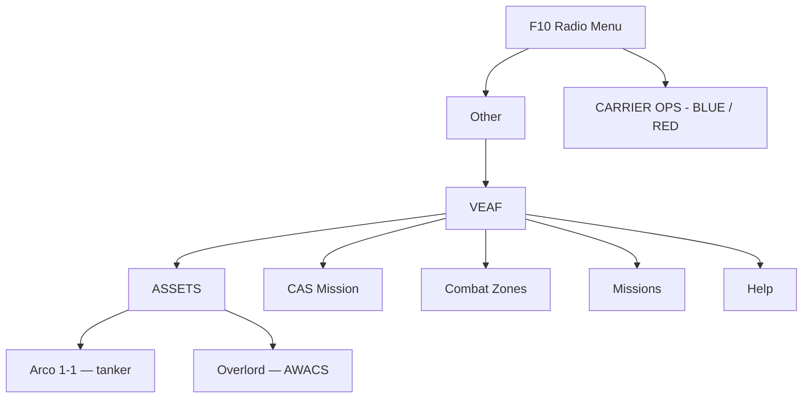

# Pilot Guide — VEAF Mission Creation Tools

This guide is for players flying missions that use the VEAF framework. No technical knowledge is required: everything is done in-game, with the mouse and keyboard.

---

## Table of Contents

1. [What is VEAF MCT?](#what-is-veaf-mct)
2. [Recognising a VEAF Mission](#recognising-a-veaf-mission)
3. [The F10 Radio Menu](#the-f10-radio-menu)
4. [Marker Commands](#marker-commands)
5. [Assets: Tankers, AWACS, Carriers](#assets)
6. [Combat Zones and Missions](#combat-zones-and-missions)
7. [CAS Training](#cas-training)
8. [Security and Permissions](#security-and-permissions)
9. [Tips for Your Aircraft](#tips-for-your-aircraft)
10. [Frequently Asked Questions (FAQ)](#frequently-asked-questions-faq)
11. [Community and Support](#community-and-support)

---

## What is VEAF MCT?

VEAF Mission Creation Tools (VEAF MCT) makes DCS World missions alive and interactive. In a regular mission, everything is fixed in advance. With VEAF MCT, you can act while flying:

- spawn enemy units on demand;
- request a tanker, an AWACS or a carrier;
- launch a Close Air Support (CAS) training session at the difficulty level of your choice;
- activate combat missions prepared by the mission maker.

These capabilities come from small programs — called **scripts** — that the mission maker has added. **You have nothing to install**: everything is already included in the mission. You give orders in two ways: through the **radio menu** (F10 key) or by **placing a marker** on the map.

---

## Recognising a VEAF Mission

Three signs tell you a mission uses VEAF:

1. **Startup messages** appear in the lower-right corner of the screen at launch, listing the loaded VEAF modules.
2. **A "VEAF" submenu** appears under **F10 → Other**.
3. **Map markers** show tanker tracks, AWACS orbits or combat zone positions.

> 📷 *Screenshot coming soon: VEAF startup messages in the lower-right corner.*

---

## The F10 Radio Menu

All VEAF MCT features are available from **F10 → Other → VEAF**. (The radio menu is the list that opens with the F10 key; "Other" groups the commands added by the mission.)



> 📷 *Screenshot coming soon: VEAF submenu in the F10 radio menu.*

The exact contents depend on what the mission maker has enabled: some missions will not have every entry.

---

## Marker Commands {#marker-commands}

In addition to the radio menu, you can give orders by writing a **command in a marker** on the F10 map.

**How to do it:**

1. Open the map (F10).
2. Right-click → **Add marker**.
3. Type the command in the marker's text field.
4. Confirm.

VEAF detects the marker, runs the command at the marker's location, then removes it automatically.

> 📷 *Screenshot coming soon: typing a command into an F10 map marker.*

> On multiplayer servers, some commands require a password. See [Security and Permissions](#security-and-permissions).

### Aliases: the simplest method

An **alias** is a shortcut prepared by the mission maker. It starts with a hyphen `-` and triggers a full command behind the scenes. It is the easiest way to spawn units: you only need to know the shortcut's name.

**Common air-defence aliases:**

| Alias | What spawns |
|-------|-------------|
| `-sa2` | SA-2 Guideline (S-75) battery |
| `-sa6` | SA-6 Gainful (2K12 Kub) battery |
| `-sa10` | SA-10 Grumble (S-300) battery |
| `-sa11` | SA-11 Gadfly (9K37 Buk) battery |
| `-sa15` | SA-15 Gauntlet (Tor) vehicle |
| `-sa22` | SA-22 Greyhound (Pantsir-S1) vehicle |
| `-shilka` | ZSU-23-4 Shilka AAA |
| `-manpads` | MANPADS squad (man-portable surface-to-air missiles) |
| `-samLR` | Random long-range SAM battery |
| `-samSR` | Random short-range SAM battery |

**Common vehicle and ship aliases:**

| Alias | What spawns |
|-------|-------------|
| `-burke` | USS Arleigh Burke IIa destroyer |
| `-ticonderoga` | Ticonderoga cruiser |
| `-mortar` | Mortar team |
| `-arty` | M-109 artillery battery |
| `-mlrs` | MLRS rocket battery |
| `-attack_convoy_red` | Red attack convoy |

> 📷 *Screenshot coming soon: units spawned by an alias command, shown on the map.*

> **Tip:** each mission can define its own aliases. Ask your server administrator for the full list.

### Raw Commands (Advanced)

For anything not covered by an alias, you can write a full VEAF command directly. These commands start with an underscore `_`.

**Spawn a unit — `_spawn unit`:**

```
_spawn unit, name F-16C
_spawn unit, name T-80, multiplier 4, hdg 270
_spawn unit, name SA-6
```

Common options:

| Option | Description | Example |
|--------|-------------|---------|
| `name [TYPE]` | DCS unit type (required) | `name F-16C` |
| `multiplier [N]` | Number of units in the group | `multiplier 4` |
| `hdg [DEG]` | Initial heading in degrees | `hdg 270` |
| `alt [FT]` | Altitude in feet (aircraft) | `alt 15000` |
| `speed [KT]` | Speed in knots | `speed 450` |
| `side [blue/red]` | Force the coalition | `side red` |

**Spawn a predefined group — `_spawn group`:**

```
_spawn group, name CAP-2
_spawn group, name RED-SAM-SITE, hdg 180
```

Groups must have been defined in the mission's configuration by the mission maker.

**Spawn a combat air patrol (CAP) — `_spawn cap`:**

```
_spawn cap, name Su-27, alt 25000, capradius 20000
```

**Smoke, flares, explosions:**

```
_spawn smoke, color red
_spawn flare, power 1000000, shells 5
_spawn bomb, power 500, shells 3
```

---

## Assets

**Assets** are the mission's shared support aircraft and vessels: tankers, AWACS and ships. You find them under **F10 → VEAF → ASSETS**.

> 📷 *Screenshot coming soon: the ASSETS menu and one asset's submenu.*

### Tankers, AWACS and ships

**F10 → VEAF → ASSETS → [Asset name] → Get info on [Asset name]**

The menu does not group assets by category: every tanker, AWACS or ship has its own submenu directly, named after the asset. There is no *Tankers* or *AWACS* step to go through.

What the info shows depends on the asset: for a tanker, its position, TACAN channel (navigation beacon), radio frequency and refuelling type; for an AWACS, its callsign, frequency and position.

Two more commands may appear in an asset's submenu:

- **Respawn [Name]** — brings it back if it has been destroyed. Available to everyone.
- **Dispose of [Name]** — removes it from the mission. Restricted to authenticated players.

An asset the mission maker did not make consultable has no submenu at all: its **Respawn [Name]** sits directly in the ASSETS menu.

### Carriers

Carrier air operations have their own **CARRIER OPS** menu (not under *Assets*), with a submenu per coalition and then per carrier.

| Action | Menu path |
|--------|-----------|
| Turn the carrier into the wind (45 minutes) | CARRIER OPS → [coalition] → [Name] → Start carrier air operations for 45 minutes |
| Turn the carrier into the wind (90 minutes) | CARRIER OPS → [coalition] → [Name] → Start carrier air operations for 90 minutes |
| Stop operations and resume the route | CARRIER OPS → [coalition] → [Name] → End air operations |
| Get info (BRC, TACAN, ICLS, radio) | CARRIER OPS → [coalition] → [Name] → ATC - Request informations |

> 📷 *Screenshot coming soon: carrier recovery submenu.*

**Recovery procedure:**

1. **Request air operations** 10–15 minutes before your approach (*Start carrier air operations for 45 minutes*). The carrier turns into the wind to provide its target relative wind over the deck (about 20–25 knots depending on the carrier).
2. **Check the info** (*ATC - Request informations*):
   - **BRC** (*Base Recovery Course*): the deck heading for recovery;
   - **TACAN channel** (e.g. 73X): for navigation to the carrier;
   - **ICLS channel** (e.g. 13): for glideslope guidance (F/A-18C, F-14);
   - **ATC frequency**.
3. **Approach and land** following TACAN, then ICLS.
4. **After landing**, choose *End air operations* to return the carrier to its route.

> Air operations time out automatically after 45 minutes (90 minutes if you chose the longer option).

---

## Combat Zones and Missions

### Combat Zones

A **combat zone** is an area prepared by the mission maker that you activate on demand. On activation, enemy units spawn; once all are destroyed, the zone is complete and can be replayed.

| Action | Menu path |
|--------|-----------|
| List available zones | Combat Zones |
| Activate a zone | Combat Zones → [Zone] → Activate |
| Check zone status | Combat Zones → [Zone] → Info |
| Mark the zone with smoke | Combat Zones → [Zone] → Smoke |
| Deactivate / clean up | Combat Zones → [Zone] → Deactivate |

### Missions

**Missions** are more elaborate scenarios, with objectives and progress tracking.

| Action | Menu path |
|--------|-----------|
| List missions | Missions |
| Activate | Missions → [Mission] → Activate |
| Read status and objectives | Missions → [Mission] → Info |
| Abort | Missions → [Mission] → Deactivate |

---

## CAS Training

The **CAS** generator (*Close Air Support*) creates a zone of ground targets with an adjustable threat level. Ideal for practising attacks on enemy positions.

**Workflow:**

1. **Generate** — place a `_cas` marker on the map (with optional parameters, see below). The **CAS MISSION** submenu then appears under F10 → VEAF.
2. **Mark the zone** — *Target markers → Request smoke on target area* or *Request illumination flare over target area* (3-minute cooldown between marks).
3. **Get info** — *Target information*: position, unit composition, status.
4. **Engage** — attack the marked targets.
5. **Advance** — the zone moves to the next one automatically when all units are destroyed, or use *Skip current objective*.

> 📷 *Screenshot coming soon: smoke marking a CAS target.*

**Set the difficulty** via marker: `_cas, size 3, defense 2, armor 3`

| Level | Typical composition | For whom |
|-------|---------------------|----------|
| 0 | Infantry, jeeps, no AA | Beginners |
| 1 | Light vehicles, MANPADS | Easy |
| 2 | Armoured personnel carriers (APC), light AA | Intermediate |
| 3 | Infantry fighting vehicles (IFV), medium AA + SHORAD | Advanced |
| 4 | Main battle tanks (MBT), ZSU + SA-9 | Difficult |
| 5 | Heavy armour, SAMs | Expert |

Options for the `_cas` command: `size [1-5]` (force size), `defense [0-5]` (AA level), `armor [0-5]` (armour), `side [blue/red]` (coalition).

---

## Security and Permissions

On multiplayer servers, the mission maker may restrict certain commands according to your permission level:

There are two ways to be allowed to run a command: **being recognised by the server**, or **giving
the password**. VEAF servers keep a list of pilots, and your place on that list opens some commands
without typing anything.

| Tier | Who passes without a password |
|------|-------------------------------|
| Known pilot | Any pilot on the server's list |
| Trusted member | The pilots the server has singled out as such |
| Administrator | The server's administrators |

Some commands are open to everyone, listed or not: asset info, smoke, signal flares, naming a point.
Others — spawning a group, destroying a unit — need one of the tiers above.

If you are not recognised, place a marker containing:

```
_auth [PASSWORD]
```

The password is set by the mission maker or server administrator, and there is one per tier — the
administrator's also opens everything below it. Authentication stays valid for a configured duration
(10 minutes by default), after which your rights return automatically to whatever the server's list
grants you.

---

## Tips for Your Aircraft

### Fighters (F-16C, F/A-18C, F-15C, Su-27…)

- Use the AWACS for threat vectors before engaging.
- Spawn an enemy CAP with `_spawn cap, name Su-27` for a realistic intercept scenario.
- Activate a predefined intercept mission from the F10 menu.

### Attack aircraft (A-10C, Su-25, F/A-18C…)

- Start CAS training at difficulty 1 or 2.
- Use **Smoke** to mark the target before attacking.
- Increase difficulty gradually (level 3 and up: SEAD-worthy threats).

### Helicopters (AH-64D, Ka-50, Mi-24…)

- Keep difficulty between 0 and 2 (minimal AA).
- Use `_spawn armorgroup, size 5, spacing 8` for dispersed armour targets — `size` is how many
  vehicles, and `spacing` widens the gap between them as a multiple of each vehicle's own footprint
  (so a bigger number spreads the group out).
- Use terrain masking to approach below AA radar coverage.

### Transports (C-130, Mi-8, UH-1H…)

- Spawn a FARP as a destination: `-farp FARP Alpha`.
- Use CTLD integration (if enabled) for troop and cargo missions.

---

## Frequently Asked Questions (FAQ)

**How do I know if a mission uses VEAF?**
Press F10: if a "VEAF" submenu appears under "Other", it is a VEAF mission.

**My marker commands don't work. Why?**
Check the syntax (raw commands start with `_`, aliases with `-`). In multiplayer you may need to authenticate first with `_auth [PASSWORD]`. Also check that the server allows marker commands.

**What unit names can I use with `_spawn unit`?**
Standard DCS type names: `F-16C`, `Su-27`, `T-80`, `M1 Abrams`, `SA-6`, etc. Note that they are case-sensitive.

**The units I spawned disappeared. Is that normal?**
Yes — some missions enforce a range limit (about 40–50 NM): AI is cleaned up if you fly too far away.

**How do I move to the next CAS target?**
F10 → CAS MISSION → *Skip current objective*. To start over, place a new `_cas` marker.

**Can I spawn friendly units?**
Yes: add `side blue` to your command.

---

## Community and Support

- **VEAF Discord**: [veaf.org/discord](https://www.veaf.org/discord) — `#support` channel for real-time help.
- **Website**: [veaf.org](https://www.veaf.org)
- **GitHub**: [github.com/VEAF/VEAF-Mission-Creation-Tools](https://github.com/VEAF/VEAF-Mission-Creation-Tools)
