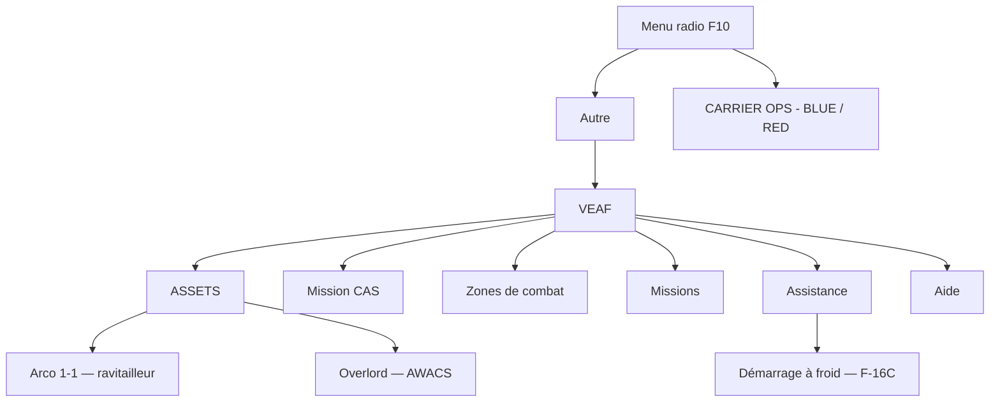

# Guide du pilote — VEAF Mission Creation Tools

Ce guide s'adresse aux joueurs qui volent dans des missions utilisant le framework VEAF. Aucune connaissance technique n'est nécessaire : tout se fait en jeu, à la souris et au clavier.

---

## Table des matières

1. [Qu'est-ce que VEAF MCT ?](#quest-ce-que-veaf-mct)
2. [Reconnaître une mission VEAF](#reconnaître-une-mission-veaf)
3. [Le menu radio F10](#le-menu-radio-f10)
4. [Les commandes par marqueur](#marker-commands)
5. [Ressources : ravitailleurs, AWACS, porte-avions](#ressources)
6. [Zones et missions de combat](#zones-et-missions-de-combat)
7. [Entraînement CAS](#entraînement-cas)
8. [Sécurité et permissions](#security)
9. [Conseils selon votre appareil](#conseils-selon-votre-appareil)
10. [Questions fréquentes (FAQ)](#questions-fréquentes-faq)
11. [Communauté et support](#communauté-et-support)

---

## Qu'est-ce que VEAF MCT ?

VEAF Mission Creation Tools (VEAF MCT) rend les missions DCS World vivantes et interactives. Dans une mission classique, tout est figé à l'avance. Avec VEAF MCT, vous pouvez agir pendant le vol :

- faire apparaître des unités ennemies à la demande ;
- demander un avion ravitailleur, un AWACS ou un porte-avions ;
- déclencher un entraînement d'appui aérien rapproché (CAS) au niveau de difficulté de votre choix ;
- activer des missions de combat préparées par le créateur de la mission.

Ces possibilités viennent de petits programmes — appelés **scripts** — que le créateur de la mission a ajoutés. **Vous n'avez rien à installer** : tout est déjà inclus dans la mission. Vous donnez vos ordres de deux façons : par le **menu radio** (touche F10) ou en **plaçant un marqueur** sur la carte.

---

## Reconnaître une mission VEAF

Trois signes indiquent qu'une mission utilise VEAF :

1. **Des messages de démarrage** s'affichent dans le coin inférieur droit de l'écran au lancement, listant les modules VEAF chargés.
2. **Un sous-menu « VEAF »** apparaît dans **F10 → Autre**.
3. **Des marqueurs** sur la carte indiquent les trajectoires des ravitailleurs, les orbites des AWACS ou la position des zones de combat.

> 📷 *Capture à venir : messages de démarrage VEAF dans le coin inférieur droit.*

---

## Le menu radio F10

Toutes les fonctions de VEAF MCT sont accessibles depuis **F10 → Autre → VEAF**. (Le menu radio est la liste qui s'ouvre avec la touche F10 ; « Autre » y regroupe les commandes ajoutées par la mission.)



> 📷 *Capture à venir : sous-menu VEAF dans le menu radio F10.*

Le contenu exact dépend de ce que le créateur de la mission a activé : certaines missions n'auront pas toutes ces entrées.

---

## Les commandes par marqueur {#marker-commands}

En plus du menu radio, vous pouvez donner des ordres en écrivant une **commande dans un marqueur** sur la carte F10.

**Comment faire :**

1. Ouvrez la carte (F10).
2. Clic droit → **Ajouter un marqueur**.
3. Tapez la commande dans le champ de texte du marqueur.
4. Validez.

VEAF détecte le marqueur, exécute la commande à l'emplacement du marqueur, puis le supprime automatiquement.

> 📷 *Capture à venir : saisie d'une commande dans un marqueur de la carte F10.*

> Sur les serveurs multijoueurs, certaines commandes demandent un mot de passe. Voir [Sécurité et permissions](#security).

### Les alias : la méthode la plus simple

Un **alias** est un raccourci préparé par le créateur de la mission. Il commence par un tiret `-` et déclenche une commande complète en arrière-plan. C'est la façon la plus simple de faire apparaître des unités : il suffit de connaître le nom du raccourci.

**Alias de défense aérienne courants :**

| Alias | Ce qui apparaît |
|-------|-----------------|
| `-sa2` | Batterie SA-2 Guideline (S-75) |
| `-sa6` | Batterie SA-6 Gainful (2K12 Kub) |
| `-sa10` | Batterie SA-10 Grumble (S-300) |
| `-sa11` | Batterie SA-11 Gadfly (9K37 Buk) |
| `-sa15` | Escouade SA-15 Gauntlet (Tor) |
| `-sa22` | Escouade SA-22 Greyhound (Pantsir-S1) |
| `-shilka` | DCA ZSU-23-4 Shilka |
| `-manpads` | Équipe de MANPADS (missiles sol-air portables) |
| `-samLR` | Batterie SAM longue portée aléatoire |
| `-samSR` | Batterie SAM courte portée aléatoire |

**Alias de véhicules et navires courants :**

| Alias | Ce qui apparaît |
|-------|-----------------|
| `-burke` | Destroyer USS Arleigh Burke IIa |
| `-ticonderoga` | Croiseur Ticonderoga |
| `-mortar` | Équipe de mortier |
| `-arty` | Batterie d'artillerie M-109 |
| `-mlrs` | Batterie de lance-roquettes MLRS |
| `-attack_convoy_red` | Convoi d'attaque rouge |

> 📷 *Capture à venir : unités apparues après une commande alias, vues sur la carte.*

> **Astuce :** chaque mission peut définir ses propres alias. Demandez la liste complète à l'administrateur de votre serveur.

### Les commandes brutes (avancé)

Pour tout ce qui n'est pas couvert par un alias, vous pouvez écrire directement une commande VEAF complète. Ces commandes commencent par un tiret bas `_`.

**Faire apparaître une unité — `_spawn unit` :**

```
_spawn unit, name F-16C
_spawn unit, name T-80, multiplier 4, hdg 270
_spawn unit, name SA-6
```

Options courantes :

| Option | Description | Exemple |
|--------|-------------|---------|
| `name [TYPE]` | Type d'unité DCS (obligatoire) | `name F-16C` |
| `multiplier [N]` | Nombre d'unités dans le groupe | `multiplier 4` |
| `hdg [DEG]` | Cap initial en degrés | `hdg 270` |
| `alt [FT]` | Altitude en pieds (aéronefs) | `alt 15000` |
| `speed [KT]` | Vitesse en nœuds | `speed 450` |
| `side [blue/red]` | Forcer la coalition | `side red` |

**Faire apparaître un groupe prédéfini — `_spawn group` :**

```
_spawn group, name CAP-2
_spawn group, name RED-SAM-SITE, hdg 180
```

Les groupes doivent avoir été définis dans la configuration de la mission par son créateur.

**Faire apparaître une patrouille de chasse (CAP) — `_spawn cap` :**

```
_spawn cap, name Su-27, alt 25000, capradius 20000
```

**Fumée, fusées éclairantes, explosions :**

```
_spawn smoke, color red
_spawn flare, power 1000000, shells 5
_spawn bomb, power 500, shells 3
```

---

## Ressources

Les **ressources** sont les appareils de soutien partagés de la mission : ravitailleurs, AWACS et navires. Vous les retrouvez sous **F10 → VEAF → MOYENS**.

> 📷 *Capture à venir : le menu ASSETS et le sous-menu d'une ressource.*

### Ravitailleurs, AWACS et navires

**F10 → VEAF → MOYENS → [Nom de la ressource] → Infos sur [Nom de la ressource]**

Le menu ne range pas les ressources par catégorie : chaque ravitailleur, AWACS ou navire a directement son propre sous-menu, portant son nom. Il n'y a donc pas d'étape *Ravitailleurs* ou *AWACS* à traverser.

Ce que l'info affiche dépend de la ressource : pour un ravitailleur, sa position, son canal TACAN (balise de navigation), sa fréquence radio et son type de ravitaillement ; pour un AWACS, son indicatif radio (*callsign*), sa fréquence et sa position.

Deux autres commandes peuvent apparaître dans le sous-menu d'une ressource :

- **Respawn [Nom]** — la fait réapparaître si elle a été détruite. Disponible pour tout le monde.
- **Dispose of [Nom]** — la retire de la mission. Réservée aux joueurs authentifiés.

Une ressource que le créateur de la mission n'a pas rendue consultable n'a pas de sous-menu du tout : son **Respawn [Nom]** figure directement dans le menu ASSETS.

### Porte-avions

Les opérations aériennes du porte-avions ont leur propre menu **OPS PORTE-AVIONS** (et non sous *MOYENS*), avec un sous-menu par camp puis par porte-avions.

| Action | Chemin dans le menu |
|--------|---------------------|
| Mettre le porte-avions face au vent (45 minutes) | CARRIER OPS → [camp] → [Nom] → Start carrier air operations for 45 minutes |
| Mettre le porte-avions face au vent (90 minutes) | CARRIER OPS → [camp] → [Nom] → Start carrier air operations for 90 minutes |
| Arrêter les opérations et reprendre la route | CARRIER OPS → [camp] → [Nom] → End air operations |
| Obtenir les infos (BRC, TACAN, ICLS, radio) | CARRIER OPS → [camp] → [Nom] → ATC - Request informations |

> 📷 *Capture à venir : sous-menu de récupération du porte-avions.*

**Procédure d'appontage :**

1. **Demandez les opérations aériennes** 10 à 15 minutes avant l'approche (*Start carrier air operations for 45 minutes*). Le porte-avions se place face au vent pour offrir le vent relatif visé sur le pont (environ 20 à 25 nœuds selon le porte-avions).
2. **Consultez les infos** (*ATC - Request informations*) :
   - **BRC** (*Base Recovery Course*) : le cap du pont pour l'appontage ;
   - **canal TACAN** (ex. 73X) : pour la navigation jusqu'au porte-avions ;
   - **canal ICLS** (ex. 13) : pour le guidage sur le plan de descente (F/A-18C, F-14) ;
   - **fréquence ATC**.
3. **Approchez et appontez** en suivant le TACAN puis l'ICLS.
4. **Après l'appontage**, choisissez *End air operations* pour rendre sa route au porte-avions.

> Les opérations aériennes s'arrêtent automatiquement au bout de 45 minutes (90 minutes si vous avez choisi l'option longue).

---

## Zones et missions de combat

### Zones de combat

> **Le menu F10 suit la langue de la mission** (`mission.language`). Les libellés ci-dessous sont
> ceux d'une mission en français ; en anglais, ce sont leurs équivalents anglais.

Une **zone de combat** est une zone préparée par le créateur de la mission, que vous activez à la demande. À l'activation, des unités ennemies apparaissent ; une fois qu'elles sont toutes détruites, la zone est terminée et peut être rejouée.

| Action | Chemin dans le menu |
|--------|---------------------|
| Lister les zones disponibles | `ZONES DE COMBAT` |
| Activer une zone | `ZONES DE COMBAT` → [Zone] → `Activer la zone` |
| Voir l'état de la zone | `ZONES DE COMBAT` → [Zone] → `Infos` |
| Marquer la zone à la fumée | `ZONES DE COMBAT` → [Zone] → `Demander de la fumée ROUGE sur l'objectif` |
| Désactiver / nettoyer | `ZONES DE COMBAT` → [Zone] → `Désactiver la zone` |

**Vous ne voyez que les zones de votre camp.** Une zone de combat peut être jouée depuis le rouge
comme depuis le bleu, et son sous-menu n'apparaît que dans le camp auquel elle appartient : deux
pilotes de camps opposés n'ont donc pas la même liste sous *Zones de combat*, et une zone absente de
la vôtre n'est pas une zone manquante. Si le créateur de la mission veut l'ancien comportement — tout
le monde voit tout — il déclare `radio_menu_coalition: ALL` sur la zone.

### Missions

Les **missions** sont des scénarios plus élaborés, avec objectifs et suivi de progression.

| Action | Chemin dans le menu |
|--------|---------------------|
| Lister les missions | `MISSIONS` → `Lister les missions disponibles` |
| Activer | `MISSIONS` → [Mission] → `Activer la mission` |
| Lire l'état et les objectifs | `MISSIONS` → [Mission] → `Infos` |
| Abandonner | `MISSIONS` → [Mission] → `Désactiver la mission` |

---

## Entraînement CAS

Le générateur **CAS** (*Close Air Support*, appui aérien rapproché) crée une zone de cibles au sol avec un niveau de menace réglable. Idéal pour s'entraîner au pilonnage de positions ennemies.

**Déroulement :**

1. **Générer** — posez un marqueur `_cas` sur la carte (avec des paramètres optionnels, voir plus bas). Le sous-menu **MISSION CAS** apparaît alors dans F10 → VEAF.
2. **Marquer la zone** — *Target markers → Request smoke on target area* ou *Request illumination flare over target area* (3 minutes de délai entre deux marquages).
3. **Obtenir les infos** — *Target information* : position, composition des unités, état.
4. **Engager** — attaquez les cibles marquées.
5. **Avancer** — la zone passe automatiquement à la suivante quand toutes les unités sont détruites, ou utilisez *Skip current objective*.

> 📷 *Capture à venir : fumée marquant une cible CAS.*

**Régler la difficulté** par marqueur : `_cas, size 3, defense 2, armor 3`

| Niveau (`defense` / `armor`) | Composition typique | Pour qui |
|--------|---------------------|----------|
| 0 | Infanterie, jeeps, pas de DCA | Débutants |
| 1 | Véhicules légers, MANPADS | Facile |
| 2 | Transports de troupes (APC), DCA légère | Intermédiaire |
| 3 | Véhicules de combat d'infanterie (IFV), DCA moyenne + SHORAD | Avancé |
| 4 | Chars de combat (MBT), ZSU + SA-9 | Difficile |
| 5 | Blindés lourds, SAM | Expert |

Options de la commande `_cas` : `size [1-5]` (taille de la force), `defense [0-5]` (niveau de DCA), `armor [0-5]` (blindage), `side [blue/red]` (coalition).

---

## Sécurité et permissions {#security}

Sur les serveurs multijoueurs, le créateur de la mission peut restreindre certaines commandes selon votre niveau de permission.

Il y a deux façons d'avoir le droit d'utiliser une commande : **être reconnu par le serveur**, ou
**donner le mot de passe**. Les serveurs VEAF tiennent une liste de pilotes ; si vous y êtes inscrit,
votre palier s'applique tout seul — aucun mot de passe ne vous est jamais demandé pour les commandes
de votre palier ou en dessous.

| Palier | Qui passe sans mot de passe |
|--------|-----------------------------|
| Ouvert | Tout le monde, inscrit ou pas |
| Pilote connu | Tout pilote inscrit sur la liste du serveur |
| Membre de confiance | Les pilotes que le serveur a distingués comme tels |
| Administrateur | Les administrateurs du serveur |
| Mission Master | Personne : le mot de passe est exigé de tous, quel que soit le palier |

Les commandes ouvertes : infos sur les ressources, fumée, fusées éclairantes, marquage d'un point.
D'autres, comme faire apparaître un groupe ou détruire une unité, demandent un palier plus élevé.

Si vous n'êtes pas sur la liste, ajoutez le mot de passe du palier voulu à chaque commande protégée
(mot-clé `password`, par exemple `_spawn group, name ..., password [MOT_DE_PASSE]`) : il est vérifié
commande par commande. Il n'y a ni session ni durée — rien à ouvrir, rien qui expire. Le mot de passe
est défini par le créateur de la mission ou l'administrateur du serveur, et il y en a un par palier —
celui d'administrateur ouvre aussi tout ce qui est en dessous.

**Menu F10** : DCS ne sait pas dire quel occupant d'un groupe a cliqué sur une entrée du menu. Les
commandes protégées du menu F10 fonctionnent donc au niveau du **membre le moins gradé** du groupe.
Si cela vous bride (appareil multi-places partagé), posez un marqueur contenant `_auth elevate` : le
groupe monte à votre propre niveau pendant 2 minutes, jamais plus haut.

### Un cas concret : l'instructeur et l'élève {#instructor-and-student}

Vous êtes membre de confiance, votre élève vient de créer son compte et n'est sur aucune liste. Vous
montez tous les deux dans le même L-39.

- **Vos commandes par marqueur continuent de marcher normalement.** Un marqueur porte le nom de son
  auteur, donc le serveur sait que c'est vous qui l'avez posé, et votre palier s'applique.
- **Les entrées protégées du menu F10, en revanche, ne répondent plus** : le groupe agit au niveau
  du moins gradé de ses occupants, et c'est votre élève.
- **Pour récupérer vos droits**, posez un marqueur `_auth elevate`. Pendant 2 minutes, tout le
  groupe — vous *et* votre élève — agit à **votre** niveau. Passé ce délai, le groupe retombe au
  niveau de l'élève. Reposez le marqueur si vous en avez encore besoin.

Deux choses à ne pas confondre : `_auth elevate` élève le groupe à **votre** niveau, jamais plus
haut, et un `_auth [MOT_DE_PASSE]` tout court n'élève rien du tout — il ne fait que valider le mot
de passe pour la commande en cours.

---

## Conseils selon votre appareil

### Chasseurs (F-16C, F/A-18C, F-15C, Su-27…)

- Utilisez l'AWACS pour obtenir les axes de menace avant d'engager.
- Faites apparaître une CAP ennemie avec `_spawn cap, name Su-27` pour un scénario d'interception réaliste.
- Activez une mission d'interception prédéfinie depuis le menu F10.

### Avions d'attaque (A-10C, Su-25, F/A-18C…)

- Commencez l'entraînement CAS en difficulté 1 ou 2.
- Utilisez **Fumée** pour marquer la cible avant l'attaque.
- Montez la difficulté progressivement (niveau 3 et plus : menaces dignes d'une mission SEAD).

### Hélicoptères (AH-64D, Ka-50, Mi-24…)

- Gardez une difficulté de 0 à 2 (DCA minimale).
- Utilisez `_spawn armorgroup, size 5, spacing 8` pour des cibles blindées dispersées — `size` est le
  nombre de véhicules, et `spacing` élargit l'écart entre eux en multiple de l'emprise de chaque
  véhicule (plus le nombre est grand, plus le groupe est étalé).
- Profitez du relief pour approcher sous la couverture radar de la DCA.

### Transports (C-130, Mi-8, UH-1H…)

- Faites apparaître un FARP comme destination : `-farp FARP Alpha`.
- Utilisez l'intégration CTLD (si elle est activée) pour les missions de troupes et de cargaison.

---

## Questions fréquentes (FAQ)

**Comment savoir si une mission utilise VEAF ?**
Appuyez sur F10 : si un sous-menu « VEAF » apparaît sous « Autre », c'est une mission VEAF.

**Mes commandes par marqueur ne fonctionnent pas. Pourquoi ?**
Vérifiez la syntaxe (les commandes brutes commencent par `_`, les alias par `-`). En multijoueur, si vous n'êtes pas sur la liste des pilotes du serveur, ajoutez `password [MOT_DE_PASSE]` à la commande. Pour le menu F10, rappelez-vous que le groupe agit au niveau de son membre le moins gradé : `_auth elevate` le monte à votre niveau pendant 2 minutes. Vérifiez aussi que le serveur autorise les commandes par marqueur.

**Quels noms d'unités puis-je utiliser avec `_spawn unit` ?**
Les noms de types standard de DCS : `F-16C`, `Su-27`, `T-80`, `M1 Abrams`, `SA-6`, etc. Attention, ils sont sensibles à la casse (majuscules/minuscules).

**Les unités que j'ai fait apparaître ont disparu. Est-ce normal ?**
Oui, certaines missions imposent une limite de distance (environ 40 à 50 NM) : l'IA est nettoyée si vous vous éloignez trop.

**Comment passer à la cible CAS suivante ?**
F10 → MISSION CAS → *Passer l'objectif en cours*. Pour repartir de zéro, posez un nouveau marqueur `_cas`.

**Puis-je faire apparaître des unités amies ?**
Oui : ajoutez `side blue` à votre commande.

---

## Communauté et support

- **Discord VEAF** : [veaf.org/discord](https://www.veaf.org/discord) — canal `#support` pour obtenir de l'aide en temps réel.
- **Site web** : [veaf.org](https://www.veaf.org)
- **GitHub** : [github.com/VEAF/VEAF-Mission-Creation-Tools](https://github.com/VEAF/VEAF-Mission-Creation-Tools)
