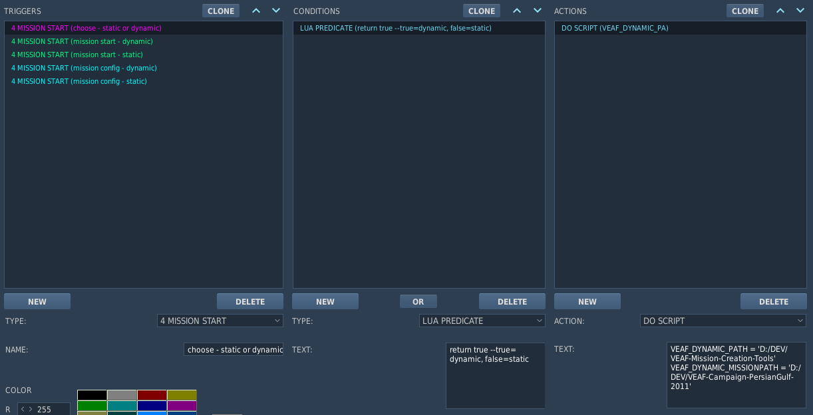
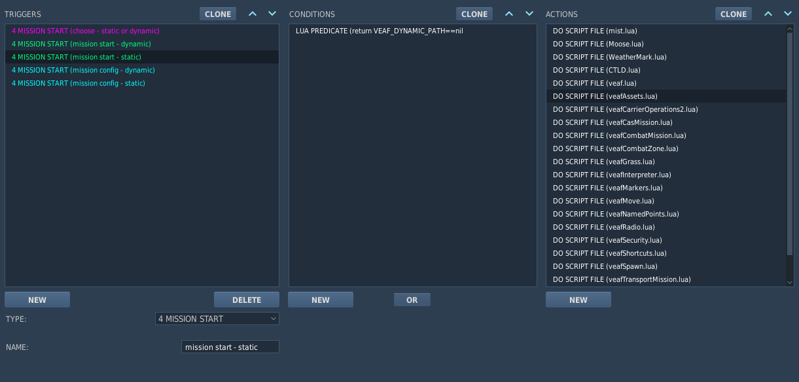
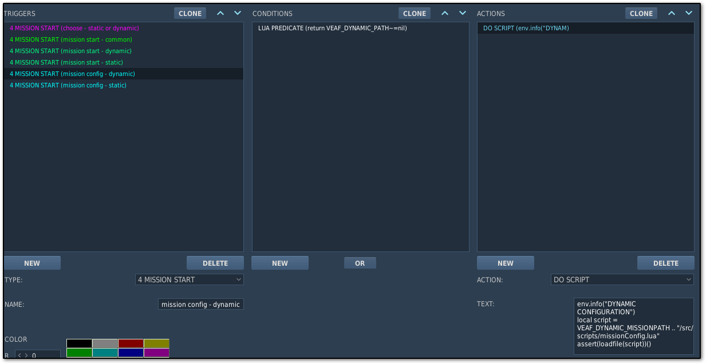

+++
title = "Load scripts in the mission"
weight = 1
chapter = false
+++

## Introduction

In a mission using the VEAF Mission Creation Tools, the script have to be loaded through triggers.
This chapter will explain how to setup such triggers, and also how to use a dynamic loading method for development.

To load a script in a DCS mission, the easiest way is to create a MISSION START trigger, and make it execute a DO SCRIPT FILE action, loading the script.

If you do this for all the community and veaf scripts, they will be stored in the mission file (in the "I10N\default" folder) and referenced for loading.
This way, the mission is completely autonomous (all the need scripts are stored inside).

Then, the *build.cmd* command will construct the mission file from the sources and copy all the community and veaf scripts (the version that is in the VEAF-Mission-Creation-Tools npm repository) inside.

The compiled mission will work and still be autonomous.

But there is a catch : everytime you make a change to a script (either because you're developping a new functionnality in a veaf module, or because you are editing a configuration script for your mission), it's a pain to import it in the mission for testing. You need to modify your trigger, open the script file again (if running from the mission editor), or copy your files to the VEAF Mission Creation Tools repository (which is not always possible).

There is a way of loading the scripts dynamically, meaning that they will be loaded from where they are stored on your disk.

This was first demonstrated by *thebgpikester* in [his YouTube video](https://www.youtube.com/watch?v=BMKBXjjKiDI).

## The basics

Here are the triggers we're gonna create in the mission; we'll see each one of them in details below.

### choose - static or dynamic



The first trigger will allow us to choose between static and dynamic loading easily, as well as define the location of the scripts on our disk. Of course, the latter differs from one person to another, and therefore it must be adapted if you want to use dynamic loading.

The name of the trigger is not important, as is its color.

It has a condition (a *lua predicate*) `return true --true=dynamic, false=static`: if the condition returns true, the trigger will be executed and the scripts will be loaded dynamically. If false, the trigger will not be executed and the scripts will be loaded statically.
At the moment, the condition returns true and therefore we'll be loading dynamically.

The trigger does execute a script (DO SCRIPT) that defines two constants, used later in the other triggers :

```lua
VEAF_DYNAMIC_PATH = 'D:/DEV/VEAF-Mission-Creation-Tools'
VEAF_DYNAMIC_MISSIONPATH = 'D:/DEV/VEAF-Demo-Mission'
```

Bear in mind that these paths are probably not correct for your environment. If needed, change them.

### mission start - dynamic


This one has a condition:

```lua
return VEAF_DYNAMIC_PATH~=nil
```

This means that it will be executed if the *VEAF_DYNAMIC_PATH* constant has been defined, hence only if the first trigger is activated.

It will load the community scripts (one by one), with code like this:

```lua
local script = VEAF_DYNAMIC_PATH .. "/src/scripts/community/mist.lua"
assert(loadfile(script))()
```

It will also load all the veaf scripts dynamically with this code:

```lua
env.info("DYNAMIC LOADING")
local script = VEAF_DYNAMIC_PATH .. "/src/scripts/VeafDynamicLoader.lua"
assert(loadfile(script))()
```

### mission start - static



This is the opposite of the previous trigger : it will be executed only if the *VEAF_DYNAMIC_PATH* constant has **not** been defined.

Here's the condition:

```lua
return VEAF_DYNAMIC_PATH==nil
```

When executed, it simply loads all the veaf scripts using DO SCRIPT FILE statements.

### mission config - dynamic

This is the same trigger that *mission start - dynamic*, except that is it made for loading the mission scripts (in this case, only *missionConfig.lua*)



It has the same condition:

```lua
return VEAF_DYNAMIC_PATH~=nil
```

And its code does this:

```lua
env.info("DYNAMIC CONFIGURATION")
local script = VEAF_DYNAMIC_MISSIONPATH .. "/src/scripts/missionConfig.lua"
assert(loadfile(script))()
```

### mission config - static

Again, the same trigger than *mission start - static*, except that is it made for loading the mission scripts (in this case, only *missionConfig.lua*)


Same condition:

```lua
return VEAF_DYNAMIC_PATH==nil
```

When executed, it simply loads the mission scripts using DO SCRIPT FILE statements.

## Usage

### Choose between static and dynamic loading

During the development of your mission, it's easier to select dynamic loading.
To do this, modify the condition of the first trigger (*choose - static or dynamic*) so it returns **true**:

```lua
return true
```

When publishing your mission, ensure that you selected static loading by modifying the condition of the first trigger (*choose - static or dynamic*) so it returns **false**:

```lua
return false
```

### Use dynamic loading

When your mission is setup to dynamically load its scripts, it loads them each time it starts, from their original location on your disk.
This means that every change you make to the scripts will be immediately available in your mission the next time you start it.
The easiest way to restart a running mission is to press the "Left-Shift + R" key combination.

## Miscelleanous

### Building the mission and dynamic loading

The *extract.cmd* script will automatically change from a dynamic loading to a static loading, to ensure that the mission is never published with dynamic loading (it wouldn't work).
To do this, the script replaces the `return true --true=dynamic, false=static` with `return false --true=dynamic, false=static` in the mission before storing it.

### Debugging and tracing

When using dynamic loading, the error messages will refer to the scripts by their actual filename, making it easier to debug.

Also, the *VeafDynamicLoader.lua* script will set debugging and tracing to ON, so when trying out your mission you'll see all your trace messages (and mine).

When building, the scripts will automaticall be edited to remove any debugging or tracing call, saving some CPU time for the game itself.