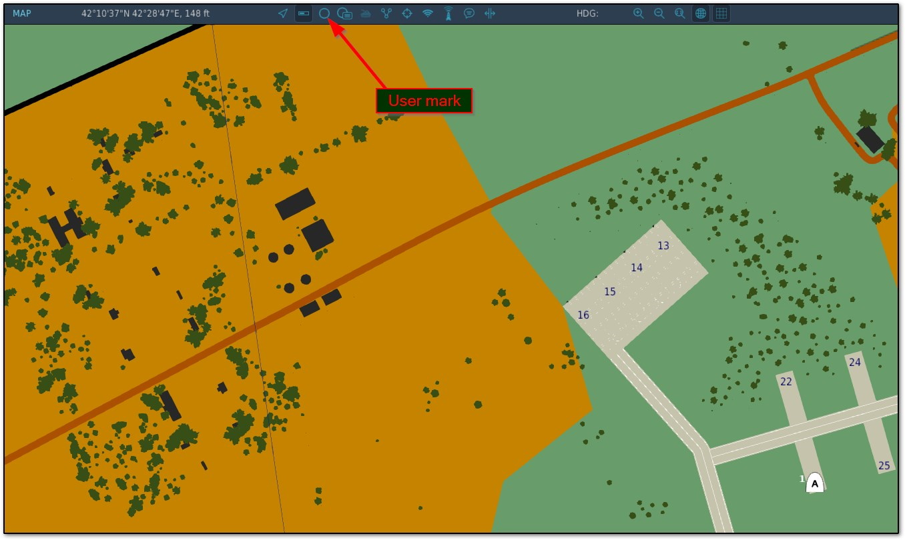
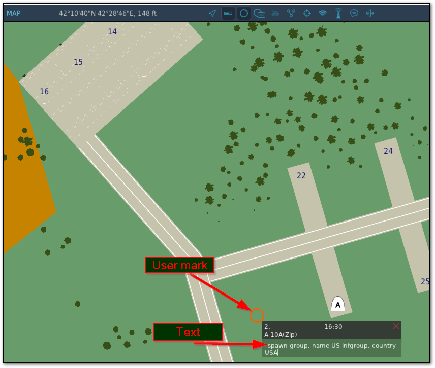

+++
title = "User marks"
weight = 3
chapter = false
+++

A lot of the VEAF Mission Creation Tools functionalities are controlled through commands entered in the text of user marks on the F10 map.

This means that, during runtime, a player can go to the F10 map and create a user mark

In this mark, the player enters a text that the VEAF Tools scripts will understand. Of course, it has to follow a specific syntax (see the documentation of the [modules](../../modules/)) for more detail.

Example : ``_spawn group, name US infgroup, country USA``

The command is sent to the scripts everytime the content of the marker changes:

* at first, when the player entered some content and then clicked outside of the maker windows
* each time the text in the marker is modified and the player clicks outside of the maker windows

A lot of modules are programmed to delete the marker as soon as its command is recognized and interpreted, so the second point is often moot.
